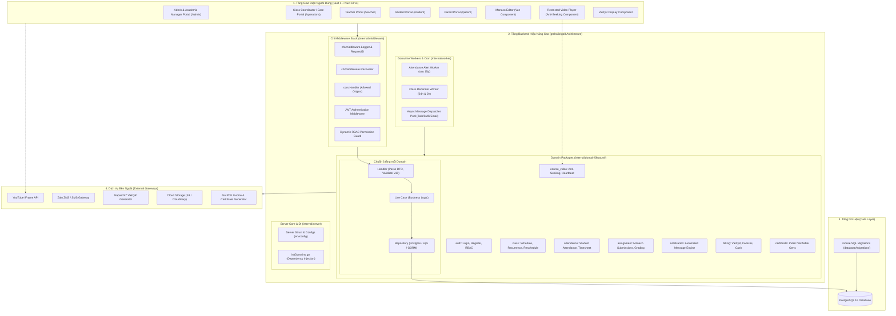
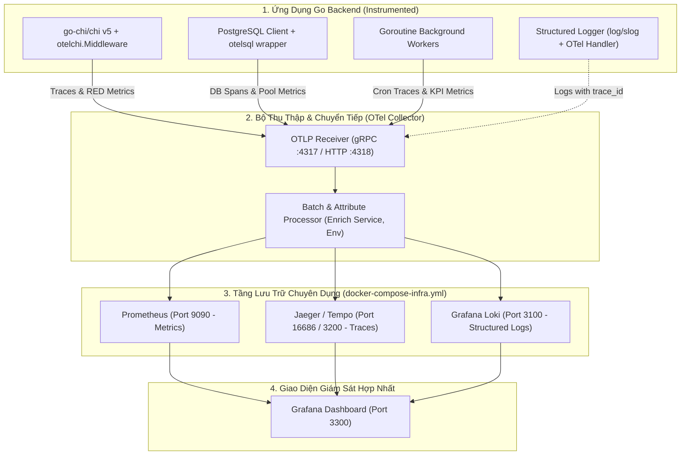
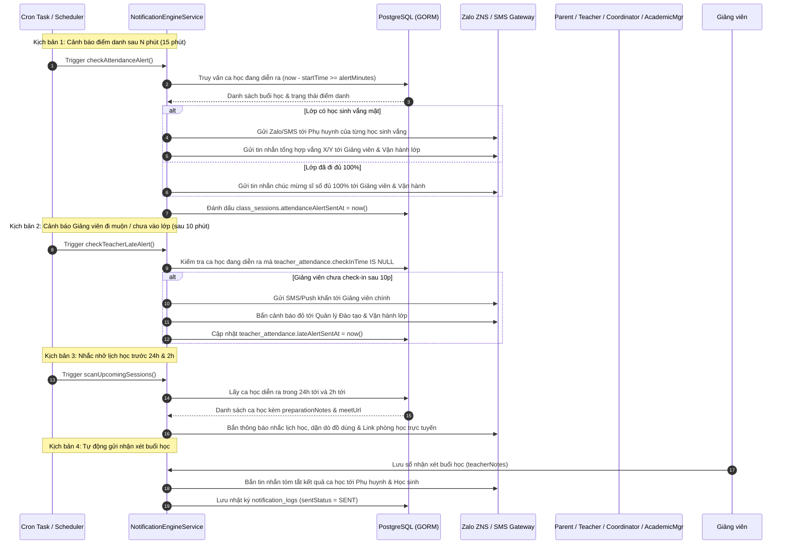
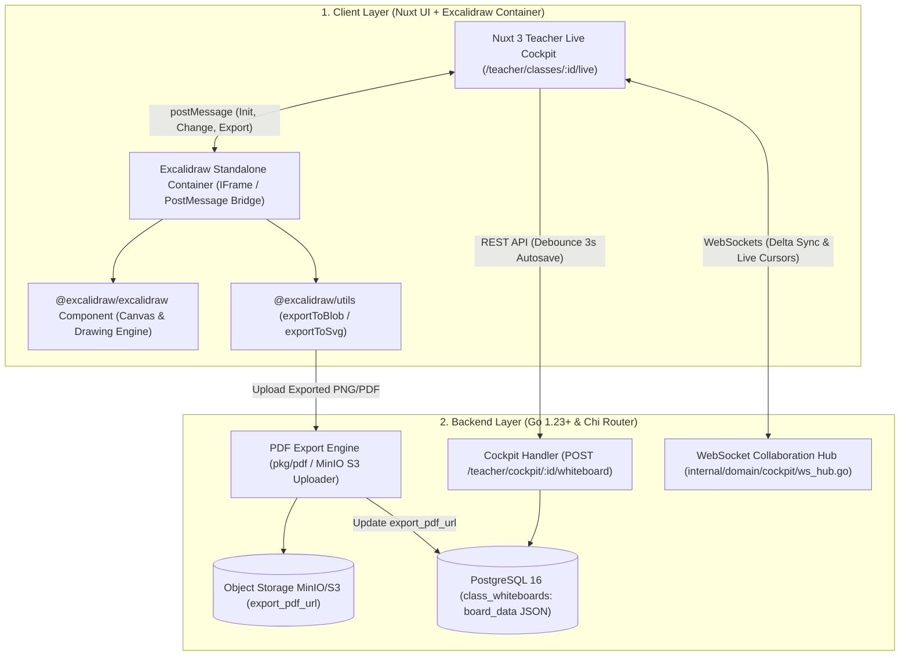

# Thiết Kế Kiến Trúc Hệ Thống & Cơ Sở Dữ Liệu (System Architecture & Database Design)

> **Dự án:** LMS Center Platform (Hệ thống Quản lý Học tập, Giảng viên & Vận hành Đào tạo Đa hình thức)  
> **Tài liệu:** `docs/architecture.md`  
> **Phiên bản:** 2.4.0 (Bổ sung Cổng Vận Hành Lớp & Chăm Sóc Học Viên CLASS_COORDINATOR, 4 Bảng CSDL mới 56-59, 2 Goose Migrations 18 & 19)  
> **Ngày cập nhật:** 23/09/2026  

---

## 1. Tổng Quan Kiến Trúc Hệ Thống (System Architecture Overview)

Hệ thống **LMS Center Platform** được thiết kế theo mô hình kiến trúc **Tách biệt Frontend - Backend (Decoupled Clean Architecture)** tối ưu hiệu năng cao:
- **Frontend Layer:** Xây dựng trên nền tảng **Nuxt 4 + Nuxt UI v4 (Vue 3.5+, TypeScript, Tailwind CSS v4, Reka UI, Pinia)** mang lại trải nghiệm tương tác mượt mà, hỗ trợ cả SSR (Server-Side Rendering cho SEO trang công khai) và SPA tốc độ cao cho các cổng Dashboard quản trị (chi tiết tại [ADR-0006](adr/0006-nuxt-4-and-nuxt-ui-v4-frontend-foundation.md)).
- **Backend API Layer:** Xây dựng bằng ngôn ngữ **Go (Golang 1.23+)** kế thừa trọn vẹn kiến trúc phân tầng chuyên nghiệp từ blueprint **[`gmhafiz/go8`](https://github.com/gmhafiz/go8)**:
  - **Router:** `go-chi/chi` v5 (tiêu chuẩn cộng đồng Go, 100% tương thích `net/http`).
  - **Mô hình Phân tầng (Layered Architecture):** `Handler` (Controller, DTO validation) $\to$ `UseCase` (Business logic) $\to$ `Repository` (Data access).
  - **Quản lý CSDL & Migrations:** Quản lý phiên bản bảng bằng **Goose migrations** (`database/migrations/*.sql`), kết nối truy vấn tốc độ cao qua `sqlx` / `GORM`.
  - **Quản lý Cấu hình:** Struct-based Configuration đọc từ `.env` qua `kelseyhightower/envconfig`.
  - **Dependency Injection:** Khởi tạo tường minh tại `internal/server/initDomains.go`.
  - **Task Runner:** Điều phối tự động hóa qua `Taskfile.yml` (`task dev`, `task migrate`, `task routes`, `task swagger`).
  - **Concurrency & Workers:** Tận dụng tối đa Go Goroutines & Channels cho Cron quét điểm danh sau 15p, nhắc lịch trước 24h/2h và Heartbeat chống tua video mà không cần Redis.
- **Database Layer:** **PostgreSQL 16** đảm bảo toàn vẹn dữ liệu, giao dịch ACID tin cậy và tốc độ truy vấn tối ưu.



---

### 1.1 Kiến Trúc Giám Sát Toàn Diện OpenTelemetry (Logs, Metrics, Traces - Chuẩn `gmhafiz/go8`)

Hệ thống tích hợp bộ công cụ chuẩn công nghiệp **OpenTelemetry (OTel)** v1.30+ kết hợp cùng cụm hạ tầng **Loki + Prometheus + Jaeger/Tempo + Grafana (Cổng 3300)**:



#### Quy Chuẩn Ba Trụ Cột Observability:
1. **Logs (Structured Logging & Trace-Log Correlation):**
   - Sử dụng thư viện chuẩn Go 1.21+ `log/slog` xuất định dạng JSON.
   - Handler tự động trích xuất `trace_id` và `span_id` từ `context.Context` để nhúng vào từng dòng log.
   - Cho phép điều hướng 1-click **"Jump to Logs"** từ trace bị lỗi sang log chi tiết và ngược lại trên Grafana Explore.
2. **Metrics (Ứng Dụng, CSDL & Chỉ Số Nghiệp Vụ LMS):**
   - **RED Metrics:** `http_server_requests_total`, `http_server_request_duration_seconds` (p50, p90, p99), `http_server_active_requests`.
   - **Database Pool Metrics:** `db_client_connections_open`, `db_client_connections_idle`, `db_client_connections_wait_duration`.
   - **Chỉ số kinh doanh LMS:** `lms_student_active_sessions`, `lms_video_heartbeats_total`, `lms_attendance_checkin_total`, `lms_vietqr_checkout_total`, `lms_teacher_late_alerts_total`.
3. **Traces (Distributed Tracing):**
   - Tự động sinh Root Span cho HTTP Inbound qua `otelchi.Middleware` (chuẩn W3C `traceparent`).
   - Tự động sinh Child Spans cho câu truy vấn PostgreSQL qua `otelsql.WrapDB`.
   - Thủ công gắn Child Spans cho logic nặng: `payroll.calculate_net_salary`, `schedule.generate_recurrence_sessions`, `vietqr.generate_dynamic_payload`.

---

## 2. Thiết Kế Cơ Sở Dữ Liệu Toàn Diện (Database Schema & ERD)

### 2.1 Sơ Đồ Thực Thể Quan Hệ (Entity Relationship Diagram - ERD)

```mermaid
erDiagram
    User ||--o{ UserRole : has
    Role ||--o{ UserRole : assigned_to
    Role ||--o{ RolePermission : contains
    Permission ||--o{ RolePermission : defines

    User ||--o{ TeacherProfile : has
    User ||--o{ ExaminerProfile : has
    User ||--o{ StudentProfile : has
    User ||--o{ ParentProfile : has
    ParentProfile ||--o{ ParentStudent : connects
    StudentProfile ||--o{ ParentStudent : belongs_to
    
    Subject ||--o{ Course : categorizes
    SalaryGrade ||--o{ TeacherProfile : defines_grade
    TeacherProfile ||--o{ TeacherPayroll : receives_monthly_salary
    SalaryGrade ||--o{ TeacherPayroll : applies_hourly_rate

    Course ||--o{ Module : contains
    Module ||--o{ Lesson : contains
    Lesson ||--o{ Material : includes
    Course ||--o{ GradebookConfig : defines
    
    Course ||--o{ Class : instances
    TeacherProfile ||--o{ Class : teaches_main
    TeacherProfile ||--o{ Class : teaches_ta_optional
    User ||--o{ Class : coordinates
    
    Class ||--o{ ClassSession : schedules
    Class ||--o{ Enrollment : registers
    StudentProfile ||--o{ Enrollment : joins
    
    ClassSession ||--o{ TeacherAttendance : logs
    ClassSession ||--o{ StudentAttendance : logs
    StudentProfile ||--o{ StudentAttendance : records
    ClassSession ||--o{ SessionFeedback : receives_student_review
    StudentProfile ||--o{ SessionFeedback : submits_review
    
    TeacherProfile ||--o{ TeacherEvaluation : evaluated
    User ||--o{ TeacherEvaluation : audits

    Class ||--o{ CapstoneProject : hosts_capstone
    StudentProfile ||--o{ CapstoneProject : submits_capstone
    CapstoneProject ||--o{ CapstoneEvaluation : graded_by
    ExaminerProfile ||--o{ CapstoneEvaluation : reviews_defense

    Lesson ||--o{ LessonDiscussion : has_qa
    User ||--o{ LessonDiscussion : posts_qa
    Lesson ||--o{ LessonNote : has_notes
    StudentProfile ||--o{ LessonNote : writes_notes
    Lesson ||--o{ LessonProgress : tracks
    StudentProfile ||--o{ LessonProgress : achieves
    
    ClassSession ||--o{ NotificationLog : triggers
    NotificationTemplate ||--o{ NotificationLog : formats
    User ||--o{ NotificationLog : receives
    
    Class ||--o{ Assignment : assigns_homework
    Assignment ||--o{ Material : attaches
    Assignment ||--o{ Submission : receives_class_submissions
    StudentProfile ||--o{ Submission : submits
    Submission ||--o{ GradeFeedback : grades
    TeacherProfile ||--o{ GradeFeedback : evaluates_class_homework
    
    StudentProfile ||--o{ Certificate : awarded
    Course ||--o{ Certificate : certifies
    
    Discount ||--o{ CourseDiscount : offers
    Course ||--o{ CourseDiscount : applied_discount
    Discount ||--o{ TuitionInvoice : discounts_amount
    StudentProfile ||--o{ TuitionInvoice : billed_to
    TuitionInvoice ||--o{ PaymentTransaction : settles

    Campus ||--o{ Room : contains
    Room ||--o{ ClassSession : hosts_in_room
    ClassSession ||--o{ MakeupSession : original_session
    StudentProfile ||--o{ MakeupSession : attends_makeup
    TeacherProfile ||--o{ MakeupSession : conducts_makeup
    Class ||--o{ MakeupSession : parallel_target_class
    Room ||--o{ MakeupSession : holds_makeup_room
    
    Subject ||--o{ QuestionBank : categorizes_bank
    QuestionBank ||--o{ Question : contains_questions
    Course ||--o{ Quiz : has_quizzes
    Class ||--o{ Quiz : assigns_quizzes
    Quiz ||--o{ QuizQuestion : includes
    Question ||--o{ QuizQuestion : maps_to
    Quiz ||--o{ QuizAttempt : records_attempts
    StudentProfile ||--o{ QuizAttempt : takes_quiz
    QuizAttempt ||--o{ QuizAnswer : contains_answers
    Question ||--o{ QuizAnswer : answered_question

    StudentProfile ||--o{ Contract : signs_contract
    Course ||--o{ Contract : specifies_course

    ClassSession ||--o{ ClassWhiteboard : has_whiteboards
    TeacherProfile ||--o{ ClassWhiteboard : draws_whiteboard
    ClassSession ||--o{ QuickPoll : hosts_polls
    QuickPoll ||--o{ PollVote : collects_votes
    StudentProfile ||--o{ PollVote : casts_vote

    Submission ||--o{ AICodeReview : analyzed_by_ai
    StudentProfile ||--o{ StudentPedagogicalNote : subject_student
    TeacherProfile ||--o{ StudentPedagogicalNote : authored_teacher
    Class ||--o{ StudentPedagogicalNote : in_class

    TeacherProfile ||--o{ TeacherAvailability : configures_availability
    ClassSession ||--o{ SubstituteRequest : requests_substitute
    TeacherProfile ||--o{ SubstituteRequest : original_teacher
    TeacherProfile ||--o{ SubstituteRequest : substitute_teacher
    TeacherProfile ||--o{ AssignmentBank : owns_bank
    Subject ||--o{ AssignmentBank : categorizes_asg_bank

    StudentProfile ||--o{ StudentCareLog : cared_student
    Class ||--o{ StudentCareLog : student_class
    User ||--o{ StudentCareLog : coordinator_actor

    StudentProfile ||--o{ ClassTransfer : transfer_student
    Class ||--o{ ClassTransfer : from_class
    Class ||--o{ ClassTransfer : to_class

    ClassSession ||--o{ SessionIncident : reports_incident
    User ||--o{ SessionIncident : coordinator_reporter

    StudentProfile ||--o{ StudentMaterial : receives_material
    Class ||--o{ StudentMaterial : class_material
```


---

### 2.2 Quy Chuẩn 6 Trường Audit & Chính Sách Soft Delete Bắt Buộc (Audit Fields & Soft Delete)

> **Quy định bất biến:** 100% các bảng trong CSDL LMS bắt buộc phải có đầy đủ 6 trường audit:
> - `createdAt` (`TIMESTAMPTZ DEFAULT now() NOT NULL`): Thời điểm tạo bản ghi.
> - `createdBy` (`UUID`, Nullable, FK -> `users.id`): Người thực hiện tạo bản ghi.
> - `updatedAt` (`TIMESTAMPTZ DEFAULT now() NOT NULL`): Thời điểm cập nhật bản ghi gần nhất.
> - `updatedBy` (`UUID`, Nullable, FK -> `users.id`): Người thực hiện cập nhật gần nhất.
> - `deletedAt` (`TIMESTAMPTZ`, Nullable): Thời điểm xóa mềm (`NULL` = bản ghi đang hoạt động).
> - `deletedBy` (`UUID`, Nullable, FK -> `users.id`): Người thực hiện xóa mềm.
>
> **Chính sách Soft Delete:** Nghiêm cấm xóa vật lý (Hard DELETE) đối với tất cả bảng nghiệp vụ chính (`users`, `classes`, `class_sessions`, `courses`, `subjects`, `enrollments`, `tuition_invoices`, `assignments`, `submissions`, `teacher_profiles`, `salary_grades`, `teacher_payrolls`, `discounts`). Mọi query nghiệp vụ tự động lọc điều kiện `WHERE deleted_at IS NULL`.

---

### 2.3 Từ Điển Dữ Liệu Chi Tiết (Data Dictionary)

#### Nhóm 1: Hệ Thống Phân Quyền Động Chuẩn RBAC (Core Dynamic RBAC)

1. **`users`**:
   - `id` (UUID, PK): Mã người dùng duy nhất.
   - `email` (String, Unique): Email đăng nhập.
   - `passwordHash` (String): Mật khẩu mã hóa bcrypt.
   - `fullName` (String): Họ và tên.
   - `phone` (String, Nullable): Số điện thoại liên hệ.
   - `avatarUrl` (String, Nullable): Ảnh đại diện.
   - `isActive` (Boolean, Default `true`): Trạng thái kích hoạt.
   - *Audit Fields:* `createdAt`, `createdBy`, `updatedAt`, `updatedBy`, `deletedAt`, `deletedBy`.

2. **`roles`** (Bảng quản lý vai trò):
   - `id` (UUID, PK).
   - `code` (String, Unique): Mã định danh (ví dụ: `SUPER_ADMIN`, `ACADEMIC_MANAGER`, `CLASS_COORDINATOR`, `TEACHER`, `TA`, `EXAMINER`, `STUDENT`, `PARENT`).
   - `name` (String): Tên hiển thị (ví dụ: "Quản lý Đào tạo / Giáo vụ trưởng", "Chuyên viên Vận hành & CSKH lớp").
   - `description` (String, Nullable): Mô tả quyền hạn.
   - `isSystem` (Boolean, Default `false`): Role hệ thống mặc định (không được xóa).
   - *Audit Fields:* `createdAt`, `createdBy`, `updatedAt`, `updatedBy`, `deletedAt`, `deletedBy`.

3. **`permissions`** (Bảng quản lý quyền hạn chi tiết - Granular Permissions):
   - `id` (UUID, PK).
   - `code` (String, Unique): Mã quyền (ví dụ: `classes.create`, `classes.schedule`, `classes.reschedule`, `teachers.evaluate`, `attendance.record_student`, `attendance.record_teacher`, `students.care_notes`, `finance.manage_invoices`, `payroll.manage`, `discounts.manage`).
   - `name` (String): Tên quyền.
   - `module` (String): Phân hệ (`CLASSES`, `TEACHERS`, `ATTENDANCE`, `FINANCE`, `PAYROLL`, `DISCOUNTS`).
   - `description` (String, Nullable).
   - *Audit Fields:* `createdAt`, `createdBy`, `updatedAt`, `updatedBy`, `deletedAt`, `deletedBy`.

4. **`role_permissions`** (Bảng trung gian N-N gán quyền cho vai trò):
   - `id` (UUID, PK).
   - `roleId` (UUID, FK -> `roles.id`).
   - `permissionId` (UUID, FK -> `permissions.id`).
   - Unique Constraint: `(roleId, permissionId)`.
   - *Audit Fields:* `createdAt`, `createdBy`, `updatedAt`, `updatedBy`, `deletedAt`, `deletedBy`.

5. **`user_roles`** (Bảng trung gian N-N gán vai trò cho người dùng):
   - `id` (UUID, PK).
   - `userId` (UUID, FK -> `users.id`).
   - `roleId` (UUID, FK -> `roles.id`).
   - `assignedAt` (Timestamp, Default `now()`).
   - `assignedBy` (UUID, Nullable, FK -> `users.id`): Người cấp quyền.
   - Unique Constraint: `(userId, roleId)`.
   - *Audit Fields:* `createdAt`, `createdBy`, `updatedAt`, `updatedBy`, `deletedAt`, `deletedBy`.

---

#### Nhóm 2: Hồ Sơ Người Dùng, Bậc Lương & Quan Hệ Gia Đình (Profiles & Salary Grades)

6. **`salary_grades`** (Bậc lương & định mức thù lao giảng viên):
   - `id` (UUID, PK).
   - `code` (String, Unique): Mã bậc (ví dụ: `GRADE_INTERN_TA`, `GRADE_STANDARD`, `GRADE_SENIOR`, `GRADE_MASTER`).
   - `name` (String): Tên bậc (ví dụ: "Trợ giảng / Tập sự", "Giảng viên chuẩn", "Giảng viên cao cấp", "Chuyên gia / Master").
   - `baseHourlyRate` (Decimal): Đơn giá thù lao giờ dạy chuẩn (VNĐ/giờ).
   - `overtimeMultiplier` (Decimal, Default `1.5`): Hệ số nhân ca tối hoặc cuối tuần.
   - `kpiBonusRate` (Decimal, Default `0.1`): Tỷ lệ thưởng thêm nếu điểm KPI buổi học $\ge 4.5$ sao.
   - *Audit Fields:* `createdAt`, `createdBy`, `updatedAt`, `updatedBy`, `deletedAt`, `deletedBy`.

7. **`teacher_profiles`**:
   - `id` (UUID, PK).
   - `userId` (UUID, FK -> `users.id`, Unique).
   - `salaryGradeId` (UUID, FK -> `salary_grades.id`): Bậc lương áp dụng cho giảng viên.
   - `specialization` (String): Lĩnh vực chuyên môn (Frontend, Backend, Python AI, IELTS...).
   - `bio` (Text, Nullable): Kinh nghiệm & chứng chỉ.
   - `hourlyRate` (Decimal): Đơn giá thù lao giờ dạy thực tế (VNĐ - có thể override theo hợp đồng cá nhân).
   - `contractType` (Enum: `FULLTIME`, `PARTTIME`, `VISITING`).
   - `kpiRating` (Decimal, Default `5.0`): Điểm đánh giá trung bình từ học viên và giáo vụ.
   - *Audit Fields:* `createdAt`, `createdBy`, `updatedAt`, `updatedBy`, `deletedAt`, `deletedBy`.

8. **`examiner_profiles`** (Hội đồng Giám khảo / Chuyên gia phản biện đồ án):
   - `id` (UUID, PK).
   - `userId` (UUID, FK -> `users.id`, Unique).
   - `title` (String): Chức danh / Học hàm (ví dụ: "Senior Solution Architect", "Tiến sĩ KHMT", "Giám khảo Trưởng").
   - `company` (String, Nullable): Tổ chức / Doanh nghiệp công tác.
   - `bio` (Text, Nullable): Kinh nghiệm chuyên môn và phản biện.
   - *Audit Fields:* `createdAt`, `createdBy`, `updatedAt`, `updatedBy`, `deletedAt`, `deletedBy`.

9. **`student_profiles`**:
   - `id` (UUID, PK).
   - `userId` (UUID, FK -> `users.id`, Unique).
   - `studentCode` (String, Unique): Mã học viên (ví dụ: `HV-2026-001`).
   - `dateOfBirth` (Date, Nullable).
   - `currentLevel` (String, Nullable).
   - *Audit Fields:* `createdAt`, `createdBy`, `updatedAt`, `updatedBy`, `deletedAt`, `deletedBy`.

10. **`parent_profiles`**:
    - `id` (UUID, PK).
    - `userId` (UUID, FK -> `users.id`, Unique).
    - `address` (String, Nullable).
    - *Audit Fields:* `createdAt`, `createdBy`, `updatedAt`, `updatedBy`, `deletedAt`, `deletedBy`.

11. **`parent_students`**:
    - `id` (UUID, PK).
    - `parentId` (UUID, FK -> `parent_profiles.id`).
    - `studentId` (UUID, FK -> `student_profiles.id`).
    - `relationship` (String): Bố, Mẹ, Người giám hộ.
    - Unique Constraint: `(parentId, studentId)`.
    - *Audit Fields:* `createdAt`, `createdBy`, `updatedAt`, `updatedBy`, `deletedAt`, `deletedBy`.

---

#### Nhóm 3: Đào Tạo, Khóa Học & Lớp Học Đa Hình Thức (Subjects, Courses & Classes)

12. **`subjects`** (Danh mục Môn học & Lĩnh vực đào tạo Động - Hỗ trợ CRUD):
    - `id` (UUID, PK).
    - `code` (String, Unique): Mã môn học (ví dụ: `IT_DEV`, `LANG_ENGLISH`, `LANG_JAPANESE`, `DESIGN_UIUX`, `SOFT_SKILLS`).
    - `name` (String): Tên môn học (ví dụ: "Công nghệ thông tin & Lập trình", "Tiếng Anh Giao tiếp & IELTS", "Thiết kế UI/UX").
    - `description` (Text, Nullable): Giới thiệu môn học.
    - `iconUrl` (String, Nullable): Đường dẫn icon hiển thị trên portal.
    - `isActive` (Boolean, Default `true`).
    - *Audit Fields:* `createdAt`, `createdBy`, `updatedAt`, `updatedBy`, `deletedAt`, `deletedBy`.

13. **`courses`**:
    - `id` (UUID, PK).
    - `subjectId` (UUID, FK -> `subjects.id`): Môn học / Lĩnh vực đào tạo (CRUD động).
    - `title` (String): Tên khóa học.
    - `slug` (String, Unique).
    - `description` (Text).
    - `courseType` (Enum: `SELF_PACED_ONLINE`, `INSTRUCTOR_LED`): Phân loại khóa học tự học (cấm tua video) hay lớp có giáo viên.
    - `thumbnailUrl` (String, Nullable).
    - `isFree` (Boolean, Default `false`): Khóa học miễn phí (học sinh đăng ký học ngay 1-click).
    - `price` (Decimal, Default `0`): Học phí niêm yết (nếu trả phí thì thanh toán VietQR động).
    - `enrollmentCount` (Int, Default `0`): Số lượng học viên đã đăng ký.
    - `isPublished` (Boolean, Default `false`).
    - *Audit Fields:* `createdAt`, `createdBy`, `updatedAt`, `updatedBy`, `deletedAt`, `deletedBy`.

12. **`gradebook_configs`** (Cấu hình trọng số điểm theo chuẩn Moodle):
    - `id` (UUID, PK).
    - `courseId` (UUID, FK -> `courses.id`, Unique).
    - `attendanceWeight` (Int, Default `10`): % điểm chuyên cần.
    - `homeworkWeight` (Int, Default `30`): % điểm bài tập về nhà.
    - `midtermWeight` (Int, Default `20`): % điểm thi giữa kỳ.
    - `finalProjectWeight` (Int, Default `40`): % điểm đồ án / thi cuối khóa.
    - *Ràng buộc:* Tổng trọng số phải bằng 100%.

13. **`modules`**:
    - `id` (UUID, PK).
    - `courseId` (UUID, FK -> `courses.id`).
    - `title` (String): Tên chương.
    - `orderIndex` (Int): Thứ tự.

14. **`lessons`**:
    - `id` (UUID, PK).
    - `moduleId` (UUID, FK -> `modules.id`).
    - `title` (String): Tên bài học.
    - `orderIndex` (Int).
    - `youtubeUrl` (String, Nullable): Link video YouTube (Unlisted/Public/Playlist).
    - `content` (Text, Nullable): Nội dung tóm tắt Markdown.
    - `durationMinutes` (Int, Default `0`).
    - `isDripLocked` (Boolean, Default `false`): Mở khóa tuần tự theo tiến độ học (tính năng kế thừa Moodle).

15. **`classes`** (Lớp học với sự tham gia của 3 vai trò: Giáo viên, Trợ giảng và Vận hành/CSKH):
    - `id` (UUID, PK).
    - `courseId` (UUID, FK -> `courses.id`).
    - `name` (String): Mã lớp (ví dụ: `FE-K32`).
    - `classType` (Enum: `OFFLINE`, `ONLINE_VIRTUAL`, `HYBRID`).
    - `mainTeacherId` (UUID, FK -> `teacher_profiles.id`): Giảng viên chính (Bắt buộc).
    - `taTeacherId` (UUID, FK -> `teacher_profiles.id`, Nullable): **Trợ giảng - Tùy chọn (Optional)** theo quy mô lớp học.
    - `coordinatorId` (UUID, FK -> `users.id`, Nullable): **Chuyên viên Vận hành lớp & Chăm sóc học viên (Class Coordinator / Care)**.
    - `roomName` (String, Nullable): Tên phòng học mặc định.
    - `meetUrl` (String, Nullable): Link Google Meet / Zoom mặc định.
    - `startDate` (Date), `endDate` (Date).
    - `scheduleRule` (JSON): Quy tắc lịch học lặp lại (ví dụ: `[{"dayOfWeek": 2, "startTime": "19:30", "endTime": "21:30"}, {"dayOfWeek": 4, "startTime": "19:30", "endTime": "21:30"}]`).
    - `attendanceAlertMinutes` (Int, Default `15`): Thời gian phát cảnh báo sĩ số vắng/đủ sau khi buổi học bắt đầu.
    - `reminderHours` (JSON, Default `[24, 2]`): Các mốc thời gian tự động bắn tin nhắn nhắc lịch học trước buổi.
    - `allowVideoSeeking` (Boolean, Default `false`): Mặc định cấm tua đối với video tự học.
    - `maxStudents` (Int, Default `20`).
    - `status` (Enum: `UPCOMING`, `ACTIVE`, `COMPLETED`, `CANCELLED`).

15. **`class_sessions`** (Buổi học linh hoạt - Flexible Session Scheduling):
    - `id` (UUID, PK): Buổi học cụ thể.
    - `classId` (UUID, FK -> `classes.id`).
    - `sessionNumber` (Int): Buổi số (1, 2, 3...).
    - `sessionDate` (Date): Ngày diễn ra buổi học.
    - `startTime` (Time): Giờ bắt đầu (có thể điều chỉnh linh hoạt từng buổi).
    - `endTime` (Time): Giờ kết thúc.
    - `assignedTeacherId` (UUID, FK -> `teacher_profiles.id`): Giáo viên phụ trách buổi này (hỗ trợ phân công giáo viên dạy thay).
    - `roomName` (String, Nullable): Phòng học riêng của buổi này (nếu đổi phòng).
    - `meetUrl` (String, Nullable): Link meet riêng của buổi này.
    - `meetingPlatform` (Enum: `GOOGLE_MEET`, `ZOOM`, `MS_TEAMS`, `JITSI`, Nullable).
    - `preparationNotes` (Text, Nullable): Dặn dò chuẩn bị trước giờ học (laptop, tài liệu, bài tập nợ) để gửi tin nhắn nhắc nhở.
    - `topic` (String, Nullable): Chủ đề giảng dạy.
    - `status` (Enum: `SCHEDULED`, `RESCHEDULED`, `IN_PROGRESS`, `COMPLETED`, `CANCELLED`).
    - `attendanceAlertSentAt` (Timestamp, Nullable): Thời điểm hệ thống đã tự động gửi tin nhắn báo sĩ số.
    - `rescheduleReason` (Text, Nullable): Lý do dời lịch hoặc bù buổi.
    - `originalDate` (Date, Nullable): Ngày học ban đầu nếu là buổi dời/bù.

16. **`enrollments`**:
    - `id` (UUID, PK).
    - `classId` (UUID, FK -> `classes.id`).
    - `studentId` (UUID, FK -> `student_profiles.id`).
    - `enrolledAt` (Timestamp).
    - `status` (Enum: `STUDYING`, `DROPPED`, `COMPLETED`).

---

#### Nhóm 4: Điểm Danh, Chấm Công & Đánh Giá Chất Lượng Giáo Viên

18. **`teacher_attendance`** (Chấm công ca dạy giáo viên):
    - `id` (UUID, PK).
    - `sessionId` (UUID, FK -> `class_sessions.id`, Unique).
    - `teacherId` (UUID, FK -> `teacher_profiles.id`).
    - `checkInTime` (Timestamp, Nullable).
    - `checkOutTime` (Timestamp, Nullable).
    - `actualDurationMinutes` (Int, Default `0`).
    - `note` (Text, Nullable).
    - `status` (Enum: `ON_TIME`, `LATE`, `ABSENT`, `SUBSTITUTED`).
    - `lateAlertSentAt` (Timestamp, Nullable): Thời điểm hệ thống đã tự động kích hoạt cảnh báo giáo viên đi muộn/chưa vào lớp sau 10 phút.

18. **`student_attendance`** (Điểm danh học sinh đa mô hình):
    - `id` (UUID, PK).
    - `sessionId` (UUID, FK -> `class_sessions.id`).
    - `studentId` (UUID, FK -> `student_profiles.id`).
    - `status` (Enum: `PRESENT_OFFLINE`, `PRESENT_ONLINE`, `LATE`, `ABSENT`).
    - `lateMinutes` (Int, Default `0`).
    - `isExcused` (Boolean, Default `false`).
    - `teacherNote` (String, Nullable).
    - `coordinatorNote` (String, Nullable): **Ghi chú chăm sóc của Chuyên viên Vận hành lớp** (ví dụ: "Đã gọi phụ huynh, học sinh bị ốm xin nghỉ").
    - Unique Constraint: `(sessionId, studentId)`.

19. **`teacher_evaluations`** (Đánh giá giáo viên & QA Đào tạo định kỳ):
    - `id` (UUID, PK).
    - `teacherId` (UUID, FK -> `teacher_profiles.id`).
    - `classId` (UUID, FK -> `classes.id`, Nullable).
    - `evaluatorId` (UUID, FK -> `users.id`): Người đánh giá (Academic Manager hoặc Học sinh đánh giá ẩn danh).
    - `evaluationType` (Enum: `MANAGER_AUDIT`, `STUDENT_SURVEY`).
    - `criteriaScores` (JSON): Điểm chi tiết (Kiến thức chuyên môn, Kỹ năng sư phạm, Tác phong đúng giờ, Độ nhiệt tình hỗ trợ...).
    - `overallScore` (Decimal): Điểm trung bình (Thang điểm 5 hoặc 10).
    - `comment` (Text): Nhận xét góp ý.
    - `evaluatedAt` (Timestamp).

20. **`session_feedbacks`** (Đánh giá giáo viên theo từng buổi học từ học sinh - Per-Session Student Feedback):
    - `id` (UUID, PK).
    - `sessionId` (UUID, FK -> `class_sessions.id`): Buổi học được đánh giá.
    - `studentId` (UUID, FK -> `student_profiles.id`): Học sinh đánh giá.
    - `teacherRating` (Int, 1-5 sao): Đánh giá chất lượng giảng viên trong buổi.
    - `taRating` (Int, Nullable, 1-5 sao): Đánh giá trợ giảng trong buổi.
    - `understandingLevel` (Enum: `POOR`, `AVERAGE`, `GOOD`, `EXCELLENT`): Mức độ hiểu bài trong buổi.
    - `pacingFeedback` (Enum: `TOO_SLOW`, `JUST_RIGHT`, `TOO_FAST`): Tốc độ giảng bài của giáo viên.
    - `comment` (Text, Nullable): Góp ý cụ thể (ẩn danh).
    - `isAnonymous` (Boolean, Default `true`): Ẩn danh tính với giáo viên (chỉ Quản lý Đào tạo & Vận hành lớp xem được thống kê).
    - `createdAt` (Timestamp, Default `now()`).
    - Unique Constraint: `(sessionId, studentId)`: Mỗi học sinh chỉ đánh giá 1 lần mỗi buổi học.

---

#### Nhóm 5: Tài Liệu, BTVN, Monaco Editor & Chấm Điểm

20. **`materials`**:
    - `id` (UUID, PK).
    - `title` (String): Tên tài liệu.
    - `fileUrl` (String): Link Cloud Storage.
    - `fileType` (Enum: `PDF_SLIDE`, `CODE_STARTER`, `AUDIO_MP3`, `DATASET`, `DOCUMENT`).
    - `lessonId` (UUID, FK -> `lessons.id`, Nullable).
    - `assignmentId` (UUID, FK -> `assignments.id`, Nullable).
    - `isPublic` (Boolean, Default `true`).

21. **`assignments`** (Bài tập về nhà theo lớp học - Hỗ trợ giáo viên chấm bài trực tiếp trong lớp):
    - `id` (UUID, PK).
    - `classId` (UUID, FK -> `classes.id`): Thuộc về một lớp học cụ thể, cho phép giáo viên quản lý danh sách BTVN và chấm bài tập của học sinh trong lớp.
    - `title` (String).
    - `description` (Text): Hướng dẫn đề bài Markdown.
    - `format` (Enum: `CODE_MONACO`, `GITHUB_REPO`, `FILE_UPLOAD`, `AUDIO_RECORDING`, `ESSAY`).
    - `allowedLanguage` (String, Default `"javascript"`).
    - `deadline` (Timestamp).
    - `maxScore` (Int, Default `100`).
    - *Audit Fields:* `createdAt`, `createdBy`, `updatedAt`, `updatedBy`, `deletedAt`, `deletedBy`.

22. **`submissions`** (Bài nộp của học sinh trong lớp):
    - `id` (UUID, PK).
    - `assignmentId` (UUID, FK -> `assignments.id`).
    - `studentId` (UUID, FK -> `student_profiles.id`).
    - `codeContent` (Text, Nullable): Code học viên viết trên Monaco Editor.
    - `githubUrl` (String, Nullable).
    - `fileUrl` (String, Nullable).
    - `submittedAt` (Timestamp).
    - `isLate` (Boolean, Default `false`).
    - `status` (Enum: `SUBMITTED`, `GRADED`, `RESUBMIT_REQUIRED`).
    - Unique Constraint: `(assignmentId, studentId)`.
    - *Audit Fields:* `createdAt`, `createdBy`, `updatedAt`, `updatedBy`, `deletedAt`, `deletedBy`.

23. **`grade_feedbacks`** (Phiếu chấm điểm bài tập lớp học từ Giảng viên / Trợ giảng):
    - `id` (UUID, PK).
    - `submissionId` (UUID, FK -> `submissions.id`, Unique).
    - `teacherId` (UUID, FK -> `teacher_profiles.id`): Giảng viên hoặc Trợ giảng thực hiện chấm bài.
    - `score` (Decimal): Điểm số (thang 100).
    - `rubricCriteria` (JSON, Nullable): Điểm chi tiết theo rubric.
    - `comment` (Text): Lời nhận xét chi tiết gửi cho học viên & phụ huynh.
    - `gradedAt` (Timestamp).
    - *Audit Fields:* `createdAt`, `createdBy`, `updatedAt`, `updatedBy`, `deletedAt`, `deletedBy`.

---

#### Nhóm 6: Tài Chính, Khuyến Mãi & Học Phí Đa Kênh

24. **`discounts`** (Bảng quản lý mã giảm giá & khuyến mãi):
    - `id` (UUID, PK).
    - `code` (String, Unique): Mã coupon (ví dụ: `CHAOBANMOI`, `LMS2026`).
    - `title` (String): Tên chương trình ưu đãi.
    - `discountType` (Enum: `PERCENT`, `FIXED`).
    - `discountValue` (Decimal): Giá trị giảm (ví dụ: `20` cho 20% hoặc `300000` cho 300.000đ).
    - `maxDiscountAmount` (Decimal, Nullable): Mức giảm tối đa (nếu giảm theo %).
    - `minOrderAmount` (Decimal, Default `0`): Giá trị đơn hàng tối thiểu để được áp mã.
    - `usageLimit` (Int, Nullable): Giới hạn số lượt dùng (NULL = không giới hạn).
    - `usedCount` (Int, Default `0`): Số lượt đã áp dụng thành công.
    - `startDate` (Timestamp), `endDate` (Timestamp): Thời hạn áp dụng.
    - `isActive` (Boolean, Default `true`).
    - *Audit Fields:* `createdAt`, `createdBy`, `updatedAt`, `updatedBy`, `deletedAt`, `deletedBy`.

25. **`course_discounts`** (Bảng trung gian N-N gán mã giảm giá cho khóa học cụ thể):
    - `id` (UUID, PK).
    - `discountId` (UUID, FK -> `discounts.id`).
    - `courseId` (UUID, FK -> `courses.id`).
    - Unique Constraint: `(discountId, courseId)`.
    - *Audit Fields:* `createdAt`, `createdBy`, `updatedAt`, `updatedBy`, `deletedAt`, `deletedBy`.

26. **`tuition_invoices`** (Hóa đơn học phí & Đơn mua khóa học):
    - `id` (UUID, PK).
    - `invoiceCode` (String, Unique).
    - `studentId` (UUID, FK -> `student_profiles.id`).
    - `classId` (UUID, FK -> `classes.id`, Nullable): Gắn với lớp học (nếu đóng học phí lớp).
    - `courseId` (UUID, FK -> `courses.id`, Nullable): Gắn với khóa học (nếu mua khóa trực tuyến).
    - `title` (String).
    - `originalAmount` (Decimal): Học phí gốc trước khi giảm.
    - `discountId` (UUID, Nullable, FK -> `discounts.id`): Mã giảm giá được áp dụng (nếu có).
    - `discountAmount` (Decimal, Default `0`): Số tiền được miễn giảm.
    - `finalAmount` (Decimal): Số tiền thực thu (dùng để sinh mã VietQR Napas247).
    - `paidAmount` (Decimal, Default `0`).
    - `dueDate` (Date).
    - `status` (Enum: `PENDING`, `PARTIALLY_PAID`, `PAID`, `OVERDUE`).
    - `vietqrPayload` (Text, Nullable).
    - *Audit Fields:* `createdAt`, `createdBy`, `updatedAt`, `updatedBy`, `deletedAt`, `deletedBy`.

27. **`payment_transactions`**:
    - `id` (UUID, PK).
    - `invoiceId` (UUID, FK -> `tuition_invoices.id`).
    - `amount` (Decimal): Số tiền giao dịch.
    - `method` (Enum: `VIETQR`, `CREDIT_CARD`, `CASH`, `BANK_TRANSFER`).
    - `transactionRef` (String, Nullable): Mã tham chiếu ngân hàng (FT... / Webhook ID).
    - `receivedByUserId` (UUID, FK -> `users.id`, Nullable).
    - `receiptPdfUrl` (String, Nullable): Link biên lai thu tiền điện tử PDF.
    - `paidAt` (Timestamp).
    - *Audit Fields:* `createdAt`, `createdBy`, `updatedAt`, `updatedBy`, `deletedAt`, `deletedBy`.

---

#### Nhóm 7: Tính Năng Khóa Học Online Chuyên Sâu (Kế Thừa Từ Frappe LMS)

26. **`lesson_discussions`** (Hỏi đáp & Thảo luận ngay trong bài học có Timestamp):
    - `id` (UUID, PK).
    - `lessonId` (UUID, FK -> `lessons.id`).
    - `userId` (UUID, FK -> `users.id`).
    - `videoTimestampSeconds` (Int, Nullable): Giây thứ mấy trong video bài giảng YouTube mà học viên đang thắc mắc (click vào nhảy ngay đến đoạn video đó).
    - `content` (Text): Nội dung câu hỏi hoặc phản hồi.
    - `parentId` (UUID, Nullable, FK -> `lesson_discussions.id`): Phản hồi cho câu hỏi nào (Threaded Q&A).
    - `isVerifiedAnswer` (Boolean, Default `false`): Dấu tích xanh xác nhận câu trả lời chính xác từ Giảng viên / Trợ giảng.
    - `createdAt` (Timestamp, Default `now()`).

27. **`lesson_notes`** (Ghi chú cá nhân của học sinh trong khi xem bài giảng):
    - `id` (UUID, PK).
    - `lessonId` (UUID, FK -> `lessons.id`).
    - `studentId` (UUID, FK -> `student_profiles.id`).
    - `videoTimestampSeconds` (Int, Nullable): Mốc thời gian video lúc ghi chú.
    - `noteText` (Text): Nội dung ghi chú cá nhân (Markdown).
    - `createdAt`, `updatedAt` (Timestamp).

28. **`certificates`** (Chứng chỉ hoàn thành khóa học có URL xác thực công khai - Public Verifiable Certificate):
    - `id` (UUID, PK).
    - `certificateCode` (String, Unique): Mã chứng chỉ duy nhất (ví dụ: `CERT-2026-REACT-8F29`).
    - `studentId` (UUID, FK -> `student_profiles.id`).
    - `courseId` (UUID, FK -> `courses.id`).
    - `classId` (UUID, FK -> `classes.id`).
    - `issueDate` (Date).
    - `gradeClassification` (String): Xếp loại (Xuất sắc, Giỏi, Khá).
    - `verificationSlug` (String, Unique): Đường dẫn kiểm tra công khai `/verify/[certificateCode]`.
    - `pdfUrl` (String): Link file PDF chứng chỉ có mã QR xác thực.

---

#### Nhóm 8: Tiến Độ Học Tập & Kiểm Soát Video Chống Tua (Anti-Seeking Video Progress)

29. **`lesson_progress`** (Quản lý tiến độ xem video & cấm tua đối phó):
    - `id` (UUID, PK).
    - `lessonId` (UUID, FK -> `lessons.id`).
    - `studentId` (UUID, FK -> `student_profiles.id`).
    - `watchedSeconds` (Int, Default `0`): Tổng số giây đã thực sự xem.
    - `maxWatchedSeconds` (Int, Default `0`): Mốc giây xa nhất đã xem (dùng để chặn thao tác tua vượt mốc).
    - `totalDuration` (Int, Default `0`): Tổng thời lượng bài giảng (lấy từ YouTube API).
    - `isCompleted` (Boolean, Default `false`): Đánh dấu hoàn thành khi `maxWatchedSeconds >= totalDuration * 0.95`.
    - `allowFreeSeeking` (Boolean, Default `false`): Chỉ bật `true` khi học sinh đã hoàn thành bài học lần đầu tiên, cho phép tự do tua để ôn tập.
    - `lastHeartbeatAt` (Timestamp): Mốc thời gian lần heartbeat gần nhất để chống nhảy cóc (cheat detection).
    - Unique Constraint: `(lessonId, studentId)`.

---

#### Nhóm 9: Hệ Thống Thông Báo & Tin Nhắn Tự Động (Automated Notification Engine)

30. **`notification_templates`** (Mẫu nội dung thông báo đa kênh):
    - `id` (UUID, PK).
    - `code` (String, Unique): Mã mẫu thông báo (`ATTENDANCE_ALERT_ABSENT`, `ATTENDANCE_ALERT_FULL`, `TEACHER_SESSION_FEEDBACK`, `CLASS_REMINDER_24H`, `CLASS_REMINDER_2H`, `TEACHER_LATE_ALERT`).
    - `title` (String): Tiêu đề thông báo.
    - `contentTemplate` (Text): Mẫu nội dung hỗ trợ placeholder (`{{teacherName}}`, `{{studentName}}`, `{{className}}`, `{{sessionTime}}`, `{{meetingUrl}}`, `{{feedbackSummary}}`).
    - `channels` (JSON): Mảng kênh áp dụng (ví dụ: `["ZALO_ZNS", "SMS", "IN_APP", "PUSH", "EMAIL"]`).
    - `isActive` (Boolean, Default `true`).

31. **`notification_logs`** (Nhật ký phát tin nhắn & trạng thái chuyển phát):
    - `id` (UUID, PK).
    - `templateCode` (String): Mã mẫu áp dụng.
    - `recipientUserId` (UUID, FK -> `users.id`): Người nhận (Phụ huynh, Học sinh, Giáo viên hoặc Vận hành).
    - `recipientPhone` (String, Nullable): Số điện thoại nhận Zalo/SMS.
    - `sessionId` (UUID, FK -> `class_sessions.id`, Nullable): Gắn với buổi học nào.
    - `channel` (Enum: `ZALO_ZNS`, `SMS`, `IN_APP`, `PUSH`, `EMAIL`).
    - `payload` (JSON): Dữ liệu truyền vào template.
    - `sentStatus` (Enum: `PENDING`, `SENT`, `DELIVERED`, `FAILED`).
    - `errorDetails` (Text, Nullable).
    - `createdAt` (Timestamp, Default `now()`).

---

#### Nhóm 10: Hội Đồng Giám Khảo & Chấm Đồ Án Tốt Nghiệp (Capstone Jury & Defense)

32. **`capstone_projects`** (Đề tài và sản phẩm đồ án tốt nghiệp của học viên/nhóm):
    - `id` (UUID, PK).
    - `classId` (UUID, FK -> `classes.id`).
    - `studentId` (UUID, FK -> `student_profiles.id`, Nullable - nếu làm cá nhân).
    - `teamName` (String, Nullable - nếu làm theo nhóm).
    - `title` (String): Tên đề tài đồ án tốt nghiệp.
    - `description` (Text): Tóm tắt chức năng và mục tiêu đề tài.
    - `githubUrl` (String, Nullable): Đường dẫn kho mã nguồn.
    - `demoUrl` (String, Nullable): Link sản phẩm chạy trực tiếp (Live Demo).
    - `slideUrl` (String, Nullable): Link slide thuyết trình (PDF/Canva/Google Slide).
    - `videoUrl` (String, Nullable): Link video giới thiệu sản phẩm.
    - `status` (Enum: `SUBMITTED`, `DEFENSE_SCHEDULED`, `PASSED`, `REVISION_REQUIRED`).
    - `submittedAt` (Timestamp, Default `now()`).

33. **`capstone_evaluations`** (Phiếu chấm điểm và phản biện từ Hội đồng Giám khảo):
    - `id` (UUID, PK).
    - `projectId` (UUID, FK -> `capstone_projects.id`).
    - `examinerId` (UUID, FK -> `examiner_profiles.id`): Giám khảo thực hiện chấm điểm.
    - `scoreCompletion` (Decimal, 0-100): Tiêu chí hoàn thiện chức năng sản phẩm (Trọng số 30%).
    - `scoreArchitecture` (Decimal, 0-100): Tiêu chí kiến trúc hệ thống & Clean Code (Trọng số 25%).
    - `scorePresentation` (Decimal, 0-100): Tiêu chí kỹ năng thuyết trình & Q&A phản biện (Trọng số 25%).
    - `scoreCreativity` (Decimal, 0-100): Tiêu chí sáng tạo & ứng dụng thực tiễn (Trọng số 20%).
    - `finalScore` (Decimal, 0-100): Điểm tổng hợp theo trọng số của giám khảo này.
    - `evaluationNotes` (Text): Nhận xét chi tiết (Điểm mạnh, Điểm yếu cần khắc phục, Lời khuyên nghề nghiệp).
    - `evaluatedAt` (Timestamp, Default `now()`).
    - Unique Constraint: `(projectId, examinerId)`: Mỗi giám khảo chỉ nộp 1 phiếu chấm chính thức.
    - *Audit Fields:* `createdAt`, `createdBy`, `updatedAt`, `updatedBy`, `deletedAt`, `deletedBy`.

---

#### Nhóm 11: Quản Lý Bậc Lương & Bảng Lương Giáo Viên (Teacher Payroll & Salary Grades)

34. **`teacher_payrolls`** (Bảng tính lương tháng giáo viên):
    - `id` (UUID, PK).
    - `payrollPeriod` (String): Tháng tính lương định kỳ (ví dụ: `2026-10`).
    - `teacherId` (UUID, FK -> `teacher_profiles.id`).
    - `salaryGradeId` (UUID, FK -> `salary_grades.id`): Bậc lương áp dụng tính thù lao.
    - `totalTeachingHours` (Decimal): Tổng số giờ giảng dạy thực tế tính từ chấm công `teacher_attendance`.
    - `baseSalaryAmount` (Decimal): Tiền lương giờ dạy cơ bản ($= \text{Giờ dạy} \times \text{Đơn giá bậc}$).
    - `kpiBonusAmount` (Decimal, Default `0`): Tiền thưởng thêm khi điểm đánh giá trung bình từ học sinh $\ge 4.5$ sao.
    - `latePenaltyAmount` (Decimal, Default `0`): Tiền phạt trừ khi giáo viên đi muộn (từ cảnh báo trễ).
    - `allowanceAmount` (Decimal, Default `0`): Phụ cấp ca dạy ca tối/cuối tuần.
    - `netSalaryAmount` (Decimal): Tiền thù lao thực lĩnh.
    - `status` (Enum: `DRAFT`, `APPROVED`, `PAID`).
    - `approvedBy` (UUID, Nullable, FK -> `users.id`): Quản lý hoặc Kế toán trưởng phê duyệt.
    - `paidAt` (Timestamp, Nullable): Ngày giải ngân chi trả lương.
    - `payslipPdfUrl` (String, Nullable): Link phiếu lương điện tử PDF.
    - *Audit Fields:* `createdAt`, `createdBy`, `updatedAt`, `updatedBy`, `deletedAt`, `deletedBy`.

35. **`payroll_items`** (Chi tiết từng ca dạy cấu thành bảng lương tháng):
    - `id` (UUID, PK).
    - `payrollId` (UUID, FK -> `teacher_payrolls.id`).
    - `sessionId` (UUID, FK -> `class_sessions.id`): Ca học đã dạy.
    - `teachingMinutes` (Int): Số phút dạy thực tế ghi nhận từ Check-in / Check-out.
    - `hourlyRateApplied` (Decimal): Đơn giá thù lao áp dụng cho ca dạy đó.
    - `sessionSalary` (Decimal): Thù lao của ca dạy tương ứng.
    - `kpiRating` (Decimal, Nullable): Điểm học sinh đánh giá sau buổi học đó.
    - *Audit Fields:* `createdAt`, `createdBy`, `updatedAt`, `updatedBy`, `deletedAt`, `deletedBy`.

---

#### Nhóm 12: Cấu Hình Website Thương Hiệu & Nhật Ký Kiểm Toán (Whitelabel Website Settings & System Audit Logs)

36. **`website_settings`** (Cấu hình nhận diện thương hiệu & giao diện website - Super Admin Whitelabel):
    - `id` (UUID, PK).
    - `siteTitle` (String): Tên trung tâm / hệ thống (hiển thị tab trình duyệt và Header).
    - `siteTagline` (String, Nullable): Slogan trung tâm.
    - `logoUrl` (String, Nullable): URL ảnh logo hiển thị trên Header (chế độ nền sáng).
    - `logoDarkUrl` (String, Nullable): URL ảnh logo cho chế độ nền tối (Dark mode).
    - `faviconUrl` (String, Nullable): Icon hiển thị trên tab trình duyệt (.ico / .svg / .png).
    - `headerBgColor` (String, Default `"#0f172a"`): Mã màu nền thanh điều hướng Header.
    - `headerTextColor` (String, Default `"#f8fafc"`): Mã màu chữ thanh điều hướng Header.
    - `footerBgColor` (String, Default `"#0f172a"`): Mã màu nền chân trang Footer.
    - `footerTextColor` (String, Default `"#94a3b8"`): Mã màu chữ chân trang Footer.
    - `footerCopyright` (String, Nullable): Nội dung bản quyền chân trang.
    - `primaryColor` (String, Default `"#0284c7"`): Màu nhấn chủ đạo hệ thống (tuân thủ `DESIGN.md`).
    - `bannerUrl` (String, Nullable): Ảnh banner trang chủ / trang giới thiệu khóa học.
    - `contactEmail` (String, Nullable): Email tiếp nhận liên hệ / hỗ trợ.
    - `contactPhone` (String, Nullable): Số điện thoại cố định.
    - `hotline` (String, Nullable): Đường dây nóng tư vấn tuyển sinh.
    - `address` (Text, Nullable): Địa chỉ trụ sở chính và các chi nhánh cơ sở.
    - `socialLinks` (JSON, Nullable): Danh sách liên kết mạng xã hội (`facebook`, `youtube`, `zalo`, `tiktok`).
    - `seoMeta` (JSON, Nullable): Cấu hình SEO mặc định (`metaTitle`, `metaDescription`, `ogImageUrl`, `keywords`).
    - *Audit Fields:* `createdAt`, `createdBy`, `updatedAt`, `updatedBy`, `deletedAt`, `deletedBy`.

37. **`system_audit_logs`** (Nhật ký kiểm toán toàn hệ thống - Giám sát bảo mật & tuân thủ):
    - `id` (UUID, PK).
    - `actorId` (UUID, FK -> `users.id`): Người thực hiện hành động.
    - `actorEmail` (String): Email của người thực hiện tại thời điểm thao tác.
    - `action` (String): Mã hành động (`USER_CREATE`, `USER_UPDATE_ROLES`, `USER_DEACTIVATE`, `PAYROLL_APPROVE`, `GRADEBOOK_UPDATE`, `WEBSITE_SETTINGS_UPDATE`, `SESSION_RESCHEDULE`).
    - `resourceType` (String): Loại tài nguyên (`USER`, `ROLE`, `CLASS`, `PAYROLL`, `SETTING`, `SUBMISSION`).
    - `resourceId` (String): Khóa chính định danh tài nguyên bị tác động.
    - `diffJson` (JSON, Nullable): Dữ liệu chi tiết trước và sau khi thay đổi (Old/New values).
    - `ipAddress` (String, Nullable): Địa chỉ IP của client gửi request.
    - `userAgent` (String, Nullable): Trình duyệt / thiết bị của người dùng.
    - `createdAt` (Timestamp, Default `now()`).

---

#### Nhóm 13: Quản Lý Cơ Sở, Phòng Học & Lịch Học Bù (Campuses, Rooms & Make-up Sessions)

38. **`campuses`** (Hệ thống chi nhánh / cơ sở đào tạo):
    - `id` (UUID, PK).
    - `code` (String, Unique): Mã định danh cơ sở (ví dụ: `CS_CAUGIAY`, `CS_HADONG`, `CS_Q1_HCM`).
    - `name` (String): Tên cơ sở (ví dụ: "Cơ sở Cầu Giấy - Hà Nội").
    - `address` (Text): Địa chỉ chi tiết.
    - `phone` (String, Nullable): Hotline chi nhánh.
    - `email` (String, Nullable): Email tiếp nhận tuyển sinh cơ sở.
    - `isActive` (Boolean, Default `true`).
    - *Audit Fields:* `createdAt`, `createdBy`, `updatedAt`, `updatedBy`, `deletedAt`, `deletedBy`.

39. **`rooms`** (Danh mục phòng học & tiện ích):
    - `id` (UUID, PK).
    - `campusId` (UUID, FK -> `campuses.id`): Thuộc cơ sở nào.
    - `code` (String): Mã phòng (ví dụ: `LAB-201`, `TH-302`, `HALL-A`).
    - `name` (String): Tên phòng học (ví dụ: "Phòng Thực Hành Máy Tính 201").
    - `capacity` (Int, Default `25`): Sức chứa tối đa (số học viên).
    - `roomType` (Enum: `LAB_PC`, `THEORY_ROOM`, `HALL`, `STUDIO`).
    - `facilities` (JSON, Nullable): Tiện ích (`{"projector": true, "airConditioner": true, "lanGigabit": true}`).
    - `isActive` (Boolean, Default `true`).
    - Unique Constraint: `(campusId, code)`.
    - *Audit Fields:* `createdAt`, `createdBy`, `updatedAt`, `updatedBy`, `deletedAt`, `deletedBy`.

40. **`makeup_sessions`** (Lịch học bù / dạy bù cho học sinh vắng):
    - `id` (UUID, PK).
    - `originalSessionId` (UUID, FK -> `class_sessions.id`): Buổi học chính thức mà học viên đã vắng.
    - `studentId` (UUID, FK -> `student_profiles.id`): Học sinh cần học bù.
    - `makeupType` (Enum: `PARALLEL_CLASS`, `TUTOR_1ON1`): Ghép lớp song song hoặc kèm 1-1 với GV/TA.
    - `targetClassId` (UUID, Nullable, FK -> `classes.id`): Lớp song song được ghép vào (nếu là `PARALLEL_CLASS`).
    - `targetSessionId` (UUID, Nullable, FK -> `class_sessions.id`): Buổi học song song tương ứng.
    - `instructorId` (UUID, Nullable, FK -> `teacher_profiles.id`): Giáo viên hoặc Trợ giảng phụ trách (nếu là `TUTOR_1ON1`).
    - `scheduledDate` (Date): Ngày học bù.
    - `startTime` (Time), `endTime` (Time): Khung giờ học bù.
    - `roomId` (UUID, Nullable, FK -> `rooms.id`): Phòng học nếu học bù Offline.
    - `meetUrl` (String, Nullable): Link phòng học trực tuyến nếu học bù Online.
    - `status` (Enum: `SCHEDULED`, `ATTENDED`, `ABSENT`, `CANCELLED`).
    - `coordinatorNotes` (Text, Nullable): Ghi chú của Chuyên viên Vận hành / CSKH.
    - `confirmedAt` (Timestamp, Nullable): Thời điểm học viên/phụ huynh xác nhận lịch.
    - *Audit Fields:* `createdAt`, `createdBy`, `updatedAt`, `updatedBy`, `deletedAt`, `deletedBy`.

---

#### Nhóm 14: Ngân Hàng Đề Thi, Câu Hỏi & Khảo Thí Trắc Nghiệm Tự Động (Question Banks & Quizzes)

41. **`question_banks`** (Ngân hàng câu hỏi theo môn học):
    - `id` (UUID, PK).
    - `subjectId` (UUID, FK -> `subjects.id`): Môn học tương ứng.
    - `code` (String, Unique): Mã ngân hàng đề (ví dụ: `QB_GOLANG_CORE`, `QB_REACT_ADV`).
    - `name` (String): Tên ngân hàng câu hỏi.
    - `description` (Text, Nullable).
    - *Audit Fields:* `createdAt`, `createdBy`, `updatedAt`, `updatedBy`, `deletedAt`, `deletedBy`.

42. **`questions`** (Chi tiết câu hỏi thi trắc nghiệm):
    - `id` (UUID, PK).
    - `bankId` (UUID, FK -> `question_banks.id`).
    - `questionType` (Enum: `SINGLE_CHOICE`, `MULTIPLE_CHOICE`, `TRUE_FALSE`, `SHORT_ANSWER`).
    - `content` (Text): Nội dung câu hỏi (hỗ trợ Markdown, Code snippet, LaTeX).
    - `mediaUrl` (String, Nullable): Ảnh minh họa hoặc audio nghe.
    - `options` (JSON): Danh sách đáp án `[{"id": "A", "text": "...", "isCorrect": true, "explanation": "..."}]`.
    - `difficulty` (Enum: `EASY`, `MEDIUM`, `HARD`).
    - `defaultPoints` (Decimal, Default `1.0`).
    - *Audit Fields:* `createdAt`, `createdBy`, `updatedAt`, `updatedBy`, `deletedAt`, `deletedBy`.

43. **`quizzes`** (Bài thi / Bài kiểm tra trắc nghiệm):
    - `id` (UUID, PK).
    - `courseId` (UUID, FK -> `courses.id`).
    - `classId` (UUID, Nullable, FK -> `classes.id`): Gắn với lớp cụ thể hoặc dùng chung toàn khóa.
    - `title` (String): Tiêu đề bài kiểm tra (ví dụ: "Quiz 15 Phút: Go Concurrency & Channels").
    - `durationMinutes` (Int, Default `15`): Thời gian làm bài (0 = không giới hạn).
    - `passingScore` (Decimal, Default `60.0`): Điểm đạt bài thi (thang 100).
    - `maxAttempts` (Int, Default `1`): Số lần làm bài tối đa.
    - `isShuffleQuestions` (Boolean, Default `true`): Xáo trộn ngẫu nhiên thứ tự câu hỏi.
    - `isShuffleOptions` (Boolean, Default `true`): Xáo trộn thứ tự các lựa chọn A/B/C/D.
    - `status` (Enum: `DRAFT`, `PUBLISHED`, `CLOSED`).
    - *Audit Fields:* `createdAt`, `createdBy`, `updatedAt`, `updatedBy`, `deletedAt`, `deletedBy`.

44. **`quiz_questions`** (Bảng trung gian N-N gán câu hỏi vào đề thi):
    - `id` (UUID, PK).
    - `quizId` (UUID, FK -> `quizzes.id`).
    - `questionId` (UUID, FK -> `questions.id`).
    - `orderIndex` (Int): Thứ tự câu hỏi trong đề.
    - `points` (Decimal, Default `1.0`): Trọng số điểm câu hỏi trong đề thi này.
    - Unique Constraint: `(quizId, questionId)`.

45. **`quiz_attempts`** (Lượt thi của học viên):
    - `id` (UUID, PK).
    - `quizId` (UUID, FK -> `quizzes.id`).
    - `studentId` (UUID, FK -> `student_profiles.id`).
    - `attemptNumber` (Int, Default `1`): Lần làm bài thứ mấy.
    - `startedAt` (Timestamp, Default `now()`).
    - `submittedAt` (Timestamp, Nullable).
    - `totalScore` (Decimal, Default `0`): Tổng điểm đạt được.
    - `isPassed` (Boolean, Default `false`).
    - *Audit Fields:* `createdAt`, `createdBy`, `updatedAt`, `updatedBy`, `deletedAt`, `deletedBy`.

46. **`quiz_answers`** (Chi tiết câu trả lời của từng học viên trong lượt thi):
    - `id` (UUID, PK).
    - `attemptId` (UUID, FK -> `quiz_attempts.id`).
    - `questionId` (UUID, FK -> `questions.id`).
    - `studentAnswer` (JSON): Đáp án học sinh chọn (`["A"]` hoặc `["A", "C"]` hoặc text).
    - `isCorrect` (Boolean, Default `false`).
    - `earnedScore` (Decimal, Default `0`).

---

#### Nhóm 15: Hợp Đồng Đào Tạo Điện Tử (Electronic Training Contracts)

47. **`contracts`** (Hợp đồng cam kết đào tạo, thỏa thuận việc làm & bảo mật):
    - `id` (UUID, PK).
    - `contractCode` (String, Unique): Mã hợp đồng (ví dụ: `HDDT-2026-REACT-089`).
    - `studentId` (UUID, FK -> `student_profiles.id`).
    - `courseId` (UUID, Nullable, FK -> `courses.id`).
    - `classId` (UUID, Nullable, FK -> `classes.id`).
    - `contractType` (Enum: `TRAINING_COMMITMENT`, `TUITION_INSTALLMENT`, `JOB_PLACEMENT_GUARANTEE`).
    - `title` (String): Tiêu đề hợp đồng.
    - `termsContent` (Text): Nội dung điều khoản Markdown / HTML.
    - `filePdfUrl` (String, Nullable): URL file hợp đồng PDF có dấu mộc điện tử.
    - `signedAt` (Timestamp, Nullable): Thời điểm ký hợp đồng điện tử.
    - `signatureData` (JSON, Nullable): Dữ liệu chữ ký (`signatureBase64`, `signerIp`, `signerPhone`, `verificationOtp`).
    - `status` (Enum: `DRAFT`, `SENT`, `SIGNED`, `EXPIRED`, `TERMINATED`).
    - *Audit Fields:* `createdAt`, `createdBy`, `updatedAt`, `updatedBy`, `deletedAt`, `deletedBy`.

---

#### Nhóm 16: Không Gian Lớp Học Trực Tiếp & Bảng Trắng Kỹ Thuật Số (Live Cockpit & Whiteboards)

48. **`class_whiteboards`** (Bảng trắng kỹ thuật số theo ca học):
    - `id` (UUID, PK).
    - `sessionId` (UUID, FK -> `class_sessions.id`).
    - `teacherId` (UUID, FK -> `teacher_profiles.id`): Giáo viên vẽ bài giảng.
    - `title` (String): Tiêu đề bản vẽ (ví dụ: "Sơ đồ kiến trúc Go Microservices").
    - `boardData` (JSON): Tọa độ và nét vẽ vector elements (chuẩn bị cho Vue-native canvas).
    - `exportPdfUrl` (String, Nullable): URL file PDF xuất ra đính kèm buổi học.
    - *Audit Fields:* `createdAt`, `createdBy`, `updatedAt`, `updatedBy`, `deletedAt`, `deletedBy`.

49. **`quick_polls`** (Khảo sát nhanh / Mini Quiz trong ca dạy):
    - `id` (UUID, PK).
    - `sessionId` (UUID, FK -> `class_sessions.id`).
    - `questionText` (String): Câu hỏi kiểm tra độ hiểu bài (ví dụ: "Channel có đệm hay không đệm chặn goroutine gửi?").
    - `options` (JSON): Danh sách lựa chọn `[{"id": "A", "text": "Có đệm"}, {"id": "B", "text": "Không đệm"}]`.
    - `correctOptionId` (String, Nullable).
    - `isActive` (Boolean, Default `true`): Đang mở bình chọn.
    - `durationSeconds` (Int, Default `120`): Thời gian đếm ngược (2 phút).
    - *Audit Fields:* `createdAt`, `createdBy`, `updatedAt`, `updatedBy`, `deletedAt`, `deletedBy`.

50. **`poll_votes`** (Phiếu bình chọn của học viên trong ca dạy):
    - `id` (UUID, PK).
    - `pollId` (UUID, FK -> `quick_polls.id`).
    - `studentId` (UUID, FK -> `student_profiles.id`).
    - `selectedOptionId` (String): Lựa chọn của học viên.
    - `votedAt` (Timestamp, Default `now()`).
    - Unique Constraint: `(pollId, studentId)`.

---

#### Nhóm 17: Trợ Lý Chấm Điểm AI, Nhận Xét Giọng Nói & Ghi Chú Sư Phạm (AI Code Review & Pedagogical Notes)

51. **`ai_code_reviews`** (Bản nháp gợi ý nhận xét mã nguồn từ AI):
    - `id` (UUID, PK).
    - `submissionId` (UUID, FK -> `submissions.id`, Unique).
    - `lintIssues` (JSON, Nullable): Danh sách lỗi cú pháp, vi phạm Clean Code.
    - `suggestedScore` (Decimal, Nullable): Thang điểm AI đề xuất.
    - `feedbackDraft` (Text): Lời nhận xét mẫu sư phạm do AI tạo.
    - `status` (Enum: `PENDING`, `REVIEWED_BY_TEACHER`, `REJECTED`).
    - *Audit Fields:* `createdAt`, `createdBy`, `updatedAt`, `updatedBy`, `deletedAt`, `deletedBy`.

52. **`student_pedagogical_notes`** (Ghi chú sư phạm nội bộ giữa Giáo viên và Trợ giảng):
    - `id` (UUID, PK).
    - `studentId` (UUID, FK -> `student_profiles.id`): Học sinh được ghi chú.
    - `teacherId` (UUID, FK -> `teacher_profiles.id`): Giáo viên/Trợ giảng viết ghi chú.
    - `classId` (UUID, FK -> `classes.id`).
    - `noteContent` (Text): Nhận xét riêng tư (Điểm yếu, thái độ, phương pháp kèm riêng).
    - `isSharedWithTA` (Boolean, Default `true`): Chia sẻ với Trợ giảng để phối hợp.
    - *Bảo mật:* Tuyệt đối ẩn danh với Học viên và Phụ huynh.
    - *Audit Fields:* `createdAt`, `createdBy`, `updatedAt`, `updatedBy`, `deletedAt`, `deletedBy`.

---

#### Nhóm 18: Lịch Rảnh, Đề Xuất Dạy Thay & Kho Bài Tập Mẫu (Substitute Marketplace & Assignment Bank)

53. **`teacher_availabilities`** (Cấu hình khung giờ rảnh hàng tuần của giảng viên):
    - `id` (UUID, PK).
    - `teacherId` (UUID, FK -> `teacher_profiles.id`).
    - `dayOfWeek` (Int, 1-7): Thứ trong tuần (2 = Thứ Hai, ..., 8 = Chủ Nhật).
    - `startTime` (Time), `endTime` (Time): Khung giờ sẵn sàng nhận ca dạy.
    - `isActive` (Boolean, Default `true`).
    - *Audit Fields:* `createdAt`, `createdBy`, `updatedAt`, `updatedBy`, `deletedAt`, `deletedBy`.

54. **`substitute_requests`** (Yêu cầu nhờ đồng nghiệp dạy thay ca học):
    - `id` (UUID, PK).
    - `sessionId` (UUID, FK -> `class_sessions.id`): Buổi học cần nhờ dạy thay.
    - `originalTeacherId` (UUID, FK -> `teacher_profiles.id`): Giáo viên chính nhờ dạy.
    - `substituteTeacherId` (UUID, Nullable, FK -> `teacher_profiles.id`): Giáo viên đồng ý nhận ca.
    - `reason` (Text): Lý do xin nghỉ / nhờ dạy thay.
    - `compensationRate` (Decimal, Nullable): Mức thù lao ca dạy chuyển giao.
    - `status` (Enum: `PENDING_OFFER`, `ACCEPTED`, `REJECTED`, `CANCELLED`).
    - `resolvedAt` (Timestamp, Nullable).
    - *Audit Fields:* `createdAt`, `createdBy`, `updatedAt`, `updatedBy`, `deletedAt`, `deletedBy`.

55. **`assignment_banks`** (Kho lưu trữ bài tập mẫu & starter code của giảng viên):
    - `id` (UUID, PK).
    - `teacherId` (UUID, FK -> `teacher_profiles.id`): Chủ sở hữu bài tập mẫu.
    - `subjectId` (UUID, FK -> `subjects.id`): Môn học tương ứng.
    - `title` (String): Tiêu đề bài tập mẫu.
    - `description` (Text): Đề bài Markdown.
    - `format` (Enum: `CODE_MONACO`, `GITHUB_REPO`, `FILE_UPLOAD`).
    - `starterCode` (Text, Nullable).
    - `solutionCode` (Text, Nullable).
    - `rubricCriteria` (JSON, Nullable).
    - `isSharedWithCenter` (Boolean, Default `false`): Cho phép các GV khác cùng trung tâm tái sử dụng.
    - *Audit Fields:* `createdAt`, `createdBy`, `updatedAt`, `updatedBy`, `deletedAt`, `deletedBy`.

---

#### Nhóm 19: Chăm Sóc Học Viên, Can Thiệp Churn & Chuyển Lớp (Student Care CRM & Class Transfers)

56. **`student_care_logs`** (Nhật ký tương tác, gọi điện chăm sóc học viên của Coordinator):
    - `id` (UUID, PK).
    - `studentId` (UUID, FK -> `student_profiles.id`): Học sinh được chăm sóc.
    - `classId` (UUID, FK -> `classes.id`): Thuộc lớp học tương ứng.
    - `coordinatorId` (UUID, FK -> `users.id`): Chuyên viên vận hành phụ trách.
    - `contactType` (Enum: `PHONE_CALL`, `ZALO`, `IN_PERSON`, `EMAIL`).
    - `contactTarget` (Enum: `STUDENT`, `PARENT`).
    - `reasonCategory` (Enum: `SICK`, `EXAM`, `DEMOTIVATED`, `HARD_TOPIC`, `SCHEDULE_CONFLICT`, `OTHER`).
    - `noteContent` (Text): Chi tiết phản ánh và trao đổi.
    - `actionTaken` (Enum: `SCHEDULED_MAKEUP`, `EXTENDED_DEADLINE`, `TA_TUTORING`, `COUNSELED`, `TRANSFERRED`).
    - `nextFollowUpAt` (Timestamp, Nullable): Lịch hẹn gọi điện kiểm tra lại.
    - *Audit Fields:* `createdAt`, `createdBy`, `updatedAt`, `updatedBy`, `deletedAt`, `deletedBy`.

57. **`class_transfers`** (Đơn xin chuyển lớp & Bảo lưu khóa học):
    - `id` (UUID, PK).
    - `studentId` (UUID, FK -> `student_profiles.id`): Học sinh chuyển lớp hoặc bảo lưu.
    - `fromClassId` (UUID, FK -> `classes.id`): Lớp học ban đầu.
    - `toClassId` (UUID, Nullable, FK -> `classes.id`): Lớp học chuyển đến (NULL nếu là bảo lưu).
    - `transferType` (Enum: `CLASS_TRANSFER`, `DEFERRAL`).
    - `reason` (Text): Lý do chuyển lớp / bảo lưu.
    - `reservedCredit` (Decimal, Default `0`): Số học phí còn bảo lưu chuyển sang khóa sau.
    - `deferUntilDate` (Date, Nullable): Hạn chót bảo lưu (tối đa 6 tháng).
    - `status` (Enum: `PENDING`, `APPROVED`, `REJECTED`, `COMPLETED`).
    - `approvedById` (UUID, Nullable, FK -> `users.id`): Giáo vụ trưởng hoặc Admin phê duyệt.
    - *Audit Fields:* `createdAt`, `createdBy`, `updatedAt`, `updatedBy`, `deletedAt`, `deletedBy`.

---

#### Nhóm 20: Quản Lý Sự Cố Vận Hành & Cấp Phát Học Liệu (Session Incidents & Student Materials)

58. **`session_incidents`** (Báo cáo sự cố phòng học & ca dạy):
    - `id` (UUID, PK).
    - `sessionId` (UUID, FK -> `class_sessions.id`): Ca học phát sinh sự cố.
    - `coordinatorId` (UUID, FK -> `users.id`): Chuyên viên vận hành ghi nhận.
    - `incidentType` (Enum: `TEACHER_LATE`, `NETWORK_DOWN`, `PROJECTOR_BROKEN`, `POWER_OUTAGE`, `WEATHER_ISSUE`).
    - `severity` (Enum: `LOW`, `MEDIUM`, `CRITICAL`).
    - `description` (Text): Mô tả tình huống sự cố.
    - `resolution` (Text, Nullable): Phương án khắc phục (Đổi phòng, chuyển Meet online, nhờ dạy thay).
    - *Audit Fields:* `createdAt`, `createdBy`, `updatedAt`, `updatedBy`, `deletedAt`, `deletedBy`.

59. **`student_materials`** (Theo dõi cấp phát giáo trình, áo đồng phục & Welcome Kit):
    - `id` (UUID, PK).
    - `studentId` (UUID, FK -> `student_profiles.id`): Học sinh nhận học liệu.
    - `classId` (UUID, FK -> `classes.id`): Lớp học tiếp nhận.
    - `itemName` (String): Tên vật phẩm (ví dụ: "Giáo trình Lập Trình Go", "Áo đồng phục LMS", "Balo").
    - `itemType` (Enum: `TEXTBOOK`, `UNIFORM`, `WELCOME_KIT`, `STUDENT_CARD`).
    - `sizeOption` (String, Nullable): Kích cỡ (S, M, L, XL đối với áo).
    - `isDelivered` (Boolean, Default `false`): Đã bàn giao cho học sinh.
    - `deliveredAt` (Timestamp, Nullable): Thời điểm bàn giao.
    - `receiverName` (String, Nullable): Người ký nhận bàn giao.
    - *Audit Fields:* `createdAt`, `createdBy`, `updatedAt`, `updatedBy`, `deletedAt`, `deletedBy`.

---

## 3. Ma Trận Phân Quyền Hạt Nhân RBAC (Granular RBAC Matrix)

| Chức năng / Permission Code | Super Admin | Academic Manager (Giáo vụ) | Class Coordinator (Vận hành/CSKH) | Teacher (Giảng viên) | Examiner (Giám khảo) | Student (Học viên) | Parent (Phụ huynh) |
| :--- | :---: | :---: | :---: | :---: | :---: | :---: | :---: |
| Quản trị hệ thống, Cấu hình RBAC | ✅ | ❌ | ❌ | ❌ | ❌ | ❌ | ❌ |
| Quản lý Giao diện Website (Logo, Favicon, Màu) | ✅ | ❌ | ❌ | ❌ | ❌ | ❌ | ❌ |
| Quản lý Cổng thanh toán & Cấu hình Tích hợp | ✅ | ❌ | ❌ | ❌ | ❌ | ❌ | ❌ |
| Xem Nhật ký Kiểm toán Toàn hệ thống (Audit Logs) | ✅ | ❌ | ❌ | ❌ | ❌ | ❌ | ❌ |
| Quản trị Người Dùng Toàn Diện (CRUD, Khóa/Mở) | ✅ | ✅ (xem/lọc) | ❌ | ❌ | ❌ | ❌ | ❌ |
| CRUD Danh mục môn học (`subjects`) | ✅ | ✅ | ❌ | ❌ | ❌ | ❌ | ❌ |
| Quản lý Cơ sở (`campuses`) & Danh mục Phòng học (`rooms`) | ✅ | ✅ | ❌ | ❌ | ❌ | ❌ | ❌ |
| Quản lý Bậc lương & Duyệt bảng lương GV | ✅ | ✅ | ❌ | ❌ | ❌ | ❌ | ❌ |
| Quản lý Mã giảm giá (`discounts`) | ✅ | ✅ | ❌ | ❌ | ❌ | ❌ | ❌ |
| Tạo khóa học, phân công giáo viên & mời hội đồng | ✅ | ✅ | ❌ | ❌ | ❌ | ❌ | ❌ |
| Xếp lớp, cấu hình lịch học linh hoạt (TA optional) | ✅ | ✅ | ❌ | ❌ | ❌ | ❌ | ❌ |
| Dời lịch học / đổi phòng (Room Conflict Guard) / đổi Meet | ✅ | ✅ | ✅ (lớp phụ trách) | ⚠️ (đề xuất) | ❌ | ❌ | ❌ |
| Lên lịch học bù & ghép lớp song song (`makeup_sessions`) | ✅ | ✅ | ✅ (lớp phụ trách) | ❌ | ❌ | ❌ | ❌ |
| Điểm danh buổi học bù & dạy bù 1-1 | ✅ | ✅ | ✅ (hỗ trợ) | ✅ (phụ trách) | ❌ | ❌ | ❌ |
| Cấu hình thời gian gửi tin tự động & cảnh báo trễ | ✅ | ✅ | ✅ (lớp phụ trách) | ❌ | ❌ | ❌ | ❌ |
| Đánh giá chất lượng giáo viên (Audit định kỳ) | ✅ | ✅ | ❌ | ❌ | ❌ | ❌ | ❌ |
| Đánh giá giáo viên theo từng buổi học | ❌ | ❌ | ❌ | ❌ | ❌ | ✅ | ❌ |
| Ghi chú chăm sóc học sinh vắng (`coordinatorNote`) | ✅ | ✅ | ✅ (lớp phụ trách) | ❌ | ❌ | ❌ | ❌ |
| Bảng điều phối ca học hôm nay (`/coordinator/today`) | ✅ | ✅ | ✅ | ❌ | ❌ | ❌ | ❌ |
| Phát loa thông báo khẩn cấp cả lớp (1-Click Broadcast) | ✅ | ✅ | ✅ (lớp phụ trách) | ⚠️ (đề xuất) | ❌ | ❌ | ❌ |
| Sổ nhật ký chăm sóc học viên & CSKH (`student_care_logs`) | ✅ | ✅ | ✅ | ❌ | ❌ | ❌ | ❌ |
| Tạo yêu cầu chuyển lớp / bảo lưu khóa học | ✅ | ✅ | ✅ | ❌ | ❌ | ⚠️ (học viên nộp đơn) | ❌ |
| Phê duyệt đơn chuyển lớp / bảo lưu khóa học | ✅ | ✅ | ❌ | ❌ | ❌ | ❌ | ❌ |
| Ghi nhận & xử lý sự cố buổi học (`session_incidents`) | ✅ | ✅ | ✅ | ⚠️ (báo cáo) | ❌ | ❌ | ❌ |
| Quản lý cấp phát giáo trình, đồng phục (`student_materials`) | ✅ | ✅ | ✅ | ❌ | ❌ | 👁️ (xem) | ❌ |
| Soạn & gửi báo cáo buổi học tới Phụ huynh | ✅ | ✅ | ✅ (lớp phụ trách) | ❌ | ❌ | ❌ | ❌ |
| Giám sát Radar nguy cơ bỏ học (Churn Radar) & KPIs | ✅ | ✅ | ✅ (lớp phụ trách) | ❌ | ❌ | ❌ | ❌ |
| Check-in/out ca dạy (chấm công giáo viên) | ❌ | ❌ | ❌ | ✅ | ❌ | ❌ | ❌ |
| Bảng điều khiển ca dạy tập trung (Live Class Cockpit) | ❌ | ❌ | ❌ | ✅ | ❌ | ❌ | ❌ |
| Vẽ sơ đồ trên Bảng trắng kỹ thuật số (Whiteboard) | ❌ | ❌ | ❌ | ✅ | ❌ | 👁️ (xem) | ❌ |
| Tạo Quick Poll kiểm tra độ hiểu bài ngay tại lớp | ❌ | ❌ | ❌ | ✅ | ❌ | ✅ (bình chọn) | ❌ |
| Điểm danh học sinh lớp Hybrid (Offline/Online) | ✅ | ✅ | ✅ (hỗ trợ) | ✅ | ❌ | ❌ | ❌ |
| Upload tài liệu học tập, slide, code mẫu | ✅ | ✅ | ❌ | ✅ | ❌ | ❌ | ❌ |
| Giao bài tập & Chấm BTVN trong lớp học | ✅ | ❌ | ❌ | ✅ (lớp phụ trách) | ❌ | ❌ | ❌ |
| Sử dụng Trợ lý AI gợi ý Code Review & Voice Note | ❌ | ❌ | ❌ | ✅ | ❌ | ❌ | ❌ |
| Ghi chú sư phạm nội bộ (Pedagogical Notes) | ❌ | ❌ | ❌ | ✅ | ❌ | ❌ | ❌ |
| Quản lý Hộp thư hỏi đáp (Unified Q&A) & Giao cho TA | ❌ | ❌ | ❌ | ✅ | ❌ | ❌ | ❌ |
| Đăng ký lịch rảnh & Đề xuất nhờ dạy thay (`substitute`) | ❌ | ❌ | ❌ | ✅ | ❌ | ❌ | ❌ |
| Nhận ca dạy thay của đồng nghiệp cùng chuyên môn | ❌ | ❌ | ❌ | ✅ | ❌ | ❌ | ❌ |
| Quản lý Ngân hàng bài tập mẫu & Nhân bản 1-click | ❌ | ✅ | ❌ | ✅ | ❌ | ❌ | ❌ |
| Quản lý Ngân hàng câu hỏi & Tạo đề thi trắc nghiệm | ✅ | ✅ | ❌ | ✅ | ❌ | ❌ | ❌ |
| Làm bài kiểm tra trắc nghiệm online (Auto-Quiz) | ❌ | ❌ | ❌ | ❌ | ❌ | ✅ | ❌ |
| Chấm điểm đồ án tốt nghiệp & thuyết trình cuối khóa | ✅ | ✅ | ❌ | ✅ | ✅ | ❌ | ❌ |
| Mua trực tiếp khóa học trực tuyến (Free / Áp mã VietQR) | ❌ | ❌ | ❌ | ❌ | ❌ | ✅ | ✅ |
| Xem bài giảng chống tua video, Timestamped Q&A | ❌ | ❌ | ❌ | ❌ | ❌ | ✅ | ❌ |
| Làm BTVN trên Monaco Code Editor | ❌ | ❌ | ❌ | ❌ | ❌ | ✅ | ❌ |
| Ký hợp đồng đào tạo điện tử & Xem cam kết việc làm | ❌ | ❌ | ❌ | ❌ | ❌ | ✅ | ✅ |
| Quản lý & Xuất PDF Hợp đồng đào tạo | ✅ | ✅ | ❌ | ❌ | ❌ | ❌ | ❌ |
| Xem chuyên cần, điểm số của con | ❌ | ❌ | ❌ | ❌ | ❌ | ❌ | ✅ |
| Thanh toán học phí VietQR, thẻ | ❌ | ❌ | ❌ | ❌ | ❌ | ✅ | ✅ |
| Xác nhận thu tiền mặt tại quầy | ✅ | ✅ | ✅ | ❌ | ❌ | ❌ | ❌ |

---

## 4. Cơ Chế Xếp Lịch Học Linh Hoạt (Flexible Scheduling Engine)

Thuật toán sinh và điều chỉnh buổi học:
1. **Lịch định kỳ chuẩn (Base Recurrence):**
   - Khi mở lớp, Quản lý đào tạo chọn tần suất:
     - *1 buổi/tuần:* Chọn thứ (ví dụ: Chủ nhật 08:30 - 11:30).
     - *Nhiều buổi/tuần:* Chọn các thứ (ví dụ: T2-T4-T6 hoặc T3-T5 lúc 19:30 - 21:30).
   - Phân công Giảng viên chính (Bắt buộc) và Trợ giảng (Tùy chọn - không bắt buộc).
   - Hệ thống tự động tạo trước danh sách $N$ buổi học tương ứng trong bảng `class_sessions`.
2. **Tùy biến từng buổi học (Per-Session Customization):**
   - Mỗi buổi học trong `class_sessions` là một thực thể độc lập có `id` riêng.
   - Quản lý đào tạo hoặc Điều phối viên lớp có thể:
     - **Dời ngày học (Reschedule):** Chuyển từ ngày $D$ sang ngày $D'$; hệ thống tự động lưu `originalDate` và lý do `rescheduleReason`.
     - **Đổi phòng học / Link Meet:** Cập nhật `roomName` hoặc `meetUrl` riêng cho buổi đó nếu phòng cũ bảo trì.
     - **Phân công giáo viên dạy thay:** Cập nhật `assignedTeacherId` riêng cho buổi học khi giáo viên chính bận đột xuất.
     - **Bù buổi:** Thêm một buổi học mới ngoài lịch cố định.
   - Mọi thay đổi lịch học được bắn thông báo tức thời (Email/Push) đến Giảng viên, Học viên và Phụ huynh.

---

## 5. Kiến Trúc Động Cơ Tin Nhắn & Thông Báo Tự Động (Automated Notification Engine)



---

## 6. Cơ Chế Video Player Chống Tua & Heartbeat Anti-Cheat (Restricted Video Player)

Nhằm bảo đảm học viên của các khóa học tự học (Self-Paced) xem trọn vẹn bài giảng video nhúng YouTube:

1. **Client-Side Player Shield (Nuxt / Vue 3 Component):**
   - Trình phát sử dụng YouTube IFrame API bọc trong component bảo vệ Vue 3 (`components/course/RestrictedVideoPlayer.vue`).
   - Ẩn điều khiển tua mặc định của YouTube hoặc chặn sự kiện `seekTo`:
     - Nếu vị trí người dùng tua tới $> \text{maxWatchedSeconds} + 2\text{s}$, player ngay lập tức ép `seekTo(maxWatchedSeconds)`.
     - Cho phép tua lùi thoải mái ($\le \text{maxWatchedSeconds}$) để nghe lại bài giảng.
2. **Anti-Cheat Heartbeat Protocol:**
   - Mỗi $5$ giây khi video đang ở trạng thái `PLAYING`, client gửi heartbeat:
     ```json
     {
       "lessonId": "uuid",
       "currentSeconds": 145,
       "playbackRate": 1.0,
       "clientTimestamp": 1727072400
     }
     ```
   - **Xác thực phía Server (Go Backend Verification):**
     - $\Delta T_{\text{client}} = \text{currentSeconds} - \text{lastCurrentSeconds}$.
     - $\Delta T_{\text{server}} = \text{now}() - \text{lastHeartbeatAt}$.
     - Nếu $\Delta T_{\text{client}} > \Delta T_{\text{server}} \times \text{playbackRate} + 3\text{s}$ (phát hiện tua lách luật qua DevTools/Script) $\to$ Server từ chối cập nhật `maxWatchedSeconds` và trả mã cảnh báo `400 Bad Request`.
3. **Mở khóa sau khi hoàn thành (Post-Completion Unlock):**
   - Khi `maxWatchedSeconds >= totalDuration * 0.95`, hệ thống cập nhật `isCompleted = true` và `allowFreeSeeking = true`.
   - Các lần xem tiếp theo, học sinh được tự do tua nhanh/chậm phục vụ việc tra cứu và ôn tập.

---

## 7. Cấu Trúc Mã Nguồn Dự Án (Chuẩn hóa theo blueprint gmhafiz/go8 + Nuxt UI)

Hệ thống được tổ chức theo chuẩn **Monorepo** với Backend tuân thủ nguyên tắc Clean/Layered Architecture của **`gmhafiz/go8`**:

```text
LMS/
├── backend/                                   # Golang REST API Server (gmhafiz/go8 Blueprint)
│   ├── cmd/
│   │   ├── go8/
│   │   │   └── main.go                        # Entrypoint chính khởi chạy API Server
│   │   ├── migrate/
│   │   │   └── main.go                        # Trình thực thi database migrations (Goose)
│   │   ├── route/
│   │   │   └── main.go                        # CLI in danh sách toàn bộ routes đã đăng ký
│   │   └── seed/
│   │       └── main.go                        # Seeder dữ liệu mẫu (Roles, Admin, Permissions)
│   ├── configs/                               # Cấu hình Struct-based (envconfig & .env)
│   │   ├── configs.go                         # Root Config struct
│   │   ├── api.go                             # Cấu hình Host, Port, Read/Write Timeout
│   │   ├── database.go                        # Cấu hình PostgreSQL connection pool
│   │   ├── cors.go                            # Cấu hình CORS allowed origins
│   │   └── jwt.go                             # Cấu hình JWT secret key & expiration
│   ├── database/
│   │   └── migrations/                        # Goose SQL Migrations (*.sql)
│   │       ├── 20260923000001_create_roles_permissions.sql
│   │       ├── 20260923000002_create_users_profiles.sql
│   │       ├── 20260923000003_create_courses_classes.sql
│   │       ├── 20260923000004_create_sessions_attendance.sql
│   │       ├── 20260923000005_create_assignments_submissions.sql
│   │       ├── 20260923000006_create_invoices_payments.sql
│   │       ├── 20260923000007_create_video_progress_discussions.sql
│   │       ├── 20260923000008_create_notification_logs_templates.sql
│   │       ├── 20260923000009_create_capstone_examiners.sql
│   │       ├── 20260923000010_create_payroll_salary_grades.sql
│   │       ├── 20260923000011_create_website_settings_audit_logs.sql
│   │       ├── 20260923000012_create_campuses_rooms_makeup.sql
│   │       ├── 20260923000013_create_question_banks_quizzes.sql
│   │       ├── 20260923000014_create_contracts.sql
│   │       ├── 20260923000015_create_teacher_cockpit_whiteboards.sql
│   │       ├── 20260923000016_create_ai_code_reviews_pedagogy.sql
│   │       ├── 20260923000017_create_substitute_assignment_bank.sql
│   │       ├── 20260923000018_create_coordinator_care_transfers.sql
│   │       └── 20260923000019_create_coordinator_incidents_materials.sql
│   ├── internal/
│   │   ├── server/                            # Khởi tạo Server & Dependency Injection
│   │   │   ├── server.go                      # Server struct & lifecycle
│   │   │   ├── init.go                        # Khởi tạo Router, DB, Validator, Middlewares
│   │   │   └── initDomains.go                 # Wire-up dependencies (Repo -> Usecase -> Handler)
│   │   ├── middleware/                        # Chaining Middlewares cho Chi Router
│   │   │   ├── auth.go                        # JWT Authentication Middleware
│   │   │   ├── rbac.go                        # Dynamic RBAC Permission Guard
│   │   │   ├── cors.go                        # Cross-Origin Resource Sharing
│   │   │   └── request_id.go                  # Gắn Request ID phục vụ truy vết log
│   │   ├── domain/                            # Các phân hệ nghiệp vụ độc lập (Clean Layered)
│   │   │   ├── auth/                          # Đăng nhập, đăng ký, cấp phát Token, phân quyền
│   │   │   ├── system/                        # Cấu hình website branding, audit logs
│   │   │   ├── user/                          # Quản lý người dùng, đa vai trò (Super Admin)
│   │   │   ├── subject/                       # Danh mục môn học động (CRUD)
│   │   │   ├── campus/                        # Quản lý cơ sở, phòng học & chống trùng lịch (Conflict Guard)
│   │   │   ├── class/                         # Khóa học, Module, Lớp học & Buổi học linh hoạt (TA optional)
│   │   │   ├── coordinator/                   # Điều hành ca học hôm nay, Chăm sóc học viên (Care CRM), Chuyển lớp, Sự cố & Cấp phát học liệu
│   │   │   ├── cockpit/                       # Bảng điều khiển ca dạy Live Cockpit, Bảng trắng & Mini Polls
│   │   │   ├── substitute/                    # Đăng ký lịch rảnh, sàn nhờ dạy thay & quyết toán thù lao
│   │   │   ├── inbox/                         # Hộp thư hỏi đáp tập trung (Unified Q&A) & ủy quyền Trợ giảng
│   │   │   ├── pedagogy/                      # Ghi chú sư phạm nội bộ & kho bài tập mẫu (Assignment Bank)
│   │   │   ├── makeup/                        # Lên lịch học bù ghép lớp & kèm 1-1 cho học sinh vắng
│   │   │   ├── attendance/                    # Điểm danh học sinh Hybrid & Chấm công giáo viên
│   │   │   ├── quiz/                          # Ngân hàng câu hỏi, sinh đề thi ngẫu nhiên & auto-grading
│   │   │   ├── evaluation/                    # Đánh giá giáo viên theo buổi (Student Feedback) & Audit
│   │   │   ├── analytics/                     # KPIs Executive & Radar cảnh báo nguy cơ bỏ học (Churn Radar)
│   │   │   ├── capstone/                      # Đồ án tốt nghiệp, Hội đồng Giám khảo & Rubric defense
│   │   │   ├── course_video/                  # Trình phát video chống tua & Heartbeat anti-cheat
│   │   │   ├── assignment/                    # BTVN, nộp code Monaco, AI review & Voice note
│   │   │   ├── discount/                      # Mã giảm giá, voucher khuyến mãi
│   │   │   ├── billing/                       # Mua khóa học trực tuyến (Free 1-click / VietQR), webhook ngân hàng, thu tiền mặt
│   │   │   ├── payroll/                       # Quản lý bậc lương, tính lương tháng tự động theo KPI & phạt trễ
│   │   │   ├── contract/                      # Hợp đồng đào tạo điện tử & cam kết việc làm
│   │   │   ├── notification/                  # Engine gửi tin nhắn Zalo/SMS (sau 15p, nhắc 24h/2h, cảnh báo GV trễ 10p)
│   │   │   └── certificate/                   # Cấp chứng chỉ & URL xác minh công khai (/verify)
│   │   │       # Mỗi domain tuân thủ cấu trúc 3 tầng chuẩn của go8:
│   │   │       # ├── handler/ (HTTP Handlers, register.go, DTO validator)
│   │   │       # ├── usecase/ (Business Logic implementation)
│   │   │       # ├── repository/ (Postgres data access)
│   │   │       # ├── model.go (Entity struct)
│   │   │       # ├── dto.go (Request/Response DTOs)
│   │   │       # ├── repository.go (Interface)
│   │   │       # └── usecase.go (Interface)
│   │   └── worker/                            # Tiến trình nền Goroutines & Scheduled Cron
│   │       ├── cron.go                        # robfig/cron setup
│   │       ├── attendance_alert_job.go        # Quét và gửi tin điểm danh sau 15p
│   │       ├── teacher_late_alert_job.go      # Quét và gửi cảnh báo giáo viên đi muộn sau 10p
│   │       ├── class_reminder_job.go          # Quét và gửi tin nhắc lịch học trước 24h & 2h
│   │       └── message_dispatcher.go          # Worker pool bắn tin Zalo ZNS / SMS / Email
│   ├── pkg/                                   # Thư viện tiện ích dùng chung
│   │   ├── response/                          # Chuẩn hóa JSON Response Envelope
│   │   ├── validator/                         # Custom validation rules (go-playground/validator)
│   │   ├── vietqr/                            # Package tạo payload & mã VietQR Napas247
│   │   └── pdf/                               # Package sinh file PDF biên lai & chứng chỉ
│   ├── Taskfile.yml                           # Task runner tự động hóa (build, dev, test, migrate)
│   ├── .air.toml                              # Cấu hình hot reload (Air)
│   ├── env.example                            # Biến môi trường mẫu
│   ├── go.mod
│   └── go.sum
│
├── frontend/                                  # Nuxt UI Application (Vue 3 + Tailwind CSS v4)
│   ├── assets/css/main.css                    # Tailwind CSS v4 & Design Tokens (DESIGN.md)
│   ├── components/                            # Reusable Nuxt UI components
│   │   ├── common/                            # Navigation, Modal, Toast, VietQR Card
│   │   ├── course/                            # RestrictedVideoPlayer.vue, TimestampedQA.vue
│   │   ├── editor/                            # MonacoCodeEditor.vue
│   │   └── portals/                           # Components riêng của 4 Portal
│   ├── composables/                           # Vue 3 Composables (useAuth, useApi, useAttendance)
│   ├── layouts/                               # default.vue, admin.vue, portal.vue
│   ├── pages/                                 # File-based routing (Admin, Teacher, Student, Parent)
│   ├── stores/                                # Pinia Stores (auth.ts, class.ts)
│   ├── nuxt.config.ts                         # Cấu hình Nuxt UI, Tailwind, API proxy
│   ├── package.json
│   └── tsconfig.json
│
├── docs/                                      # Bộ tài liệu kỹ thuật toàn diện
│   ├── requirements.md                        # SRS v1.3.0
│   ├── architecture.md                        # Kiến trúc v2.1.0 (go8 + Nuxt UI)
│   ├── api-specification.md                   # Đặc tả REST API chuẩn Chi Router
│   ├── user-flows.md                          # Sơ đồ tương tác người dùng & Wireframes
│   └── test-plan.md                           # Kế hoạch QA & Lệnh kiểm thử
├── DESIGN.md                                  # Quy chuẩn Design Tokens & Typography
└── .gitignore
```

---

## 8. Quy Trình Phát Triển & Vận Hành Với `go8` & Taskfile (Go8 Developer Workflow)

Nhờ áp dụng blueprint `gmhafiz/go8`, toàn bộ các thao tác phát triển và kiểm thử ở backend được gói gọn trong công cụ **Task runner (`Taskfile.yml`)**:

| Lệnh `task` | Thao Tác Thực Hiện Phía Backend |
| :--- | :--- |
| `task dev` | Khởi chạy máy chủ API với cơ chế **Hot Reload (Air)**, tự động biên dịch lại khi sửa mã nguồn Go. |
| `task migrate` | Chạy toàn bộ các file migration trong `database/migrations/*.sql` bằng **Goose**. |
| `task migrate:create -- name` | Tạo nhanh một file migration mới (Up & Down SQL). |
| `task migrate:rollback` | Rollback migration gần nhất nếu cần quay lại phiên bản CSDL cũ. |
| `task routes` | In ra toàn bộ bảng danh sách các API Route đã đăng ký trên terminal để kiểm tra nhanh. |
| `task swagger` | Tự động quét annotations trong handlers và sinh tài liệu **Swagger/OpenAPI** trực quan tại `/swagger/`. |
| `task test` | Chạy toàn bộ Unit Test và Integration Test của Repository, UseCase và Handler. |
| `task check` | Chạy kiểm tra tổng hợp: `go fmt` (định dạng), `go vet` (biên dịch), `golangci-lint` và quét lỗ hổng bảo mật `govulncheck`. |
| `task build` | Đóng gói nhị phân (statically-linked binary) tối ưu cho môi trường Production (Linux/Docker). |

---

## 9. Định Hướng Bảng Vẽ Kỹ Thuật Số: Kế Hoạch Đánh Giá Giải Pháp Bảng Vẽ Thuần Vue (Vue-Native Whiteboard Plan & Reference)

> [!NOTE] 
> **Kế hoạch triển khai & Đánh giá công nghệ:**  
> Dự án **tạm thời hoãn việc triển khai Excalidraw** (do thư viện này viết trên React và đòi hỏi tầng IFrame bridge trung gian) để ưu tiên tìm kiếm và triển khai giải pháp bảng vẽ kỹ thuật số thuần **Vue 3 / Nuxt UI (Vue-native)** trong thời gian tới.  
> Các phương án Vue-native đang được đưa vào lộ trình đánh giá bao gồm:
> 1. **Vue-Konva (`vue-konva`):** Canvas 2D engine hiệu năng cao, hỗ trợ kéo thả hình học, zoom/pan và kết xuất SVG/PNG mượt mà.
> 2. **Fabric.js Wrapper (`vue-fabric-wrapper`):** Thư viện canvas hướng đối tượng mạnh mẽ, hỗ trợ đầy đủ các hình khối vector và xuất PDF.
> 3. **Perfect Freehand + SVG (`perfect-freehand`):** Thuật toán làm mịn nét vẽ tay mượt mà như mực viết thật, dễ dàng dựng component canvas thuần Vue 3 với dung lượng siêu nhẹ (< 15KB).
> 
> *Toàn bộ tài liệu tham chiếu kiến trúc dưới đây được lưu giữ lại làm thiết kế tham khảo (Reference Design) về luồng đồng bộ WebSocket và cấu trúc dữ liệu vector JSON.*



---

### 9.1 Giải Pháp Kỹ Thuật Tích Hợp Frontend (Nuxt UI / Vue 3)

Excalidraw là thư viện xây dựng trên nền tảng React. Để tích hợp tối ưu và mượt mà nhất vào Frontend **Nuxt UI (Vue 3 / TypeScript)** của LMS, hệ thống áp dụng **Giải pháp IFrame Micro-Frontend Container**:

#### Phương Án Khuyến Nghị (IFrame Standalone Container):
1. **Kiến trúc:** Tạo một trang nhúng tĩnh độc lập tại `frontend/public/whiteboard/index.html` hoặc submodule client riêng biệt đóng gói React + `@excalidraw/excalidraw`.
2. **Nhúng vào Nuxt UI:** Component `components/teacher/LiveWhiteboard.vue` chỉ cần nhúng qua thẻ `<iframe src="/whiteboard/index.html" class="w-full h-full border-none"></iframe>`.
3. **Cơ chế giao tiếp qua `window.postMessage`:**
   - **Parent (Nuxt UI) $\to$ IFrame:**
     - `LOAD_SCENE`: Truyền dữ liệu `boardData` (elements, appState, files) lấy từ API backend để khôi phục bảng vẽ của buổi học.
     - `TRIGGER_EXPORT`: Yêu cầu container xuất bản file PDF/PNG.
     - `SET_COLLABORATORS`: Cập nhật vị trí con trỏ chuột của các thành viên khác từ WebSocket.
   - **IFrame $\to$ Parent (Nuxt UI):**
     - `ON_CHANGE`: Bắn payload dữ liệu khi giảng viên vẽ (được debounce 3s tại parent để gọi API autosave).
     - `ON_POINTER_UPDATE`: Bắn tọa độ chuột của giảng viên (`{ x, y }`) để parent đẩy qua WebSocket tới học viên.
     - `ON_EXPORT_RESULT`: Trả về Blob dữ liệu hình ảnh/PDF sau khi render xong.
4. **Ưu điểm kỹ thuật:**
   - **Cô lập hoàn toàn (Zero Conflict):** Không xảy ra bất kỳ xung đột nào giữa Virtual DOM của Vue 3 và React DOM.
   - **Tối ưu Bundle Size:** Không làm phình to gói bundle chính của ứng dụng Nuxt UI.
   - **Ổn định cao:** Nâng cấp phiên bản `@excalidraw/excalidraw` độc lập mà không ảnh hưởng tới các package Vue.

---

### 9.2 Cấu Trúc Dữ Liệu Lưu Trữ (Scene JSON Schema - Bảng `class_whiteboards`)

Dữ liệu nét vẽ được tuần tự hóa và lưu trữ nguyên vẹn dưới dạng chuỗi JSON trong cột `board_data` (kiểu dữ liệu `TEXT` hoặc `JSONB`) của bảng `class_whiteboards`.

Cấu trúc đối tượng JSON tuân thủ 100% định dạng scene tiêu chuẩn của Excalidraw (Version 2):

```json
{
  "type": "excalidraw",
  "version": 2,
  "source": "https://github.com/excalidraw/excalidraw",
  "elements": [
    {
      "id": "elem_rect_worker_pool",
      "type": "rectangle",
      "x": 180,
      "y": 120,
      "width": 260,
      "height": 140,
      "angle": 0,
      "strokeColor": "#0284c7",
      "backgroundColor": "#e0f2fe",
      "fillStyle": "solid",
      "strokeWidth": 2,
      "strokeStyle": "solid",
      "roughness": 1,
      "opacity": 100,
      "groupIds": [],
      "strokeSharpness": "round",
      "seed": 9182736,
      "version": 3,
      "versionNonce": 4829103,
      "isDeleted": false,
      "boundElements": [
        {
          "id": "elem_arrow_01",
          "type": "arrow"
        }
      ],
      "updated": 1727083200000,
      "link": null,
      "locked": false
    },
    {
      "id": "elem_text_title",
      "type": "text",
      "x": 200,
      "y": 140,
      "width": 180,
      "height": 30,
      "angle": 0,
      "strokeColor": "#0f172a",
      "backgroundColor": "transparent",
      "fillStyle": "solid",
      "strokeWidth": 1,
      "strokeStyle": "solid",
      "roughness": 0,
      "opacity": 100,
      "groupIds": [],
      "strokeSharpness": "round",
      "seed": 1029384,
      "version": 2,
      "versionNonce": 7382910,
      "isDeleted": false,
      "text": "Go Worker Pool (Goroutines)",
      "fontSize": 18,
      "fontFamily": 1,
      "textAlign": "left",
      "verticalAlign": "top",
      "baseline": 22
    }
  ],
  "appState": {
    "viewBackgroundColor": "#ffffff",
    "gridSize": 20,
    "theme": "light",
    "zoom": {
      "value": 1.0
    },
    "scrollX": 0,
    "scrollY": 0
  },
  "files": {}
}
```

---

### 9.3 Cơ Chế Đồng Bộ Trực Tiếp Thời Gian Thực (Multiplayer Collaboration Qua WebSockets)

Để giảng viên và học viên có thể cùng theo dõi nét vẽ và con trỏ chuột trực tiếp trong buổi học trực tuyến:

1. **WebSocket Hub Backend (`internal/domain/cockpit/ws_hub.go`):**
   - Quản lý các phòng học theo `sessionId`.
   - Khi client kết nối tới `ws://host/api/v1/teacher/sessions/{sessionId}/whiteboard/ws`, máy chủ gán client vào room tương ứng.
2. **Cơ chế truyền dữ liệu Delta (Delta Syncing):**
   - Thay vì truyền toàn bộ mảng `elements` nặng hàng MB sau mỗi nét vẽ, client chỉ truyền danh sách các elements có `versionNonce` hoặc `version` mới hơn so với lần đồng bộ trước.
   - Nhờ đó, băng thông mạng giảm trên 90%, độ trễ hiển thị dưới 50ms.
3. **Con trỏ chuột cộng tác (Collaborator Remote Cursors):**
   - Định kỳ 50ms, client gửi tọa độ chuột `pointer: { x: number, y: number }`.
   - Hub WebSocket phát tán tới các client khác trong phòng để vẽ con trỏ chuột kèm tên giảng viên/học viên tương ứng.

---

### 9.4 Luồng Xuất Bản PDF & Lưu Trữ Tự Động (PDF Export Pipeline)

Khi buổi học kết thúc hoặc giảng viên bấm nút **[Xuất PDF Lưu Trữ]**:

1. **Client-side Rendering với `@excalidraw/utils`:**
   ```typescript
   import { exportToBlob } from "@excalidraw/utils";

   // 1. Kết xuất các elements thành Blob hình ảnh PNG độ phân giải cao
   const blob = await exportToBlob({
     elements: excalidrawAPI.getSceneElements(),
     appState: {
       ...excalidrawAPI.getAppState(),
       exportWithDarkMode: false,
       exportBackground: true,
     },
     files: excalidrawAPI.getFiles(),
     mimeType: "image/png",
     exportPadding: 30,
   });

   // 2. Gửi file Blob lên Backend Go qua Multipart Form Data
   const formData = new FormData();
   formData.append("file", blob, `session-${sessionId}-whiteboard.png`);
   formData.append("title", "Sơ đồ kiến trúc bài giảng");
   await $fetch(`/api/v1/teacher/whiteboards/${whiteboardId}/export-pdf`, {
     method: "POST",
     body: formData,
   });
   ```
2. **Backend Processing & MinIO Storage:**
   - Package `pkg/pdf` đóng gói hình ảnh vector sơ đồ vào định dạng tài liệu PDF tiêu chuẩn, chèn tiêu đề bài học, tên giảng viên và con dấu điện tử của trung tâm.
   - Lưu file PDF vào MinIO S3 bucket `lms-whiteboards/{sessionId}/{whiteboardId}.pdf`.
   - Cập nhật trường `export_pdf_url` trong bảng `class_whiteboards` để hiển thị nút **[Tải Sơ Đồ Bài Giảng PDF]** cho học viên ôn tập.


