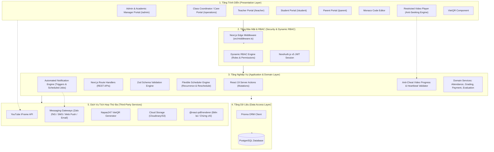
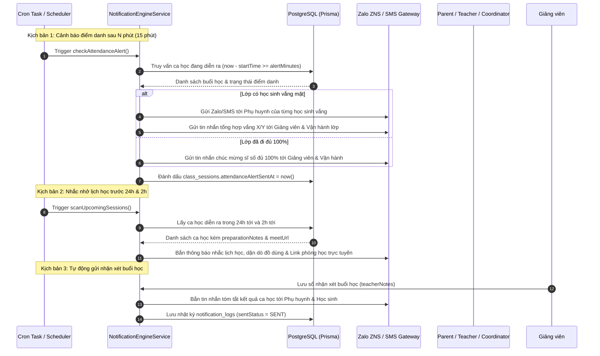

# Thiết Kế Kiến Trúc Hệ Thống & Cơ Sở Dữ Liệu (System Architecture & Database Design)

> **Dự án:** LMS Center Platform (Hệ thống Quản lý Học tập, Giảng viên & Vận hành Đào tạo Đa hình thức)  
> **Tài liệu:** `docs/architecture.md`  
> **Phiên bản:** 1.2.0 (Cập nhật Chuẩn RBAC, Vận Hành Lớp, Lịch Học Linh Hoạt & Tính Năng Moodle)  
> **Ngày cập nhật:** 23/09/2026  

---

## 1. Tổng Quan Kiến Trúc Hệ Thống (System Architecture Overview)

Hệ thống **LMS Center Platform** được thiết kế theo mô hình kiến trúc **Full-Stack Monolith phân tầng (Layered Architecture)** trên nền tảng **Next.js 16 App Router** và **React 19**, kết hợp cơ chế phân quyền hạt nhân **RBAC chuẩn quốc tế (Role-Based Access Control)**.



---

## 2. Thiết Kế Cơ Sở Dữ Liệu Toàn Diện (Database Schema & ERD)

### 2.1 Sơ Đồ Thực Thể Quan Hệ (Entity Relationship Diagram - ERD)

```mermaid
erDiagram
    User ||--o{ UserRole : has
    Role ||--o{ UserRole : assigned_to
    Role ||--o{ RolePermission : contains
    Permission ||--o{ RolePermission : defines

    User ||--o{ TeacherProfile : has
    User ||--o{ StudentProfile : has
    User ||--o{ ParentProfile : has
    ParentProfile ||--o{ ParentStudent : connects
    StudentProfile ||--o{ ParentStudent : belongs_to
    
    Course ||--o{ Module : contains
    Module ||--o{ Lesson : contains
    Lesson ||--o{ Material : includes
    Course ||--o{ GradebookConfig : defines
    
    Course ||--o{ Class : instances
    TeacherProfile ||--o{ Class : teaches_main
    TeacherProfile ||--o{ Class : teaches_ta
    User ||--o{ Class : coordinates
    
    Class ||--o{ ClassSession : schedules
    Class ||--o{ Enrollment : registers
    StudentProfile ||--o{ Enrollment : joins
    
    ClassSession ||--o{ TeacherAttendance : logs
    ClassSession ||--o{ StudentAttendance : logs
    StudentProfile ||--o{ StudentAttendance : records
    ClassSession ||--o{ SessionFeedback : receives_student_review
    StudentProfile ||--o{ SessionFeedback : submits_review
    
    TeacherProfile ||--o{ TeacherEvaluation : evaluated
    User ||--o{ TeacherEvaluation : audits

    Lesson ||--o{ LessonDiscussion : has_qa
    User ||--o{ LessonDiscussion : posts_qa
    Lesson ||--o{ LessonNote : has_notes
    StudentProfile ||--o{ LessonNote : writes_notes
    Lesson ||--o{ LessonProgress : tracks
    StudentProfile ||--o{ LessonProgress : achieves
    
    ClassSession ||--o{ NotificationLog : triggers
    NotificationTemplate ||--o{ NotificationLog : formats
    User ||--o{ NotificationLog : receives
    
    Class ||--o{ Assignment : assigns
    Assignment ||--o{ Material : attaches
    Assignment ||--o{ Submission : receives
    StudentProfile ||--o{ Submission : submits
    Submission ||--o{ GradeFeedback : grades
    TeacherProfile ||--o{ GradeFeedback : evaluates
    
    StudentProfile ||--o{ Certificate : awarded
    Course ||--o{ Certificate : certifies
    
    StudentProfile ||--o{ TuitionInvoice : billed_to
    TuitionInvoice ||--o{ PaymentTransaction : settles
```


---

### 2.2 Từ Điển Dữ Liệu Chi Tiết (Data Dictionary)

#### Nhóm 1: Hệ Thống Phân Quyền Động Chuẩn RBAC (Core Dynamic RBAC)

1. **`users`**:
   - `id` (UUID, PK): Mã người dùng duy nhất.
   - `email` (String, Unique): Email đăng nhập.
   - `passwordHash` (String): Mật khẩu mã hóa bcrypt.
   - `fullName` (String): Họ và tên.
   - `phone` (String, Nullable): Số điện thoại liên hệ.
   - `avatarUrl` (String, Nullable): Ảnh đại diện.
   - `isActive` (Boolean, Default `true`): Trạng thái kích hoạt.
   - `createdAt`, `updatedAt` (Timestamp).

2. **`roles`** (Bảng quản lý vai trò):
   - `id` (UUID, PK).
   - `code` (String, Unique): Mã định danh (ví dụ: `SUPER_ADMIN`, `ACADEMIC_MANAGER`, `CLASS_COORDINATOR`, `TEACHER`, `TA`, `STUDENT`, `PARENT`).
   - `name` (String): Tên hiển thị (ví dụ: "Quản lý Đào tạo / Giáo vụ trưởng", "Chuyên viên Vận hành & CSKH lớp").
   - `description` (String, Nullable): Mô tả quyền hạn.
   - `isSystem` (Boolean, Default `false`): Role hệ thống mặc định (không được xóa).

3. **`permissions`** (Bảng quản lý quyền hạn chi tiết - Granular Permissions):
   - `id` (UUID, PK).
   - `code` (String, Unique): Mã quyền (ví dụ: `classes.create`, `classes.schedule`, `classes.reschedule`, `teachers.evaluate`, `attendance.record_student`, `attendance.record_teacher`, `students.care_notes`, `finance.manage_invoices`).
   - `name` (String): Tên quyền (ví dụ: "Xếp thời khóa biểu lớp học", "Đánh giá chất lượng giáo viên").
   - `module` (String): Phân hệ (ví dụ: `CLASSES`, `TEACHERS`, `ATTENDANCE`, `FINANCE`).
   - `description` (String, Nullable).

4. **`role_permissions`** (Bảng trung gian N-N gán quyền cho vai trò):
   - `id` (UUID, PK).
   - `roleId` (UUID, FK -> `roles.id`).
   - `permissionId` (UUID, FK -> `permissions.id`).
   - Unique Constraint: `(roleId, permissionId)`.

5. **`user_roles`** (Bảng trung gian N-N gán vai trò cho người dùng):
   - `id` (UUID, PK).
   - `userId` (UUID, FK -> `users.id`).
   - `roleId` (UUID, FK -> `roles.id`).
   - `assignedAt` (Timestamp, Default `now()`).
   - `assignedBy` (UUID, Nullable, FK -> `users.id`): Người cấp quyền.
   - Unique Constraint: `(userId, roleId)`.

---

#### Nhóm 2: Hồ Sơ Người Dùng & Quan Hệ Gia Đình (Profiles)

6. **`teacher_profiles`**:
   - `id` (UUID, PK).
   - `userId` (UUID, FK -> `users.id`, Unique).
   - `specialization` (String): Lĩnh vực chuyên môn (Frontend, Backend, Python AI, IELTS...).
   - `bio` (Text, Nullable): Kinh nghiệm & chứng chỉ.
   - `hourlyRate` (Decimal): Đơn giá thù lao giờ dạy (VNĐ).
   - `contractType` (Enum: `FULLTIME`, `PARTTIME`, `VISITING`).
   - `kpiRating` (Decimal, Default `5.0`): Điểm đánh giá trung bình từ học viên và giáo vụ.

7. **`student_profiles`**:
   - `id` (UUID, PK).
   - `userId` (UUID, FK -> `users.id`, Unique).
   - `studentCode` (String, Unique): Mã học viên (ví dụ: `HV-2026-001`).
   - `dateOfBirth` (Date, Nullable).
   - `currentLevel` (String, Nullable).

8. **`parent_profiles`**:
   - `id` (UUID, PK).
   - `userId` (UUID, FK -> `users.id`, Unique).
   - `address` (String, Nullable).

9. **`parent_students`**:
   - `id` (UUID, PK).
   - `parentId` (UUID, FK -> `parent_profiles.id`).
   - `studentId` (UUID, FK -> `student_profiles.id`).
   - `relationship` (String): Bố, Mẹ, Người giám hộ.
   - Unique Constraint: `(parentId, studentId)`.

---

#### Nhóm 3: Đào Tạo, Khóa Học & Lớp Học Đa Hình Thức (Courses & Classes)

10. **`courses`**:
    - `id` (UUID, PK).
    - `title` (String): Tên khóa học.
    - `slug` (String, Unique).
    - `description` (Text).
    - `courseType` (Enum: `SELF_PACED_ONLINE`, `INSTRUCTOR_LED`): Phân loại khóa học tự học (cấm tua video) hay lớp có giáo viên.
    - `subjectType` (Enum: `IT`, `LANGUAGE`, `GENERAL`).
    - `thumbnailUrl` (String, Nullable).
    - `price` (Decimal): Học phí niêm yết.
    - `isPublished` (Boolean, Default `false`).

11. **`gradebook_configs`** (Cấu hình trọng số điểm theo chuẩn Moodle):
    - `id` (UUID, PK).
    - `courseId` (UUID, FK -> `courses.id`, Unique).
    - `attendanceWeight` (Int, Default `10`): % điểm chuyên cần.
    - `homeworkWeight` (Int, Default `30`): % điểm bài tập về nhà.
    - `midtermWeight` (Int, Default `20`): % điểm thi giữa kỳ.
    - `finalProjectWeight` (Int, Default `40`): % điểm đồ án / thi cuối khóa.
    - *Ràng buộc:* Tổng trọng số phải bằng 100%.

12. **`modules`**:
    - `id` (UUID, PK).
    - `courseId` (UUID, FK -> `courses.id`).
    - `title` (String): Tên chương.
    - `orderIndex` (Int): Thứ tự.

13. **`lessons`**:
    - `id` (UUID, PK).
    - `moduleId` (UUID, FK -> `modules.id`).
    - `title` (String): Tên bài học.
    - `orderIndex` (Int).
    - `youtubeUrl` (String, Nullable): Link video YouTube (Unlisted/Public/Playlist).
    - `content` (Text, Nullable): Nội dung tóm tắt Markdown.
    - `durationMinutes` (Int, Default `0`).
    - `isDripLocked` (Boolean, Default `false`): Mở khóa tuần tự theo tiến độ học (tính năng kế thừa Moodle).

14. **`classes`** (Lớp học với sự tham gia của 3 vai trò: Giáo viên, Trợ giảng và Vận hành/CSKH):
    - `id` (UUID, PK).
    - `courseId` (UUID, FK -> `courses.id`).
    - `name` (String): Mã lớp (ví dụ: `FE-K32`).
    - `classType` (Enum: `OFFLINE`, `ONLINE_VIRTUAL`, `HYBRID`).
    - `mainTeacherId` (UUID, FK -> `teacher_profiles.id`): Giảng viên chính.
    - `taTeacherId` (UUID, FK -> `teacher_profiles.id`, Nullable): Trợ giảng.
    - `coordinatorId` (UUID, FK -> `users.id`, Nullable): **Chuyên viên Vận hành lớp & Chăm sóc học viên (Class Coordinator / Care)**.
    - `roomName` (String, Nullable): Tên phòng học mặc định.
    - `meetUrl` (String, Nullable): Link Google Meet / Zoom mặc định.
    - `startDate` (Date), `endDate` (Date).
    - `scheduleRule` (JSON): Quy tắc lịch học lặp lại (ví dụ: `[{"dayOfWeek": 2, "startTime": "19:30", "endTime": "21:30"}, {"dayOfWeek": 4, "startTime": "19:30", "endTime": "21:30"}]`).
    - `attendanceAlertMinutes` (Int, Default `15`): Thời gian phát cảnh báo sĩ số vắng/đủ sau khi buổi học bắt đầu.
    - `reminderHours` (JSON, Default `[24, 2]`): Các mốc thời gian tự động bắn tin nhắn nhắc lịch học trước buổi.
    - `allowVideoSeeking` (Boolean, Default `false`): Mặc định cấm tua đối với video tự học.
    - `maxStudents` (Int, Default `20`).
    - `status` (Enum: `UPCOMING`, `ACTIVE`, `COMPLETED`, `CANCELLED`).

15. **`class_sessions`** (Buổi học linh hoạt - Flexible Session Scheduling):
    - `id` (UUID, PK): Buổi học cụ thể.
    - `classId` (UUID, FK -> `classes.id`).
    - `sessionNumber` (Int): Buổi số (1, 2, 3...).
    - `sessionDate` (Date): Ngày diễn ra buổi học.
    - `startTime` (Time): Giờ bắt đầu (có thể điều chỉnh linh hoạt từng buổi).
    - `endTime` (Time): Giờ kết thúc.
    - `assignedTeacherId` (UUID, FK -> `teacher_profiles.id`): Giáo viên phụ trách buổi này (hỗ trợ phân công giáo viên dạy thay).
    - `roomName` (String, Nullable): Phòng học riêng của buổi này (nếu đổi phòng).
    - `meetUrl` (String, Nullable): Link meet riêng của buổi này.
    - `meetingPlatform` (Enum: `GOOGLE_MEET`, `ZOOM`, `MS_TEAMS`, `JITSI`, Nullable).
    - `preparationNotes` (Text, Nullable): Dặn dò chuẩn bị trước giờ học (laptop, tài liệu, bài tập nợ) để gửi tin nhắn nhắc nhở.
    - `topic` (String, Nullable): Chủ đề giảng dạy.
    - `status` (Enum: `SCHEDULED`, `RESCHEDULED`, `IN_PROGRESS`, `COMPLETED`, `CANCELLED`).
    - `attendanceAlertSentAt` (Timestamp, Nullable): Thời điểm hệ thống đã tự động gửi tin nhắn báo sĩ số.
    - `rescheduleReason` (Text, Nullable): Lý do dời lịch hoặc bù buổi.
    - `originalDate` (Date, Nullable): Ngày học ban đầu nếu là buổi dời/bù.

16. **`enrollments`**:
    - `id` (UUID, PK).
    - `classId` (UUID, FK -> `classes.id`).
    - `studentId` (UUID, FK -> `student_profiles.id`).
    - `enrolledAt` (Timestamp).
    - `status` (Enum: `STUDYING`, `DROPPED`, `COMPLETED`).

---

#### Nhóm 4: Điểm Danh, Chấm Công & Đánh Giá Chất Lượng Giáo Viên

17. **`teacher_attendance`** (Chấm công ca dạy giáo viên):
    - `id` (UUID, PK).
    - `sessionId` (UUID, FK -> `class_sessions.id`, Unique).
    - `teacherId` (UUID, FK -> `teacher_profiles.id`).
    - `checkInTime` (Timestamp, Nullable).
    - `checkOutTime` (Timestamp, Nullable).
    - `actualDurationMinutes` (Int, Default `0`).
    - `note` (Text, Nullable).
    - `status` (Enum: `ON_TIME`, `LATE`, `ABSENT`, `SUBSTITUTED`).

18. **`student_attendance`** (Điểm danh học sinh đa mô hình):
    - `id` (UUID, PK).
    - `sessionId` (UUID, FK -> `class_sessions.id`).
    - `studentId` (UUID, FK -> `student_profiles.id`).
    - `status` (Enum: `PRESENT_OFFLINE`, `PRESENT_ONLINE`, `LATE`, `ABSENT`).
    - `lateMinutes` (Int, Default `0`).
    - `isExcused` (Boolean, Default `false`).
    - `teacherNote` (String, Nullable).
    - `coordinatorNote` (String, Nullable): **Ghi chú chăm sóc của Chuyên viên Vận hành lớp** (ví dụ: "Đã gọi phụ huynh, học sinh bị ốm xin nghỉ").
    - Unique Constraint: `(sessionId, studentId)`.

19. **`teacher_evaluations`** (Đánh giá giáo viên & QA Đào tạo định kỳ):
    - `id` (UUID, PK).
    - `teacherId` (UUID, FK -> `teacher_profiles.id`).
    - `classId` (UUID, FK -> `classes.id`, Nullable).
    - `evaluatorId` (UUID, FK -> `users.id`): Người đánh giá (Academic Manager hoặc Học sinh đánh giá ẩn danh).
    - `evaluationType` (Enum: `MANAGER_AUDIT`, `STUDENT_SURVEY`).
    - `criteriaScores` (JSON): Điểm chi tiết (Kiến thức chuyên môn, Kỹ năng sư phạm, Tác phong đúng giờ, Độ nhiệt tình hỗ trợ...).
    - `overallScore` (Decimal): Điểm trung bình (Thang điểm 5 hoặc 10).
    - `comment` (Text): Nhận xét góp ý.
    - `evaluatedAt` (Timestamp).

20. **`session_feedbacks`** (Đánh giá giáo viên theo từng buổi học từ học sinh - Per-Session Student Feedback):
    - `id` (UUID, PK).
    - `sessionId` (UUID, FK -> `class_sessions.id`): Buổi học được đánh giá.
    - `studentId` (UUID, FK -> `student_profiles.id`): Học sinh đánh giá.
    - `teacherRating` (Int, 1-5 sao): Đánh giá chất lượng giảng viên trong buổi.
    - `taRating` (Int, Nullable, 1-5 sao): Đánh giá trợ giảng trong buổi.
    - `understandingLevel` (Enum: `POOR`, `AVERAGE`, `GOOD`, `EXCELLENT`): Mức độ hiểu bài trong buổi.
    - `pacingFeedback` (Enum: `TOO_SLOW`, `JUST_RIGHT`, `TOO_FAST`): Tốc độ giảng bài của giáo viên.
    - `comment` (Text, Nullable): Góp ý cụ thể (ẩn danh).
    - `isAnonymous` (Boolean, Default `true`): Ẩn danh tính với giáo viên (chỉ Quản lý Đào tạo & Vận hành lớp xem được thống kê).
    - `createdAt` (Timestamp, Default `now()`).
    - Unique Constraint: `(sessionId, studentId)`: Mỗi học sinh chỉ đánh giá 1 lần mỗi buổi học.

---

#### Nhóm 5: Tài Liệu, BTVN, Monaco Editor & Chấm Điểm

20. **`materials`**:
    - `id` (UUID, PK).
    - `title` (String): Tên tài liệu.
    - `fileUrl` (String): Link Cloud Storage.
    - `fileType` (Enum: `PDF_SLIDE`, `CODE_STARTER`, `AUDIO_MP3`, `DATASET`, `DOCUMENT`).
    - `lessonId` (UUID, FK -> `lessons.id`, Nullable).
    - `assignmentId` (UUID, FK -> `assignments.id`, Nullable).
    - `isPublic` (Boolean, Default `true`).

21. **`assignments`**:
    - `id` (UUID, PK).
    - `classId` (UUID, FK -> `classes.id`).
    - `title` (String).
    - `description` (Text): Hướng dẫn đề bài Markdown.
    - `format` (Enum: `CODE_MONACO`, `GITHUB_REPO`, `FILE_UPLOAD`, `AUDIO_RECORDING`, `ESSAY`).
    - `allowedLanguage` (String, Default `"javascript"`).
    - `deadline` (Timestamp).
    - `maxScore` (Int, Default `100`).

22. **`submissions`**:
    - `id` (UUID, PK).
    - `assignmentId` (UUID, FK -> `assignments.id`).
    - `studentId` (UUID, FK -> `student_profiles.id`).
    - `codeContent` (Text, Nullable): Code học viên viết trên Monaco Editor.
    - `githubUrl` (String, Nullable).
    - `fileUrl` (String, Nullable).
    - `submittedAt` (Timestamp).
    - `isLate` (Boolean, Default `false`).
    - `status` (Enum: `SUBMITTED`, `GRADED`, `RESUBMIT_REQUIRED`).
    - Unique Constraint: `(assignmentId, studentId)`.

23. **`grade_feedbacks`**:
    - `id` (UUID, PK).
    - `submissionId` (UUID, FK -> `submissions.id`, Unique).
    - `teacherId` (UUID, FK -> `teacher_profiles.id`).
    - `score` (Decimal).
    - `rubricCriteria` (JSON, Nullable).
    - `comment` (Text).
    - `gradedAt` (Timestamp).

---

#### Nhóm 6: Tài Chính & Học Phí Đa Kênh

24. **`tuition_invoices`**:
    - `id` (UUID, PK).
    - `invoiceCode` (String, Unique).
    - `studentId` (UUID, FK -> `student_profiles.id`).
    - `classId` (UUID, FK -> `classes.id`, Nullable).
    - `title` (String).
    - `amount` (Decimal), `paidAmount` (Decimal, Default `0`).
    - `dueDate` (Date).
    - `status` (Enum: `PENDING`, `PARTIALLY_PAID`, `PAID`, `OVERDUE`).
    - `vietqrPayload` (Text, Nullable).

25. **`payment_transactions`**:
    - `id` (UUID, PK).
    - `invoiceId` (UUID, FK -> `tuition_invoices.id`).
    - `amount` (Decimal).
    - `method` (Enum: `VIETQR`, `CREDIT_CARD`, `CASH`, `BANK_TRANSFER`).
    - `transactionRef` (String, Nullable).
    - `receivedByUserId` (UUID, FK -> `users.id`, Nullable).
    - `receiptPdfUrl` (String, Nullable).
    - `paidAt` (Timestamp).

---

#### Nhóm 7: Tính Năng Khóa Học Online Chuyên Sâu (Kế Thừa Từ Frappe LMS)

26. **`lesson_discussions`** (Hỏi đáp & Thảo luận ngay trong bài học có Timestamp):
    - `id` (UUID, PK).
    - `lessonId` (UUID, FK -> `lessons.id`).
    - `userId` (UUID, FK -> `users.id`).
    - `videoTimestampSeconds` (Int, Nullable): Giây thứ mấy trong video bài giảng YouTube mà học viên đang thắc mắc (click vào nhảy ngay đến đoạn video đó).
    - `content` (Text): Nội dung câu hỏi hoặc phản hồi.
    - `parentId` (UUID, Nullable, FK -> `lesson_discussions.id`): Phản hồi cho câu hỏi nào (Threaded Q&A).
    - `isVerifiedAnswer` (Boolean, Default `false`): Dấu tích xanh xác nhận câu trả lời chính xác từ Giảng viên / Trợ giảng.
    - `createdAt` (Timestamp, Default `now()`).

27. **`lesson_notes`** (Ghi chú cá nhân của học sinh trong khi xem bài giảng):
    - `id` (UUID, PK).
    - `lessonId` (UUID, FK -> `lessons.id`).
    - `studentId` (UUID, FK -> `student_profiles.id`).
    - `videoTimestampSeconds` (Int, Nullable): Mốc thời gian video lúc ghi chú.
    - `noteText` (Text): Nội dung ghi chú cá nhân (Markdown).
    - `createdAt`, `updatedAt` (Timestamp).

28. **`certificates`** (Chứng chỉ hoàn thành khóa học có URL xác thực công khai - Public Verifiable Certificate):
    - `id` (UUID, PK).
    - `certificateCode` (String, Unique): Mã chứng chỉ duy nhất (ví dụ: `CERT-2026-REACT-8F29`).
    - `studentId` (UUID, FK -> `student_profiles.id`).
    - `courseId` (UUID, FK -> `courses.id`).
    - `classId` (UUID, FK -> `classes.id`).
    - `issueDate` (Date).
    - `gradeClassification` (String): Xếp loại (Xuất sắc, Giỏi, Khá).
    - `verificationSlug` (String, Unique): Đường dẫn kiểm tra công khai `/verify/[certificateCode]`.
    - `pdfUrl` (String): Link file PDF chứng chỉ có mã QR xác thực.

---

#### Nhóm 8: Tiến Độ Học Tập & Kiểm Soát Video Chống Tua (Anti-Seeking Video Progress)

29. **`lesson_progress`** (Quản lý tiến độ xem video & cấm tua đối phó):
    - `id` (UUID, PK).
    - `lessonId` (UUID, FK -> `lessons.id`).
    - `studentId` (UUID, FK -> `student_profiles.id`).
    - `watchedSeconds` (Int, Default `0`): Tổng số giây đã thực sự xem.
    - `maxWatchedSeconds` (Int, Default `0`): Mốc giây xa nhất đã xem (dùng để chặn thao tác tua vượt mốc).
    - `totalDuration` (Int, Default `0`): Tổng thời lượng bài giảng (lấy từ YouTube API).
    - `isCompleted` (Boolean, Default `false`): Đánh dấu hoàn thành khi `maxWatchedSeconds >= totalDuration * 0.95`.
    - `allowFreeSeeking` (Boolean, Default `false`): Chỉ bật `true` khi học sinh đã hoàn thành bài học lần đầu tiên, cho phép tự do tua để ôn tập.
    - `lastHeartbeatAt` (Timestamp): Mốc thời gian lần heartbeat gần nhất để chống nhảy cóc (cheat detection).
    - Unique Constraint: `(lessonId, studentId)`.

---

#### Nhóm 9: Hệ Thống Thông Báo & Tin Nhắn Tự Động (Automated Notification Engine)

30. **`notification_templates`** (Mẫu nội dung thông báo đa kênh):
    - `id` (UUID, PK).
    - `code` (String, Unique): Mã mẫu thông báo (`ATTENDANCE_ALERT_ABSENT`, `ATTENDANCE_ALERT_FULL`, `TEACHER_SESSION_FEEDBACK`, `CLASS_REMINDER_24H`, `CLASS_REMINDER_2H`).
    - `title` (String): Tiêu đề thông báo.
    - `contentTemplate` (Text): Mẫu nội dung hỗ trợ placeholder (`{{studentName}}`, `{{className}}`, `{{sessionTime}}`, `{{meetingUrl}}`, `{{feedbackSummary}}`).
    - `channels` (JSON): Mảng kênh áp dụng (ví dụ: `["ZALO_ZNS", "SMS", "IN_APP", "PUSH", "EMAIL"]`).
    - `isActive` (Boolean, Default `true`).

31. **`notification_logs`** (Nhật ký phát tin nhắn & trạng thái chuyển phát):
    - `id` (UUID, PK).
    - `templateCode` (String): Mã mẫu áp dụng.
    - `recipientUserId` (UUID, FK -> `users.id`): Người nhận (Phụ huynh, Học sinh, Giáo viên hoặc Vận hành).
    - `recipientPhone` (String, Nullable): Số điện thoại nhận Zalo/SMS.
    - `sessionId` (UUID, FK -> `class_sessions.id`, Nullable): Gắn với buổi học nào.
    - `channel` (Enum: `ZALO_ZNS`, `SMS`, `IN_APP`, `PUSH`, `EMAIL`).
    - `payload` (JSON): Dữ liệu truyền vào template.
    - `sentStatus` (Enum: `PENDING`, `SENT`, `DELIVERED`, `FAILED`).
    - `errorDetails` (Text, Nullable).
    - `createdAt` (Timestamp, Default `now()`).

---

## 3. Ma Trận Phân Quyền Hạt Nhân RBAC (Granular RBAC Matrix)

| Chức năng / Permission Code | Super Admin | Academic Manager (Giáo vụ) | Class Coordinator (Vận hành/CSKH) | Teacher (Giảng viên) | Student (Học viên) | Parent (Phụ huynh) |
| :--- | :---: | :---: | :---: | :---: | :---: | :---: |
| Quản trị hệ thống, Cấu hình RBAC | ✅ | ❌ | ❌ | ❌ | ❌ | ❌ |
| Tạo khóa học, phân công giáo viên | ✅ | ✅ | ❌ | ❌ | ❌ | ❌ |
| Xếp lớp, cấu hình lịch học linh hoạt | ✅ | ✅ | ❌ | ❌ | ❌ | ❌ |
| Dời lịch học / đổi phòng / đổi Meet link | ✅ | ✅ | ✅ (lớp phụ trách) | ⚠️ (đề xuất) | ❌ | ❌ |
| Cấu hình thời gian gửi tin tự động | ✅ | ✅ | ✅ (lớp phụ trách) | ❌ | ❌ | ❌ |
| Đánh giá chất lượng giáo viên (Audit) | ✅ | ✅ | ❌ | ❌ | ❌ | ❌ |
| Đánh giá giáo viên theo từng buổi | ❌ | ❌ | ❌ | ❌ | ✅ | ❌ |
| Ghi chú chăm sóc học sinh vắng | ✅ | ✅ | ✅ (lớp phụ trách) | ❌ | ❌ | ❌ |
| Check-in/out ca dạy (chấm công) | ❌ | ❌ | ❌ | ✅ | ❌ | ❌ |
| Điểm danh học sinh lớp Hybrid | ✅ | ✅ | ✅ (hỗ trợ) | ✅ | ❌ | ❌ |
| Upload tài liệu học tập, code mẫu | ✅ | ✅ | ❌ | ✅ | ❌ | ❌ |
| Giao bài tập, chấm điểm theo rubric | ✅ | ❌ | ❌ | ✅ | ❌ | ❌ |
| Làm BTVN trên Monaco Code Editor | ❌ | ❌ | ❌ | ❌ | ✅ | ❌ |
| Xem chuyên cần, điểm số của con | ❌ | ❌ | ❌ | ❌ | ❌ | ✅ |
| Thanh toán học phí VietQR, thẻ | ❌ | ❌ | ❌ | ❌ | ✅ | ✅ |
| Xác nhận thu tiền mặt tại quầy | ✅ | ✅ | ✅ | ❌ | ❌ | ❌ |

---

## 4. Cơ Chế Xếp Lịch Học Linh Hoạt (Flexible Scheduling Engine)

Thuật toán sinh và điều chỉnh buổi học:
1. **Lịch định kỳ chuẩn (Base Recurrence):**
   - Khi mở lớp, Quản lý đào tạo chọn tần suất:
     - *1 buổi/tuần:* Chọn thứ (ví dụ: Chủ nhật 08:30 - 11:30).
     - *Nhiều buổi/tuần:* Chọn các thứ (ví dụ: T2-T4-T6 hoặc T3-T5 lúc 19:30 - 21:30).
   - Hệ thống tự động tạo trước danh sách $N$ buổi học tương ứng trong bảng `class_sessions`.
2. **Tùy biến từng buổi học (Per-Session Customization):**
   - Mỗi buổi học trong `class_sessions` là một thực thể độc lập có `id` riêng.
   - Quản lý đào tạo hoặc Điều phối viên lớp có thể:
     - **Dời ngày học (Reschedule):** Chuyển từ ngày $D$ sang ngày $D'$; hệ thống tự động lưu `originalDate` và lý do `rescheduleReason`.
     - **Đổi phòng học / Link Meet:** Cập nhật `roomName` hoặc `meetUrl` riêng cho buổi đó nếu phòng cũ bảo trì.
     - **Phân công giáo viên dạy thay:** Cập nhật `assignedTeacherId` riêng cho buổi học khi giáo viên chính bận đột xuất.
     - **Bù buổi:** Thêm một buổi học mới ngoài lịch cố định.
   - Mọi thay đổi lịch học được bắn thông báo tức thời (Email/Push) đến Giảng viên, Học viên và Phụ huynh.

---

## 5. Kiến Trúc Động Cơ Tin Nhắn & Thông Báo Tự Động (Automated Notification Engine)



---

## 6. Cơ Chế Video Player Chống Tua & Heartbeat Anti-Cheat (Restricted Video Player)

Nhằm bảo đảm học viên của các khóa học tự học (Self-Paced) xem trọn vẹn bài giảng video nhúng YouTube:

1. **Client-Side Player Shield:**
   - Trình phát sử dụng YouTube IFrame API bọc trong component bảo vệ React.
   - Ẩn điều khiển tua mặc định của YouTube hoặc chặn sự kiện `seekTo`:
     - Nếu vị trí người dùng tua tới $> \text{maxWatchedSeconds} + 2\text{s}$, player ngay lập tức ép `seekTo(maxWatchedSeconds)`.
     - Cho phép tua lùi thoải mái ($\le \text{maxWatchedSeconds}$) để nghe lại bài giảng.
2. **Anti-Cheat Heartbeat Protocol:**
   - Mỗi $5$ giây khi video đang ở trạng thái `PLAYING`, client gửi heartbeat:
     ```json
     {
       "lessonId": "uuid",
       "currentSeconds": 145,
       "playbackRate": 1.0,
       "clientTimestamp": 1727072400
     }
     ```
   - **Xác thực phía Server (Backend Verification):**
     - $\Delta T_{\text{client}} = \text{currentSeconds} - \text{lastCurrentSeconds}$.
     - $\Delta T_{\text{server}} = \text{now}() - \text{lastHeartbeatAt}$.
     - Nếu $\Delta T_{\text{client}} > \Delta T_{\text{server}} \times \text{playbackRate} + 3\text{s}$ (phát hiện tua lách luật qua DevTools/Script) $\to$ Server từ chối cập nhật `maxWatchedSeconds` và trả mã cảnh báo `400 Bad Request`.
3. **Mở khóa sau khi hoàn thành (Post-Completion Unlock):**
   - Khi `maxWatchedSeconds >= totalDuration * 0.95`, hệ thống cập nhật `isCompleted = true` và `allowFreeSeeking = true`.
   - Các lần xem tiếp theo, học sinh được tự do tua nhanh/chậm phục vụ việc tra cứu và ôn tập.

