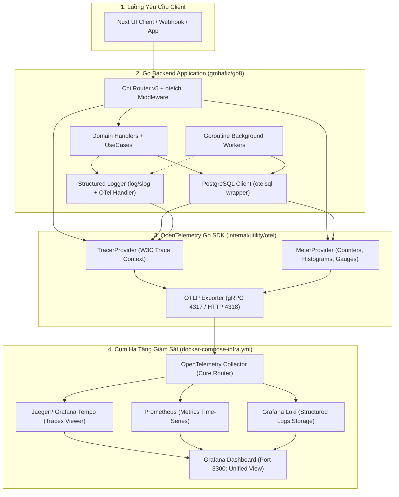
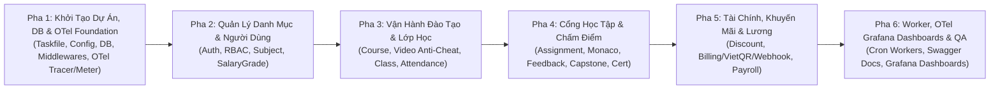

# Kế Hoạch Triển Khai Backend REST API, OpenTelemetry & Danh Sách API Dự Tính

> **Dự án:** LMS Center Platform (Hệ thống Quản lý Học tập, Giảng viên & Vận hành Đào tạo Đa hình thức)  
> **Tài liệu:** `docs/implementation-plan.md`  
> **Kiến trúc Blueprint:** [`gmhafiz/go8`](https://github.com/gmhafiz/go8) (Go 1.23+, `go-chi/chi/v5`, PostgreSQL 16, Goose SQL Migrations, `swaggo/swag`, `go-playground/validator/v10`)  
> **Tài liệu tham chiếu:** [`docs/architecture.md`](file:///c:/Users/ducth/OneDrive/M%C3%A1y%20t%C3%ADnh/LMS/docs/architecture.md), [`docs/api-specification.md`](file:///c:/Users/ducth/OneDrive/M%C3%A1y%20t%C3%ADnh/LMS/docs/api-specification.md), [`docs/requirements.md`](file:///c:/Users/ducth/OneDrive/M%C3%A1y%20t%C3%ADnh/LMS/docs/requirements.md)  
> **Phiên bản kế hoạch:** 2.3.0 (Bổ sung Cổng Vận Hành Lớp & Chăm Sóc Học Viên CLASS_COORDINATOR - Tổng cộng 105+ REST API, 24 Domains)  
> **Ngày cập nhật:** 23/09/2026  

---

## 1. Quy Chuẩn Kiến Trúc Backend Bắt Buộc (Go8 Standards)

Hệ sinh thái Backend được xây dựng tuân thủ nghiêm ngặt mô hình kiến trúc phân tầng chuẩn từ blueprint **`gmhafiz/go8`**:
- **Router:** `go-chi/chi/v5` nhẹ, hiệu năng cao, 100% tương thích `net/http` tiêu chuẩn cộng đồng Go.
- **Mô hình Phân tầng (Layered Clean Architecture):** Mỗi domain nghiệp vụ chia thành 3 tầng độc lập:
  - `Handler` (Controller): Tiếp nhận HTTP request, parse DTO và kiểm tra hợp lệ qua `go-playground/validator/v10`.
  - `UseCase` (Business Logic): Thực hiện các quy tắc nghiệp vụ, điều phối giao dịch (ACID transactions).
  - `Repository` (Data Access): Thao tác với PostgreSQL 16 qua `sqlx` hoặc `otelsql`.
- **Chuẩn hóa phản hồi JSON:** Toàn bộ API phản hồi theo định dạng thống nhất `pkg/response/Envelope`:
  ```json
  {
    "success": true,
    "data": { ... },
    "message": "Thao tác thực hiện thành công",
    "error": null
  }
  ```
- **Chuẩn hóa 6 trường Audit & Xóa mềm (Universal Audit & Soft Delete):**
  - 100% bảng trong CSDL đều có 6 trường: `created_at`, `created_by`, `updated_at`, `updated_by`, `deleted_at`, `deleted_by`.
  - Cấm Tuyệt Đối Hard Delete trên các bảng nghiệp vụ lõi (`users`, `subjects`, `courses`, `classes`, `assignments`, `tuition_invoices`, `teacher_payrolls`, `campuses`, `rooms`, `quizzes`, `contracts`, `student_care_logs`, `class_transfers`). Mọi thao tác xóa đều cập nhật `deleted_at = NOW()` và các câu lệnh query mặc định lọc `WHERE deleted_at IS NULL`.
- **Tự động sinh tài liệu Swagger UI:** 100% các Handler functions phải có đầy đủ Swaggo annotations (`@Summary`, `@Description`, `@Tags`, `@Accept`, `@Produce`, `@Param`, `@Success`, `@Failure`, `@Router`) để tự động sinh Swagger UI qua lệnh `task swagger`.

---

## 2. 📋 Danh Sách Toàn Bộ 105+ REST API Dự Tính (Chi Tiết 24 Domains)

Dưới đây là danh sách phân rã toàn bộ 105+ endpoint API dự tính xây dựng, chia theo 24 phân hệ nghiệp vụ:

### Phân Hệ 1: Xác Thực & Quản Lý Người Dùng (`internal/domain/auth` & `user`)
| Method | Endpoint | Mô tả chức năng | Quyền hạn |
| :--- | :--- | :--- | :--- |
| `POST` | `/api/v1/auth/register` | Đăng ký tài khoản học viên mới | Public |
| `POST` | `/api/v1/auth/login` | Đăng nhập hệ thống (trả về Access & Refresh Token) | Public |
| `POST` | `/api/v1/auth/refresh` | Làm mới JWT Access Token | Public |
| `POST` | `/api/v1/auth/logout` | Đăng xuất và thu hồi Refresh Token | BearerAuth |
| `GET` | `/api/v1/auth/me` | Lấy thông tin cá nhân & quyền hạn (Roles/Permissions) | BearerAuth |
| `PUT` | `/api/v1/auth/profile` | Cập nhật hồ sơ cá nhân (Họ tên, SĐT, Avatar) | BearerAuth |
| `PUT` | `/api/v1/auth/change-password` | Đổi mật khẩu tài khoản | BearerAuth |

### Phân Hệ 2: Quản Trị Hệ Thống, Nhận Diện Thương Hiệu & Audit Logs (`internal/domain/system` & `admin`)
| Method | Endpoint | Mô tả chức năng | Quyền hạn |
| :--- | :--- | :--- | :--- |
| `GET` | `/api/v1/settings/website` | Lấy cấu hình nhận diện thương hiệu công khai (Logo, Favicon, Màu Header/Footer, Hotline) | Public |
| `PUT` | `/api/v1/admin/settings/website` | Super Admin tùy biến giao diện website (Logo sáng/tối, Favicon, Màu nền Header/Footer, Banner, SEO) | Super Admin |
| `GET` | `/api/v1/admin/users` | Danh sách người dùng toàn trung tâm (tìm kiếm, lọc role, trạng thái) | Super Admin / Academic |
| `POST` | `/api/v1/admin/users` | Tạo mới tài khoản nhân sự (GV, TA, Giám khảo, Vận hành) | Super Admin |
| `GET` | `/api/v1/admin/users/{id}` | Xem chi tiết thông tin và hồ sơ người dùng | Super Admin / Academic |
| `PUT` | `/api/v1/admin/users/{id}/roles` | Gán hoặc thu hồi vai trò của người dùng (Multi-Role Support) | Super Admin |
| `PUT` | `/api/v1/admin/users/{id}/status` | Khóa hoặc mở khóa tài khoản người dùng (`isActive`) | Super Admin |
| `DELETE` | `/api/v1/admin/users/{id}` | Xóa mềm tài khoản người dùng (`deleted_at`, `deleted_by`) | Super Admin |
| `GET` | `/api/v1/admin/roles` | Lấy danh sách các vai trò trong hệ thống | Super Admin |
| `POST` | `/api/v1/admin/roles` | Tạo vai trò mới và phân quyền hạt nhân | Super Admin |
| `GET` | `/api/v1/admin/permissions` | Lấy danh mục cây quyền hạn chi tiết | Super Admin |
| `GET` | `/api/v1/admin/audit-logs` | Tra cứu nhật ký kiểm toán hệ thống (Audit Logs) | Super Admin |
| `GET` | `/api/v1/admin/settings/integrations` | Xem cấu hình cổng thanh toán VietQR, Zalo ZNS, SMTP | Super Admin |
| `PUT` | `/api/v1/admin/settings/integrations` | Cập nhật cấu hình tích hợp và Webhook Secret | Super Admin |

### Phân Hệ 3: Quản Lý Môn Học Động (`internal/domain/subject`)
| Method | Endpoint | Mô tả chức năng | Quyền hạn |
| :--- | :--- | :--- | :--- |
| `GET` | `/api/v1/subjects` | Lấy danh sách môn học (hỗ trợ search, filter status) | Public / Auth |
| `GET` | `/api/v1/subjects/{id}` | Lấy chi tiết môn học | Public / Auth |
| `POST` | `/api/v1/subjects` | Tạo môn học mới | Admin / Academic |
| `PUT` | `/api/v1/subjects/{id}` | Cập nhật thông tin môn học | Admin / Academic |
| `DELETE` | `/api/v1/subjects/{id}` | Xóa mềm môn học (`deleted_at`, `deleted_by`) | Admin / Academic |

### Phân Hệ 4: Khóa Học & Giáo Trình Bài Giảng (`internal/domain/course`)
| Method | Endpoint | Mô tả chức năng | Quyền hạn |
| :--- | :--- | :--- | :--- |
| `GET` | `/api/v1/courses` | Danh mục khóa học (filter theo Subject, loại Free/Paid) | Public |
| `GET` | `/api/v1/courses/{id}` | Xem chi tiết khóa học, đề cương và giáo viên phụ trách | Public |
| `POST` | `/api/v1/courses` | Tạo khóa học mới (liên kết `subjectId`) | Admin / Academic |
| `PUT` | `/api/v1/courses/{id}` | Cập nhật thông tin khóa học | Admin / Academic |
| `DELETE` | `/api/v1/courses/{id}` | Xóa mềm khóa học | Admin / Academic |
| `GET` | `/api/v1/courses/{id}/curriculum` | Lấy toàn bộ cây chương/bài giảng video và tài liệu | Enrolled / Teacher / Admin |
| `POST` | `/api/v1/courses/{id}/chapters` | Tạo chương học mới | Admin / Academic |
| `POST` | `/api/v1/courses/{id}/lessons` | Thêm bài học mới (video YouTube, slide PDF, code mẫu) | Admin / Academic |

### Phân Hệ 5: Trình Phát Video Chống Tua & Heartbeat (`internal/domain/course_video`)
| Method | Endpoint | Mô tả chức năng | Quyền hạn |
| :--- | :--- | :--- | :--- |
| `POST` | `/api/v1/courses/{courseId}/lessons/{lessonId}/heartbeat` | Gửi nhịp tim kiểm soát tiến độ xem mỗi 5s & chống tua tiến | Student (Enrolled) |
| `GET` | `/api/v1/courses/{courseId}/lessons/{lessonId}/progress` | Lấy mốc đã xem tối đa và cờ mở khóa tua tự do | Student (Enrolled) |

### Phân Hệ 6: Lớp Học & Xếp Lịch Linh Hoạt (`internal/domain/class`)
| Method | Endpoint | Mô tả chức năng | Quyền hạn |
| :--- | :--- | :--- | :--- |
| `GET` | `/api/v1/classes` | Danh sách lớp học (Offline/Online/Hybrid, phân trang) | Teacher / Admin / Coord |
| `POST` | `/api/v1/classes` | Mở lớp học mới & sinh lịch tuần tự động (TA là tùy chọn) | Admin / Academic |
| `GET` | `/api/v1/classes/{id}` | Chi tiết lớp học, sĩ số và thông tin GV/TA/Vận hành | Auth |
| `PUT` | `/api/v1/classes/{id}` | Cập nhật thông tin lớp học | Admin / Academic |
| `DELETE` | `/api/v1/classes/{id}` | Xóa mềm lớp học | Admin / Academic |
| `GET` | `/api/v1/classes/{id}/sessions` | Lấy danh sách toàn bộ các buổi học (`class_sessions`) | Auth |
| `PUT` | `/api/v1/sessions/{id}/reschedule` | Dời lịch học, đổi phòng hoặc phân công GV dạy thay | Admin / Academic / Coord |

### Phân Hệ 7: Điểm Danh & Chấm Công Ca Dạy (`internal/domain/attendance`)
| Method | Endpoint | Mô tả chức năng | Quyền hạn |
| :--- | :--- | :--- | :--- |
| `POST` | `/api/v1/attendance/teacher-checkin` | Giáo viên Check-in / Check-out ca dạy để tính thù lao | Teacher |
| `POST` | `/api/v1/attendance/student-batch` | Điểm danh học sinh đa hình thức (Offline/Online/Late/Absent) | Teacher / Coord |
| `GET` | `/api/v1/sessions/{sessionId}/attendance` | Lấy bảng điểm danh chi tiết của buổi học | Teacher / Coord / Admin |
| `GET` | `/api/v1/classes/{classId}/attendance-summary` | Tổng hợp tỷ lệ chuyên cần của cả lớp | Teacher / Coord / Admin |

### Phân Hệ 8: Bài Tập Về Nhà Theo Lớp & Chấm Điểm Monaco (`internal/domain/assignment`)
| Method | Endpoint | Mô tả chức năng | Quyền hạn |
| :--- | :--- | :--- | :--- |
| `GET` | `/api/v1/classes/{classId}/assignments` | Danh sách bài tập được giao cho lớp học | Class Members |
| `POST` | `/api/v1/classes/{classId}/assignments` | Giáo viên tạo bài tập về nhà mới kèm deadline & starter code | Teacher / Admin |
| `POST` | `/api/v1/submissions` | Học viên nộp bài làm Monaco Code Editor / link GitHub | Student |
| `GET` | `/api/v1/classes/{classId}/assignments/{assignmentId}/submissions` | Danh sách bài nộp của học viên trong lớp | Teacher / Admin |
| `POST` | `/api/v1/classes/{classId}/assignments/{assignmentId}/submissions/{submissionId}/grade` | Giáo viên chấm điểm Rubric, ghi chú Markdown, audio dặn dò | Teacher / TA |
| `GET` | `/api/v1/classes/{classId}/gradebook` | Bảng tổng hợp Sổ điểm toàn bộ bài tập của lớp | Teacher / Admin / Coord |

### Phân Hệ 9: Đánh Giá Chất Lượng Sau Buổi Học (`internal/domain/evaluation`)
| Method | Endpoint | Mô tả chức năng | Quyền hạn |
| :--- | :--- | :--- | :--- |
| `POST` | `/api/v1/sessions/{sessionId}/feedback` | Học sinh đánh giá GV, TA và độ hiểu bài sau buổi học (24h) | Student (Attended) |
| `GET` | `/api/v1/teachers/{teacherId}/feedbacks` | Thống kê điểm hài lòng trung bình của giáo viên | Admin / Academic / Teacher |

### Phân Hệ 10: Hội Đồng Giám Khảo & Chấm Đồ Án Tốt Nghiệp (`internal/domain/capstone`)
| Method | Endpoint | Mô tả chức năng | Quyền hạn |
| :--- | :--- | :--- | :--- |
| `GET` | `/api/v1/capstone/projects` | Danh sách đề tài đồ án tốt nghiệp cần chấm | Examiner / Admin / Student |
| `POST` | `/api/v1/capstone/projects` | Khởi tạo đề tài đồ án tốt nghiệp cho nhóm học viên | Teacher / Academic |
| `POST` | `/api/v1/capstone/evaluations` | Giám khảo chấm điểm đồ án độc lập theo Rubric 4 tiêu chí | Examiner |
| `GET` | `/api/v1/capstone/projects/{id}/evaluations` | Tổng hợp điểm phản biện của Hội đồng Giám khảo | Examiner / Admin |

### Phân Hệ 11: Khuyến Mãi & Voucher Giảm Giá (`internal/domain/discount`)
| Method | Endpoint | Mô tả chức năng | Quyền hạn |
| :--- | :--- | :--- | :--- |
| `GET` | `/api/v1/discounts` | Danh sách mã giảm giá trong hệ thống | Admin / Marketing |
| `POST` | `/api/v1/discounts` | Tạo mã giảm giá mới (PERCENT / FIXED, điều kiện trần/sàn) | Admin / Marketing |
| `PUT` | `/api/v1/discounts/{id}` | Cập nhật cấu hình mã giảm giá | Admin / Marketing |
| `DELETE` | `/api/v1/discounts/{id}` | Xóa mềm mã giảm giá | Admin / Marketing |
| `POST` | `/api/v1/discounts/validate` | Xác thực mã giảm giá và tính toán số tiền khấu trừ trước checkout | Public / Auth |

### Phân Hệ 12: Cổng Mua Khóa Học & Thanh Toán VietQR (`internal/domain/billing`)
| Method | Endpoint | Mô tả chức năng | Quyền hạn |
| :--- | :--- | :--- | :--- |
| `POST` | `/api/v1/courses/{id}/enroll` | Đăng ký học ngay với Khóa học Miễn Phí (1-Click) | Student |
| `POST` | `/api/v1/courses/{id}/checkout` | Mua khóa học Trả Phí, áp mã Coupon & sinh VietQR Napas247 | Student |
| `POST` | `/api/v1/invoices/{id}/vietqr` | Lấy lại mã VietQR động cho hóa đơn học phí lớp học | Student / Parent |
| `POST` | `/api/v1/webhooks/payment` | Webhook ngân hàng SePay/Casso tự động kích hoạt | Public (Webhook) |
| `GET` | `/api/v1/invoices` | Danh sách hóa đơn học phí / mua khóa học | Admin / Accountant / Student |
| `POST` | `/api/v1/invoices/{id}/cash-confirm` | Thu ngân xác nhận thu tiền mặt tại quầy | Cashier / Admin |

### Phân Hệ 13: Bảng Lương Giáo Viên & Bậc Lương (`internal/domain/payroll`)
| Method | Endpoint | Mô tả chức năng | Quyền hạn |
| :--- | :--- | :--- | :--- |
| `GET` | `/api/v1/salary-grades` | Danh sách cấu hình bậc lương (Intern/TA, Standard, Senior, Master) | Admin |
| `POST` | `/api/v1/salary-grades` | Cấu hình định mức thù lao, hệ số ngoài giờ, tỷ lệ thưởng KPI | Admin |
| `POST` | `/api/v1/payrolls/generate` | Tự động tổng hợp bảng lương tháng từ ca dạy, feedback và phạt muộn | Admin |
| `GET` | `/api/v1/payrolls` | Danh sách bảng lương tháng (lọc theo kỳ YYYY-MM, trạng thái, GV) | Admin / Accountant |
| `GET` | `/api/v1/payrolls/{id}` | Xem chi tiết phiếu lương cá nhân kèm chi tiết từng ca dạy | Admin / Teacher |
| `POST` | `/api/v1/payrolls/{id}/approve` | Phê duyệt bảng lương quyết toán chuyển khoản | Admin / Director |

### Phân Hệ 14: Hệ Thống Tin Nhắn, Cảnh Báo & Chứng Chỉ (`internal/domain/notification` & `certificate`)
| Method | Endpoint | Mô tả chức năng | Quyền hạn |
| :--- | :--- | :--- | :--- |
| `POST` | `/api/v1/cron/teacher-late-alerts` | Quét và phát cảnh báo khẩn khi GV đi muộn sau 10p | ApiKeyAuth (Cron) |
| `POST` | `/api/v1/sessions/{sessionId}/attendance-alert` | Bắn tin nhắn sĩ số vắng/đủ tới Phụ huynh & Quản lý sau 15p | Worker / Teacher / Coord |
| `POST` | `/api/v1/cron/session-reminders` | Cron quét và gửi tin nhắc lịch học trước 24h và 2h | ApiKeyAuth (Cron) |
| `GET` | `/api/v1/notifications` | Danh sách thông báo in-app của tài khoản hiện tại | BearerAuth |
| `PUT` | `/api/v1/notifications/{id}/read` | Đánh dấu thông báo đã đọc | BearerAuth |
| `POST` | `/api/v1/classes/{classId}/certificates/issue` | Cấp chứng chỉ số tốt nghiệp cho học viên hoàn thành | Admin / Academic |
| `GET` | `/api/v1/verify/{certificateCode}` | Xác thực chứng chỉ công khai (không cần login) | Public |
| `GET` | `/api/v1/students/my-certificates` | Danh sách chứng chỉ của học viên hiện tại | Student |

### Phân Hệ 15: Quản Lý Cơ Sở, Phòng Học & Chống Trùng Lịch (`internal/domain/campus`)
| Method | Endpoint | Mô tả chức năng | Quyền hạn |
| :--- | :--- | :--- | :--- |
| `GET` | `/api/v1/campuses` | Danh sách chi nhánh cơ sở đào tạo đang hoạt động | Public / Auth |
| `POST` | `/api/v1/campuses` | Tạo cơ sở đào tạo mới (địa chỉ, hotline, email) | Super Admin |
| `PUT` | `/api/v1/campuses/{id}` | Cập nhật thông tin chi nhánh cơ sở | Super Admin / Academic |
| `DELETE` | `/api/v1/campuses/{id}` | Xóa mềm chi nhánh cơ sở | Super Admin |
| `GET` | `/api/v1/campuses/{id}/rooms` | Danh sách phòng học của cơ sở kèm sức chứa và tiện ích | Auth |
| `POST` | `/api/v1/rooms` | Thêm phòng học mới (Lab PC, Lý thuyết, Hội trường) | Admin / Academic |
| `PUT` | `/api/v1/rooms/{id}` | Cập nhật cấu hình phòng học và sức chứa | Admin / Academic |
| `GET` | `/api/v1/rooms/conflicts` | Kiểm tra xung đột phòng học (Room Conflict Guard) | Admin / Academic / Coord |

### Phân Hệ 16: Lên Lịch Dạy Bù & Học Bù Cho Học Sinh Vắng (`internal/domain/makeup`)
| Method | Endpoint | Mô tả chức năng | Quyền hạn |
| :--- | :--- | :--- | :--- |
| `GET` | `/api/v1/makeup-sessions` | Danh sách các ca học bù (lọc theo học sinh, lớp, trạng thái) | Coord / Admin / Teacher |
| `POST` | `/api/v1/makeup-sessions` | Lên lịch học bù cho học sinh vắng (Ghép lớp song song / Kèm 1-1) | Coord / Academic |
| `GET` | `/api/v1/classes/parallel-topics` | Tìm các lớp song song cùng dạy bài giảng học sinh đã vắng | Coord / Academic |
| `PUT` | `/api/v1/makeup-sessions/{id}/attend` | Điểm danh ca học bù & tự động đồng bộ chuyên cần buổi gốc | Teacher / TA / Coord |
| `PUT` | `/api/v1/makeup-sessions/{id}/cancel` | Hủy hoặc đổi lịch ca học bù | Coord / Academic |

### Phân Hệ 17: Khảo Thí & Ngân Hàng Câu Hỏi Tự Động (`internal/domain/quiz`)
| Method | Endpoint | Mô tả chức năng | Quyền hạn |
| :--- | :--- | :--- | :--- |
| `GET` | `/api/v1/question-banks` | Danh sách ngân hàng câu hỏi theo môn học | Admin / Academic / Teacher |
| `POST` | `/api/v1/question-banks` | Tạo ngân hàng câu hỏi mới | Admin / Academic |
| `POST` | `/api/v1/question-banks/{id}/questions` | Thêm câu hỏi trắc nghiệm (Single/Multi/TF/ShortAnswer) | Admin / Teacher |
| `POST` | `/api/v1/quizzes/generate` | Tự động rút ngẫu nhiên câu hỏi theo cấp độ (Dễ/TB/Khó) | Teacher / Academic |
| `GET` | `/api/v1/quizzes/{id}` | Xem chi tiết bài thi trắc nghiệm | Student / Teacher / Admin |
| `POST` | `/api/v1/quizzes/{id}/start` | Bắt đầu lượt làm bài thi (sinh attempt & xáo trộn đề) | Student |
| `POST` | `/api/v1/quizzes/{id}/submit` | Nộp bài thi, tự động tính điểm & đồng bộ Sổ điểm | Student |
| `GET` | `/api/v1/quizzes/{id}/attempts/{attemptId}` | Xem kết quả thi, bảng điểm chi tiết và lời giải | Student / Teacher |

### Phân Hệ 18: Trung Tâm Điều Hành & Radar Cảnh Báo Nguy Cơ Bỏ Học (`internal/domain/analytics`)
| Method | Endpoint | Mô tả chức năng | Quyền hạn |
| :--- | :--- | :--- | :--- |
| `GET` | `/api/v1/admin/analytics/kpis` | Báo cáo chỉ số điều hành Real-time (Doanh thu, Sĩ số, Chuyên cần) | Super Admin / Director |
| `GET` | `/api/v1/admin/analytics/churn-risk` | Radar cảnh báo nguy cơ học sinh bỏ học (Vắng 2 buổi, nợ 3 BTVN) | Admin / Coord |
| `GET` | `/api/v1/admin/analytics/teacher-matrix` | Ma trận đánh giá hiệu quả giảng viên (Rating, Đúng giờ, Tốc độ chấm) | Super Admin / Academic |
| `GET` | `/api/v1/admin/analytics/room-occupancy` | Thống kê tỷ lệ lấp đầy phòng học theo cơ sở | Admin / Academic |

### Phân Hệ 19: Hợp Đồng Đào Tạo Điện Tử & Xuất PDF (`internal/domain/contract`)
| Method | Endpoint | Mô tả chức năng | Quyền hạn |
| :--- | :--- | :--- | :--- |
| `GET` | `/api/v1/contracts` | Danh sách hợp đồng đào tạo & cam kết việc làm | Admin / Academic / Student |
| `POST` | `/api/v1/contracts` | Tạo hợp đồng đào tạo mới cho học viên | Admin / Academic |
| `POST` | `/api/v1/contracts/{id}/sign` | Ký hợp đồng đào tạo điện tử (OTP / Chữ ký số) | Student / Parent |
| `GET` | `/api/v1/contracts/{id}/pdf` | Tải file hợp đồng PDF có dấu mộc điện tử (Go PDF Engine) | Student / Parent / Admin |

### Phân Hệ 20: Giảng Viên - Live Class Cockpit & Digital Whiteboard (`internal/domain/cockpit`)
| Method | Endpoint | Mô tả chức năng | Quyền hạn |
| :--- | :--- | :--- | :--- |
| `POST` | `/api/v1/teacher/sessions/{id}/start-cockpit` | Khởi động lớp 1-click (Auto check-in GV, lấy link Meet/Zoom, phòng học) | Teacher |
| `POST` | `/api/v1/teacher/sessions/{id}/quick-attendance` | Điểm danh nhanh 1 chạm cho cả lớp | Teacher |
| `GET` | `/api/v1/teacher/sessions/{id}/whiteboards` | Lấy danh sách bảng vẽ của buổi học | Teacher / Student |
| `POST` | `/api/v1/teacher/sessions/{id}/whiteboards` | Tạo mới bảng vẽ hoặc autosave state Excalidraw JSON | Teacher |
| `POST` | `/api/v1/teacher/whiteboards/{id}/export-pdf` | Xuất bảng vẽ ra file PDF đính kèm buổi học | Teacher |
| `POST` | `/api/v1/teacher/sessions/{id}/polls` | Tạo câu hỏi bình chọn tương tác nhanh (Mini Poll 2 phút) | Teacher |
| `POST` | `/api/v1/polls/{id}/vote` | Học viên bình chọn đáp án realtime | Student |
| `GET` | `/api/v1/polls/{id}/results` | Lấy kết quả bình chọn theo thời gian thực | Teacher / Student |

### Phân Hệ 21: Giảng Viên - Trợ Lý AI Chấm Bài & Voice Note Feedback (`internal/domain/assignment` & `pedagogy`)
| Method | Endpoint | Mô tả chức năng | Quyền hạn |
| :--- | :--- | :--- | :--- |
| `POST` | `/api/v1/submissions/{id}/ai-review` | Kích hoạt AI phân tích mã nguồn Clean Code & sinh nhận xét nháp | Teacher / TA |
| `GET` | `/api/v1/submissions/{id}/ai-review` | Xem kết quả phân tích AI và gợi ý điểm số | Teacher / TA |
| `POST` | `/api/v1/submissions/{id}/voice-feedback` | Upload file ghi âm nhận xét giọng nói (Voice Note 30s-2m) | Teacher / TA |
| `GET` | `/api/v1/submissions/{id}/voice-feedback` | Nghe và tải bản nhận xét giọng nói của giảng viên | Student / Parent / Teacher |

### Phân Hệ 22: Giảng Viên - Hộp Thư Q&A Tập Trung & Ủy Quyền Trợ Giảng (`internal/domain/inbox`)
| Method | Endpoint | Mô tả chức năng | Quyền hạn |
| :--- | :--- | :--- | :--- |
| `GET` | `/api/v1/teacher/inbox` | Danh sách câu hỏi thắc mắc tập trung (Video & BTVN) | Teacher / TA |
| `POST` | `/api/v1/teacher/inbox/{id}/delegate` | Chuyển giao câu hỏi cho Trợ giảng phụ trách (kèm SLA 2h) | Teacher |
| `POST` | `/api/v1/teacher/inbox/{id}/reply` | Giảng viên/TA trả lời thắc mắc (hỗ trợ câu trả lời mẫu Snippet) | Teacher / TA |
| `GET` | `/api/v1/teacher/inbox/snippets` | Danh mục các mẫu câu trả lời nhanh thường gặp | Teacher / TA |
| `POST` | `/api/v1/teacher/inbox/snippets` | Tạo mới mẫu câu trả lời nhanh | Teacher |

### Phân Hệ 23: Giảng Viên - Chợ Dạy Thay, Lịch Rảnh & Sổ Tay Sư Phạm (`internal/domain/substitute` & `pedagogy`)
| Method | Endpoint | Mô tả chức năng | Quyền hạn |
| :--- | :--- | :--- | :--- |
| `GET` | `/api/v1/teacher/availabilities` | Lấy lịch rảnh cố định trong tuần của giảng viên | Teacher |
| `PUT` | `/api/v1/teacher/availabilities` | Cập nhật các khung giờ rảnh hàng tuần | Teacher |
| `POST` | `/api/v1/teacher/substitute-requests` | Tạo yêu cầu nhờ dạy thay cho buổi học sắp tới | Teacher |
| `GET` | `/api/v1/teacher/substitute-market` | Chợ ca dạy thay mở cho các GV cùng bộ môn nhận | Teacher |
| `POST` | `/api/v1/teacher/substitute-requests/{id}/accept` | Nhận ca dạy thay (tự động cập nhật lịch & chuyển thù lao) | Teacher |
| `GET` | `/api/v1/teacher/students/{studentId}/notes` | Xem sổ tay sư phạm bảo mật về học sinh (chỉ GV/TA xem) | Teacher / TA |
| `POST` | `/api/v1/teacher/students/{studentId}/notes` | Thêm ghi chú sư phạm cá nhân về học sinh | Teacher / TA |
| `GET` | `/api/v1/teacher/assignment-banks` | Danh sách kho bài tập mẫu cá nhân của giảng viên | Teacher |
| `POST` | `/api/v1/teacher/assignment-banks` | Lưu bài tập mẫu vào ngân hàng cá nhân | Teacher |
| `POST` | `/api/v1/teacher/assignment-banks/{id}/clone-to-class` | Nhân bản 1-click bài tập từ kho mẫu sang lớp mới | Teacher |

### Phân Hệ 24: Cổng Vận Hành Lớp, Chăm Sóc Học Viên & Chuyển Lớp (`internal/domain/coordinator`)
| Method | Endpoint | Mô tả chức năng | Quyền hạn |
| :--- | :--- | :--- | :--- |
| `GET` | `/api/v1/coordinator/shifts/today` | Bảng điều hành toàn bộ ca học hôm nay kèm trạng thái Check-in GV | Coordinator |
| `POST` | `/api/v1/coordinator/sessions/{id}/broadcast` | Phát loa thông báo khẩn cấp cả lớp (đổi phòng/Meet) qua Zalo/Push | Coordinator |
| `POST` | `/api/v1/coordinator/care-logs` | Ghi nhận nhật ký chăm sóc học viên (Care CRM) & hẹn lịch nhắc | Coordinator |
| `GET` | `/api/v1/coordinator/students/{id}/care-history` | Xem toàn bộ lịch sử chăm sóc và tương tác của học viên | Coordinator |
| `POST` | `/api/v1/coordinator/transfers` | Tiếp nhận đơn xin chuyển lớp hoặc bảo lưu khóa học | Coordinator |
| `PUT` | `/api/v1/coordinator/transfers/{id}/approve` | Giáo vụ trưởng hoặc Admin duyệt chuyển lớp / bảo lưu | Academic / Admin |
| `POST` | `/api/v1/coordinator/sessions/{id}/incidents` | Báo cáo sự cố buổi học và kích hoạt phương án thay thế | Coordinator |
| `GET` | `/api/v1/coordinator/classes/{id}/materials` | Danh sách theo dõi cấp phát giáo trình, áo đồng phục lớp | Coordinator |
| `PUT` | `/api/v1/coordinator/materials/{id}/deliver` | Xác nhận bàn giao học liệu / đồng phục cho học viên | Coordinator |
| `POST` | `/api/v1/coordinator/sessions/{id}/digest` | Gửi báo cáo tóm tắt buổi học tới Phụ huynh và Học sinh | Coordinator |

---

## 3. 🔭 Thiết Kế Hệ Thống Quan Sát OpenTelemetry (Logs, Metrics, Traces - Chuẩn `gmhafiz/go8`)

Hệ thống kế thừa toàn diện kiến trúc Observability chuẩn của repo **[`gmhafiz/go8`](https://github.com/gmhafiz/go8)** với bộ công cụ OpenTelemetry (OTel) v1.30+:



### 3.1 Thành Phần Logs: Structured Logging & Tương Quan Trace-Log (Trace Correlation)
- **Engine Logging:** Sử dụng thư viện chuẩn của Go 1.21+ `log/slog` định dạng JSON trên môi trường production.
- **Trace-Log Correlation:** Tích hợp `slog` Handler tự động trích xuất `trace_id` và `span_id` từ `context.Context` (được sinh ra bởi OpenTelemetry):
  ```json
  {
    "time": "2026-10-01T19:30:15Z",
    "level": "INFO",
    "msg": "Teacher check-in recorded successfully",
    "trace_id": "4bf92f3577b34da6a3ce929d0e0e4736",
    "span_id": "00f067aa0ba902b7",
    "userId": "c2eebc99-9c0b-4ef8-bb6d-6bb9bd380c33",
    "sessionId": "a1eebc99-9c0b-4ef8-bb6d-6bb9bd380a11",
    "action": "CHECK_IN"
  }
  ```
- **Lợi ích:** Trong Grafana, kỹ sư chỉ cần nhấp một nút **"Jump to Logs"** từ một Trace bị chậm/lỗi là có thể xem toàn bộ logs liên quan đến đúng request đó mà không bị lẫn lộn giữa hàng ngàn concurrent requests.

### 3.2 Thành Phần Metrics: Hệ Thống Đo Lường Ứng Dụng, CSDL & Nghiệp Vụ LMS
- **RED Method Metrics cho HTTP Layer (`otelchi`):**
  - `http_server_requests_total`: Counter đếm số lượng requests, gắn nhãn `method`, `route` (ví dụ `/api/v1/classes/{id}` dạng route template thay vì raw ID để tránh cardinality explosion), `status_code`.
  - `http_server_request_duration_seconds`: Histogram đo phân vị thời gian phản hồi (p50, p90, p99).
  - `http_server_active_requests`: UpDownCounter đo số request đang xử lý đồng thời (in-flight).
- **Database Connection Pool Metrics (`otelsql`):**
  - `db_client_connections_open`: Số kết nối đang mở.
  - `db_client_connections_idle`: Số kết nối rảnh trong pool.
  - `db_client_connections_wait_duration`: Thời gian chờ lấy connection từ pool (phát hiện nghẽn CSDL).
- **LMS Business Domain Metrics (Chỉ số nghiệp vụ thời gian thực):**
  - `lms_student_active_sessions`: Gauge đo số học viên đang hoạt động trên hệ thống.
  - `lms_video_heartbeats_total`: Counter đo nhịp tim xem video chống tua (phát hiện tải đột biến).
  - `lms_attendance_checkin_total`: Counter đếm lượt check-in của GV/Học sinh (`on_time`, `late`, `absent`).
  - `lms_vietqr_checkout_total`: Counter đo số hóa đơn VietQR sinh ra và tỷ lệ kích hoạt thành công.
  - `lms_teacher_late_alerts_total`: Counter đo số ca học bị cảnh báo GV đi muộn sau 10p.
  - `lms_payroll_generated_amount`: Counter tổng số tiền lương thù lao đã tổng hợp trong kỳ.

### 3.3 Thành Phần Traces: Phân Tích Dòng Thực Thi Phân Tán (Distributed Tracing)
- **HTTP Inbound Tracing:** Middleware `otelchi.Middleware("lms-backend")` tự động tạo Root Span cho mỗi request, giải mã header W3C Trace Context (`traceparent`).
- **Database Query Tracing:** Sử dụng `otelsql.WrapDB(db, otelsql.WithAttributes(...))` tự động tạo Child Span cho từng câu truy vấn SQL (`SELECT`, `INSERT`, `UPDATE`), đo chính xác thời gian thực thi của Postgres và gắn câu lệnh SQL (đã ẩn tham số nhạy cảm).
- **Domain Business Spans:** Bổ sung thủ công các Child Spans cho các tác vụ tính toán phức tạp:
  - `trace.Span("payroll.calculate_net_salary")`
  - `trace.Span("schedule.generate_recurrence_sessions")`
  - `trace.Span("vietqr.generate_dynamic_payload")`
- **Worker & Cron Tracing:** Mỗi chu kỳ quét của Worker chạy ngầm sinh ra một Trace độc lập giúp kiểm tra hiệu năng chạy ngầm.

### 3.4 Cấu Hình & Quản Lý Qua File Môi Trường (`internal/configs/otel.go`)
```go
package configs

type OTelConfig struct {
	Enabled          bool    `envconfig:"OTEL_ENABLED" default:"true"`
	ServiceName      string  `envconfig:"OTEL_SERVICE_NAME" default:"lms-backend"`
	ServiceVersion   string  `envconfig:"OTEL_SERVICE_VERSION" default:"1.0.0"`
	Environment      string  `envconfig:"APP_ENV" default:"development"`
	ExporterEndpoint string  `envconfig:"OTEL_EXPORTER_OTLP_ENDPOINT" default:"localhost:4317"`
	Insecure         bool    `envconfig:"OTEL_EXPORTER_OTLP_INSECURE" default:"true"`
	TracesEnabled    bool    `envconfig:"OTEL_TRACES_ENABLED" default:"true"`
	MetricsEnabled   bool    `envconfig:"OTEL_METRICS_ENABLED" default:"true"`
	TraceSampleRatio float64 `envconfig:"OTEL_TRACE_SAMPLE_RATIO" default:"1.0"` // 1.0 (100% trong dev/staging), 0.1 (10% trong prod)
}
```

### 3.5 Cụm Docker Compose Cho Bộ Giám Sát (`docker-compose-infra.yml`)
Kế thừa chuẩn `gmhafiz/go8`, file cấu hình hạ tầng container hóa gồm:
- **`otel-collector` (Port 4317 gRPC, 4318 HTTP):** Tiếp nhận OTLP từ backend và phân luồng ra các đích lưu trữ.
- **`prometheus` (Port 9090):** Thu thập và lưu trữ số liệu metrics.
- **`jaeger` / `tempo` (Port 16686 / 3200):** Lưu trữ và phân tích Waterfall Traces.
- **`loki` (Port 3100):** Lưu trữ log tập trung.
- **`grafana` (Port 3300):** Cổng giao diện trực quan hóa tập trung (Dashboard giám sát có sẵn cấu hình Prometheus, Jaeger, Loki).
- **Lệnh điều khiển Taskfile:**
  - `task infra:up`: Khởi chạy toàn bộ cụm hạ tầng OTel (`docker compose -f docker-compose-infra.yml up -d`).
  - `task infra:down`: Tắt cụm hạ tầng OTel.
  - `task infra:logs`: Xem log thời gian thực của Collector, Prometheus, Grafana.

---

## 4. 🏗️ Kế Hoạch Triển Khai Theo Từng Pha (Phased Roadmap)



### Pha 1: Khởi Tạo Dự Án, Hạ Tầng Cốt Lõi & OpenTelemetry Foundation (Core Setup)
- Khởi tạo thư mục `backend/` với `go mod init backend`.
- Cấu hình `Taskfile.yml` đầy đủ các task: `dev`, `build`, `test`, `migrate`, `swagger`, `check`, `infra:up`, `infra:down`.
- Thiết lập gói `pkg/response` (Envelope chuẩn), `pkg/validator` (go-playground/validator v10).
- Thiết lập `internal/configs` đọc biến môi trường từ `.env` qua `kelseyhightower/envconfig` (bao gồm `OTelConfig`).
- Thiết lập gói OpenTelemetry `internal/utility/otel/` khởi tạo `TracerProvider`, `MeterProvider`, OTLP gRPC Exporter.
- Thiết lập kết nối PostgreSQL 16 qua `otelsql` + `sqlx` và cấu hình connection pool có gắn metrics.
- Thiết lập file migration ban đầu `database/migrations/001_initial_schema.sql` (toàn bộ 37 bảng với 6 trường Audit & Xóa mềm).
- Cấu hình Chi Router v5 cùng Middleware stack (`otelchi.Middleware`, `Logger` có `trace_id`, `Recoverer`, `CORS`, `JWTAuth`, `RBACGuard`).
- Tạo file `docker-compose-infra.yml` chứa OTel Collector, Prometheus, Grafana (port 3300), Jaeger, Loki.

### Pha 2: Quản Lý Danh Mục, Người Dùng & Nhận Diện Website (Identity, Master Data & System)
- **Domain `auth` & `user`:**
  - Token JWT sinh và xác thực mã HMAC-SHA256, Refresh token rotation.
  - Phân quyền RBAC động 8 vai trò dựa trên bảng `roles` và `permissions`.
  - Quản lý danh sách người dùng toàn trung tâm, kích hoạt/khóa tài khoản.
- **Domain `system` (Super Admin Whitelabel & Audit Logs):**
  - Quản lý cấu hình thương hiệu: Logo, Favicon, Màu nền & màu chữ Header/Footer, Hotline, SEO.
  - Nhật ký kiểm toán toàn hệ thống (`system_audit_logs`).
  - Quản lý cấu hình cổng thanh toán VietQR và tích hợp Zalo/SMS.
- **Domain `subject`:**
  - Triển khai đầy đủ CRUD môn học động, hỗ trợ xóa mềm `deleted_at`.
- **Domain `salary_grade`:**
  - Quản lý định mức bậc lương giảng viên.

### Pha 3: Vận Hành Đào Tạo, Lớp Học & Chấm Công (Training Operations)
- **Domain `course`:**
  - Danh mục khóa học, quản lý chương/bài giảng, đính kèm slide PDF và tài liệu zip.
- **Domain `course_video`:**
  - Triển khai Heartbeat 5s chống tua video trên YouTube IFrame player.
- **Domain `class`:**
  - Quy tắc sinh lịch học lặp lại (Recurrence), dời buổi học `reschedule`, phân công GV dạy thay.
- **Domain `attendance`:**
  - Check-in/Check-out ca dạy GV, điểm danh học sinh Hybrid (Offline/Online/Late/Absent).

### Pha 4: Cổng Học Tập Học Viên, Trợ Lý AI & Chấm Điểm (Learning, AI Assistance & Grading)
- **Domain `assignment`:**
  - Giao bài tập theo lớp, học viên nộp code Monaco Editor hoặc GitHub.
  - Cổng chấm bài của giáo viên theo lớp: Monaco code viewer, chấm điểm Rubric, tự động đồng bộ vào Sổ điểm lớp học (**Gradebook**).
  - Tích hợp **Trợ lý AI Code Review** tự động quét Clean Code, phân tích lỗi tiềm ẩn và tạo bản nháp nhận xét sư phạm.
  - Tích hợp **Voice Note Feedback** cho phép giáo viên ghi âm nhận xét giọng nói 30s-2m trực tiếp trên trình duyệt.
- **Domain `evaluation`:**
  - Học sinh gửi đánh giá buổi học trong vòng 24h.
- **Domain `capstone`:**
  - Hội đồng Giám khảo chấm điểm đồ án tốt nghiệp độc lập (Rubric 4 tiêu chí).
- **Domain `certificate`:**
  - Cấp chứng chỉ số và API tra cứu công khai `GET /api/v1/verify/{certificateCode}`.

### Pha 5: Cơ Sở Chi Nhánh, Khảo Thí, Học Bù & Hợp Đồng (Campus, Makeup, Quiz & Contracts)
- **Domain `campus`:** Quản lý chi nhánh, danh mục phòng học và Room Conflict Guard.
- **Domain `makeup`:** Phát hiện học sinh vắng, điều phối ghép lớp song song hoặc kèm 1-1, đồng bộ chuyên cần.
- **Domain `quiz`:** Ngân hàng câu hỏi trắc nghiệm, thuật toán sinh đề ngẫu nhiên xáo trộn đáp án, tự chấm điểm.
- **Domain `analytics`:** Dashboard KPIs, Student Churn Radar cảnh báo nguy cơ bỏ học, Ma trận giảng viên.
- **Domain `contract`:** Ký hợp đồng đào tạo điện tử, xuất PDF bảo mật SHA-256 có con dấu trung tâm.

### Pha 6: Cổng Giảng Viên Chuyên Nghiệp (Teacher Cockpit, Whiteboard, Inbox & Substitute)
- **Domain `cockpit`:**
  - Live Class Cockpit 1-click khởi động lớp (tự động check-in GV, mở Meet/Zoom, phòng học).
  - Điểm danh nhanh 1 chạm cho toàn bộ sĩ số lớp học.
  - Bảng vẽ kỹ thuật số tương tác (Digital Whiteboard) với Autosave JSON và xuất PDF tài liệu sau ca học.
  - Tạo nhanh câu hỏi bình chọn trực tiếp (Mini Poll 2 phút) kèm biểu đồ kết quả realtime.
- **Domain `inbox`:**
  - Hộp thư Q&A tập trung gom thắc mắc từ video bài giảng và bài tập.
  - Bộ mẫu câu trả lời nhanh (Snippets) và cơ chế ủy quyền Trợ giảng phụ trách kèm SLA 2 giờ.
- **Domain `substitute`:**
  - Thiết lập lịch rảnh cố định hàng tuần (`teacher_availabilities`).
  - Chợ dạy thay khẩn cấp: Tự động ghép nối đồng nghiệp cùng môn có lịch rảnh, tự động chuyển thù lao ca dạy.
- **Domain `pedagogy`:**
  - Sổ tay sư phạm bảo mật nội bộ về từng học viên (chỉ GV và Trợ giảng xem được).
  - Ngân hàng bài tập mẫu cá nhân và công cụ nhân bản 1-click sang các lớp học mới.

### Pha 7: Cổng Vận Hành Lớp & Chăm Sóc Học Viên (Class Operations & Student Care CRM)
- **Domain `coordinator`:**
  - Bảng điều phối ca học hôm nay `/coordinator/today` và Check-in Watchdog giám sát giảng viên trễ 10p.
  - Phát loa thông báo khẩn cấp cả lớp (1-Click Broadcast) qua Zalo/Push/SMS khi đổi phòng hoặc đổi link Meet.
  - Sổ nhật ký chăm sóc học viên (`student_care_logs`) liên kết trực tiếp với Churn Radar, đặt lịch nhắc follow-up.
  - Quy trình xét duyệt chuyển lớp và bảo lưu khóa học (`class_transfers`), tự động tính học phí bảo lưu.
  - Nhật ký sự cố vận hành buổi học (`session_incidents`) và quản lý cấp phát giáo trình, đồng phục (`student_materials`).
  - Soạn thảo và gửi báo cáo tóm tắt buổi học (`coordinatorNote`) tới Phụ huynh và Học sinh.

### Pha 8: Tài Chính, Khuyến Mãi & Bảng Lương (Billing, Discounts & Payroll)
- **Domain `discount`:**
  - Quản lý mã giảm giá, kiểm tra điều kiện áp dụng và tính tiền khấu trừ.
- **Domain `billing`:**
  - Kích hoạt khóa học Free 1-click.
  - Mua khóa học có áp coupon, tính `finalAmount` và sinh mã VietQR Napas247 động.
  - Webhook tiếp nhận thanh toán SePay/Casso tự động kích hoạt enrollment trong 3s.
- **Domain `payroll`:**
  - Tự động quét ca dạy trong tháng (bao gồm cả ca dạy thay), tính lương cơ sở theo bậc lương, thưởng KPI (đánh giá $\ge 4.5$), phạt đi muộn, Admin duyệt quyết toán.

### Pha 9: Worker, OTel Grafana Dashboards, Swagger & Kiểm Thử Toàn Trình (Automation & QA)
- **Domain `notification`:**
  - Worker quét điểm danh sau 15p bắn tin báo vắng/đủ.
  - Worker quét ca học sau 10p cảnh báo GV đi muộn.
  - Worker nhắc lịch học trước 24h & 2h.
- **OpenTelemetry & Grafana Dashboards:**
  - Thiết lập sẵn cấu hình Grafana Provisioning (Dashboards & Datasources cho Prometheus, Jaeger/Tempo, Loki).
  - Cấu hình Dashboard RED Metrics (Rate, Error, Duration, In-flight requests).
  - Cấu hình Dashboard CSDL PostgreSQL (Active/Idle connections, Query Latency).
  - Cấu hình Dashboard Business Metrics (Học viên online, Video heartbeats, Check-in, VietQR).
  - Thiết lập luồng liên kết điều hướng 1-click **Trace-to-Logs** và **Logs-to-Trace** trên Grafana Explore.
- **Tự động sinh tài liệu Swagger:**
  - Tự động sinh `docs/swagger.json` và `docs/swagger.yaml` từ Swaggo comments qua `task swagger`.
- **Kiểm thử tự động:**
  - Chạy bộ kiểm thử tự động `go test -v ./... -cover` đảm bảo coverage $\ge 80\%$.

---

## 5. 🔍 Kế Hoạch Kiểm Thử & Nghiệm Thu (Verification Plan)

### 5.1 Kiểm Thử Tự Động (Automated Testing)
```bash
# 1. Kiểm tra cấu trúc thư mục & mã nguồn Go
cd backend
task check
task test

# 2. Kiểm tra Swagger sinh tự động không có lỗi cú pháp
task swagger

# 3. Kiểm tra cụm OTel Collector & Grafana hoạt động khỏe mạnh
task infra:up
curl -s http://localhost:9090/-/healthy
curl -s http://localhost:3300/api/health

# 4. Kiểm tra quét bảo mật không có lỗ hổng IDOR hoặc lộ secret
cd ..
python .agents/skills/vulnerability-scanner/scripts/security_scan.py .
```

### 5.2 Kiểm Thử Nghiệm Thu Thủ Công (Manual Verification)
- Khởi chạy máy chủ API qua `task dev` và hạ tầng giám sát qua `task infra:up`.
- **Kiểm tra Traces trên Jaeger (`http://localhost:16686`):** Gửi request API (đăng nhập, lấy danh sách khóa học) và kiểm tra Waterfall Span hiển thị đầy đủ tầng HTTP `otelchi` và tầng CSDL `otelsql`.
- **Kiểm tra Metrics trên Prometheus (`http://localhost:9090`):** Kiểm tra các metric `http_server_requests_total` và `lms_student_active_sessions` tăng trưởng chính xác.
- **Kiểm tra Logs & Trace Correlation trên Grafana (`http://localhost:3300`):** Mở Grafana Explore, truy vấn Loki logs, chọn một log entry và nhấp vào nút **TraceID** để xem toàn bộ luồng request tương ứng trong Jaeger/Tempo.
- **Kiểm tra Swagger UI (`http://localhost:8080/swagger/index.html`):** Kiểm tra danh sách 105+ endpoints hiển thị đầy đủ và có thể gửi request thử nghiệm.
- **Kiểm tra Cấu hình Website SUPER_ADMIN:** Gọi API cập nhật màu sắc Header/Footer, Logo, Favicon; kiểm tra Client Nuxt UI render đúng nhận diện mới.
- **Kiểm tra tính năng Soft Delete:** Thực hiện xóa môn học hoặc lớp học, kiểm tra trong PostgreSQL cột `deleted_at` được gán giờ và query `GET /api/v1/subjects` không trả về bản ghi đó.
- **Kiểm tra mã VietQR:** Tạo đơn hàng áp coupon giảm giá, quét mã VietQR bằng app ngân hàng thật kiểm tra đúng số tiền và nội dung chuyển khoản.
- **Kiểm tra Live Class Cockpit & AI Code Review:** Khởi động lớp học 1-click từ Cockpit, kiểm tra tự động check-in GV và render bảng vẽ Excalidraw; Kích hoạt AI phân tích bài tập học sinh và kiểm tra bản nháp nhận xét sư phạm tự sinh.
- **Kiểm tra Cổng Coordinator & Chăm sóc học viên:** Truy cập `/coordinator/today` kiểm tra hiển thị đúng các ca học trong ngày; Thử nghiệm tạo nhật ký chăm sóc `student_care_logs` kèm lịch follow-up và kiểm tra luồng nộp/duyệt đơn xin chuyển lớp hoặc bảo lưu khóa học.
