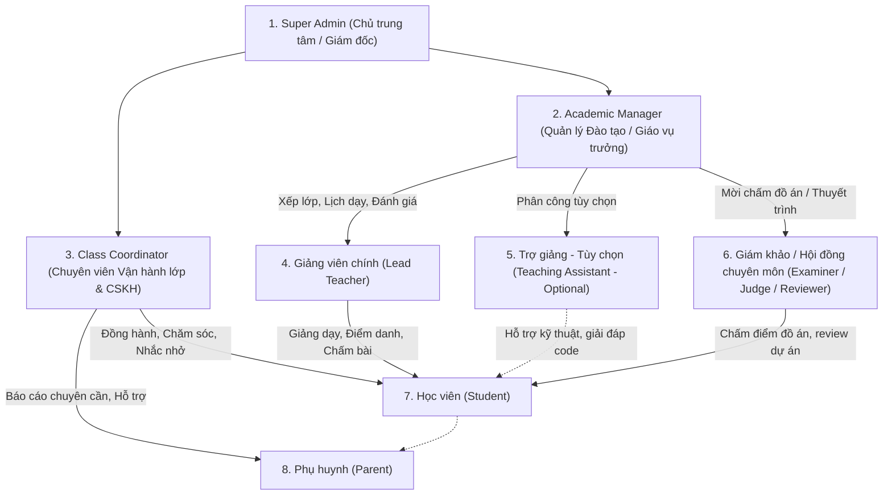

# Đặc Tả Yêu Cầu Phần Mềm (Software Requirements Specification - SRS)

> **Dự án:** LMS Center Platform (Hệ thống Quản lý Học tập, Giảng viên & Vận hành Đào tạo Đa hình thức)  
> **Tài liệu:** `docs/requirements.md`  
> **Phiên bản:** 1.2.0 (Cập nhật Phân cấp Quản lý, Vận Hành Lớp, Lịch Học Linh Hoạt & Đánh Giá Moodle)  
> **Ngày cập nhật:** 23/09/2026  

---

## 1. Mục Đích & Phạm Vi Dự Án (Scope & Objectives)

Hệ thống **LMS Center Platform** là giải pháp phần mềm quản lý toàn diện dành cho các trung tâm đào tạo hiện đại với trọng tâm chuyên sâu là **Công nghệ Thông tin (CNTT)**, kết hợp mở rộng linh hoạt cho **Ngoại ngữ** và các bộ môn khác.

Hệ thống giải quyết triệt để các bài toán vận hành thực tế:
- **Chuẩn hóa quản trị RBAC phân cấp:** Phân định rõ quyền hạn giữa Super Admin, Quản lý đào tạo (xếp lớp, đánh giá giáo viên), Chuyên viên vận hành lớp (chăm sóc học viên, điều phối), Giảng viên, Học viên và Phụ huynh.
- **Xếp lịch học linh hoạt:** Hỗ trợ lịch 1 buổi/tuần, nhiều buổi/tuần, dời ngày, đổi phòng/meet link, bù buổi học dễ dàng.
- **Phân định rõ 2 mô hình Học Trực Tuyến (Online Learning Taxonomy):**
  1. *Khóa học Online Tự học / Video đóng gói (Self-Paced / Recorded Courses):* Học qua video quay sẵn nhúng YouTube, cấm tua video, làm quiz và code Monaco, hỏi đáp theo timestamp.
  2. *Lớp học Online Trực tiếp & Hybrid (Virtual Live & Hybrid Classes):* Học theo lịch cố định với Giảng viên qua link phòng học trực tuyến (Google Meet/Zoom), điểm danh, nhắc lịch và nhận xét sau buổi.
- **Hệ thống Tin nhắn & Thông báo Tự động (Automated Notification Engine):** Tự động bắn thông báo/Zalo/SMS về sĩ số điểm danh sau N phút, thông báo nhận xét của giáo viên sau buổi học, và nhắc nhở lịch học trước 24h/2h kèm link lớp và dặn dò.
- **Cơ chế Chống tua Video (Anti-Seeking Video Player):** Ngăn học viên tua nhanh video lý thuyết để chống học đối phó; chỉ cho phép tua lại hoặc tua trong phạm vi đã xem; mở khóa tua tự do sau khi hoàn thành 100%.
- **Tự động hóa điểm danh hai chiều:** Điểm danh học viên lớp Offline, Online, Hybrid và Chấm công giáo viên (Timesheet).
- **Môi trường thực hành lập trình trực tuyến:** Tích hợp Monaco Code Editor cho môn CNTT, nộp link GitHub/zip, hỗ trợ ghi âm bài nói cho ngoại ngữ.
- **Kế thừa & Nâng cấp các tính năng tinh hoa từ Moodle & Frappe LMS:** Sổ điểm đa trọng số, Drip Content tuần tự, Timestamped Q&A, Ghi chú cá nhân, Chứng chỉ số xác thực công khai.

---

## 2. Các Tác Nhân Hệ Thống & Ma Trận Phân Cấp (Actors & Roles)

### Chi tiết vai trò:
1. **Super Admin (Chủ trung tâm / Quản trị viên cấp cao):** Toàn quyền cấu hình hệ thống, quản lý tài chính, phân quyền các Role trong bảng `roles` và `permissions`.
2. **Academic Manager (Quản lý Đào tạo / Giáo vụ trưởng):**
   - Tạo khóa học, phân công giảng viên chính, chỉ định trợ giảng (nếu lớp yêu cầu) và mời hội đồng giám khảo.
   - Xếp lớp học, thiết lập thời khóa biểu định kỳ và xử lý dời lịch/bù buổi.
   - Đánh giá chất lượng giảng viên (Teacher Evaluation / Audit), duyệt giáo án và tài liệu khóa học.
3. **Class Coordinator / Operations & Care (Chuyên viên Vận hành lớp & Chăm sóc học viên):**
   - Mỗi lớp học có 1 Chuyên viên vận hành đồng hành cùng Giảng viên.
   - Nhận cảnh báo tức thời khi giáo viên đi trễ/chưa vào lớp để can thiệp kịp thời.
   - Theo dõi chuyên cần buổi học, trực tiếp liên hệ học sinh vắng hoặc đi trễ.
   - Ghi nhận `coordinatorNote` (lý do nghỉ ốm, hoàn cảnh học sinh) gửi cho Phụ huynh.
   - Đôn đốc học viên nộp BTVN trước deadline, tiếp nhận và giải quyết phản hồi về chất lượng buổi học.
4. **Giảng viên chính (Lead Teacher):**
   - Xem thời khóa biểu cá nhân, Check-in / Check-out ca dạy để chấm công.
   - Điểm danh học sinh lớp Hybrid (Offline/Online), upload tài liệu bài học, giao BTVN và chấm điểm theo rubric.
5. **Trợ giảng - Tùy chọn (Teaching Assistant - Optional):**
   - Là vai trò **tùy chọn (không bắt buộc)** trong cấu hình lớp học. Tùy quy mô lớp (lớp đông trên 15 học viên CNTT) hoặc cấp độ, lớp học có thể có hoặc không có Trợ giảng.
   - Hỗ trợ giải đáp thắc mắc bài tập code trên lớp, hỗ trợ điểm danh và theo dõi thực hành.
6. **Giám khảo / Hội đồng chuyên môn (Examiner / Judge / Reviewer):**
   - Chuyên gia, giảng viên cao cấp hoặc đối tác doanh nghiệp được mời tham gia vào các buổi bảo vệ đồ án tốt nghiệp (Capstone Project), thi thuyết trình hoặc thi vấn đáp cuối khóa.
   - Đăng nhập vào cổng chấm thi, xem sản phẩm/code của học sinh, chấm điểm theo Rubric tiêu chí và nhập nhận xét chuyên môn độc lập.
7. **Học viên (Student):**
   - Mua trực tiếp các khóa học trực tuyến (khóa học miễn phí hoặc trả phí qua VietQR/Thẻ).
   - Xem lịch học, học bài giảng YouTube chống tua, tải tài liệu bài học.
   - Làm BTVN CNTT trực tiếp trên Monaco Code Editor hoặc nộp link GitHub / file ghi âm.
   - Xem điểm số, nhận xét và thanh toán học phí qua mã VietQR.
8. **Phụ huynh (Parent):**
   - Theo dõi chuyên cần từng buổi, điểm số bài tập và nhận xét của thầy cô.
   - Nhận thông báo học phí và quét mã VietQR thanh toán.

---

## 3. Yêu Cầu Chức Năng Chi Tiết (Functional Requirements)

### Phân hệ 1: Quản Trị Hệ Thống, Người Dùng, Cấu Hình Website & Phân Quyền Hạt Nhân (SUPER_ADMIN Portal)

- **FR-USER-01 (Quản trị Người Dùng Toàn Diện - User Management):**
  - Quản trị viên cấp cao (SUPER_ADMIN) quản lý danh sách toàn bộ người dùng trong hệ thống (Học viên, Phụ huynh, Giảng viên, Trợ giảng, Giám khảo, Vận hành lớp, Quản lý đào tạo).
  - Tìm kiếm theo Họ tên, Email, Số điện thoại, Mã học sinh; Lọc theo Vai trò và Trạng thái hoạt động.
  - CRUD User: Tạo tài khoản nhân sự mới, chỉnh sửa thông tin, đặt lại mật khẩu, kích hoạt hoặc vô hiệu hóa (`isActive = false`).
  - Gán và thu hồi linh hoạt 1 hoặc nhiều vai trò cho từng người dùng (Multi-Role Support).
  - Áp dụng xóa mềm (Soft Delete) có lưu vết `deleted_at`, `deleted_by`; nghiêm cấm xóa vật lý (Hard Delete).
- **FR-RBAC-01 (Quản lý Roles & Permissions):**
  - CSDL sử dụng các bảng `roles`, `permissions`, `role_permissions`, `user_roles`.
  - Super Admin có thể tạo thêm role mới (ví dụ: "Nhân viên Tư vấn Tuyển sinh", "Kế toán Thu ngân") và tick chọn các permissions chi tiết theo từng phân hệ (`classes.create`, `payroll.approve`, `settings.edit`...).
- **FR-WEB-01 (Quản lý Thương hiệu & Giao diện Website - Whitelabel Branding Settings):**
  - Super Admin có thể tùy biến toàn bộ nhận diện thương hiệu của trung tâm mà không cần can thiệp mã nguồn:
    - **Logo & Biểu tượng:** Tải lên logo Header (hỗ trợ logo nền sáng và nền tối), thay đổi icon favicon trình duyệt (`faviconUrl`).
    - **Tùy biến Màu sắc Giao diện:** Thiết lập mã màu nền Header (`headerBgColor`), màu chữ Header (`headerTextColor`), màu nền Footer (`footerBgColor`), màu chữ Footer (`footerTextColor`), màu nhấn thương hiệu (`primaryColor` tuân thủ bảng màu chuẩn không dùng tím của `DESIGN.md`).
    - **Thông tin Website:** Tên hệ thống / Trung tâm (`siteTitle`), slogan (`siteTagline`), nội dung bản quyền Footer (`footerCopyright`).
    - **Thông tin Liên hệ:** Hotline, email hỗ trợ, địa chỉ trụ sở/cơ sở đào tạo, danh sách mạng xã hội (Facebook, YouTube, Zalo, TikTok).
    - **Tối ưu SEO:** Meta Title, Meta Description, ảnh chia sẻ mạng xã hội (OG Image).
- **FR-INT-01 (Cấu hình Tích hợp & Cổng Thanh toán):**
  - Cấu hình tài khoản ngân hàng thụ hưởng VietQR (Mã ngân hàng, Số tài khoản, Tên chủ tài khoản, Cú pháp chuyển khoản mặc định).
  - Cấu hình Webhook Secret tiếp nhận thông báo chuyển khoản tự động (SePay / Casso).
  - Cấu hình Zalo ZNS / SMS Gateway (App ID, Secret Key, Template IDs cho tin nhắn điểm danh, nhắc lịch, cảnh báo GV trễ).
  - Cấu hình máy chủ gửi Email SMTP (Host, Port, Username, Password, Sender Name).
- **FR-AUDIT-01 (Nhật ký Kiểm toán Hệ thống - System Audit Logs):**
  - Tự động ghi vết toàn bộ các hành động nhạy cảm trong hệ thống (ai sửa điểm số, ai duyệt bảng lương, ai dời lịch học, ai gán quyền).
  - Bảng log lưu thông tin: `actor_id`, `action`, `resource_type`, `resource_id`, `diff_json`, `ip_address`, `user_agent`, `created_at`.
  - Super Admin có giao diện tra cứu và xuất báo cáo kiểm toán.

---

### Phân hệ 2: Xếp Lớp & Lịch Học Linh Hoạt (Flexible Scheduling Engine)

- **FR-SCH-01 (Quy tắc lịch lặp lại - Recurrence Rule):**
  - Khi mở lớp, Quản lý Đào tạo cấu hình lịch học:
    - *1 buổi/tuần:* Ví dụ sáng Chủ Nhật (08:30 - 11:30).
    - *Nhiều buổi/tuần:* Ví dụ T2-T4-T6 (19:30 - 21:30) hoặc T3-T5 (18:00 - 20:00).
  - Hệ thống tự động sinh toàn bộ danh sách các buổi học (`class_sessions`) cho cả khóa học.
- **FR-SCH-02 (Tùy biến & Dời lịch từng buổi - Rescheduling):**
  - Quản lý Đào tạo hoặc Chuyên viên Vận hành lớp có thể:
    - **Dời ngày học:** Đổi ngày buổi học sang ngày khác, hệ thống lưu `originalDate` và `rescheduleReason`.
    - **Đổi giờ học / Đổi phòng:** Chuyển ca học sang phòng khác nếu phòng cũ bảo trì.
    - **Đổi link Meet:** Cập nhật link Google Meet riêng cho buổi đó nếu cần.
    - **Bù buổi học:** Thêm buổi học phát sinh vào khóa học.
  - Tự động gửi thông báo cập nhật lịch học tới Giảng viên, Học viên và Phụ huynh.
- **FR-SCH-03 (Phân công Giảng viên dạy thay):** Khi giảng viên chính có việc bận, Quản lý Đào tạo có thể gán `assignedTeacherId` là một giáo viên khác chỉ riêng cho buổi học đó, hệ thống tự động ghi nhận công dạy buổi đó cho giáo viên dạy thay.

---

### Phân hệ 3: Vận Hành Lớp Học & Chăm Sóc Học Viên (Class Operations & Student Care)

- **FR-OPS-01 (Mô hình Tam Giác Lớp Học):** Mỗi lớp học được quản lý bởi bộ 3:
  1. *Giảng viên chính:* Chịu trách nhiệm chuyên môn & bài giảng.
  2. *Trợ giảng (TA):* Hỗ trợ kỹ thuật, giải đáp bài tập code cho học viên.
  3. *Chuyên viên Vận hành (Class Coordinator):* Quản lý kỷ luật, sĩ số, chăm sóc học viên và phụ huynh.
- **FR-OPS-02 (Ghi chú Chăm sóc Học viên - Student Care Log):**
  - Khi học sinh vắng mặt hoặc đi trễ, Chuyên viên Vận hành vào danh sách lớp xem thông tin liên hệ và gọi điện thoại.
  - Nhập `coordinatorNote` (ví dụ: "Đã liên hệ mẹ, bạn bị sốt xin nghỉ buổi 3, đã gửi link video xem lại").
  - Phụ huynh và Giáo vụ xem được lịch sử chăm sóc này.
- **FR-OPS-03 (Đôn đốc nộp bài tập):** Chuyên viên Vận hành có màn hình theo dõi tiến độ nộp BTVN của cả lớp, tự động lọc danh sách các học viên chưa nộp bài khi còn 24h trước deadline để gửi tin nhắn nhắc nhở.

---

### Phân hệ 4: Đánh Giá Chất Lượng Giáo Viên (Teacher Quality Evaluation)

- **FR-EVAL-01 (Đánh giá từ Quản lý Đào tạo - Academic Audit):**
  - Quản lý Đào tạo dự giờ hoặc kiểm tra định kỳ chất lượng lớp học.
  - Đánh giá giảng viên theo các tiêu chí: Kiến thức chuyên môn, Kỹ năng sư phạm, Mức độ tương tác với học viên, Tác phong đúng giờ (dựa trên dữ liệu check-in/out).
  - Lưu trữ kết quả và tính điểm KPI của giảng viên.
- **FR-EVAL-02 (Khảo sát học viên cuối khóa - Student Feedback Survey):**
  - Cuối khóa học hoặc định kỳ giữa kỳ, học viên làm form khảo sát ẩn danh đánh giá giáo viên và trợ giảng (chấm điểm sao từ 1-5 và nhận xét góp ý).
  - Hệ thống tự động tổng hợp báo cáo điểm hài lòng của giảng viên để Ban Giám đốc trung tâm xem xét thù lao và khen thưởng.

---

### Phân hệ 5: Các Tính Năng Kế Thừa & Nâng Cấp Từ Moodle (Moodle-Inspired Features)

Dưới đây là các tính năng tinh hoa từ hệ thống Moodle được chọn lọc và tinh gọn cho trải nghiệm trung tâm đào tạo:

| Tính Năng Moodle | Cơ Chế Ứng Dụng Trong Hệ Thống LMS Của Chúng Ta | Giá Trị Mang Lại Cho Trung Tâm |
| :--- | :--- | :--- |
| **1. Activity Completion & Drip Content** | Cấu hình bài học tuần tự: Học viên phải xem video YouTube đạt $\ge 80\%$ thời lượng hoặc nộp xong BTVN bài trước thì bài học tiếp theo mới tự động mở khóa. | Tránh học viên học nhảy cóc, đảm bảo lộ trình tiếp thu kiến thức bài bản. |
| **2. Weighted Gradebook (Sổ điểm đa trọng số)** | Cho phép Quản lý Đào tạo cấu hình trọng số điểm cho từng khóa học (ví dụ: Chuyên cần 10%, BTVN 30%, Thi giữa kỳ 20%, Đồ án cuối kỳ 40%). Hệ thống tự động tính điểm tổng kết. | Đánh giá năng lực học viên toàn diện, chuẩn hóa xếp loại tốt nghiệp (Xuất sắc, Giỏi, Khá, Trung bình). |
| **3. Question Bank & Random Quiz** | Ngân hàng câu hỏi trắc nghiệm chia theo chuyên đề và mức độ khó (Dễ, Trung bình, Khó). Khi học viên làm bài kiểm tra, hệ thống tự động bốc ngẫu nhiên câu hỏi theo cấu trúc đề để chống nhìn bài nhau. | Hỗ trợ thi chứng chỉ đầu ra, kiểm tra định kỳ tự động chấm điểm ngay tức thì. |
| **4. Course Template Cloning (Nhân bản khóa học)** | Quản lý Đào tạo khi mở lớp mới chỉ cần nhấn nút "Nhân bản khóa học" (Clone Course): toàn bộ Module, Bài giảng YouTube, Tài liệu slide và BTVN mẫu được sao chép sang lớp mới chỉ trong 2 giây. | Tiết kiệm 95% thời gian giáo vụ nhập liệu khi mở khóa mới hàng tháng. |
- **FR-EVAL-03 (Đánh giá giáo viên theo từng buổi học từ học sinh - Per-Session Feedback):**
  - Sau khi buổi học kết thúc hoặc trong vòng 24h, khi học sinh truy cập hệ thống sẽ xuất hiện form đánh giá nhanh buổi học (thao tác dưới 15 giây):
    - Đánh giá sao Giảng viên (1 đến 5 sao).
    - Đánh giá sao Trợ giảng (1 đến 5 sao, nếu có).
    - Mức độ tiếp thu bài học (`POOR`, `AVERAGE`, `GOOD`, `EXCELLENT`).
    - Tốc độ giảng dạy (`TOO_SLOW`, `JUST_RIGHT`, `TOO_FAST`).
    - Nhận xét ẩn danh (tùy chọn).
  - Dữ liệu thống kê được cập nhật ngay lập tức cho Quản lý Đào tạo và Chuyên viên Vận hành lớp. Nếu một buổi học có điểm trung bình $< 3.5$ sao hoặc nhiều học sinh báo "Không hiểu bài / Dạy quá nhanh", hệ thống lập tức gắn cờ cảnh báo đỏ để trung tâm can thiệp và hỗ trợ học sinh ngay trong tuần.

---

### Phân hệ 6: Tính Năng Khóa Học Online Chuyên Sâu (Kế Thừa Từ Frappe LMS)

Tham khảo từ kiến trúc hiện đại của **Frappe LMS** (`https://github.com/frappe/lms`), hệ thống tích hợp các tính năng tối ưu trải nghiệm học online:

| Tính Năng Frappe LMS | Ứng Dụng Trong Hệ Thống LMS Của Chúng Ta | Lợi Ích Trực Tiếp |
| :--- | :--- | :--- |
| **1. In-Lesson Timestamped Q&A** | **Hỏi đáp gắn mốc thời gian video bài giảng:** Học viên có thể đặt câu hỏi ngay tại phút/giây thứ $T$ của video YouTube. Giảng viên hoặc trợ giảng bấm vào câu hỏi là video tự động tua tới đúng đoạn đó để xem ngữ cảnh và trả lời. Giảng viên có nút tích xanh xác nhận *"Câu trả lời chuẩn xác"*. | Loại bỏ việc học sinh hỏi chung chung "thầy ơi đoạn đó em không hiểu", tiết kiệm 80% thời gian trao đổi. |
| **2. Personal Course Notes** | **Ghi chú cá nhân trong khi học:** Học viên có khung ghi chú riêng tư ngay cạnh video bài giảng, lưu tự động kèm mốc thời gian video. Học viên có thể xem lại toàn bộ ghi chú của khóa học hoặc xuất ra file Markdown/PDF. | Tăng tính chủ động ghi chép và ghi nhớ kiến thức của học viên khi học online. |
| **3. Public Verifiable Certificate** | **Chứng chỉ số có URL xác thực công khai:** Khi học sinh hoàn thành khóa học và đạt chuẩn đầu ra, hệ thống tự động sinh chứng chỉ PDF kèm một mã định danh duy nhất và đường dẫn công khai `/verify/[certificateCode]` để nhà tuyển dụng xác minh trực tiếp. | Tăng uy tín thương hiệu của trung tâm, học viên dễ dàng đính kèm vào CV hoặc chia sẻ lên LinkedIn. |
| **4. Cohort Batches & Self-Paced Blending** | **Mô hình học kết hợp Đợt (Batch) và Tự học:** Khóa học online được tổ chức theo từng Batch (khóa khai giảng). Học viên có thể xem trước các video lý thuyết theo nhịp độ cá nhân (Self-paced), sau đó tham gia các buổi thực hành / giải đáp trực tiếp theo lịch cố định của Batch. | Tối ưu hóa thời lượng giảng dạy của giáo viên, học viên chủ động học trước lý thuyết để dành trọn vẹn giờ học trực tuyến cho thực hành. |

---

### Phân hệ 7: Hệ Thống Tin Nhắn & Thông Báo Tự Động (Automated Notification Engine)

Hệ thống cung cấp một engine gửi tin nhắn đa kênh (Zalo ZNS, SMS, Web Push, Email và In-App Notification) hoạt động theo các trigger nghiệp vụ tự động:

- **FR-NOTIF-01 (Cảnh báo điểm danh sau N phút - Attendance Broadcast):**
  - Cấu hình linh hoạt theo lớp học: `attendanceAlertMinutes` (mặc định $N = 15$ phút sau giờ vào lớp).
  - Khi hết $N$ phút, hệ thống tự động kiểm tra bảng `session_attendances`:
    - **Trường hợp lớp còn vắng học viên:** Tự động gửi thông báo tổng hợp tới Giảng viên và Chuyên viên Vận hành lớp: *"Lớp [Mã lớp] hiện có mặt X/Y bạn, vắng Z bạn: [Danh sách tên học sinh vắng]"*. Đồng thời tự động gửi tin nhắn đến từng Phụ huynh của học sinh vắng: *"Kính gửi phụ huynh, buổi học [Mã lớp] đã bắt đầu lúc [Giờ], hiện hệ thống chưa ghi nhận bé [Tên] có mặt tại lớp. Vui lòng kiểm tra hoặc liên hệ Chuyên viên Vận hành [SĐT]"*.
    - **Trường hợp lớp đi đủ:** Tự động gửi thông báo xác nhận: *"Lớp [Mã lớp] đã đủ quân số 100% (X/X học viên). Chúc thầy cô và các bạn có buổi học hiệu quả!"*.
- **FR-NOTIF-02 (Tự động gửi nhận xét buổi học tới Phụ huynh & Học sinh - Teacher Feedback Dispatch):**
  - Ngay sau khi Giảng viên hoàn tất nhập nhận xét và lưu sổ buổi học (`session_attendances.teacherNotes`, `attitudeRating`), hệ thống kích hoạt trigger tự động định dạng và gửi tin nhắn/Zalo ZNS tới Phụ huynh & Học sinh:
    - *Nội dung:* *"Trung tâm xin gửi nhận xét buổi học ngày [Ngày] môn [Tên môn] của bé [Tên]: Thái độ: [Chăm chú/Tích cực], Thực hành trên lớp: [Đạt/Cần cố gắng thêm], Dặn dò từ Thầy/Cô: [Lời dặn] - Xem chi tiết tại [Link]"*.
- **FR-NOTIF-03 (Nhắc nhở buổi học sắp diễn ra - Upcoming Class Reminder):**
  - Hệ thống chạy tiến trình định kỳ (Cron / Scheduled Job) quét các buổi học sắp tới:
    - **Nhắc trước 24 giờ (1 ngày):** Gửi thông báo nhắc lịch học, thời gian, phòng học và danh mục dặn dò (`preparationNotes`: ví dụ mang laptop sạc đầy, cài đặt môi trường NodeJS/Python, hoặc nộp bài tập còn nợ).
    - **Nhắc trước 2 giờ (hoặc tùy biến theo setting):** Gửi nhắc nhở khẩn, đính kèm link phòng học ảo (Google Meet / Zoom URL) nếu là lớp Online hoặc Hybrid.
- **FR-NOTIF-04 (Cảnh báo Giảng viên đi muộn / chưa vào lớp sau M phút - Teacher Late Alert):**
  - Cấu hình ngưỡng thời gian: `teacherLateAlertMinutes` (mặc định $M = 10$ phút sau giờ bắt đầu ca học).
  - Định kỳ mỗi phút, Worker kiểm tra các ca học đang diễn ra (`IN_PROGRESS` hoặc vừa qua giờ `startTime` $M$ phút):
    - Nếu Giảng viên chính chưa Check-in hoặc chưa bấm "Vào lớp" (`teacher_attendance.checkInTime` IS NULL):
    - **Hành động 1 (Tức thì với Giảng viên):** Gửi tin nhắn SMS / Zalo ZNS / High-priority App Push: *"Thầy/Cô có ca dạy lớp [Mã lớp] bắt đầu lúc [Giờ], hiện đã quá 10 phút, vui lòng check-in hoặc liên hệ Hotline Giáo vụ"*.
    - **Hành động 2 (Cảnh báo Quản lý):** Bắn cờ đỏ và tin nhắn khẩn cấp tới Quản lý Đào tạo (Academic Manager) và Chuyên viên Vận hành lớp (Class Coordinator): *"CẢNH BÁO: Giảng viên [Tên GV] chưa vào lớp [Mã lớp] (Phòng [Phòng] / Link [MeetUrl]) sau 10 phút. Đề nghị Vận hành liên hệ kiểm tra ngay!"*.

---

### Phân hệ 8: Trình Phát Video Chống Tua Cho Khóa Học Tự Học (Anti-Seeking Video Player)

Nhằm đảm bảo học viên thực sự tiếp thu kiến thức và không "học đối phó", trình phát video nhúng YouTube trong các khóa học online đóng gói (Self-Paced) được trang bị cơ chế kiểm soát tiến độ nghiêm ngặt:

- **FR-VID-01 (Cấm tua nhanh - Block Forward Seeking):**
  - Hệ thống lưu trữ biến trạng thái `maxWatchedSeconds` (thời điểm xem xa nhất mà học viên đã thực sự theo dõi).
  - Học viên **không được phép tua nhanh vượt quá `maxWatchedSeconds`**. Mọi thao tác click chuột trên thanh tiến trình (progress bar) tới vị trí tương lai đều bị chặn và trình phát tự động đưa về mốc thời gian xem hợp lệ gần nhất.
  - Học viên **được phép tua lùi (Seek Backward)** tự do để xem lại kiến thức cũ bất cứ lúc nào.
- **FR-VID-02 (Heartbeat & Chống gian lận Client-Side - Anti-Cheat Heartbeat):**
  - Trong quá trình phát video, client gửi heartbeat mỗi $5$ giây về API `POST /api/courses/[id]/lessons/[lessonId]/heartbeat` kèm thời lượng thực tế đã xem.
  - Backend kiểm tra tính hợp lệ: Nếu mốc thời gian xem giữa 2 lần heartbeat tăng đột biến bất thường (ví dụ học viên can thiệp DevTools chỉnh `currentTime` nhảy cóc $5$ phút chỉ trong $2$ giây), hệ thống từ chối cập nhật và ghi nhận cờ gian lận.
- **FR-VID-03 (Mở khóa tua tự do sau khi hoàn thành 100% - Unlock Seeking Upon Completion):**
  - Khi học viên đã xem video đạt $\ge 95\%$ thời lượng bài giảng (hoặc 100% tùy cấu hình), bài học được ghi nhận trạng thái `isCompleted = true`.
  - Từ thời điểm này trở đi, học viên được cấp quyền `allowFreeSeeking = true` để tự do tua nhanh/chậm mọi đoạn video phục vụ ôn tập và tra cứu.

---

### Phân hệ 9: Phân Định Rõ Ràng 2 Mô Hình Khóa Học Trực Tuyến (Dual Online Learning Paradigms)

Hệ thống hỗ trợ song song và phân tách mạch lạc hai hình thức học tập trực tuyến đáp ứng trọn vẹn nhu cầu của trung tâm:

| Tiêu Chí So Sánh | 1. Khóa Học Online Đóng Gói (Self-Paced Online Course) | 2. Lớp Học Online Trực Tiếp & Hybrid (Virtual Live & Hybrid Classes) |
| :--- | :--- | :--- |
| **Bản chất đào tạo** | Học viên tự học theo nhịp độ cá nhân qua video bài giảng thu sẵn (Video On-Demand). | Lớp học tương tác thời gian thực với Giảng viên & Trợ giảng qua phòng học trực tuyến. |
| **Thời khóa biểu** | Không có lịch cố định. Học viên chủ động học bất kỳ lúc nào 24/7. | Có lịch học định kỳ cố định (ví dụ: T3-T5 lúc 19:30 - 21:30). |
| **Trải nghiệm Video** | Nhúng YouTube Player có **cơ chế cấm tua video**; tích hợp hỏi đáp Timestamped Q&A và Ghi chú cá nhân. | Giảng dạy trực tiếp qua link phòng học ảo (`meetingUrl`: Google Meet / Zoom / MS Teams); buổi học có thể ghi hình lại để học sinh xem lại sau. |
| **Quy trình Điểm danh** | Không áp dụng điểm danh theo ca; tiến độ được đo bằng % video đã xem và số bài tập/quiz đã nộp. | **Bắt buộc điểm danh từng buổi:** Check-in qua web / OTP phòng học ảo / Giáo viên điểm danh tay; kích hoạt cảnh báo vắng sau 15 phút. |
| **Chăm sóc & Nhắc nhở** | Hệ thống tự động gửi email/thông báo khi học viên không đăng nhập quá 7 ngày. | **Tự động nhắc lịch học trước 24h/2h** kèm link Meet; gửi nhận xét của giáo viên sau mỗi buổi học về cho phụ huynh. |
| **Chứng nhận hoàn thành** | Hoàn thành tất cả bài học tuần tự (Drip content) + đạt điểm Quiz $\ge 80\%$. | Dựa trên sổ điểm tổng kết đa trọng số (Chuyên cần $\ge 80\%$, BTVN, Thi giữa kỳ, Đồ án cuối khóa). |

---

### Phân hệ 10: Mua Trực Tiếp Khóa Học Trực Tuyến (Course Store & Direct Enrollment)

Cổng hiển thị và phân phối trực tiếp khóa học trực tuyến (Self-Paced) cho học viên và khách vãng lai:

- **FR-CRS-01 (Duyệt danh mục & Thông tin khóa học):**
  - Trang Store hiển thị danh sách khóa học với bộ lọc theo chủ đề (CNTT, Ngoại ngữ, Kỹ năng mềm).
  - Phân loại rõ ràng 2 trạng thái tài chính: **Miễn Phí (`isFree = true`, Giá = 0đ)** và **Có Phí (`isFree = false`, Giá > 0đ)**.
- **FR-CRS-02 (Đăng ký học ngay với Khóa Miễn Phí - 1-Click Free Enrollment):**
  - Học viên đã đăng nhập chỉ cần click nút **"Đăng ký học ngay (Free)"**.
  - Backend tự động khởi tạo bản ghi `enrollments` với trạng thái `ACTIVE` trong vòng 1 giây, mở khóa toàn bộ bài học nhập môn mà không cần qua giỏ hàng hay cổng thanh toán.
- **FR-CRS-03 (Mua khóa học trả phí & Thanh toán VietQR Động - Instant Direct Checkout):**
  - Học viên nhấn **"Mua khóa học"** -> Hệ thống tạo đơn hàng và sinh mã VietQR Napas247 động với số tiền chính xác và cú pháp chuyển khoản định danh duy nhất (ví dụ: `LMS CRS [EnrollmentCode]`).
  - Hỗ trợ thanh toán nhanh bằng ứng dụng ngân hàng di động hoặc thẻ Visa/Mastercard.
- **FR-CRS-04 (Tự động kích hoạt khóa học qua Webhook Ngân Hàng - Auto-Fulfillment):**
  - Khi người dùng quét mã VietQR và hoàn tất chuyển khoản, cổng thanh toán/ngân hàng gửi Webhook về Backend `POST /api/v1/webhooks/payment`.
  - Hệ thống kiểm tra số tiền và nội dung chuyển khoản trong vòng dưới 3 giây, tự động kích hoạt `enrollment.status = ACTIVE`, gửi email biên lai thanh toán và thông báo In-app chào mừng học viên vào học.

---

### Phân hệ 11: Hội Đồng Giám Khảo & Chấm Đồ Án Tốt Nghiệp (Examiner & Capstone Defense)

Phục vụ các khóa học chuyên sâu (nhất là CNTT và Ngoại ngữ nâng cao) có phần bảo vệ đồ án tốt nghiệp hoặc thi thuyết trình cuối khóa:

- **FR-EXAM-01 (Vai trò Hội đồng Giám khảo & Trợ giảng tùy chọn):**
  - Trợ giảng (TA) là vai trò **tùy chọn (Optional)** trong cấu hình lớp học. Một lớp có thể có hoặc không có Trợ giảng tùy theo số lượng học sinh.
  - Quản lý Đào tạo có quyền phân công một hoặc nhiều **Giám khảo / Reviewer (`EXAMINER`)** tham gia Hội đồng chấm thi đồ án (Capstone Jury Board). Giám khảo có thể là giảng viên cao cấp, chuyên gia ngoài ngành hoặc đối tác doanh nghiệp.
- **FR-EXAM-02 (Cổng chấm thi dành riêng cho Giám khảo - Defense Portal):**
  - Giám khảo có giao diện riêng hiển thị danh sách nhóm / học viên bảo vệ đồ án.
  - Xem trực tiếp thông tin sản phẩm: Link GitHub Repository, Live Demo URL, Slide thuyết trình PDF, Video demo sản phẩm.
- **FR-EXAM-03 (Chấm điểm Rubric & Phản biện chuyên sâu):**
  - Giám khảo chấm điểm theo Rubric đa tiêu chí được cấu hình sẵn:
    - *Tính hoàn thiện sản phẩm & Chức năng (30%).*
    - *Kiến trúc kỹ thuật, Code Quality & Clean Code (25%).*
    - *Kỹ năng thuyết trình & Trả lời phản biện Q&A (25%).*
    - *Tính sáng tạo & Khả năng ứng dụng thực tế (20%).*
  - Nhập nhận xét độc lập (Điểm mạnh, Điểm yếu cần cải thiện, Định hướng nghề nghiệp).
  - Điểm tổng hợp của Hội đồng được tính trung bình tự động và đồng bộ vào Sổ điểm tổng kết của lớp học.

---

### Phân hệ 12: Quản Lý Bậc Lương & Bảng Lương Giáo Viên (Teacher Salary Grades & Monthly Payroll)

Đáp ứng yêu cầu quản lý nhân sự và chi trả thù lao minh bạch, tự động hóa tại trung tâm đào tạo:

- **FR-PAYROLL-01 (Quản lý Bậc Lương - Salary Grades / Levels):**
  - Super Admin và Quản lý Đào tạo cấu hình các bậc lương giảng viên:
    - *Bậc 1 - Trợ giảng / Tập sự (`GRADE_INTERN_TA`):* Đơn giá giờ dạy cơ bản (ví dụ: 100.000 - 150.000 VNĐ/giờ).
    - *Bậc 2 - Giảng viên chuẩn (`GRADE_STANDARD`):* Đơn giá giờ dạy (ví dụ: 250.000 - 350.000 VNĐ/giờ).
    - *Bậc 3 - Giảng viên cao cấp (`GRADE_SENIOR`):* Đơn giá giờ dạy (ví dụ: 400.000 - 600.000 VNĐ/giờ).
    - *Bậc 4 - Chuyên gia / Master (`GRADE_MASTER`):* Đơn giá đặc biệt cho đồ án hoặc chuyên đề nâng cao.
  - Mỗi bậc lương định nghĩa: Đơn giá giờ dạy cơ bản (`baseHourlyRate`), Hệ số ca tối/cuối tuần (`overtimeMultiplier`), Tỷ lệ thưởng KPI buổi học (`kpiBonusRate`).
  - Hồ sơ giáo viên (`teacher_profiles`) liên kết với một bậc lương cụ thể (`salaryGradeId`).
- **FR-PAYROLL-02 (Bảng Lương Tháng Tự Động - Automated Monthly Payroll Slip):**
  - Định kỳ cuối tháng (hoặc ngày chốt lương), Admin bấm **"Tổng hợp bảng lương"**:
    - *Tổng giờ dạy:* Hệ thống tự động tính tổng số phút dạy thực tế từ các bản ghi `teacher_attendance` có trạng thái `ON_TIME` hoặc hoàn thành ca dạy.
    - *Thưởng KPI chất lượng:* Nếu điểm sao trung bình học sinh đánh giá sau buổi học (`session_feedbacks`) trong tháng $\ge 4.5$ sao, cộng thêm thưởng theo tỷ lệ `kpiBonusRate`.
    - *Phạt đi muộn:* Trừ tiền phạt tự động nếu giáo viên bị ghi nhận cảnh báo đi muộn (`lateMinutes > 0`).
    - *Lương thực lĩnh:* $\text{NetSalary} = (\text{Số giờ} \times \text{Đơn giá bậc}) + \text{Thưởng KPI} - \text{Phạt đi muộn} + \text{Phụ cấp}$.
  - Quy trình phê duyệt bảng lương: `DRAFT` (Dự thảo) $\to$ `APPROVED` (Giám đốc duyệt) $\to$ `PAID` (Đã thanh toán).
  - Tự động xuất phiếu lương điện tử (PDF Payroll Slip) gửi về email và Dashboard cá nhân của Giảng viên.

---

### Phân hệ 13: Hệ Thống Giảm Giá & Áp Mã Khuyến Mãi (Course Discounts & Coupons)

Hỗ trợ các chiến dịch marketing, ưu đãi tuyển sinh và bán khóa học:

- **FR-DISC-01 (Quản lý Mã Khuyến Mãi - Coupon Management):**
  - Quản trị viên tạo và cấu hình mã giảm giá:
    - *Mã định danh (`code`):* Ví dụ `CHAOBANMOI`, `LMS2026`, `BLACKFRIDAY`.
    - *Loại giảm giá (`discountType`):* Theo phần trăm (`PERCENT` - ví dụ giảm 20%) hoặc Số tiền cố định (`FIXED` - ví dụ giảm 300.000 VNĐ).
    - *Giới hạn giảm tối đa (`maxDiscountAmount`):* Áp dụng khi giảm theo %, tránh giảm vượt ngân sách.
    - *Giá trị đơn hàng tối thiểu (`minOrderAmount`):* Ví dụ chỉ áp dụng cho đơn từ 1.000.000 VNĐ.
    - *Thời hạn hiệu lực:* `startDate` đến `endDate`.
    - *Số lượt dùng tối đa (`usageLimit`):* Ví dụ 100 lượt; thống kê số lượt đã dùng (`usedCount`).
    - *Phạm vi áp dụng:* Áp dụng toàn bộ khóa học hoặc theo từng danh mục môn học (`subjects`) hoặc khóa học chỉ định.
- **FR-DISC-02 (Áp mã khi Mua Khóa Học - Coupon Application at Checkout):**
  - Tại màn hình thanh toán khóa học trực tuyến hoặc đóng học phí lớp học, người dùng nhập mã giảm giá.
  - Hệ thống kiểm tra hợp lệ tức thì: Còn hạn sử dụng, chưa vượt số lượt tối đa, đạt giá trị đơn tối thiểu.
  - Tự động tính toán số tiền giảm (`discountAmount`) và số tiền thực trả (`finalAmount`).
  - Sinh mã VietQR Napas247 động với đúng số tiền đã giảm để học viên thanh toán ngay.

---

### Phân hệ 14: Danh Mục Môn Học & Lĩnh Vực Đào Tạo Động (Dynamic Subject Management - CRUD)

Loại bỏ hoàn toàn cơ chế hardcode enum tĩnh, chuyển sang quản lý danh mục môn học động linh hoạt cho trung tâm:

- **FR-SUBJ-01 (CRUD Danh mục Môn học):**
  - Super Admin và Quản lý Đào tạo có toàn quyền:
    - **Xem danh sách (Read):** Lọc theo trạng thái hoạt động, tìm kiếm theo tên hoặc mã môn.
    - **Thêm mới (Create):** Tạo môn học mới (Mã môn `code`: ví dụ `IT`, `ENGLISH`, `JAPANESE`, `DESIGN`, `MARKETING`; Tên môn `name`; Mô tả; Icon URL).
    - **Cập nhật (Update):** Đổi tên, sửa mô tả, cập nhật icon môn học.
    - **Xóa mềm (Soft Delete):** Ẩn môn học không còn đào tạo mà không làm mất tính toàn vẹn của các khóa học và lớp học lịch sử.
  - Mọi khóa học (`courses`) liên kết khóa ngoại trực tiếp tới `subjects.id`.

---

### Phân hệ 15: Quản Lý & Chấm Bài Tập Trực Tiếp Trong Lớp Học (Class Assignment & Grading Portal)

Đặc tả chi tiết quy trình Giảng viên quản lý và chấm bài tập của học sinh trong ngữ cảnh lớp học cụ thể:

- **FR-CLASS-GRD-01 (Quản lý Bài tập theo Lớp học - Class Assignment Dashboard):**
  - Giảng viên truy cập vào lớp học phụ trách (`/teacher/classes/{classId}`) $\to$ Tab **"Bài tập về nhà (Assignments)"**.
  - Hiển thị danh sách các bài tập đã giao cho lớp kèm các chỉ số thống kê trực quan:
    - Tiêu đề bài tập, Hạn nộp (Deadline), Định dạng yêu cầu (Monaco Code / GitHub / File).
    - Tỷ lệ nộp bài: Số học sinh đã nộp ($X/Y$ học viên).
    - Tiến độ chấm bài: Số bài đã chấm ($Z/X$ bài nộp), Số bài còn chờ chấm.
- **FR-CLASS-GRD-02 (Màn hình Chấm bài tập lớp học - Class Submission Grading Workspace):**
  - Giáo viên bấm nút **[Chấm bài lớp]** tại bài tập cần chấm:
    - Hiển thị danh sách toàn bộ học viên trong lớp kèm trạng thái nộp bài (`Đã nộp đúng giờ`, `Nộp muộn`, `Chưa nộp`).
    - Khung xem bài làm trực tiếp:
      - Nếu là bài lập trình: Trình xem Monaco Editor hiển thị mã nguồn học viên viết (syntax highlighting, định dạng thụt dòng).
      - Nếu là GitHub: Nút mở nhanh kho mã nguồn hoặc pull request.
      - Nếu là file/audio: Trình nghe audio hoặc xem PDF trực tiếp trên web.
    - Form chấm điểm theo Rubric tiêu chí và nhập lời nhận xét chi tiết cho học sinh.
    - Nút **[Lưu điểm & Gửi nhận xét]**: Cập nhật trạng thái bài nộp sang `GRADED`.
- **FR-CLASS-GRD-03 (Đồng bộ Sổ Điểm Lớp & Thông Báo Tức Thời):**
  - Điểm số sau khi chấm lập tức được tính toán và đồng bộ vào Sổ điểm tổng kết của lớp học (`gradebook_configs`).
  - Tự động phát thông báo In-app và Zalo/SMS thông báo điểm số và nhận xét của thầy cô tới Học viên và Phụ huynh.

---

### Phân hệ 16: Quy Chuẩn Toàn Bộ Bảng CSDL: 6 Audit Fields & Chính Sách Soft Delete

Đảm bảo an toàn dữ liệu, phục vụ kiểm toán tài chính và khả năng phục hồi dữ liệu:

- **FR-AUDIT-01 (Chuẩn 6 Trường Audit Trên 100% Bảng CSDL):**
  - Mọi bảng trong hệ thống CSDL bắt buộc phải có đầy đủ 6 trường:
    - `createdAt` (Timestamp with time zone, Default `now()`).
    - `createdBy` (UUID, Nullable, FK -> `users.id`): Người tạo bản ghi.
    - `updatedAt` (Timestamp with time zone, Default `now()`).
    - `updatedBy` (UUID, Nullable, FK -> `users.id`): Người cập nhật gần nhất.
    - `deletedAt` (Timestamp with time zone, Nullable): Mốc thời gian xóa mềm.
    - `deletedBy` (UUID, Nullable, FK -> `users.id`): Người thực hiện xóa mềm.
- **FR-AUDIT-02 (Chính Sách Bắt Buộc Soft Delete):**
  - **Nghiêm cấm Hard Delete (DELETE SQL vật lý)** trên các bảng thực thể cốt lõi: `users`, `classes`, `class_sessions`, `courses`, `subjects`, `enrollments`, `tuition_invoices`, `assignments`, `submissions`, `teacher_profiles`, `salary_grades`, `teacher_payrolls`, `discounts`.
  - Mọi thao tác xóa dữ liệu từ người dùng sẽ chuyển thành cập nhật cờ `deletedAt = now()` và `deletedBy = currentUserId`.
  - Toàn bộ các truy vấn nghiệp vụ (SELECT/JOIN) mặc định tự động áp dụng điều kiện `WHERE deleted_at IS NULL`.
  - Chỉ Super Admin trong màn hình Thùng rác (Recycle Bin) mới có quyền Khôi phục (Restore: gán `deletedAt = NULL`) hoặc Xóa vĩnh viễn (Hard Delete) sau khi có xác nhận 2 lớp.

---

### Phân hệ 17: Quản Lý Cơ Sở, Phòng Học & Chống Trùng Lịch (Multi-Campus & Room Conflict Guard)

Hỗ trợ trung tâm đào tạo mở rộng quy mô đa chi nhánh và kiểm soát tài nguyên phòng học:

- **FR-CAMPUS-01 (Quản lý Chuỗi Cơ sở / Chi nhánh - Multi-Campus Support):**
  - Quản lý danh sách các chi nhánh trung tâm: Mã cơ sở, Tên cơ sở, Địa chỉ chi tiết, Hotline, Email liên hệ, Bản đồ định vị GPS.
  - Phân quyền nhân sự quản lý theo cơ sở (Campus Admin/Staff) hoặc quản trị toàn chuỗi (Super Admin).
- **FR-CAMPUS-02 (Quản lý Danh mục Phòng học & Cơ sở vật chất):**
  - Phân loại phòng học: Phòng thực hành máy tính (Lab PC), Phòng lý thuyết tiêu chuẩn, Hội trường lớn, Phòng Studio quay bài giảng.
  - Định mức sức chứa tối đa (Capacity: 15-100 học viên) và tiện ích đi kèm (Máy chiếu, Điều hòa, Bảng tương tác, Mạng LAN gigabit).
- **FR-CAMPUS-03 (Bộ Kiểm Soát Chống Trùng Phòng Học Tự Động - Room Conflict Guard):**
  - Khi tạo lớp học hoặc dời ngày/đổi giờ buổi học (`class_sessions`), hệ thống tự động kiểm tra xung đột thời gian với phòng học đã chọn:
    - Logic kiểm tra SQL: Không cho phép tồn tại ca học khác cùng phòng trong khoảng thời gian giao thoa `(start_time, end_time) OVERLAPS (:new_start, :new_end)` tại cùng ngày học.
    - Cảnh báo trực quan trên giao diện lưới thời khóa biểu (Timetable Grid): Phòng học bận sẽ hiển thị màu đỏ kèm thông tin lớp đang chiếm dụng.

---

### Phân hệ 18: Lên Lịch Dạy Bù & Học Bù Cho Học Sinh Vắng (Make-up Class Scheduling Engine)

Đặc tả chuyên sâu quy trình hỗ trợ học viên vắng buổi học trước được học bù đầy đủ kiến thức, không bị gián đoạn lộ trình:

- **FR-MAKEUP-01 (Tự Động Phát Hiện & Đề Xuất Học Bù Sau Điểm Danh):**
  - Khi giáo viên hoặc vận hành điểm danh học sinh trạng thái `ABSENT` (Vắng có phép hoặc không phép), hệ thống tự động sinh cờ **"Cần Xếp Học Bù"** trên Dashboard của Chuyên viên Vận hành lớp (Class Coordinator).
  - Hệ thống gợi ý 2 phương án học bù linh hoạt:
    1. **Ghép Lớp Song Song (Parallel Class Make-up):** Tìm các lớp học khác đang học cùng chương trình, cùng môn học và có buổi học dạy đúng chủ đề (`topic` / `lesson_id`) diễn ra trong vòng 7 ngày tới còn chỗ trống.
    2. **Kèm Dạy Bù 1-1 (Tutor 1-on-1 Make-up):** Phân công một Trợ giảng (TA) hoặc Giảng viên phụ trách buổi bù 1-1 qua Google Meet/Zoom hoặc trực tiếp tại phòng học cơ sở.
- **FR-MAKEUP-02 (Giao Diện Xếp Lịch Bù & Xác Nhận Thời Gian):**
  - Điều phối viên chọn hình thức, chọn buổi học ghép hoặc chọn giáo viên kèm 1-1, ấn định thời gian (`scheduledDate`, `startTime`, `endTime`, `roomId` hoặc `meetUrl`).
  - Hệ thống gửi tin nhắn xác nhận lịch học bù tự động qua Zalo ZNS / Push Notification kèm link xác nhận tới Học viên và Phụ huynh.
- **FR-MAKEUP-03 (Điểm Danh Buổi Bù & Đồng Bộ Tiến Độ Học Tập):**
  - Khi buổi học bù diễn ra, Giáo viên/Trợ giảng phụ trách xác nhận tham gia (`ATTENDED`).
  - Hệ thống tự động ghi nhận hoàn thành buổi bù và cập nhật tiến độ học tập của học viên, bảo lưu điều kiện chuyên cần để được thi tốt nghiệp và cấp chứng chỉ.

---

### Phân hệ 19: Khảo Thí, Ngân Hàng Câu Hỏi & Thi Trắc Nghiệm Tự Động (Question Bank & Auto-Quiz)

- **FR-QUIZ-01 (Quản trị Ngân hàng Câu hỏi Đa dạng):**
  - Quản lý câu hỏi phân theo Môn học (`subjects`) và Cấp độ khó (`EASY`, `MEDIUM`, `HARD`).
  - Hỗ trợ 4 định dạng câu hỏi: Trắc nghiệm 1 đáp án (Single Choice), Trắc nghiệm nhiều đáp án (Multiple Choice), Đúng/Sai (True/False), và Điền từ ngắn (Short Answer).
  - Cho phép chèn hình ảnh, công thức toán LaTeX, đoạn mã code lập trình vào nội dung câu hỏi và từng đáp án.
- **FR-QUIZ-02 (Tạo Đề Thi & Sinh Đề Tự Động Ngẫu Nhiên):**
  - Cho phép tạo bài kiểm tra nhanh 15 phút, bài thi giữa kỳ, bài kiểm tra cuối module.
  - Cơ chế sinh đề ngẫu nhiên (Randomization): Tự động rút ngẫu nhiên $X$ câu Dễ, $Y$ câu Trung bình, $Z$ câu Khó từ ngân hàng câu hỏi; Xáo trộn thứ tự câu hỏi và thứ tự đáp án đối với từng học viên nhằm chống gian lận.
- **FR-QUIZ-03 (Chấm Điểm Tự Động & Đồng Bộ Sổ Điểm):**
  - Học viên nộp bài thi, hệ thống tính điểm tự động trong 0.5 giây.
  - Hiển thị bảng đáp án đúng/sai kèm lời giải chi tiết (nếu cấu hình cho phép xem sau khi thi).
  - Tự động đồng bộ điểm bài thi vào Sổ điểm tổng kết khóa học (`gradebook_configs`).

---

### Phân hệ 20: Trung Tâm Điều Hành & Radar Cảnh Báo Nguy Cơ Bỏ Học (Executive Analytics & Student Churn Risk Radar)

Cung cấp cho Ban Giám đốc và Quản lý Đào tạo cái nhìn toàn cảnh về hiệu quả vận hành và chất lượng đào tạo:

- **FR-ANALYTICS-01 (Executive Analytics & Real-time KPIs Dashboard):**
  - Tổng doanh thu đào tạo theo tháng/quý/năm, so sánh cùng kỳ.
  - Số lượng học viên đang học (`ACTIVE`), số lớp đang mở, tỷ lệ lấp đầy phòng học.
  - Tỷ lệ chuyên cần trung bình toàn trung tâm, tỷ lệ hoàn thành khóa học và tỷ lệ tốt nghiệp.
- **FR-ANALYTICS-02 (Radar Cảnh Báo Học Sinh Có Nguy Cơ Bỏ Học - Churn Risk Radar):**
  - Thuật toán tự động gắn cờ đỏ cảnh báo học sinh có nguy cơ thôi học/bỏ dở theo 3 tiêu chí:
    1. Nghỉ học 2 buổi liên tiếp gần nhất mà chưa học bù.
    2. Tỷ lệ chuyên cần lũy kế dưới 70%.
    3. Thiếu từ 3 bài tập về nhà liên tiếp hoặc điểm số trung bình dưới 50/100.
  - Danh sách cảnh báo hiển thị trên giao diện của Chuyên viên Vận hành và Giám đốc Đào tạo để can thiệp kịp thời (gọi điện chăm sóc, hỗ trợ xếp học bù, gia hạn thời gian làm bài).
- **FR-ANALYTICS-03 (Ma Trận Đánh Giá Giảng Viên Toàn Diện - Teacher Performance Matrix):**
  - Bảng xếp hạng giảng viên dựa trên:
    - Điểm hài lòng từ học sinh qua feedback từng buổi (`session_feedbacks`).
    - Tỷ lệ đúng giờ (dựa trên check-in thực tế).
    - Tốc độ chấm bài tập (thời gian từ lúc học sinh nộp đến khi trả bài có điểm & nhận xét).
    - Tỷ lệ học viên vượt qua kỳ thi tốt nghiệp / bảo vệ đồ án của lớp phụ trách.

---

### Phân hệ 21: Quản Trị Hợp Đồng Đào Tạo Điện Tử & Công Cụ Xuất Báo Cáo/Chứng Nhận PDF (Contracts & Go PDF Engine)

- **FR-CONTRACT-01 (Quản lý Hợp Đồng Đào Tạo Điện Tử):**
  - Quản lý hợp đồng cam kết đào tạo việc làm, thỏa thuận bảo mật và cam kết học tập đối với các khóa học dài hạn.
  - Cho phép học viên và phụ huynh ký hợp đồng điện tử bằng chữ ký số / ký tay trên màn hình cảm ứng hoặc mã OTP qua SMS.
  - Lưu trữ hợp đồng đã ký dưới định dạng PDF có mã băm bảo mật SHA-256 chống chỉnh sửa.
- **FR-PDF-01 (Go PDF Rendering Engine):**
  - Module Go thuần sinh tài liệu PDF tốc độ cao (không phụ thuộc Headless Chrome) cho:
    - Phiếu thu học phí / Biên lai thanh toán điện tử có mã VietQR và dấu mộc điện tử.
    - Bảng điểm chi tiết kết quả học tập của từng học viên.
    - Chứng chỉ số tốt nghiệp khổ A4 ngang có mã QR xác thực công khai.
    - Phiếu lương chi tiết gửi từng giảng viên hàng tháng.

---

### Phân hệ 22: Sao Lưu CSDL & Khôi Phục Thảm Họa Tự Động (Database Backup & Disaster Recovery)

- **FR-BACKUP-01 (Lập Lịch Sao Lưu Tự Động Định Kỳ):**
  - Tự động chạy tiến trình `pg_dump` nén sao lưu toàn bộ CSDL PostgreSQL hàng ngày vào lúc 02:00 sáng.
  - Mã hóa bản sao lưu bằng AES-256 và tự động đẩy lên Cloud Storage (AWS S3 / Google Cloud Storage / MinIO).
- **FR-BACKUP-02 (Chính Sách Lưu Trữ & Thử Nghiệm Khôi Phục Thảm Họa - DR):**
  - Chính sách lưu trữ (Retention Policy): Giữ bản sao lưu hàng ngày trong 30 ngày, bản sao lưu hàng tháng trong 12 tháng.
  - Cung cấp tài liệu và script kiểm thử khôi phục thảm họa định kỳ để đảm bảo RPO (Recovery Point Objective) $\le 24$ giờ và RTO (Recovery Time Objective) $\le 2$ giờ.

---

### Phân hệ 23: Không Gian Lớp Học Trực Tuyến & Bảng Điều Khiển Ca Dạy (Live Class Cockpit & Digital Whiteboard)

Tối ưu hóa trải nghiệm trực tiếp của giảng viên trong từng giờ lên lớp:

- **FR-COCKPIT-01 (Màn hình Điều khiển Ca dạy Tập trung - Live Cockpit Workspace):**
  - Giao diện chuyên dụng `/teacher/classes/{id}/live`:
    - **1-Click Launch:** Mở phòng học Google Meet / Zoom chỉ với 1 click và tự động kích hoạt Check-in chấm công ca dạy.
    - **Quick Attendance Widget:** Thanh điểm danh 1 chạm có nút *"Tất cả có mặt"* $\to$ GV chỉ cần tích nhanh 1-2 học viên vắng/muộn.
    - **Trình chiếu Giáo án & Bài tập:** Tích hợp bộ xem slide PDF và starter code ngay bên cạnh danh sách học sinh.
- **FR-COCKPIT-02 (Tương Tác Tức Thì - Quick Poll / Mini Quiz 2 Phút):**
  - Giảng viên có thể phát nhanh 1 câu hỏi bình chọn / trắc nghiệm ngắn trong 2 phút để kiểm tra độ hiểu bài ngay tại lớp.
  - Học viên bình chọn trực tiếp trên điện thoại/laptop; hệ thống hiển thị biểu đồ phần trăm kết quả theo thời gian thực (Real-time).
- **FR-COCKPIT-03 (Bảng Trắng Kỹ Thuật Số Tương Tác - Interactive Digital Whiteboard):**
  - Tích hợp bảng vẽ kỹ thuật số (Excalidraw/Tldraw) hỗ trợ vẽ sơ đồ kiến trúc, giải thuật luồng dữ liệu, lược đồ ERD.
  - Tự động lưu và xuất file PDF/PNG sơ đồ bảng vẽ đính kèm vào phần tài liệu buổi học để toàn bộ học viên xem lại sau giờ học.

---

### Phân hệ 24: Trợ Lý Chấm Code AI & Nhận Xét Giọng Nói (AI Code Review Assistant & Voice Feedback)

Giải phóng thời gian chấm bài cho giảng viên và nâng cao chất lượng phản hồi sư phạm:

- **FR-AI-GRD-01 (Trợ Lý Quét Mã Nguồn & Gợi Ý Nhận Xét Bằng AI):**
  - Khi học sinh nộp bài làm Monaco Code Editor hoặc link GitHub, hệ thống tự động phân tích:
    - Kiểm tra linter, phát hiện vi phạm Clean Code, lỗi rò rỉ tài nguyên (ví dụ: unclosed channels, memory leaks).
    - AI sinh bản nháp nhận xét sư phạm (Draft Feedback): Chỉ ra điểm làm tốt, dòng code có vấn đề và gợi ý đoạn code tối ưu.
  - Giảng viên soát xét nhanh bản nháp của AI, chỉnh sửa nếu cần và bấm **[Duyệt & Gửi điểm]** trong dưới 30 giây mỗi bài.
- **FR-AI-GRD-02 (Chấm Điểm Bằng Giọng Nói - Voice Note Feedback):**
  - Giảng viên bấm nút ghi âm trực tiếp trên trình duyệt để thu âm lời dặn dò, hướng dẫn cách sửa bài (thời lượng 30s - 2 phút).
  - Tự động nén audio MP3/WebM và gắn vào phiếu chấm bài. Học viên và phụ huynh có thể vừa nghe lời thầy cô dặn dò vừa nhìn bài làm.

---

### Phân hệ 25: Hộp Thư Hỏi Đáp Tập Trung & Điều Phối Trợ Giảng (Unified Q&A Inbox & TA Delegation)

Chấm dứt tình trạng trôi tin nhắn hỏi bài rải rác trên Zalo, Meet chat và comment video:

- **FR-INBOX-01 (Hộp Thư Hỏi Đáp Tập Trung - Unified Teacher Inbox):**
  - Gom toàn bộ thắc mắc của học viên từ video YouTube (Timestamped Q&A), câu hỏi bài tập về nhà và diễn đàn lớp học vào `/teacher/inbox`.
  - Phân loại rõ ràng: *Chưa trả lời*, *Đang xử lý*, *Đã giải quyết*, *Có gắn cờ khẩn cấp*.
- **FR-INBOX-02 (Điều Phối Câu Hỏi Cho Trợ Giảng Kèm SLA):**
  - Giảng viên có thể phân công câu hỏi cụ thể cho Trợ giảng (TA) phụ trách kèm cam kết thời hạn trả lời (SLA 2 giờ).
  - Đánh dấu **[Tích xanh: Câu trả lời chính xác]** để ghim câu trả lời mẫu cho toàn bộ học viên cùng khóa tham khảo.
- **FR-INBOX-03 (Kho Đoạn Trả Lời Nhanh - Saved Quick Snippets):**
  - Giảng viên lưu sẵn kho câu trả lời mẫu cho các lỗi thường gặp (CORS, Null Pointer, Docker port conflict, Async/Await bug) để giải đáp nhanh trong 1 chạm.

---

### Phân hệ 26: Sàn Dạy Thay Tự Động & Lịch Rảnh Giảng Viên (Substitute Marketplace & Teacher Availability)

Tự động hóa hoàn toàn quy trình xin nghỉ đột xuất và hỗ trợ đổi ca giữa các đồng nghiệp:

- **FR-SUB-01 (Cấu Hình Khung Giờ Rảnh Giảng Viên - Weekly Availability Calendar):**
  - Giảng viên chủ động cập nhật lịch rảnh/bận định kỳ hàng tuần trên hệ thống để phòng đào tạo tự động né các khung giờ bận khi xếp lớp.
- **FR-SUB-02 (Đề Xuất Nhờ Dạy Thay Ca Học - Substitute Request Marketplace):**
  - Khi bận đột xuất, GV bấm **[Đề xuất nhờ dạy thay]** tại buổi học và chọn lý do (ốm, công tác, việc gia đình).
  - Hệ thống tự động lọc danh sách các giảng viên cùng bộ môn đang rảnh ca đó và bắn thông báo mời nhận ca dạy thay.
  - Khi có đồng nghiệp bấm **[Nhận ca dạy]**, hệ thống tự động:
    1. Chuyển quyền phụ trách ca học cho giáo viên dạy thay.
    2. Cập nhật phòng học/Meet link và gửi thông báo cho học sinh trong lớp.
    3. Tự động tính thù lao ca dạy đó vào bảng lương tháng của người dạy thay.

---

### Phân hệ 27: Hồ Sơ Sư Phạm Nội Bộ & Ngân Hàng Bài Tập Mẫu (Student Pedagogical Notes & Assignment Bank)

Nâng cao chất lượng đào tạo và tái sử dụng giáo án sư phạm:

- **FR-PEDAGOGY-01 (Ghi Chú Sư Phạm Nội Bộ - Private Pedagogical Notes):**
  - Giáo viên và Trợ giảng ghi chú tiến trình nhận thức, thói quen học tập hoặc khó khăn của từng học sinh (chỉ GV & TA xem được, bảo mật với học sinh/phụ huynh).
  - Giúp việc bàn giao giữa Giảng viên chính và Trợ giảng liền mạch, bám sát các học viên yếu để kèm cặp riêng.
- **FR-ASG-BANK-01 (Ngân Hàng Bài Tập Mẫu & Nhân Bản 1-Click - Assignment Bank & Cloner):**
  - Kho lưu trữ bài tập mẫu, bộ test case và starter code cá nhân của giáo viên.
  - Hỗ trợ nhân bản toàn bộ bài tập của khóa cũ sang lớp học mới mở trong 1 click mà không cần nhập lại đề bài.

---

## 4. Bổ Sung Ma Trận User Stories (Acceptance Criteria)

| Mã Story | Đối tượng | Hành động (User Story) | Tiêu chí chấp nhận (Acceptance Criteria) |
| :--- | :--- | :--- | :--- |
| **US-SCH-01** | Quản lý Đào tạo | Tạo lớp học với lịch 1 tuần 1 buổi hoặc nhiều buổi | - Chọn được lịch tuần linh hoạt (ví dụ: T2-T4-T6 lúc 19:30). - Tự động sinh ra đúng $N$ buổi học trong bảng `class_sessions`. - Trợ giảng là tùy chọn (có thể để trống). |
| **US-SCH-02** | Quản lý / Vận hành | Dời ngày học một buổi cụ thể khi có sự cố | - Đổi ngày từ ngày $D$ sang $D'$, nhập lý do dời lịch. - Hệ thống cập nhật và gửi thông báo cho giáo viên, học sinh, phụ huynh. |
| **US-OPS-01** | Chuyên viên Vận hành | Ghi chú chăm sóc học viên vắng học | - Xem được danh sách học viên vắng sau khi giáo viên điểm danh. - Nhập ghi chú chăm sóc `coordinatorNote`, phụ huynh đọc được ghi chú. |
| **US-EVAL-01** | Quản lý Đào tạo | Đánh giá chất lượng giáo viên định kỳ | - Form chấm điểm các tiêu chí sư phạm, chuyên môn, đúng giờ. - Cập nhật điểm KPI vào hồ sơ giảng viên. |
| **US-EVAL-02** | Học viên | Đánh giá giáo viên ngay sau buổi học | - Form đánh giá nhanh 1-5 sao, mức độ hiểu bài, tốc độ dạy. - Đánh giá ẩn danh, cảnh báo cờ đỏ cho quản lý nếu điểm dưới 3 sao. |
| **US-FRP-01** | Học viên | Đặt câu hỏi tại mốc thời gian video YouTube | - Nhập câu hỏi kèm timestamp video. - Click câu hỏi video tự tua đến đúng đoạn; Giáo viên có nút tích xanh câu trả lời đúng. |
| **US-FRP-02** | Học viên | Nhận chứng chỉ có link xác thực công khai | - Hoàn thành khóa học tự động cấp chứng chỉ. - Link `/verify/[code]` hiển thị thông tin khóa học và tên học viên công khai. |
| **US-MDL-01** | Quản lý Đào tạo | Cấu hình trọng số điểm cho khóa học | - Nhập % chuyên cần, % BTVN, % thi giữa kỳ, % đồ án cuối kỳ (tổng = 100%). - Sổ điểm tự động tính điểm trung bình môn theo đúng công thức trọng số. |
| **US-MDL-02** | Quản lý Đào tạo | Nhân bản khóa học sang lớp mới | - Bấm "Nhân bản khóa học" sao chép đầy đủ nội dung bài học, video và BTVN. - Không sao chép học viên hay điểm số của lớp cũ. |
| **US-NOTIF-01** | Vận hành / Phụ huynh | Tự động nhận thông báo sĩ số sau 15 phút mở lớp | - Sau $N$ phút (mặc định 15p), hệ thống quét dữ liệu điểm danh. - Bắn tin nhắn danh sách vắng cho Vận hành & GV; gửi tin nhắn riêng cho Phụ huynh học sinh vắng. |
| **US-NOTIF-02** | Phụ huynh / Học sinh | Nhận tin nhắn nhận xét của giáo viên sau ca học | - Ngay khi GV lưu nhận xét buổi học, hệ thống gửi Zalo/SMS/Push cho Phụ huynh & Học sinh tóm tắt thái độ và kết quả trên lớp. |
| **US-NOTIF-03** | Học viên / Phụ huynh | Nhận thông báo nhắc lịch học trước 24h và 2h | - Cron tự động quét và gửi tin nhắn trước 24h (kèm dặn dò chuẩn bị) và trước 2h (kèm link Google Meet/Zoom). |
| **US-NOTIF-04** | Quản lý / Vận hành | Nhận cảnh báo giáo viên đi muộn / chưa vào lớp sau 10p | - Sau 10p từ giờ bắt đầu, nếu GV chưa check-in, tự động gửi SMS/Push cho GV và báo động đỏ cho Quản lý & Vận hành lớp. |
| **US-VID-01** | Học viên | Xem video bài giảng khóa tự học (Self-Paced) | - Không thể kéo tua tiến thanh thời lượng nếu chưa xem tới mốc đó. - Có thể tua lùi để nghe lại. - Gửi heartbeat 5s/lần cập nhật tiến độ. |
| **US-VID-02** | Học viên đã hoàn thành | Ôn tập lại bài giảng video sau khi học xong | - Sau khi xem đạt 100% thời lượng, thanh thời gian mở khóa hoàn toàn để học viên tự do tua nhanh/chậm ôn tập. |
| **US-CRS-01** | Học viên | Đăng ký học ngay khóa học trực tuyến Miễn Phí | - Click "Đăng ký học ngay", hệ thống kích hoạt enrollment `ACTIVE` trong 1 giây, truy cập bài học tức thì không cần thanh toán. |
| **US-CRS-02** | Học viên | Mua trực tiếp khóa học trực tuyến Trả Phí qua VietQR | - Click "Mua khóa học", hiển thị mã VietQR Napas247 động. - Tự động kích hoạt khóa học trong 3 giây khi nhận webhook chuyển khoản thành công. |
| **US-EXAM-01** | Giám khảo | Chấm điểm đồ án tốt nghiệp & nhận xét phản biện | - Xem GitHub repo, live demo và slide thuyết trình của học sinh. - Nhập điểm theo 4 tiêu chí Rubric và lưu nhận xét chuyên môn. |
| **US-PAYROLL-01** | Admin / Kế toán | Tính bảng lương giáo viên tự động theo bậc & KPI | - Tự động tổng hợp giờ dạy từ check-in thực tế nhân đơn giá bậc lương. - Tự động cộng thưởng KPI nếu sao đánh giá $\ge 4.5$, trừ phạt nếu đi muộn. - Xuất phiếu lương PDF gửi giáo viên. |
| **US-DISC-01** | Học viên | Áp mã giảm giá khi thanh toán khóa học | - Nhập mã coupon hợp lệ, hệ thống tự trừ tiền và cập nhật mã VietQR động với số tiền đã giảm. |
| **US-SUBJ-01** | Quản lý Đào tạo | Quản lý danh mục môn học động (CRUD) | - Thêm/sửa/xóa mềm môn học (CNTT, Ngoại ngữ, Thiết kế...) linh hoạt trên giao diện quản trị. |
| **US-CLASS-GRD-01**| Giảng viên | Chấm bài tập của học sinh trực tiếp trong lớp học | - Vào lớp học phụ trách, xem danh sách bài nộp của cả lớp. - Mở bài làm xem code Monaco/GitHub, chấm điểm theo Rubric và gửi nhận xét tức thì. |
| **US-AUDIT-01** | Hệ thống | Ghi nhận Audit fields và áp dụng Soft Delete | - Tự động điền 6 trường audit trên mọi bản ghi. - Xóa mềm chuyển cờ `deletedAt`, dữ liệu lịch sử được bảo toàn toàn vẹn. |
| **US-CAMPUS-01** | Quản lý Đào tạo | Quản lý cơ sở đào tạo và danh mục phòng học | - Thêm/sửa/xóa mềm cơ sở chi nhánh và phòng học (Lab PC, Lý thuyết, Sức chứa). |
| **US-ROOM-01** | Quản trị / Giáo vụ | Chống trùng lịch xếp phòng học tự động | - Khi lưu lịch học, hệ thống chặn lưu nếu phòng học đã có lớp khác học cùng khung giờ giao thoa. |
| **US-MAKEUP-01** | Điều phối viên | Lên lịch học bù ghép lớp song song cho học sinh vắng | - Chọn học sinh vắng buổi trước $\to$ hệ thống đề xuất các lớp song song có cùng chủ đề bài giảng $\to$ chọn lớp ghép và gửi thông báo cho học sinh/phụ huynh. |
| **US-MAKEUP-02** | Điều phối viên | Lên lịch dạy bù 1-1 với Trợ giảng/Giáo viên | - Phân công Trợ giảng kèm bù 1-1 qua Meet hoặc tại phòng học $\to$ Trợ giảng xác nhận hoàn thành $\to$ cập nhật tiến độ học tập cho học viên. |
| **US-QUIZ-01** | Học viên | Làm bài kiểm tra trắc nghiệm sinh đề tự động | - Hệ thống sinh đề ngẫu nhiên từ ngân hàng câu hỏi, xáo trộn đáp án. - Tự động chấm điểm ngay khi nộp bài và đồng bộ vào Sổ điểm lớp. |
| **US-CHURN-01** | Điều phối viên / Admin | Giám sát radar nguy cơ học sinh bỏ học | - Danh sách học sinh vắng 2 buổi liên tiếp hoặc thiếu 3 bài tập được đưa vào danh sách cảnh báo đỏ để CSKH liên hệ hỗ trợ kịp thời. |
| **US-CONTRACT-01**| Học viên / Phụ huynh | Ký hợp đồng cam kết đào tạo điện tử | - Xem hợp đồng trực tuyến, ký xác nhận điện tử/OTP $\to$ tải file PDF có dấu mộc điện tử. |
| **US-PDF-01** | Kế toán / Học viên | Tải biên lai thu học phí và chứng chỉ định dạng PDF | - Go PDF Engine sinh biên lai/chứng chỉ có mã QR xác thực trong dưới 1 giây. |
| **US-BACKUP-01** | Hệ thống / DevOps | Sao lưu CSDL tự động hàng ngày lên Cloud Storage | - Cron 02:00 sáng tự động dump CSDL, mã hóa AES-256 và lưu trữ an toàn. |
| **US-TEACH-COCKPIT-01** | Giảng viên | Điều khiển ca dạy tập trung qua Live Class Cockpit | - 1-click mở Meet/Zoom, điểm danh nhanh 1 chạm toàn bộ học sinh, tạo quick poll kiểm tra độ hiểu bài ngay trong giờ học. |
| **US-TEACH-WHITEBOARD-01** | Giảng viên | Sử dụng bảng trắng kỹ thuật số giảng bài | - Vẽ sơ đồ kiến trúc, giải thuật trực tiếp; tự động lưu file đính kèm buổi học cho cả lớp xem lại. |
| **US-TEACH-AI-01** | Giảng viên | Dùng trợ lý AI hỗ trợ chấm bài tập lập trình | - AI quét code review, phát hiện vi phạm Clean Code và gợi ý bản nháp nhận xét để giáo viên duyệt nhanh. |
| **US-TEACH-VOICE-01** | Giảng viên | Ghi âm nhận xét dặn dò bài tập bằng giọng nói | - Thu âm 30s - 2 phút nhận xét trực tiếp trên trình duyệt, đính kèm vào phiếu chấm gửi cho học sinh/phụ huynh. |
| **US-TEACH-INBOX-01** | Giảng viên | Quản lý thắc mắc tập trung và giao việc cho Trợ giảng | - Gom câu hỏi từ video/BTVN vào Unified Inbox; phân công cho Trợ giảng trả lời kèm deadline SLA 2 giờ. |
| **US-TEACH-SUB-01** | Giảng viên | Nhờ đồng nghiệp dạy thay khi bận đột xuất | - Đăng ký nhờ dạy thay $\to$ hệ thống đề xuất đồng nghiệp rảnh ca nhận dạy $\to$ tự động tính thù lao vào bảng lương người dạy thay. |
| **US-TEACH-NOTE-01** | Giảng viên | Ghi chú sư phạm nội bộ về học sinh | - Lưu nhận xét riêng tư về năng lực/thói quen học sinh, chia sẻ bảo mật với Trợ giảng để kèm cặp riêng. |
| **US-TEACH-BANK-01** | Giảng viên | Tái sử dụng bài tập từ ngân hàng bài tập mẫu | - 1-click nhân bản bài tập, test case và starter code từ khóa trước sang lớp học mới. |

