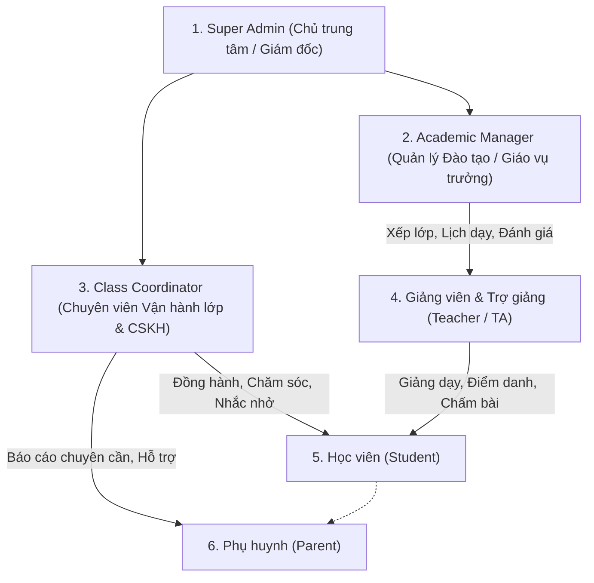

# Đặc Tả Yêu Cầu Phần Mềm (Software Requirements Specification - SRS)

> **Dự án:** LMS Center Platform (Hệ thống Quản lý Học tập, Giảng viên & Vận hành Đào tạo Đa hình thức)  
> **Tài liệu:** `docs/requirements.md`  
> **Phiên bản:** 1.2.0 (Cập nhật Phân cấp Quản lý, Vận Hành Lớp, Lịch Học Linh Hoạt & Đánh Giá Moodle)  
> **Ngày cập nhật:** 23/09/2026  

---

## 1. Mục Đích & Phạm Vi Dự Án (Scope & Objectives)

Hệ thống **LMS Center Platform** là giải pháp phần mềm quản lý toàn diện dành cho các trung tâm đào tạo hiện đại với trọng tâm chuyên sâu là **Công nghệ Thông tin (CNTT)**, kết hợp mở rộng linh hoạt cho **Ngoại ngữ** và các bộ môn khác.

Hệ thống giải quyết triệt để các bài toán vận hành thực tế:
- **Chuẩn hóa quản trị RBAC phân cấp:** Phân định rõ quyền hạn giữa Super Admin, Quản lý đào tạo (xếp lớp, đánh giá giáo viên), Chuyên viên vận hành lớp (chăm sóc học viên, điều phối), Giảng viên, Học viên và Phụ huynh.
- **Xếp lịch học linh hoạt:** Hỗ trợ lịch 1 buổi/tuần, nhiều buổi/tuần, dời ngày, đổi phòng/meet link, bù buổi học dễ dàng.
- **Phân định rõ 2 mô hình Học Trực Tuyến (Online Learning Taxonomy):**
  1. *Khóa học Online Tự học / Video đóng gói (Self-Paced / Recorded Courses):* Học qua video quay sẵn nhúng YouTube, cấm tua video, làm quiz và code Monaco, hỏi đáp theo timestamp.
  2. *Lớp học Online Trực tiếp & Hybrid (Virtual Live & Hybrid Classes):* Học theo lịch cố định với Giảng viên qua link phòng học trực tuyến (Google Meet/Zoom), điểm danh, nhắc lịch và nhận xét sau buổi.
- **Hệ thống Tin nhắn & Thông báo Tự động (Automated Notification Engine):** Tự động bắn thông báo/Zalo/SMS về sĩ số điểm danh sau N phút, thông báo nhận xét của giáo viên sau buổi học, và nhắc nhở lịch học trước 24h/2h kèm link lớp và dặn dò.
- **Cơ chế Chống tua Video (Anti-Seeking Video Player):** Ngăn học viên tua nhanh video lý thuyết để chống học đối phó; chỉ cho phép tua lại hoặc tua trong phạm vi đã xem; mở khóa tua tự do sau khi hoàn thành 100%.
- **Tự động hóa điểm danh hai chiều:** Điểm danh học viên lớp Offline, Online, Hybrid và Chấm công giáo viên (Timesheet).
- **Môi trường thực hành lập trình trực tuyến:** Tích hợp Monaco Code Editor cho môn CNTT, nộp link GitHub/zip, hỗ trợ ghi âm bài nói cho ngoại ngữ.
- **Kế thừa & Nâng cấp các tính năng tinh hoa từ Moodle & Frappe LMS:** Sổ điểm đa trọng số, Drip Content tuần tự, Timestamped Q&A, Ghi chú cá nhân, Chứng chỉ số xác thực công khai.

---

## 2. Các Tác Nhân Hệ Thống & Ma Trận Phân Cấp (Actors & Roles)

### Chi tiết vai trò:
1. **Super Admin (Chủ trung tâm / Quản trị viên cấp cao):** Toàn quyền cấu hình hệ thống, quản lý tài chính, phân quyền các Role trong bảng `roles` và `permissions`.
2. **Academic Manager (Quản lý Đào tạo / Giáo vụ trưởng):**
   - Tạo khóa học, phân công giảng viên & trợ giảng.
   - Xếp lớp học, thiết lập thời khóa biểu định kỳ và xử lý dời lịch/bù buổi.
   - Đánh giá chất lượng giảng viên (Teacher Evaluation / Audit), duyệt giáo án và tài liệu khóa học.
3. **Class Coordinator / Operations & Care (Chuyên viên Vận hành lớp & Chăm sóc học viên):**
   - Mỗi lớp học có 1 Chuyên viên vận hành đồng hành cùng Giảng viên và Trợ giảng.
   - Theo dõi chuyên cần buổi học, trực tiếp liên hệ học sinh vắng hoặc đi trễ.
   - Ghi nhận `coordinatorNote` (lý do nghỉ ốm, hoàn cảnh học sinh) gửi cho Phụ huynh.
   - Đôn đốc học viên nộp BTVN trước deadline, tiếp nhận và giải quyết phản hồi về chất lượng buổi học.
4. **Giảng viên & Trợ giảng (Teacher & Teaching Assistant):**
   - Xem thời khóa biểu cá nhân, Check-in / Check-out ca dạy để chấm công.
   - Điểm danh học sinh lớp Hybrid (Offline/Online), upload tài liệu bài học, giao BTVN và chấm điểm theo rubric.
5. **Học viên (Student):**
   - Xem lịch học, học bài giảng YouTube, tải tài liệu bài học.
   - Làm BTVN CNTT trực tiếp trên Monaco Code Editor hoặc nộp link GitHub / file ghi âm.
   - Xem điểm số, nhận xét và thanh toán học phí qua mã VietQR.
6. **Phụ huynh (Parent):**
   - Theo dõi chuyên cần từng buổi, điểm số bài tập và nhận xét của thầy cô.
   - Nhận thông báo học phí và quét mã VietQR thanh toán.

---

## 3. Yêu Cầu Chức Năng Chi Tiết (Functional Requirements)

### Phân hệ 1: Quản Trị RBAC & Phân Quyền Hạt Nhân (Dynamic RBAC Engine)

- **FR-RBAC-01 (Quản lý Roles & Permissions):** CSDL sử dụng các bảng `roles`, `permissions`, `role_permissions`, `user_roles`. Super Admin có thể tạo thêm role mới (ví dụ: "Nhân viên Tư vấn Tuyển sinh", "Kế toán") và gán các permissions cụ thể.
- **FR-RBAC-02 (Cấp quyền linh hoạt):** Một người dùng có thể đảm nhiệm nhiều vai trò (ví dụ: vừa là Giảng viên vừa là Quản lý Đào tạo).

---

### Phân hệ 2: Xếp Lớp & Lịch Học Linh Hoạt (Flexible Scheduling Engine)

- **FR-SCH-01 (Quy tắc lịch lặp lại - Recurrence Rule):**
  - Khi mở lớp, Quản lý Đào tạo cấu hình lịch học:
    - *1 buổi/tuần:* Ví dụ sáng Chủ Nhật (08:30 - 11:30).
    - *Nhiều buổi/tuần:* Ví dụ T2-T4-T6 (19:30 - 21:30) hoặc T3-T5 (18:00 - 20:00).
  - Hệ thống tự động sinh toàn bộ danh sách các buổi học (`class_sessions`) cho cả khóa học.
- **FR-SCH-02 (Tùy biến & Dời lịch từng buổi - Rescheduling):**
  - Quản lý Đào tạo hoặc Chuyên viên Vận hành lớp có thể:
    - **Dời ngày học:** Đổi ngày buổi học sang ngày khác, hệ thống lưu `originalDate` và `rescheduleReason`.
    - **Đổi giờ học / Đổi phòng:** Chuyển ca học sang phòng khác nếu phòng cũ bảo trì.
    - **Đổi link Meet:** Cập nhật link Google Meet riêng cho buổi đó nếu cần.
    - **Bù buổi học:** Thêm buổi học phát sinh vào khóa học.
  - Tự động gửi thông báo cập nhật lịch học tới Giảng viên, Học viên và Phụ huynh.
- **FR-SCH-03 (Phân công Giảng viên dạy thay):** Khi giảng viên chính có việc bận, Quản lý Đào tạo có thể gán `assignedTeacherId` là một giáo viên khác chỉ riêng cho buổi học đó, hệ thống tự động ghi nhận công dạy buổi đó cho giáo viên dạy thay.

---

### Phân hệ 3: Vận Hành Lớp Học & Chăm Sóc Học Viên (Class Operations & Student Care)

- **FR-OPS-01 (Mô hình Tam Giác Lớp Học):** Mỗi lớp học được quản lý bởi bộ 3:
  1. *Giảng viên chính:* Chịu trách nhiệm chuyên môn & bài giảng.
  2. *Trợ giảng (TA):* Hỗ trợ kỹ thuật, giải đáp bài tập code cho học viên.
  3. *Chuyên viên Vận hành (Class Coordinator):* Quản lý kỷ luật, sĩ số, chăm sóc học viên và phụ huynh.
- **FR-OPS-02 (Ghi chú Chăm sóc Học viên - Student Care Log):**
  - Khi học sinh vắng mặt hoặc đi trễ, Chuyên viên Vận hành vào danh sách lớp xem thông tin liên hệ và gọi điện thoại.
  - Nhập `coordinatorNote` (ví dụ: "Đã liên hệ mẹ, bạn bị sốt xin nghỉ buổi 3, đã gửi link video xem lại").
  - Phụ huynh và Giáo vụ xem được lịch sử chăm sóc này.
- **FR-OPS-03 (Đôn đốc nộp bài tập):** Chuyên viên Vận hành có màn hình theo dõi tiến độ nộp BTVN của cả lớp, tự động lọc danh sách các học viên chưa nộp bài khi còn 24h trước deadline để gửi tin nhắn nhắc nhở.

---

### Phân hệ 4: Đánh Giá Chất Lượng Giáo Viên (Teacher Quality Evaluation)

- **FR-EVAL-01 (Đánh giá từ Quản lý Đào tạo - Academic Audit):**
  - Quản lý Đào tạo dự giờ hoặc kiểm tra định kỳ chất lượng lớp học.
  - Đánh giá giảng viên theo các tiêu chí: Kiến thức chuyên môn, Kỹ năng sư phạm, Mức độ tương tác với học viên, Tác phong đúng giờ (dựa trên dữ liệu check-in/out).
  - Lưu trữ kết quả và tính điểm KPI của giảng viên.
- **FR-EVAL-02 (Khảo sát học viên cuối khóa - Student Feedback Survey):**
  - Cuối khóa học hoặc định kỳ giữa kỳ, học viên làm form khảo sát ẩn danh đánh giá giáo viên và trợ giảng (chấm điểm sao từ 1-5 và nhận xét góp ý).
  - Hệ thống tự động tổng hợp báo cáo điểm hài lòng của giảng viên để Ban Giám đốc trung tâm xem xét thù lao và khen thưởng.

---

### Phân hệ 5: Các Tính Năng Kế Thừa & Nâng Cấp Từ Moodle (Moodle-Inspired Features)

Dưới đây là các tính năng tinh hoa từ hệ thống Moodle được chọn lọc và tinh gọn cho trải nghiệm trung tâm đào tạo:

| Tính Năng Moodle | Cơ Chế Ứng Dụng Trong Hệ Thống LMS Của Chúng Ta | Giá Trị Mang Lại Cho Trung Tâm |
| :--- | :--- | :--- |
| **1. Activity Completion & Drip Content** | Cấu hình bài học tuần tự: Học viên phải xem video YouTube đạt $\ge 80\%$ thời lượng hoặc nộp xong BTVN bài trước thì bài học tiếp theo mới tự động mở khóa. | Tránh học viên học nhảy cóc, đảm bảo lộ trình tiếp thu kiến thức bài bản. |
| **2. Weighted Gradebook (Sổ điểm đa trọng số)** | Cho phép Quản lý Đào tạo cấu hình trọng số điểm cho từng khóa học (ví dụ: Chuyên cần 10%, BTVN 30%, Thi giữa kỳ 20%, Đồ án cuối kỳ 40%). Hệ thống tự động tính điểm tổng kết. | Đánh giá năng lực học viên toàn diện, chuẩn hóa xếp loại tốt nghiệp (Xuất sắc, Giỏi, Khá, Trung bình). |
| **3. Question Bank & Random Quiz** | Ngân hàng câu hỏi trắc nghiệm chia theo chuyên đề và mức độ khó (Dễ, Trung bình, Khó). Khi học viên làm bài kiểm tra, hệ thống tự động bốc ngẫu nhiên câu hỏi theo cấu trúc đề để chống nhìn bài nhau. | Hỗ trợ thi chứng chỉ đầu ra, kiểm tra định kỳ tự động chấm điểm ngay tức thì. |
| **4. Course Template Cloning (Nhân bản khóa học)** | Quản lý Đào tạo khi mở lớp mới chỉ cần nhấn nút "Nhân bản khóa học" (Clone Course): toàn bộ Module, Bài giảng YouTube, Tài liệu slide và BTVN mẫu được sao chép sang lớp mới chỉ trong 2 giây. | Tiết kiệm 95% thời gian giáo vụ nhập liệu khi mở khóa mới hàng tháng. |
- **FR-EVAL-03 (Đánh giá giáo viên theo từng buổi học từ học sinh - Per-Session Feedback):**
  - Sau khi buổi học kết thúc hoặc trong vòng 24h, khi học sinh truy cập hệ thống sẽ xuất hiện form đánh giá nhanh buổi học (thao tác dưới 15 giây):
    - Đánh giá sao Giảng viên (1 đến 5 sao).
    - Đánh giá sao Trợ giảng (1 đến 5 sao, nếu có).
    - Mức độ tiếp thu bài học (`POOR`, `AVERAGE`, `GOOD`, `EXCELLENT`).
    - Tốc độ giảng dạy (`TOO_SLOW`, `JUST_RIGHT`, `TOO_FAST`).
    - Nhận xét ẩn danh (tùy chọn).
  - Dữ liệu thống kê được cập nhật ngay lập tức cho Quản lý Đào tạo và Chuyên viên Vận hành lớp. Nếu một buổi học có điểm trung bình $< 3.5$ sao hoặc nhiều học sinh báo "Không hiểu bài / Dạy quá nhanh", hệ thống lập tức gắn cờ cảnh báo đỏ để trung tâm can thiệp và hỗ trợ học sinh ngay trong tuần.

---

### Phân hệ 6: Tính Năng Khóa Học Online Chuyên Sâu (Kế Thừa Từ Frappe LMS)

Tham khảo từ kiến trúc hiện đại của **Frappe LMS** (`https://github.com/frappe/lms`), hệ thống tích hợp các tính năng tối ưu trải nghiệm học online:

| Tính Năng Frappe LMS | Ứng Dụng Trong Hệ Thống LMS Của Chúng Ta | Lợi Ích Trực Tiếp |
| :--- | :--- | :--- |
| **1. In-Lesson Timestamped Q&A** | **Hỏi đáp gắn mốc thời gian video bài giảng:** Học viên có thể đặt câu hỏi ngay tại phút/giây thứ $T$ của video YouTube. Giảng viên hoặc trợ giảng bấm vào câu hỏi là video tự động tua tới đúng đoạn đó để xem ngữ cảnh và trả lời. Giảng viên có nút tích xanh xác nhận *"Câu trả lời chuẩn xác"*. | Loại bỏ việc học sinh hỏi chung chung "thầy ơi đoạn đó em không hiểu", tiết kiệm 80% thời gian trao đổi. |
| **2. Personal Course Notes** | **Ghi chú cá nhân trong khi học:** Học viên có khung ghi chú riêng tư ngay cạnh video bài giảng, lưu tự động kèm mốc thời gian video. Học viên có thể xem lại toàn bộ ghi chú của khóa học hoặc xuất ra file Markdown/PDF. | Tăng tính chủ động ghi chép và ghi nhớ kiến thức của học viên khi học online. |
| **3. Public Verifiable Certificate** | **Chứng chỉ số có URL xác thực công khai:** Khi học sinh hoàn thành khóa học và đạt chuẩn đầu ra, hệ thống tự động sinh chứng chỉ PDF kèm một mã định danh duy nhất và đường dẫn công khai `/verify/[certificateCode]` để nhà tuyển dụng xác minh trực tiếp. | Tăng uy tín thương hiệu của trung tâm, học viên dễ dàng đính kèm vào CV hoặc chia sẻ lên LinkedIn. |
| **4. Cohort Batches & Self-Paced Blending** | **Mô hình học kết hợp Đợt (Batch) và Tự học:** Khóa học online được tổ chức theo từng Batch (khóa khai giảng). Học viên có thể xem trước các video lý thuyết theo nhịp độ cá nhân (Self-paced), sau đó tham gia các buổi thực hành / giải đáp trực tiếp theo lịch cố định của Batch. | Tối ưu hóa thời lượng giảng dạy của giáo viên, học viên chủ động học trước lý thuyết để dành trọn vẹn giờ học trực tuyến cho thực hành. |

---

### Phân hệ 7: Hệ Thống Tin Nhắn & Thông Báo Tự Động (Automated Notification Engine)

Hệ thống cung cấp một engine gửi tin nhắn đa kênh (Zalo ZNS, SMS, Web Push, Email và In-App Notification) hoạt động theo các trigger nghiệp vụ tự động:

- **FR-NOTIF-01 (Cảnh báo điểm danh sau N phút - Attendance Broadcast):**
  - Cấu hình linh hoạt theo lớp học: `attendanceAlertMinutes` (mặc định $N = 15$ phút sau giờ vào lớp).
  - Khi hết $N$ phút, hệ thống tự động kiểm tra bảng `session_attendances`:
    - **Trường hợp lớp còn vắng học viên:** Tự động gửi thông báo tổng hợp tới Giảng viên và Chuyên viên Vận hành lớp: *"Lớp [Mã lớp] hiện có mặt X/Y bạn, vắng Z bạn: [Danh sách tên học sinh vắng]"*. Đồng thời tự động gửi tin nhắn đến từng Phụ huynh của học sinh vắng: *"Kính gửi phụ huynh, buổi học [Mã lớp] đã bắt đầu lúc [Giờ], hiện hệ thống chưa ghi nhận bé [Tên] có mặt tại lớp. Vui lòng kiểm tra hoặc liên hệ Chuyên viên Vận hành [SĐT]"*.
    - **Trường hợp lớp đi đủ:** Tự động gửi thông báo xác nhận: *"Lớp [Mã lớp] đã đủ quân số 100% (X/X học viên). Chúc thầy cô và các bạn có buổi học hiệu quả!"*.
- **FR-NOTIF-02 (Tự động gửi nhận xét buổi học tới Phụ huynh & Học sinh - Teacher Feedback Dispatch):**
  - Ngay sau khi Giảng viên hoàn tất nhập nhận xét và lưu sổ buổi học (`session_attendances.teacherNotes`, `attitudeRating`), hệ thống kích hoạt trigger tự động định dạng và gửi tin nhắn/Zalo ZNS tới Phụ huynh & Học sinh:
    - *Nội dung:* *"Trung tâm xin gửi nhận xét buổi học ngày [Ngày] môn [Tên môn] của bé [Tên]: Thái độ: [Chăm chú/Tích cực], Thực hành trên lớp: [Đạt/Cần cố gắng thêm], Dặn dò từ Thầy/Cô: [Lời dặn] - Xem chi tiết tại [Link]"*.
- **FR-NOTIF-03 (Nhắc nhở buổi học sắp diễn ra - Upcoming Class Reminder):**
  - Hệ thống chạy tiến trình định kỳ (Cron / Scheduled Job) quét các buổi học sắp tới:
    - **Nhắc trước 24 giờ (1 ngày):** Gửi thông báo nhắc lịch học, thời gian, phòng học và danh mục dặn dò (`preparationNotes`: ví dụ mang laptop sạc đầy, cài đặt môi trường NodeJS/Python, hoặc nộp bài tập còn nợ).
    - **Nhắc trước 2 giờ (hoặc tùy biến theo setting):** Gửi nhắc nhở khẩn, đính kèm link phòng học ảo (Google Meet / Zoom URL) nếu là lớp Online hoặc Hybrid.

---

### Phân hệ 8: Trình Phát Video Chống Tua Cho Khóa Học Tự Học (Anti-Seeking Video Player)

Nhằm đảm bảo học viên thực sự tiếp thu kiến thức và không "học đối phó", trình phát video nhúng YouTube trong các khóa học online đóng gói (Self-Paced) được trang bị cơ chế kiểm soát tiến độ nghiêm ngặt:

- **FR-VID-01 (Cấm tua nhanh - Block Forward Seeking):**
  - Hệ thống lưu trữ biến trạng thái `maxWatchedSeconds` (thời điểm xem xa nhất mà học viên đã thực sự theo dõi).
  - Học viên **không được phép tua nhanh vượt quá `maxWatchedSeconds`**. Mọi thao tác click chuột trên thanh tiến trình (progress bar) tới vị trí tương lai đều bị chặn và trình phát tự động đưa về mốc thời gian xem hợp lệ gần nhất.
  - Học viên **được phép tua lùi (Seek Backward)** tự do để xem lại kiến thức cũ bất cứ lúc nào.
- **FR-VID-02 (Heartbeat & Chống gian lận Client-Side - Anti-Cheat Heartbeat):**
  - Trong quá trình phát video, client gửi heartbeat mỗi $5$ giây về API `POST /api/courses/[id]/lessons/[lessonId]/heartbeat` kèm thời lượng thực tế đã xem.
  - Backend kiểm tra tính hợp lệ: Nếu mốc thời gian xem giữa 2 lần heartbeat tăng đột biến bất thường (ví dụ học viên can thiệp DevTools chỉnh `currentTime` nhảy cóc $5$ phút chỉ trong $2$ giây), hệ thống từ chối cập nhật và ghi nhận cờ gian lận.
- **FR-VID-03 (Mở khóa tua tự do sau khi hoàn thành 100% - Unlock Seeking Upon Completion):**
  - Khi học viên đã xem video đạt $\ge 95\%$ thời lượng bài giảng (hoặc 100% tùy cấu hình), bài học được ghi nhận trạng thái `isCompleted = true`.
  - Từ thời điểm này trở đi, học viên được cấp quyền `allowFreeSeeking = true` để tự do tua nhanh/chậm mọi đoạn video phục vụ ôn tập và tra cứu.

---

### Phân hệ 9: Phân Định Rõ Ràng 2 Mô Hình Khóa Học Trực Tuyến (Dual Online Learning Paradigms)

Hệ thống hỗ trợ song song và phân tách mạch lạc hai hình thức học tập trực tuyến đáp ứng trọn vẹn nhu cầu của trung tâm:

| Tiêu Chí So Sánh | 1. Khóa Học Online Đóng Gói (Self-Paced Online Course) | 2. Lớp Học Online Trực Tiếp & Hybrid (Virtual Live & Hybrid Classes) |
| :--- | :--- | :--- |
| **Bản chất đào tạo** | Học viên tự học theo nhịp độ cá nhân qua video bài giảng thu sẵn (Video On-Demand). | Lớp học tương tác thời gian thực với Giảng viên & Trợ giảng qua phòng học trực tuyến. |
| **Thời khóa biểu** | Không có lịch cố định. Học viên chủ động học bất kỳ lúc nào 24/7. | Có lịch học định kỳ cố định (ví dụ: T3-T5 lúc 19:30 - 21:30). |
| **Trải nghiệm Video** | Nhúng YouTube Player có **cơ chế cấm tua video**; tích hợp hỏi đáp Timestamped Q&A và Ghi chú cá nhân. | Giảng dạy trực tiếp qua link phòng học ảo (`meetingUrl`: Google Meet / Zoom / MS Teams); buổi học có thể ghi hình lại để học sinh xem lại sau. |
| **Quy trình Điểm danh** | Không áp dụng điểm danh theo ca; tiến độ được đo bằng % video đã xem và số bài tập/quiz đã nộp. | **Bắt buộc điểm danh từng buổi:** Check-in qua web / OTP phòng học ảo / Giáo viên điểm danh tay; kích hoạt cảnh báo vắng sau 15 phút. |
| **Chăm sóc & Nhắc nhở** | Hệ thống tự động gửi email/thông báo khi học viên không đăng nhập quá 7 ngày. | **Tự động nhắc lịch học trước 24h/2h** kèm link Meet; gửi nhận xét của giáo viên sau mỗi buổi học về cho phụ huynh. |
| **Chứng nhận hoàn thành** | Hoàn thành tất cả bài học tuần tự (Drip content) + đạt điểm Quiz $\ge 80\%$. | Dựa trên sổ điểm tổng kết đa trọng số (Chuyên cần $\ge 80\%$, BTVN, Thi giữa kỳ, Đồ án cuối khóa). |

---

## 4. Bổ Sung Ma Trận User Stories (Acceptance Criteria)

| Mã Story | Đối tượng | Hành động (User Story) | Tiêu chí chấp nhận (Acceptance Criteria) |
| :--- | :--- | :--- | :--- |
| **US-SCH-01** | Quản lý Đào tạo | Tạo lớp học với lịch 1 tuần 1 buổi hoặc nhiều buổi | - Chọn được lịch tuần linh hoạt (ví dụ: T2-T4-T6 lúc 19:30). - Tự động sinh ra đúng $N$ buổi học trong bảng `class_sessions`. |
| **US-SCH-02** | Quản lý / Vận hành | Dời ngày học một buổi cụ thể khi có sự cố | - Đổi ngày từ ngày $D$ sang $D'$, nhập lý do dời lịch. - Hệ thống cập nhật và gửi thông báo cho giáo viên, học sinh, phụ huynh. |
| **US-OPS-01** | Chuyên viên Vận hành | Ghi chú chăm sóc học viên vắng học | - Xem được danh sách học viên vắng sau khi giáo viên điểm danh. - Nhập ghi chú chăm sóc `coordinatorNote`, phụ huynh đọc được ghi chú. |
| **US-EVAL-01** | Quản lý Đào tạo | Đánh giá chất lượng giáo viên định kỳ | - Form chấm điểm các tiêu chí sư phạm, chuyên môn, đúng giờ. - Cập nhật điểm KPI vào hồ sơ giảng viên. |
| **US-EVAL-02** | Học viên | Đánh giá giáo viên ngay sau buổi học | - Form đánh giá nhanh 1-5 sao, mức độ hiểu bài, tốc độ dạy. - Đánh giá ẩn danh, cảnh báo cờ đỏ cho quản lý nếu điểm dưới 3 sao. |
| **US-FRP-01** | Học viên | Đặt câu hỏi tại mốc thời gian video YouTube | - Nhập câu hỏi kèm timestamp video. - Click câu hỏi video tự tua đến đúng đoạn; Giáo viên có nút tích xanh câu trả lời đúng. |
| **US-FRP-02** | Học viên | Nhận chứng chỉ có link xác thực công khai | - Hoàn thành khóa học tự động cấp chứng chỉ. - Link `/verify/[code]` hiển thị thông tin khóa học và tên học viên công khai. |
| **US-MDL-01** | Quản lý Đào tạo | Cấu hình trọng số điểm cho khóa học | - Nhập % chuyên cần, % BTVN, % thi giữa kỳ, % đồ án cuối kỳ (tổng = 100%). - Sổ điểm tự động tính điểm trung bình môn theo đúng công thức trọng số. |
| **US-MDL-02** | Quản lý Đào tạo | Nhân bản khóa học sang lớp mới | - Bấm "Nhân bản khóa học" sao chép đầy đủ nội dung bài học, video và BTVN. - Không sao chép học viên hay điểm số của lớp cũ. |
| **US-NOTIF-01** | Vận hành / Phụ huynh | Tự động nhận thông báo sĩ số sau 15 phút mở lớp | - Sau $N$ phút (mặc định 15p), hệ thống quét dữ liệu điểm danh. - Bắn tin nhắn danh sách vắng cho Vận hành & GV; gửi tin nhắn riêng cho Phụ huynh học sinh vắng. |
| **US-NOTIF-02** | Phụ huynh / Học sinh | Nhận tin nhắn nhận xét của giáo viên sau ca học | - Ngay khi GV lưu nhận xét buổi học, hệ thống gửi Zalo/SMS/Push cho Phụ huynh & Học sinh tóm tắt thái độ và kết quả trên lớp. |
| **US-NOTIF-03** | Học viên / Phụ huynh | Nhận thông báo nhắc lịch học trước 24h và 2h | - Cron tự động quét và gửi tin nhắn trước 24h (kèm dặn dò chuẩn bị) và trước 2h (kèm link Google Meet/Zoom). |
| **US-VID-01** | Học viên | Xem video bài giảng khóa tự học (Self-Paced) | - Không thể kéo tua tiến thanh thời lượng nếu chưa xem tới mốc đó. - Có thể tua lùi để nghe lại. - Gửi heartbeat 5s/lần cập nhật tiến độ. |
| **US-VID-02** | Học viên đã hoàn thành | Ôn tập lại bài giảng video sau khi học xong | - Sau khi xem đạt 100% thời lượng, thanh thời gian mở khóa hoàn toàn để học viên tự do tua nhanh/chậm ôn tập. |

