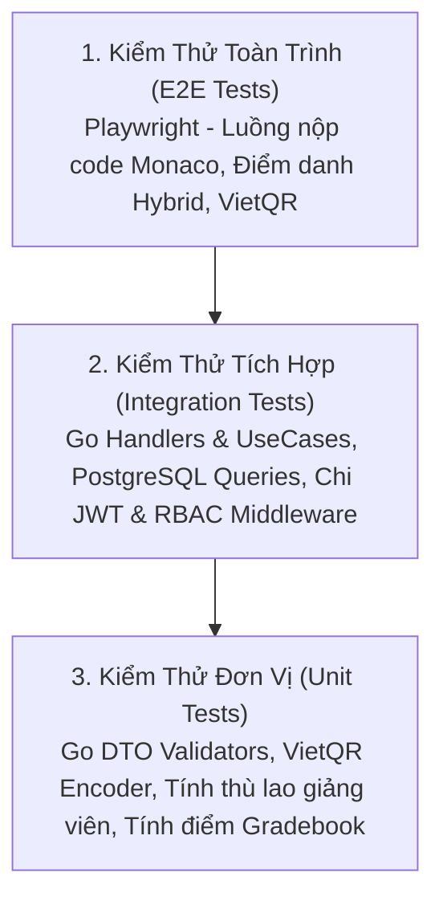

# Kế Hoạch Kiểm Thử & Bộ Test Cases Nghiệp Vụ (QA Strategy & Test Plan)

> **Dự án:** LMS Center Platform (Hệ thống Quản lý Học tập, Giảng viên & Vận hành Đào tạo Đa hình thức)  
> **Tài liệu:** `docs/test-plan.md`  
> **Phiên bản:** 2.3.0 (Bổ sung Nhóm 11: Class Coordinator - Bảng Điều Hành Ca Học, Sổ Chăm Sóc Học Viên CRM, Bảo Lưu & Chuyển Lớp, Báo Cáo Sự Cố & Quản Lý Giáo Trình Học Liệu)  
> **Ngày cập nhật:** 23/09/2026  

---

## 1. Chiến Lược Kiểm Thử (Testing Strategy & Pyramid)

Để đảm bảo toàn bộ hệ thống vận hành mượt mà, không xảy ra sai sót dữ liệu điểm số, tài chính hoặc xung đột quyền truy cập, chiến lược kiểm thử tuân theo mô hình **Testing Pyramid**:



### Tiêu chuẩn chất lượng:
- **Độ bao phủ kiểm thử (Coverage):** $\ge 80\%$ cho các hàm tính toán điểm số, thù lao và phân quyền.
- **Bảo mật:** 100% các endpoint nhạy cảm được quét qua `security_scan.py` không có lỗ hổng IDOR hoặc lộ lọt thông tin.
- **Khả năng tương thích:** Chạy thử nghiệm trên Chrome, Firefox, Safari (Webkit) và Mobile Viewport.

---

## 2. Ma Trận Test Cases Nghiệp Vụ Chi Tiết (Detailed Test Cases)

### Nhóm 1: Bảo Mật & Phân Quyền RBAC (Authentication & Access Control)

| Mã Test Case | Phân hệ | Mô tả kịch bản | Các bước thực hiện | Kết quả mong đợi | Mức độ |
| :--- | :--- | :--- | :--- | :--- | :--- |
| **TC-SEC-01** | RBAC | Học viên cố tình truy cập trang Admin | 1. Đăng nhập bằng tài khoản Student.<br>2. Gõ trực tiếp URL `/admin` hoặc `/admin/teachers`. | Middleware phát hiện sai role, chuyển hướng về `/student` hoặc báo lỗi 403 Forbidden. | **P0 (Blocker)** |
| **TC-SEC-02** | RBAC | Phụ huynh cố tình gọi API chấm điểm | 1. Đăng nhập bằng tài khoản Parent.<br>2. Gửi request POST tới `/api/grading`. | API trả về mã `403 Unauthorized` kèm thông điệp từ chối. | **P0 (Blocker)** |
| **TC-SEC-03** | Auth | Đăng nhập với mật khẩu sai | 1. Nhập email đúng, mật khẩu sai.<br>2. Nhấn Đăng nhập. | Báo lỗi "Email hoặc mật khẩu không chính xác", không tiết lộ email có tồn tại hay không. | **P1** |

---

### Nhóm 2: Giảng Viên, Lịch Dạy & Điểm Danh Hai Chiều (Teacher & Attendance)

| Mã Test Case | Phân hệ | Mô tả kịch bản | Các bước thực hiện | Kết quả mong đợi | Mức độ |
| :--- | :--- | :--- | :--- | :--- | :--- |
| **TC-TEA-01** | Giáo viên | Giảng viên xem lịch dạy cá nhân | 1. Đăng nhập với vai trò Teacher.<br>2. Vào mục Thời khóa biểu `/teacher/schedule`. | Hiển thị đúng các ca dạy của giáo viên trong tuần, không hiển thị ca dạy của giáo viên khác. | **P0** |
| **TC-TEA-02** | Chấm công | Check-in và Check-out ca dạy | 1. Giáo viên nhấn [Check-in] lúc 19:25.<br>2. Giảng dạy đến 21:30 nhấn [Check-out]. | Hệ thống ghi nhận `checkInTime`, `checkOutTime`, tính toán đúng số phút dạy thực tế (125 phút) để tính thù lao. | **P0** |
| **TC-ATT-01** | Điểm danh | Điểm danh lớp Hybrid (Phân loại Offline/Online) | 1. Mở lớp học Hybrid buổi số 5.<br>2. Chọn học viên A: `PRESENT_OFFLINE`.<br>3. Chọn học viên B: `PRESENT_ONLINE`.<br>4. Nhấn Lưu điểm danh. | CSDL lưu chính xác trạng thái của từng học sinh; Phụ huynh của học viên A và B xem đúng trạng thái con mình tham gia tại lớp hay online. | **P0** |
| **TC-ATT-02** | Điểm danh | Cảnh báo học viên vắng học | 1. Điểm danh học viên C vắng buổi thứ 3 liên tiếp.<br>2. Kiểm tra thông báo. | Hệ thống gắn cờ cảnh báo chuyên cần dưới 80% trên Dashboard học viên và phụ huynh. | **P1** |

---

### Nhóm 3: Tài Liệu Khóa Học, Bài Giảng YouTube & BTVN (Materials & YouTube)

| Mã Test Case | Phân hệ | Mô tả kịch bản | Các bước thực hiện | Kết quả mong đợi | Mức độ |
| :--- | :--- | :--- | :--- | :--- | :--- |
| **TC-MAT-01** | Tài liệu | Giáo viên upload slide PDF & code mẫu vào bài học | 1. Vào bài học số 3.<br>2. Đính kèm file `slide.pdf` và `starter.zip`.<br>3. Nhấn Lưu. | Học viên vào bài học thấy danh sách file đính kèm và tải về thành công. | **P1** |
| **TC-MAT-02** | BTVN | Đính kèm dataset mẫu vào bài tập về nhà | 1. Tạo bài tập CNTT.<br>2. Đính kèm file `data-sample.json`.<br>3. Giao bài cho lớp. | Học viên khi mở đề bài tập thấy nút tải file `data-sample.json` để làm bài. | **P1** |
| **TC-YT-01** | YouTube | Phát video bài giảng YouTube và lưu vết tiến độ | 1. Học viên mở bài học có video YouTube.<br>2. Xem video đạt trên 80% thời lượng bài học. | Hệ thống tự động phát sự kiện lưu tiến độ và đánh dấu bài học đã hoàn thành (`isCompleted = true`). | **P1** |
| **TC-VID-01** | Chống tua Video | Chặn thao tác tua tiến vượt mốc đã xem (`maxWatchedSeconds`) | 1. Học viên mở bài học mới (chưa xem).<br>2. Kéo thanh tua tới phút thứ 10.<br>3. Kiểm tra phản hồi trình phát. | Trình phát hiện cảnh báo cấm tua và tự động nhảy về giây 0 hoặc mốc xem hợp lệ gần nhất. | **P0** |
| **TC-VID-02** | Chống tua Video | Mở khóa tua tự do sau khi hoàn thành $\ge 95\%$ | 1. Học viên xem tuần tự bài giảng đạt 95% thời lượng.<br>2. Quay lại xem lại bài học lần 2. | Hệ thống cập nhật `allowFreeSeeking = true`, học viên được tự do tua nhanh/chậm mọi đoạn video để ôn tập. | **P1** |
| **TC-NOTIF-01** | Thông báo tự động | Phát cảnh báo điểm danh sau 15 phút vào lớp | 1. Buổi học bắt đầu lúc 19:30, có 2 học viên vắng.<br>2. Lúc 19:45 (sau 15p), trigger cảnh báo kích hoạt. | Phụ huynh 2 học viên vắng nhận được tin nhắn báo con chưa đến lớp; GV & Vận hành lớp nhận tin báo cáo vắng 2/20. | **P0** |
| **TC-NOTIF-02** | Thông báo tự động | Tự động gửi nhận xét buổi học tới Phụ huynh | 1. GV nhập nhận xét thái độ và BTVN trên lớp.<br>2. Bấm [Lưu nhận xét buổi học]. | Hệ thống tự động gửi tin nhắn tóm tắt kết quả ca học tới Phụ huynh & Học sinh; ghi log thành công vào `notification_logs`. | **P0** |
| **TC-NOTIF-03** | Thông báo tự động | Cron nhắc nhở lịch học trước 24h & 2h | 1. Cron job quét ca học ngày mai và ca học sắp bắt đầu trong 2h.<br>2. Kích hoạt phát tin nhắn. | Học viên & Phụ huynh nhận tin nhắn nhắc lịch kèm dặn dò đồ dùng học tập và link phòng học ảo (Google Meet/Zoom). | **P1** |
| **TC-NOTIF-04** | Thông báo tự động | Cảnh báo Giáo viên đi muộn / chưa vào lớp sau 10p | 1. Ca học bắt đầu lúc 19:30, đến 19:40 giáo viên chưa check-in.<br>2. Worker kiểm tra và kích hoạt cảnh báo. | Gửi tin SMS/Push khẩn cho Giảng viên; bắn cờ đỏ trên Dashboard Quản lý Đào tạo & Vận hành lớp. | **P0** |

---

### Nhóm 4: Làm Bài Tập Trên Web (Monaco Editor) & Chấm Điểm (Assignments & Grading)

| Mã Test Case | Phân hệ | Mô tả kịch bản | Các bước thực hiện | Kết quả mong đợi | Mức độ |
| :--- | :--- | :--- | :--- | :--- | :--- |
| **TC-ASM-01** | Monaco Editor | Học viên viết code JavaScript/TypeScript và nộp trực tiếp | 1. Mở bài tập lập trình trên web.<br>2. Soạn thảo mã nguồn trên Monaco Editor.<br>3. Nhấn [Nộp bài tập]. | Mã nguồn được lưu trữ toàn vẹn trong CSDL; trạng thái chuyển sang `SUBMITTED`, ghi nhận đúng thời gian nộp. | **P0** |
| **TC-ASM-02** | Monaco Editor | Tự động lưu nháp (Auto-save) khi đang viết code | 1. Học viên đang gõ dở code bài tập.<br>2. Tắt trình duyệt hoặc bấm F5 tải lại trang. | Monaco Editor tự động phục hồi lại đoạn code dở từ `localStorage`, không bị mất bài làm. | **P1** |
| **TC-ASM-03** | Chấm điểm | Giảng viên xem bài nộp code và chấm điểm | 1. Giáo viên mở bài làm của học viên.<br>2. Xem code trên trình xem Monaco.<br>3. Nhập 90 điểm và lời nhận xét chi tiết.<br>4. Nhấn Lưu. | Học viên và phụ huynh lập tức xem được điểm số 90 và nhận xét của thầy cô trên màn hình cá nhân. | **P0** |
| **TC-GRD-01** | Sổ điểm | Tính toán Sổ điểm lớp học (Gradebook) | 1. Giáo viên chấm xong 3 bài tập của cả lớp.<br>2. Mở tab Sổ điểm lớp. | Bảng tổng hợp hiển thị đầy đủ điểm các cột của từng học sinh kèm điểm trung bình chính xác. | **P1** |

---

### Nhóm 5: Cổng Mua Khóa Học & Thanh Toán VietQR (Store & Payments)

| Mã Test Case | Phân hệ | Mô tả kịch bản | Các bước thực hiện | Kết quả mong đợi | Mức độ |
| :--- | :--- | :--- | :--- | :--- | :--- |
| **TC-STORE-01** | Khóa học Free | Đăng ký học ngay khóa học trực tuyến Miễn Phí | 1. Học viên bấm nút [Đăng ký học ngay (Free)].<br>2. Kiểm tra quyền truy cập bài học. | Hệ thống tạo `enrollment` trạng thái `ACTIVE` trong 1 giây, mở khóa ngay bài học 1 mà không cần thanh toán. | **P0** |
| **TC-STORE-02** | Khóa học Paid | Mua khóa học Trả Phí qua VietQR & Webhook | 1. Chọn mua khóa học trả phí 1.500.000 đ.<br>2. Quét mã VietQR chuyển khoản.<br>3. Webhook ngân hàng bắn về API. | Khóa học được tự động kích hoạt trạng thái `ACTIVE` trong vòng 3 giây; gửi email hóa đơn và thông báo thành công. | **P0** |
| **TC-PAY-01** | VietQR | Sinh mã VietQR động chuẩn Napas247 cho học phí lớp | 1. Mở hóa đơn học phí trị giá 3.500.000 đ.<br>2. Nhấn [Thanh toán qua VietQR]. | Ảnh mã QR hiển thị rõ nét; dùng app ngân hàng thật quét mã tự động điền đúng Số tiền `3500000` và Nội dung `HP [MãHV] [MãHĐ]`. | **P0** |
| **TC-PAY-02** | Tiền mặt | Thu ngân xác nhận thu tiền mặt tại quầy | 1. Học viên nộp tiền mặt tại cơ sở.<br>2. Thu ngân bấm [Xác nhận thu tiền mặt]. | Trạng thái hóa đơn chuyển sang `PAID`, lưu vết người thu và xuất file biên lai điện tử PDF hợp lệ. | **P0** |

---

### Nhóm 6: Hội Đồng Giám Khảo & Chấm Đồ Án Tốt Nghiệp (Capstone Defense)

| Mã Test Case | Phân hệ | Mô tả kịch bản | Các bước thực hiện | Kết quả mong đợi | Mức độ |
| :--- | :--- | :--- | :--- | :--- | :--- |
| **TC-CAP-01** | Giám khảo | Giám khảo chấm điểm đồ án theo Rubric 4 tiêu chí | 1. Đăng nhập tài khoản vai trò Examiner.<br>2. Mở đồ án của học viên, xem GitHub & Live Demo.<br>3. Nhập 4 đầu điểm Rubric và nhận xét.<br>4. Nhấn [Nộp phiếu chấm]. | Hệ thống tính điểm trung bình có trọng số chính xác, lưu phiếu chấm và cập nhật vào Sổ điểm tổng kết lớp. | **P0** |
| **TC-SCH-01** | Xếp lớp | Mở lớp học với Trợ giảng là tùy chọn (Optional) | 1. Quản lý Đào tạo tạo lớp mới, để trống ô Trợ giảng (TA).<br>2. Cấu hình lịch tuần T2-T4-T6 và bấm Lưu. | Hệ thống tạo lớp và sinh đầy đủ các buổi học thành công mà không báo lỗi thiếu TA. | **P0** |

---

### Nhóm 7: Bảng Lương Giáo Viên, Mã Giảm Giá, Môn Học & Chấm Điểm Lớp Học (Payroll, Discounts & Class Grading)

| Mã Test Case | Phân hệ | Mô tả kịch bản | Các bước thực hiện | Kết quả mong đợi | Mức độ |
| :--- | :--- | :--- | :--- | :--- | :--- |
| **TC-PAYROLL-01** | Bảng lương | Tự động tổng hợp bảng lương tháng theo bậc lương, thưởng KPI & phạt muộn | 1. Giáo viên Senior (350.000 đ/h) dạy 40h trong tháng 10/2026.<br>2. Điểm đánh giá TB đạt 4.8/5 ($\ge 4.5$), đi muộn 20 phút (phạt 100k).<br>3. Admin chạy `POST /api/v1/payrolls/generate`. | Lương cơ bản = 14.000.000 đ; Thưởng KPI 15% = 2.100.000 đ; Phạt muộn = -100.000 đ; Thực lĩnh = 16.000.000 đ; trạng thái `DRAFT`. | **P0 (Blocker)** |
| **TC-PAYROLL-02** | Bảng lương | Admin phê duyệt bảng lương quyết toán chuyển khoản | 1. Admin kiểm tra phiếu lương `DRAFT` của GV.<br>2. Nhấn [Phê duyệt quyết toán]. | Trạng thái chuyển `APPROVED`, lưu `approved_by` và `approved_at`, xuất danh sách chi trả ngân hàng. | **P0** |
| **TC-DISCOUNT-01** | Khuyến mãi | Áp mã giảm giá phần trăm có giới hạn tối đa khi mua khóa học | 1. Khóa học trị giá 3.000.000 đ.<br>2. Nhập mã `GIAM20` (Giảm 20%, tối đa 400.000 đ).<br>3. Nhấn [Áp dụng]. | Hệ thống tính mức giảm là 400.000 đ (thay vì 600.000 đ do chạm trần); Số tiền thanh toán cuối cùng = 2.600.000 đ; Sinh mã VietQR đúng 2.600.000 đ. | **P0** |
| **TC-DISCOUNT-02** | Khuyến mãi | Chặn mã giảm giá khi hết lượt hoặc không đạt giá trị tối thiểu | 1. Mã giảm giá yêu cầu đơn tối thiểu 2.000.000 đ.<br>2. Áp dụng cho khóa học 1.500.000 đ. | Báo lỗi 400 "Đơn hàng chưa đạt giá trị tối thiểu 2.000.000 đ để áp dụng mã giảm giá này". | **P1** |
| **TC-SUBJ-01** | Môn học | CRUD Môn học động trong hệ thống đào tạo | 1. Admin tạo môn `WEB_FE` ("Lập Trình Web Frontend").<br>2. Tạo khóa học gắn với môn `WEB_FE`.<br>3. Cập nhật tên môn học. | Môn học được tạo và cập nhật thành công; Khóa học liên kết đúng `subjectId`; API danh sách trả về đầy đủ. | **P0** |
| **TC-CLASS-GRD-01** | Chấm bài lớp | Giáo viên vào lớp học chấm bài tập và đồng bộ Sổ điểm lớp | 1. Giáo viên mở `/teacher/classes/{classId}` > tab Bài tập.<br>2. Chọn bài tập BTVN-03 > Xem danh sách học viên.<br>3. Mở bài làm học viên A, chấm 95 điểm kèm lời phê.<br>4. Bấm [Lưu điểm]. | Dữ liệu bài nộp lưu điểm 95; Sổ điểm của lớp (Gradebook) tự động cập nhật cột điểm tương ứng của học viên A; Học viên nhận thông báo điểm mới. | **P0** |
| **TC-SOFTDEL-01** | Audit & CSDL | Kiểm tra 6 trường Audit và cơ chế Xóa mềm (Soft Delete) | 1. Admin thực hiện xóa môn học hoặc lớp học.<br>2. Kiểm tra bản ghi trong PostgreSQL. | Bản ghi KHÔNG bị xóa vật lý; `deleted_at` được gán timestamp hiện tại; `deleted_by` lưu ID người xóa; Các câu lệnh query danh sách tự động loại trừ bản ghi đã xóa (`WHERE deleted_at IS NULL`). | **P0 (Blocker)** |

---

### Nhóm 8: Quản Trị Hệ Thống, Giao Diện Website & Giám Sát OpenTelemetry (Admin & OTel Observability)

| Mã Test Case | Phân hệ | Mô tả kịch bản | Các bước thực hiện | Kết quả mong đợi | Mức độ |
| :--- | :--- | :--- | :--- | :--- | :--- |
| **TC-ADMIN-WEB-01** | Website | Super Admin tùy biến logo, favicon và màu sắc Header/Footer | 1. Đăng nhập tài khoản Super Admin.<br>2. Gọi `PUT /api/v1/admin/settings/website` cập nhật màu Header, logo mới.<br>3. Client Nuxt UI gọi `GET /api/v1/settings/website`. | CSDL lưu cấu hình thương hiệu mới; Client nhận đúng mã màu và đường dẫn logo mới; Giao diện cập nhật tức thì. | **P0** |
| **TC-ADMIN-USER-01** | User Mgmt | Super Admin tạo nhân sự mới, gán đa vai trò và khóa tài khoản | 1. Tạo user mới với vai trò `TEACHER` và `ACADEMIC_MANAGER`.<br>2. Kiểm tra danh sách permissions.<br>3. Gọi API khóa tài khoản (`isActive = false`). | User đăng nhập được và có đầy đủ quyền của cả 2 vai trò; Sau khi khóa, đăng nhập lập tức bị từ chối 401/403. | **P0** |
| **TC-AUDIT-01** | Audit Logs | Tự động ghi nhật ký kiểm toán khi thực hiện hành động nhạy cảm | 1. Admin bấm duyệt bảng lương giáo viên hoặc sửa điểm BTVN.<br>2. Kiểm tra bảng `system_audit_logs`. | Tự động sinh bản ghi log lưu rõ `actorId`, `action: "PAYROLL_APPROVE"`, `diffJson`, IP và thời gian thao tác. | **P1** |
| **TC-OTEL-01** | OTel Tracing | Truy vết phân tán (Distributed Tracing) qua `otelchi` và `otelsql` | 1. Khởi chạy `task infra:up` và `task dev`.<br>2. Gửi request `POST /api/v1/auth/login`.<br>3. Mở Jaeger (`http://localhost:16686`). | Trace hiển thị sơ đồ thác nước: Root span từ Chi router (`otelchi`) và Child span từ truy vấn PostgreSQL (`otelsql`). | **P0** |
| **TC-OTEL-02** | OTel Logging | Tương quan vết giữa Log và Trace (Trace-Log Correlation) | 1. Gửi request API xử lý nghiệp vụ bất kỳ.<br>2. Đọc log xuất ra từ `log/slog`. | Mọi dòng log đều chứa trường `trace_id` và `span_id` trùng khớp với Trace context của request đó. | **P0** |
| **TC-OTEL-03** | OTel Metrics | Thu thập chỉ số hiệu năng và nghiệp vụ qua Prometheus | 1. Gửi 50 requests vào các API endpoints.<br>2. Mở Prometheus (`http://localhost:9090`).<br>3. Truy vấn `http_server_requests_total`. | Prometheus hiển thị đúng số lượng request phân loại theo method, route template và status code. | **P1** |

---

### Nhóm 9: Cơ Sở, Phòng Học, Lịch Học Bù, Khảo Thí & Radar Cảnh Báo (Campus, Make-up, Quiz & Churn Radar)

| Mã Test Case | Phân hệ | Mô tả kịch bản | Các bước thực hiện | Kết quả mong đợi | Mức độ |
| :--- | :--- | :--- | :--- | :--- | :--- |
| **TC-CAMPUS-01** | Cơ sở & Phòng | CRUD Cơ sở chi nhánh và phòng học | 1. Tạo cơ sở mới `CS_HADONG` ("Cơ sở Hà Đông").<br>2. Thêm phòng học `LAB-201` (Sức chứa 25 máy, projector, lan).<br>3. Lấy danh sách phòng theo cơ sở. | Cơ sở và phòng học được lưu thành công; Dữ liệu tiện ích JSON parse chính xác; Phân trang và tìm kiếm hoạt động chuẩn. | **P0** |
| **TC-ROOM-CONF-01** | Chống trùng phòng | Ngăn chặn xếp lịch trùng phòng học cùng khung giờ | 1. Lớp A đặt phòng `LAB-101` từ 18:00 đến 20:00 ngày 15/10/2026.<br>2. Giáo vụ xếp lớp B vào phòng `LAB-101` lúc 19:30 - 21:30 cùng ngày.<br>3. Gọi `GET /api/v1/rooms/conflicts`. | Trả về `hasConflict: true`, cảnh báo trùng 30 phút với lớp A; Hệ thống chặn không cho phép lưu lịch; Đổi sang phòng trống trả về `hasConflict: false`. | **P0 (Blocker)** |
| **TC-MAKEUP-01** | Lịch học bù | Xếp học bù ghép lớp song song cho học sinh vắng | 1. Học sinh Nam vắng Buổi 4 lớp FE-K32.<br>2. Điều phối viên chọn ghép lớp song song FE-K33 (học tối T5 cùng bài).<br>3. Gọi `POST /api/v1/makeup-sessions`. | Tạo bản ghi `makeup_sessions` thành công (loại `PARALLEL_CLASS`); Gửi thông báo Zalo/Push cho học viên; Lớp FE-K33 xuất hiện tên Nam diện học bù. | **P0** |
| **TC-MAKEUP-02** | Lịch học bù | Điểm danh buổi học bù và tự động đồng bộ chuyên cần | 1. Giảng viên mở danh sách ca học bù / lớp ghép.<br>2. Tích chọn [Đã tham gia] kèm nhận xét bài làm.<br>3. Gọi `PUT /api/v1/makeup-sessions/{id}/attend`. | Trạng thái chuyển `ATTENDED`; Chuyên cần buổi học gốc của Nam được đồng bộ sang "ĐÃ HỌC BÙ"; Học viên đủ điều kiện thi tốt nghiệp. | **P0** |
| **TC-QUIZ-01** | Trắc nghiệm | Sinh đề ngẫu nhiên từ Ngân hàng câu hỏi và xáo trộn đề | 1. Tạo ngân hàng câu hỏi `QB_GOLANG` (50 câu).<br>2. Gọi `POST /api/v1/quizzes/generate` rút 5 Dễ, 10 TB, 5 Khó.<br>3. Hai học sinh khác nhau cùng vào thi. | Đề thi sinh ra đủ 20 câu theo đúng cấu trúc độ khó; Thứ tự câu hỏi và thứ tự đáp án A/B/C/D của 2 học sinh được xáo trộn ngẫu nhiên. | **P0** |
| **TC-QUIZ-02** | Trắc nghiệm | Nộp bài thi trắc nghiệm, tự động chấm điểm và đồng bộ Sổ điểm | 1. Học sinh chọn đáp án cho 20 câu và bấm nộp bài.<br>2. Gọi `POST /api/v1/quizzes/{id}/submit`. | Hệ thống so khớp đáp án, tính điểm trong 0.5s; Trả về kết quả đúng/sai và lời giải; Điểm tự động ghi vào Sổ điểm tổng kết lớp học (`gradebook`). | **P0** |
| **TC-CHURN-01** | Churn Radar | Radar phát hiện học sinh có nguy cơ bỏ học | 1. Học sinh Long vắng 2 buổi liên tiếp và nợ 3 bài tập.<br>2. Điều phối viên truy cập `/admin/analytics/churn-risk`. | Tên Long xuất hiện trên danh sách cảnh báo đỏ (Mức độ: `HIGH`); Hiển thị nút thao tác nhanh: Gọi điện chăm sóc, Xếp lịch học bù, Gia hạn deadline. | **P0** |
| **TC-CONTRACT-01** | Hợp đồng & PDF | Ký hợp đồng đào tạo điện tử và xuất PDF | 1. Học sinh mở hợp đồng cam kết việc làm trực tuyến.<br>2. Xác nhận chữ ký số/OTP.<br>3. Tải file PDF hợp đồng. | Hợp đồng chuyển trạng thái `SIGNED`; File PDF sinh ra có mã băm bảo mật SHA-256 và dấu mộc điện tử của trung tâm. | **P1** |

---

### Nhóm 10: Giảng Viên - Live Class Cockpit, AI Code Review, Voice Note, Hộp Thư Q&A & Dạy Thay (Teacher Portal Advanced)

| Mã Test Case | Phân hệ | Mô tả kịch bản | Các bước thực hiện | Kết quả mong đợi | Mức độ |
| :--- | :--- | :--- | :--- | :--- | :--- |
| **TC-COCKPIT-01** | Live Cockpit | Khởi động lớp 1-click, tự động check-in GV, điểm danh nhanh & tạo Mini Poll | 1. Giảng viên truy cập `/teacher/classes/{id}/live` trước giờ học 5 phút.<br>2. Nhấp nút [Bắt đầu lớp học].<br>3. Tích điểm danh nhanh 1 chạm cho cả lớp.<br>4. Tạo nhanh Mini Poll: "Đã hiểu bài 1 chưa?" với thời gian 120s. | Tab Google Meet/Zoom tự động mở; Hệ thống tự động ghi nhận Check-in ca dạy của GV; Danh sách học sinh cập nhật trạng thái có mặt; Học viên nhận realtime popup bình chọn và biểu đồ kết quả hiển thị tức thì. | **P0** |
| **TC-WHITEBOARD-01** | Whiteboard *(Tạm hoãn)* | Bảng vẽ điện tử tương tác (Kế hoạch đánh giá giải pháp Vue-native) | 1. Giảng viên mở tab Bảng vẽ Whiteboard trên Cockpit.<br>2. Vẽ thử nghiệm nét vẽ trên canvas.<br>3. Kiểm tra autosave state.<br>4. Kết thúc ca học, bấm [Xuất PDF]. | Dữ liệu vẽ vector JSON lưu trữ đúng định dạng; Hệ thống sẵn sàng tích hợp khi giải pháp Vue-native được hoàn thiện. | **P2 (Deferred)** |
| **TC-AICODE-01** | AI Code Review | Trợ lý AI phân tích Clean Code, phát hiện bug và tạo bản nháp nhận xét | 1. Học viên nộp bài tập code Go xử lý Goroutines.<br>2. Giảng viên bấm [AI Phân tích bài nộp].<br>3. Kiểm tra danh sách gợi ý lỗi và điểm số đề xuất. | Trợ lý AI quét mã, liệt kê các vi phạm concurrency (data race), gợi ý điểm 8.5/10 và sinh bản nháp nhận xét sư phạm chi tiết; Giảng viên có thể chỉnh sửa trước khi lưu điểm chính thức. | **P0** |
| **TC-VOICE-01** | Voice Feedback | Ghi âm nhận xét bằng giọng nói (Voice Note) gửi học viên | 1. Tại màn hình chấm bài Monaco, GV bấm nút [Ghi âm nhận xét] (Microphone).<br>2. Nói nhận xét 45 giây và bấm [Lưu & Gửi].<br>3. Học sinh mở bài tập đã chấm để nghe phản hồi. | File âm thanh (WebM/AAC) upload thành công lên Object Storage; Trình phát audio hiển thị rõ sóng âm thanh; Học sinh nghe rõ phản hồi của thầy cô trực tiếp trên giao diện bài nộp. | **P1** |
| **TC-INBOX-TA-01** | Q&A Inbox & TA | Hộp thư câu hỏi tập trung, trả lời nhanh và ủy quyền cho Trợ giảng kèm SLA | 1. Học sinh bình luận hỏi đáp tại phút 12:45 bài giảng video.<br>2. Câu hỏi hiển thị ngay trong Hộp thư Q&A của GV.<br>3. GV chọn mẫu trả lời nhanh (Snippet) hoặc bấm [Giao cho Trợ giảng] với SLA 2 giờ. | Câu hỏi được phân loại theo lớp và bài; Trợ giảng nhận thông báo đẩy và đồng hồ đếm ngược SLA; Khi TA trả lời, hệ thống gửi thông báo phản hồi ngay cho học sinh. | **P0** |
| **TC-SUBSTITUTE-01** | Chợ dạy thay | Yêu cầu dạy thay khẩn cấp, tự động khớp lịch rảnh và chuyển đổi thù lao | 1. GV A có việc đột xuất vào tối Thứ 4, bấm [Tạo yêu cầu dạy thay].<br>2. Hệ thống quét `teacher_availabilities` tìm các GV cùng bộ môn đang rảnh.<br>3. GV B nhận được thông báo, bấm [Đồng ý dạy thay]. | Ca dạy của lớp tự động cập nhật `assignedTeacherId = GV_B`; Bảng tính công và thù lao buổi dạy đó tự động được ghi nhận cho GV B trong kỳ tính lương tháng. | **P0** |
| **TC-PEDAGOGY-01** | Sổ tay sư phạm | Lưu ghi chú sư phạm bảo mật nội bộ và ngân hàng đề bài cá nhân | 1. Giảng viên nhập ghi chú sư phạm cho học viên: "Học viên tiếp thu logic nhanh nhưng lười viết test".<br>2. Kiểm tra quyền hiển thị.<br>3. Lưu bài tập mẫu vào Ngân hàng đề bài riêng và bấm [Nhân bản sang Lớp FE-K33]. | Ghi chú sư phạm chỉ GV và Trợ giảng đọc được, Học sinh và Phụ huynh hoàn toàn KHÔNG thấy; Đề bài mẫu được nhân bản sang lớp mới với đầy đủ test case và rubric. | **P1** |

---

### Nhóm 11: Quản Nhiệm & Vận Hành Lớp - Live Shift Board, Student Care CRM, Chuyển Lớp/Bảo Lưu, Sự Cố & Học Liệu (Class Coordinator Operations)

| Mã Test Case | Phân hệ | Mô tả kịch bản | Các bước thực hiện | Kết quả mong đợi | Mức độ |
| :--- | :--- | :--- | :--- | :--- | :--- |
| **TC-COORD-SHIFT-01** | Giám sát ca học | Giám sát ca học hôm nay, cảnh báo trễ 10p và phát loa thông báo khẩn | 1. Quản nhiệm mở `/coordinator/today`.<br>2. Ca học 19:30 bắt đầu, đến 19:40 giáo viên chưa check-in.<br>3. Watchdog kích hoạt cảnh báo đỏ.<br>4. Nhấp [Phát Loa Thông Báo Khẩn] gửi tin Zalo/Push đến học sinh: "Lớp bắt đầu muộn 15p do GV kẹt xe". | Dashboard hiển thị banner cảnh báo đỏ nhấp nháy; Nút phát loa gửi tin tức thì đến 100% học viên trong danh sách lớp; Audit log ghi nhận thông báo phát thành công lúc 19:41. | **P0 (Blocker)** |
| **TC-COORD-CARE-01** | Student Care CRM | Chăm sóc học viên vắng 2 buổi liên tiếp qua Churn Radar và lưu nhật ký care log kèm lịch hẹn | 1. Xem danh sách cảnh báo Churn Radar (học viên vắng buổi 3 và 4).<br>2. Nhấp nút [Gọi điện chăm sóc] và bấm số phụ huynh.<br>3. Nhập ghi chú: "Học viên ốm sốt, đề xuất xếp học bù buổi 3 và 4 với lớp FE-K33".<br>4. Đặt lịch follow-up sau 3 ngày. | Tạo bản ghi `student_care_logs` thành công; Lịch hẹn tự động hiển thị trong Tab "Việc cần làm hôm nay" của Quản nhiệm; Học viên được gắn cờ "Đang chăm sóc". | **P0** |
| **TC-COORD-TRANSFER-01** | Bảo lưu / Chuyển lớp | Tiếp nhận đơn bảo lưu khóa học, tính học phí còn lại và phê duyệt chuyển trạng thái DEFERRED | 1. Học sinh gửi đơn xin bảo lưu khóa học 3 tháng vì lý do công tác.<br>2. Quản nhiệm vào `/coordinator/transfers`, hệ thống tính số buổi đã học (8/24 buổi) và tự động tính `reservedCredit = 3,500,000 VND`.<br>3. Gửi đề xuất phê duyệt lên Trưởng ban Đào tạo duyệt `APPROVED`. | Trạng thái ghi danh của học viên chuyển thành `DEFERRED`; Ghế ngồi của học viên trong lớp được giải phóng; Thư xác nhận bảo lưu kèm thời hạn bảo lưu được tự động gửi qua email cho học viên. | **P0** |
| **TC-COORD-INCIDENT-01** | Sự cố ca học | Báo cáo sự cố phòng học và phát thông báo đổi link Meet cho cả lớp | 1. Phòng học LAB-201 gặp sự cố mất điện lúc 19:45.<br>2. Quản nhiệm lập biên bản sự cố nhanh trên hệ thống: Loại `FACILITY_ISSUE`, Mức độ `HIGH`.<br>3. Hệ thống sinh link Google Meet dự phòng và tự động gửi thông báo SMS/Push chuyển sang học Online. | Bản ghi `session_incidents` được tạo; Học viên nhận được tin nhắn đổi phòng/đổi link sau 30 giây; Giảng viên tiếp tục dạy qua Meet mà không bị gián đoạn toàn bộ buổi. | **P1** |
| **TC-COORD-MATERIAL-01** | Cấp phát học liệu | Quản lý cấp phát giáo trình, áo đồng phục và xác nhận bàn giao | 1. Lớp mới khai giảng 25 học viên.<br>2. Quản nhiệm tra cứu danh sách học liệu cần cấp: Giáo trình Golang + Áo đồng phục size L.<br>3. Khi học viên đến nhận, nhấp [Xác nhận đã giao] và lưu tên người nhận. | Bản ghi `student_materials` cập nhật `isDelivered = true`, `deliveredAt = NOW()`; Báo cáo tồn kho giáo trình tự động trừ 1; Danh sách lớp hiển thị tiến độ bàn giao đạt 100%. | **P1** |

---

## 3. Lệnh Chạy Bộ Kiểm Thử Tự Động (Nuxt UI + Go-chi Stack)

```bash
# 1. Kiểm tra mã nguồn Backend Go (Golang)
cd backend
go vet ./...
go test -v ./... -cover

# 2. Kiểm tra mã nguồn Frontend Nuxt UI (Vue 3 / TypeScript)
cd ../frontend
npm run typecheck
npm run lint

# 3. Quét bảo mật toàn diện bằng công cụ AG Kit
cd ..
python .agents/skills/vulnerability-scanner/scripts/security_scan.py .

# 4. Kiểm tra cấu trúc Toolkit
python .agents/scripts/validate_kit.py

# 5. Kiểm thử giao diện E2E (Playwright)
cd frontend
npx playwright test
```

