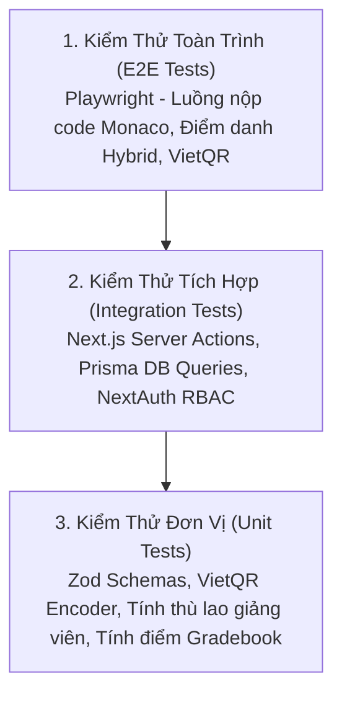

# Kế Hoạch Kiểm Thử & Bộ Test Cases Nghiệp Vụ (QA Strategy & Test Plan)

> **Dự án:** LMS Center Platform (Hệ thống Quản lý Học tập, Giảng viên & Vận hành Đào tạo Đa hình thức)  
> **Tài liệu:** `docs/test-plan.md`  
> **Phiên bản:** 1.0.0  
> **Ngày cập nhật:** 23/09/2026  

---

## 1. Chiến Lược Kiểm Thử (Testing Strategy & Pyramid)

Để đảm bảo toàn bộ hệ thống vận hành mượt mà, không xảy ra sai sót dữ liệu điểm số, tài chính hoặc xung đột quyền truy cập, chiến lược kiểm thử tuân theo mô hình **Testing Pyramid**:



### Tiêu chuẩn chất lượng:
- **Độ bao phủ kiểm thử (Coverage):** $\ge 80\%$ cho các hàm tính toán điểm số, thù lao và phân quyền.
- **Bảo mật:** 100% các endpoint nhạy cảm được quét qua `security_scan.py` không có lỗ hổng IDOR hoặc lộ lọt thông tin.
- **Khả năng tương thích:** Chạy thử nghiệm trên Chrome, Firefox, Safari (Webkit) và Mobile Viewport.

---

## 2. Ma Trận Test Cases Nghiệp Vụ Chi Tiết (Detailed Test Cases)

### Nhóm 1: Bảo Mật & Phân Quyền RBAC (Authentication & Access Control)

| Mã Test Case | Phân hệ | Mô tả kịch bản | Các bước thực hiện | Kết quả mong đợi | Mức độ |
| :--- | :--- | :--- | :--- | :--- | :--- |
| **TC-SEC-01** | RBAC | Học viên cố tình truy cập trang Admin | 1. Đăng nhập bằng tài khoản Student.<br>2. Gõ trực tiếp URL `/admin` hoặc `/admin/teachers`. | Middleware phát hiện sai role, chuyển hướng về `/student` hoặc báo lỗi 403 Forbidden. | **P0 (Blocker)** |
| **TC-SEC-02** | RBAC | Phụ huynh cố tình gọi API chấm điểm | 1. Đăng nhập bằng tài khoản Parent.<br>2. Gửi request POST tới `/api/grading`. | API trả về mã `403 Unauthorized` kèm thông điệp từ chối. | **P0 (Blocker)** |
| **TC-SEC-03** | Auth | Đăng nhập với mật khẩu sai | 1. Nhập email đúng, mật khẩu sai.<br>2. Nhấn Đăng nhập. | Báo lỗi "Email hoặc mật khẩu không chính xác", không tiết lộ email có tồn tại hay không. | **P1** |

---

### Nhóm 2: Giảng Viên, Lịch Dạy & Điểm Danh Hai Chiều (Teacher & Attendance)

| Mã Test Case | Phân hệ | Mô tả kịch bản | Các bước thực hiện | Kết quả mong đợi | Mức độ |
| :--- | :--- | :--- | :--- | :--- | :--- |
| **TC-TEA-01** | Giáo viên | Giảng viên xem lịch dạy cá nhân | 1. Đăng nhập với vai trò Teacher.<br>2. Vào mục Thời khóa biểu `/teacher/schedule`. | Hiển thị đúng các ca dạy của giáo viên trong tuần, không hiển thị ca dạy của giáo viên khác. | **P0** |
| **TC-TEA-02** | Chấm công | Check-in và Check-out ca dạy | 1. Giáo viên nhấn [Check-in] lúc 19:25.<br>2. Giảng dạy đến 21:30 nhấn [Check-out]. | Hệ thống ghi nhận `checkInTime`, `checkOutTime`, tính toán đúng số phút dạy thực tế (125 phút) để tính thù lao. | **P0** |
| **TC-ATT-01** | Điểm danh | Điểm danh lớp Hybrid (Phân loại Offline/Online) | 1. Mở lớp học Hybrid buổi số 5.<br>2. Chọn học viên A: `PRESENT_OFFLINE`.<br>3. Chọn học viên B: `PRESENT_ONLINE`.<br>4. Nhấn Lưu điểm danh. | CSDL lưu chính xác trạng thái của từng học sinh; Phụ huynh của học viên A và B xem đúng trạng thái con mình tham gia tại lớp hay online. | **P0** |
| **TC-ATT-02** | Điểm danh | Cảnh báo học viên vắng học | 1. Điểm danh học viên C vắng buổi thứ 3 liên tiếp.<br>2. Kiểm tra thông báo. | Hệ thống gắn cờ cảnh báo chuyên cần dưới 80% trên Dashboard học viên và phụ huynh. | **P1** |

---

### Nhóm 3: Tài Liệu Khóa Học, Bài Giảng YouTube & BTVN (Materials & YouTube)

| Mã Test Case | Phân hệ | Mô tả kịch bản | Các bước thực hiện | Kết quả mong đợi | Mức độ |
| :--- | :--- | :--- | :--- | :--- | :--- |
| **TC-MAT-01** | Tài liệu | Giáo viên upload slide PDF & code mẫu vào bài học | 1. Vào bài học số 3.<br>2. Đính kèm file `slide.pdf` và `starter.zip`.<br>3. Nhấn Lưu. | Học viên vào bài học thấy danh sách file đính kèm và tải về thành công. | **P1** |
| **TC-MAT-02** | BTVN | Đính kèm dataset mẫu vào bài tập về nhà | 1. Tạo bài tập CNTT.<br>2. Đính kèm file `data-sample.json`.<br>3. Giao bài cho lớp. | Học viên khi mở đề bài tập thấy nút tải file `data-sample.json` để làm bài. | **P1** |
| **TC-YT-01** | YouTube | Phát video bài giảng YouTube và lưu vết tiến độ | 1. Học viên mở bài học có video YouTube.<br>2. Xem video đạt trên 80% thời lượng bài học. | Hệ thống tự động phát sự kiện lưu tiến độ và đánh dấu bài học đã hoàn thành (`isCompleted = true`). | **P1** |

---

### Nhóm 4: Làm Bài Tập Trên Web (Monaco Editor) & Chấm Điểm (Assignments & Grading)

| Mã Test Case | Phân hệ | Mô tả kịch bản | Các bước thực hiện | Kết quả mong đợi | Mức độ |
| :--- | :--- | :--- | :--- | :--- | :--- |
| **TC-ASM-01** | Monaco Editor | Học viên viết code JavaScript/TypeScript và nộp trực tiếp | 1. Mở bài tập lập trình trên web.<br>2. Soạn thảo mã nguồn trên Monaco Editor.<br>3. Nhấn [Nộp bài tập]. | Mã nguồn được lưu trữ toàn vẹn trong CSDL; trạng thái chuyển sang `SUBMITTED`, ghi nhận đúng thời gian nộp. | **P0** |
| **TC-ASM-02** | Monaco Editor | Tự động lưu nháp (Auto-save) khi đang viết code | 1. Học viên đang gõ dở code bài tập.<br>2. Tắt trình duyệt hoặc bấm F5 tải lại trang. | Monaco Editor tự động phục hồi lại đoạn code dở từ `localStorage`, không bị mất bài làm. | **P1** |
| **TC-ASM-03** | Chấm điểm | Giảng viên xem bài nộp code và chấm điểm | 1. Giáo viên mở bài làm của học viên.<br>2. Xem code trên trình xem Monaco.<br>3. Nhập 90 điểm và lời nhận xét chi tiết.<br>4. Nhấn Lưu. | Học viên và phụ huynh lập tức xem được điểm số 90 và nhận xét của thầy cô trên màn hình cá nhân. | **P0** |
| **TC-GRD-01** | Sổ điểm | Tính toán Sổ điểm lớp học (Gradebook) | 1. Giáo viên chấm xong 3 bài tập của cả lớp.<br>2. Mở tab Sổ điểm lớp. | Bảng tổng hợp hiển thị đầy đủ điểm các cột của từng học sinh kèm điểm trung bình chính xác. | **P1** |

---

### Nhóm 5: Thanh Toán Đa Kênh & VietQR Động (Payments & VietQR)

| Mã Test Case | Phân hệ | Mô tả kịch bản | Các bước thực hiện | Kết quả mong đợi | Mức độ |
| :--- | :--- | :--- | :--- | :--- | :--- |
| **TC-PAY-01** | VietQR | Sinh mã VietQR động chuẩn Napas247 | 1. Mở hóa đơn học phí trị giá 3.500.000 đ.<br>2. Nhấn [Thanh toán qua VietQR]. | Ảnh mã QR hiển thị rõ nét; dùng app ngân hàng thật quét mã tự động điền đúng Số tiền `3500000` và Nội dung `HP [MãHV] [MãHĐ]`. | **P0** |
| **TC-PAY-02** | Tiền mặt | Thu ngân xác nhận thu tiền mặt tại quầy | 1. Học viên nộp tiền mặt tại cơ sở.<br>2. Thu ngân bấm [Xác nhận thu tiền mặt]. | Trạng thái hóa đơn chuyển sang `PAID`, lưu vết người thu và xuất file biên lai điện tử PDF hợp lệ. | **P0** |

---

## 3. Lệnh Chạy Bộ Kiểm Thử Tự Động (Automation Execution Commands)

```bash
# 1. Kiểm tra tính hợp lệ của Prisma Schema
npx prisma validate

# 2. Kiểm tra TypeScript Types & Linter
npm run lint
npx tsc --noEmit

# 3. Chạy Unit & Integration Tests (Vitest / Jest)
npm run test

# 4. Quét bảo mật toàn diện bằng công cụ AG Kit
python .agents/skills/vulnerability-scanner/scripts/security_scan.py .

# 5. Kiểm tra cấu trúc Toolkit
python .agents/scripts/validate_kit.py

# 6. Kiểm thử giao diện E2E (Playwright - khi server dev chạy)
npx playwright test
```
