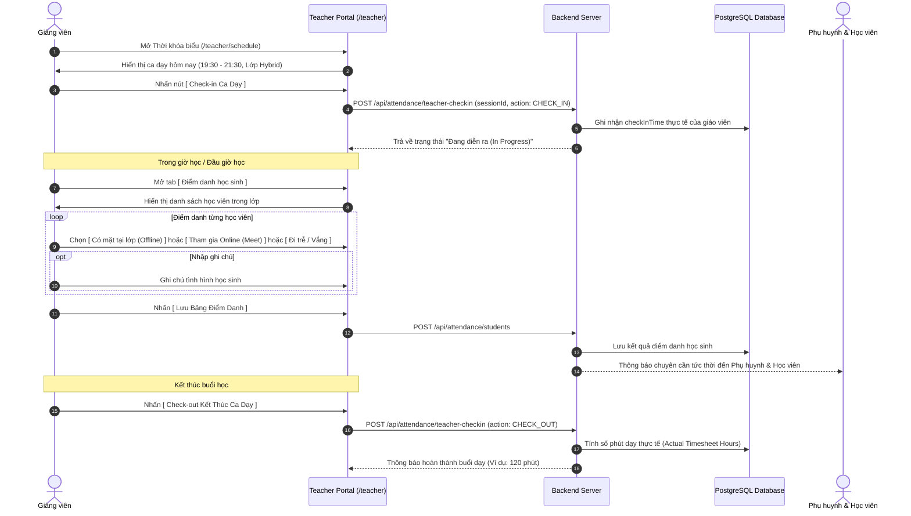
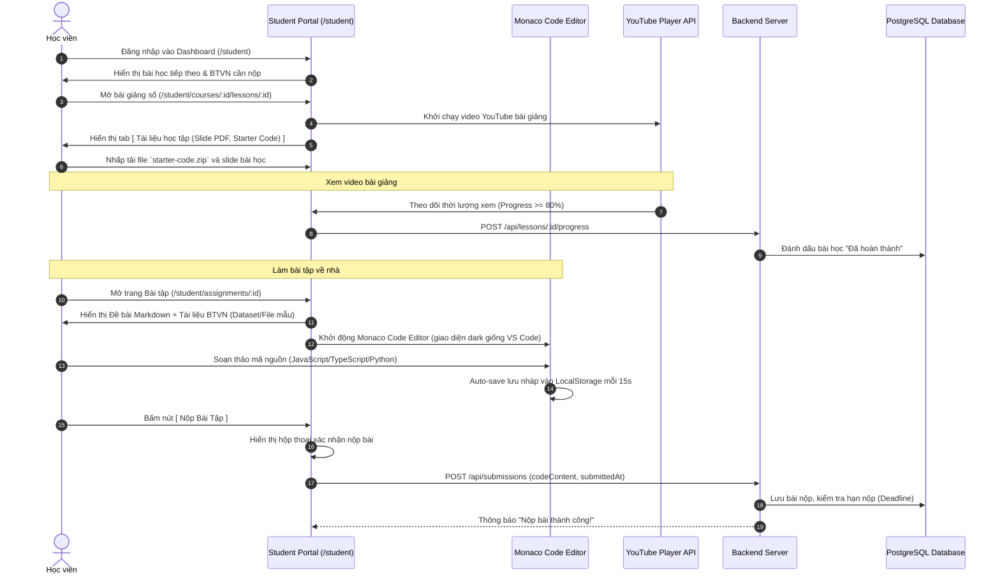
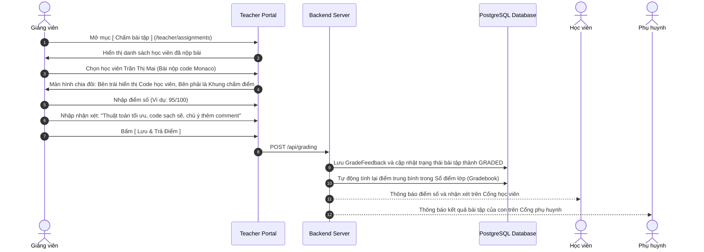
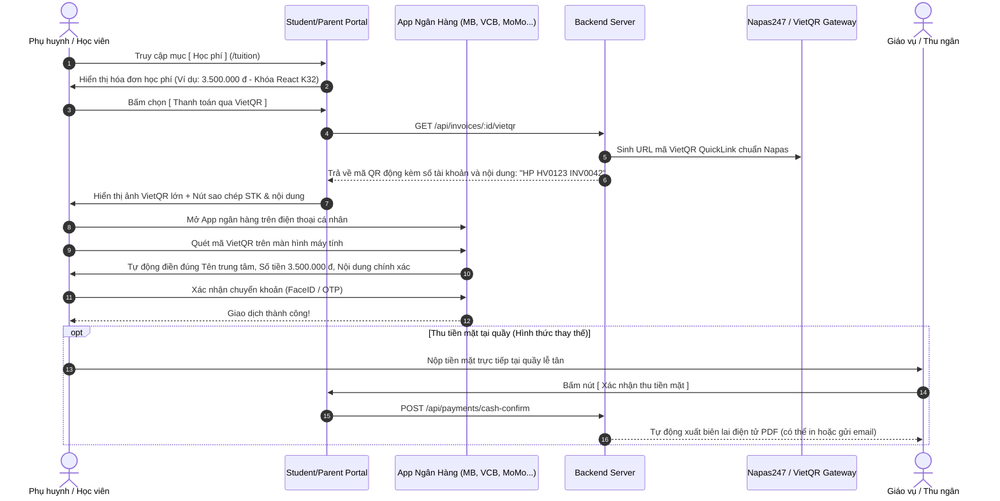
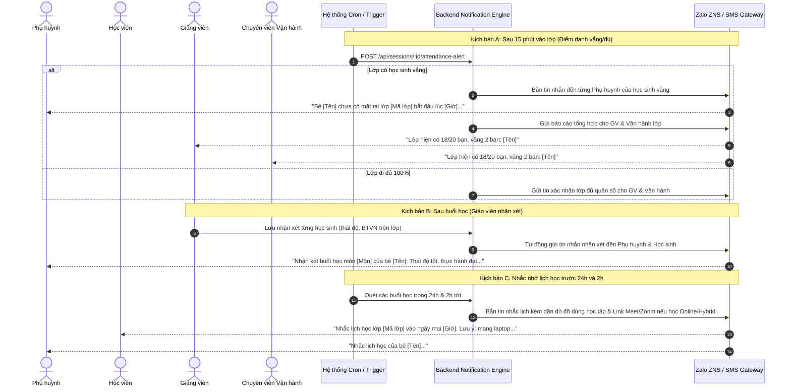
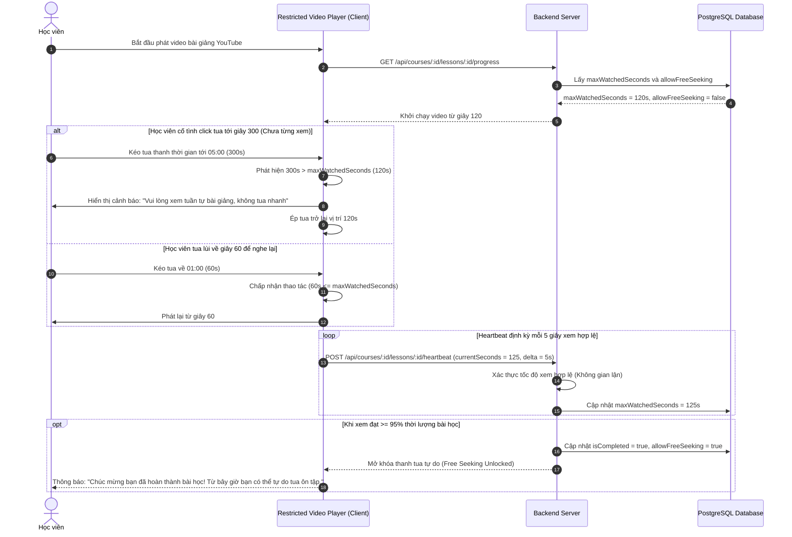
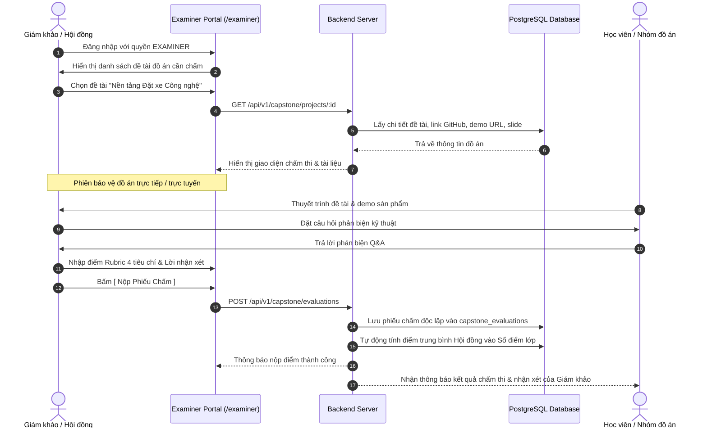
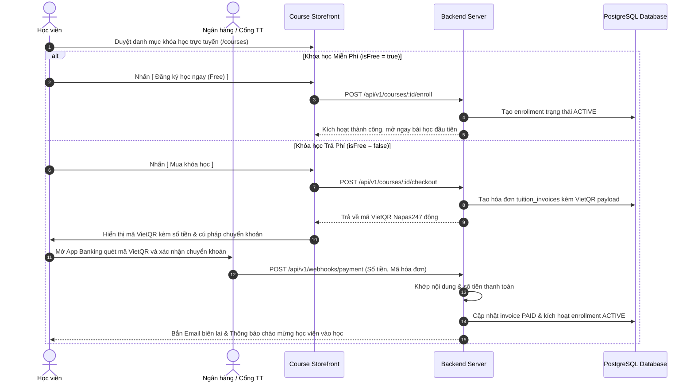

# Sơ Đồ Luồng Thao Tác Người Dùng (User Journeys & Interaction Flows)

> **Dự án:** LMS Center Platform (Hệ thống Quản lý Học tập, Giảng viên & Vận hành Đào tạo Đa hình thức)  
> **Tài liệu:** `docs/user-flows.md`  
> **Phiên bản:** 1.0.0  
> **Ngày cập nhật:** 23/09/2026  

---

## 1. Luồng 1: Giảng Viên Check-In Ca Dạy & Điểm Danh Lớp Hybrid

Luồng thao tác từ lúc giáo viên mở hệ thống chuẩn bị cho buổi dạy, chấm công ca dạy, điểm danh học viên đến khi kết thúc ca.



---

## 2. Luồng 2: Học Viên Học Bài Giảng YouTube & Làm BTVN Trực Tuyến (Monaco Editor)

Luồng thao tác của học viên CNTT khi theo dõi bài giảng, tải tài liệu và thực hành viết code nộp bài trực tiếp trên trình duyệt.



---

## 3. Luồng 3: Giảng Viên Chấm Điểm & Phụ Huynh Nhận Kết Quả

Quy trình giáo viên chấm bài nộp và hệ thống tự động cập nhật sổ điểm, thông báo đến phụ huynh.



---

## 4. Luồng 4: Phụ Huynh & Học Viên Thanh Toán Học Phí Qua Mã VietQR Động

Luồng thanh toán học phí nhanh chóng, tự động điền thông tin và không thể chuyển khoản sai lệch.



---

## 5. Luồng 5: Động Cơ Thông Báo Tự Động (Điểm Danh Sau 15p, Nhận Xét Sau Buổi, Nhắc Lịch Học)



---

## 6. Luồng 6: Trình Phát Video Bài Giảng Chống Tua (Anti-Seeking Video Player Flow)



---

## 7. Bố Cục Giao Diện Màn Hình Trọng Yếu (Key Wireframe Schematics)

### 7.1 Giao diện Học viên làm bài tập CNTT (Monaco Code Workspace)
```
+-----------------------------------------------------------------------------+
| [← Quay lại lớp]  Bài tập 03: Xây dựng Todo List với React 19   [Deadline: 23:59] |
+---------------------------------------+-------------------------------------+
| ĐỀ BÀI & HƯỚNG DẪN (Markdown)        | MONACO CODE EDITOR                  |
| ------------------------------------  | Ngôn ngữ: [ TypeScript v ] [Prettier] |
| Yêu cầu:                              | 1  import React, { useState } from  |
| 1. Tạo component TodoList             | 2  'react';                         |
| 2. Cho phép thêm, xóa, sửa trạng thái | 3                                   |
| 3. Lưu trữ vào localStorage           | 4  export function TodoApp() {      |
|                                       | 5    const [todos, setTodos] = ...  |
| Tài liệu BTVN đính kèm:               | 6    // Viết code của bạn ở đây...   |
| [📄 starter-template.zip (Tải về)]    | 7  }                                |
| [📊 sample-todos.json (Tải về)]       |                                     |
|                                       | +---------------------------------+ |
|                                       | | [💾 Lưu nháp]   [🚀 NỘP BÀI TẬP] | |
|                                       | +---------------------------------+ |
+---------------------------------------+-------------------------------------+
```

### 7.2 Giao diện Giảng viên Điểm danh Lớp Hybrid (Attendance Sheet)
```
+-----------------------------------------------------------------------------+
| Lớp: LMS-FE-K32 (Hybrid) | Buổi 5 (23/09/2026) | [Check-out ca dạy: 21:30]   |
+-----------------------------------------------------------------------------+
| Tìm học viên: [ Tìm kiếm tên / mã... ]         Sĩ số: 18/20 học viên (Vắng: 2) |
| [⚠️ Đã gửi cảnh báo vắng sau 15p tới 2 phụ huynh lúc 19:45]                 |
|                                                                             |
| #  Mã HV      Họ và tên        Trạng thái tham gia          Ghi chú buổi học |
| 1  HV-001     Trần Thị Mai     (•) Offline  ( ) Online      [Thái độ tốt   ] |
|                                ( ) Đi trễ   ( ) Vắng                         |
| 2  HV-002     Lê Hoàng Nam     ( ) Offline  (•) Online      [Học qua Meet  ] |
|                                ( ) Đi trễ   ( ) Vắng                         |
| 3  HV-003     Phạm Minh Đức    ( ) Offline  ( ) Online      [Sốt xin nghỉ  ] |
|                                ( ) Đi trễ   (•) Vắng                         |
+-----------------------------------------------------------------------------+
| [ Tải lại ]                                         [ 💾 LƯU ĐIỂM DANH ]    |
+-----------------------------------------------------------------------------+
```

### 7.3 Giao diện Khóa Học Online Tự Học với Video Chống Tua & Timestamped Q&A
```
+-----------------------------------------------------------------------------+
| [← Danh sách bài học]  Bài 04: Quản lý Global State với Zustand             |
+-------------------------------------------------------+---------------------+
| TRÌNH PHÁT VIDEO BÀI GIẢNG YOUTUBE (CHỐNG TUA)        | HỎI ĐÁP & GHI CHÚ   |
| ----------------------------------------------------- | ------------------- |
| +---------------------------------------------------+ | [❓ Thảo luận] [📝] |
| |                                                   | |                     |
| |              [ Video YouTube Embed ]              | | [02:15] Nam:        |
| |                                                   | | Store này có lưu    |
| |                                                   | | localStorage k ạ?   |
| +---------------------------------------------------+ |  ↳ [GV Trả lời] ✅  |
| [▶ Play] 02:15 / 15:40 [🔒 Đã xem: 02:15 - Cấm tua]   | Có em, dùng persist |
| [======•--------------------------------------------] |                     |
| (• Đang khóa tua tiến | Chỉ được tua lùi hoặc nghe lại) | +-----------------+ |
|                                                       | | Nhập câu hỏi... | |
| [📄 Tải Slide PDF]   [💻 Tải Code Mẫu]   [✅ Hoàn thành] | +-----------------+ |
+-------------------------------------------------------+---------------------+
```

### 7.4 Giao diện Cổng Chấm Thi Giám Khảo Đồ Án Tốt Nghiệp (Capstone Jury Defense Portal)
```
+-----------------------------------------------------------------------------+
| HỘI ĐỒNG CHẤM ĐỒ ÁN TỐT NGHIỆP | Lớp: LMS-FE-K32 | Giám khảo: TS. Lê Văn Tuấn |
+-----------------------------------------------------------------------------+
| Đề tài: Nền tảng Đặt xe Công nghệ Real-time (Nhóm 02: 3 thành viên)          |
| Tài liệu: [🔗 GitHub Repo] [🌐 Live Demo] [📊 Slide PDF] [🎥 Video Demo]     |
| --------------------------------------------------------------------------- |
| PHIẾU ĐÁNH GIÁ RUBRIC CỦA GIÁM KHẢO:                                        |
| 1. Mức độ hoàn thiện sản phẩm & Chức năng (30%):    [ 90 / 100 ]            |
| 2. Kiến trúc mã nguồn, Code Quality & Clean Code (25%): [ 85 / 100 ]         |
| 3. Kỹ năng thuyết trình & Trả lời phản biện Q&A (25%):  [ 95 / 100 ]         |
| 4. Tính sáng tạo, Đột phá & Khả năng ứng dụng (20%):   [ 80 / 100 ]         |
| --------------------------------------------------------------------------- |
| => ĐIỂM TỔNG HỢP: 88.0 / 100  [✅ ĐẠT YÊU CẦU TỐT NGHIỆP]                   |
|                                                                             |
| Nhận xét chuyên môn & Góp ý định hướng:                                     |
| +-------------------------------------------------------------------------+ |
| | Kiến trúc WebSocket thời gian thực hoạt động tốt. Cần tối ưu lại index  | |
| | PostgreSQL để chịu tải cao hơn. Nhóm phản biện rất tự tin và sắc bén.   | |
| +-------------------------------------------------------------------------+ |
|                                                    [ 💾 NỘP PHIẾU CHẤM ]    |
+-----------------------------------------------------------------------------+
```

---

## 8. Luồng 7: Giám Khảo Chấm Điểm Đồ Án Tốt Nghiệp & Phản Biện (Capstone Defense)



---

## 9. Luồng 8: Mua Trực Tiếp Khóa Học Trực Tuyến & Thanh Toán VietQR Tự Động Kích Hoạt



