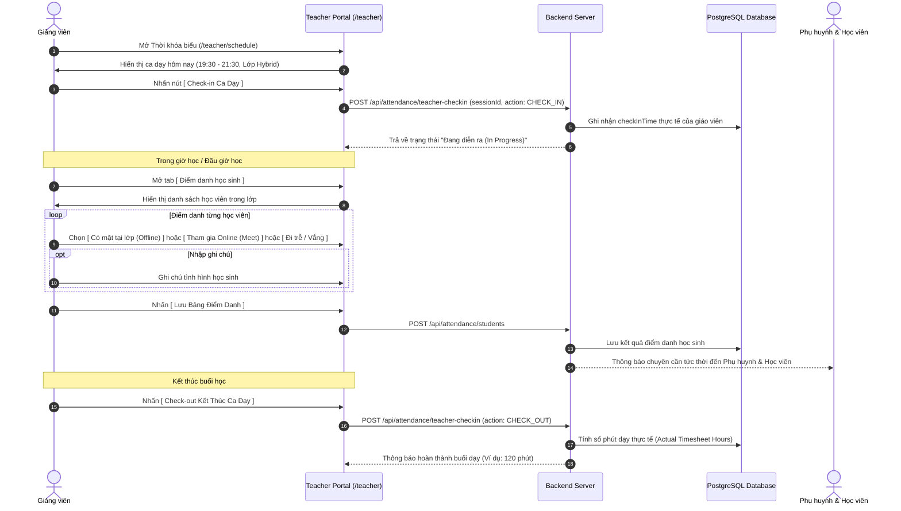
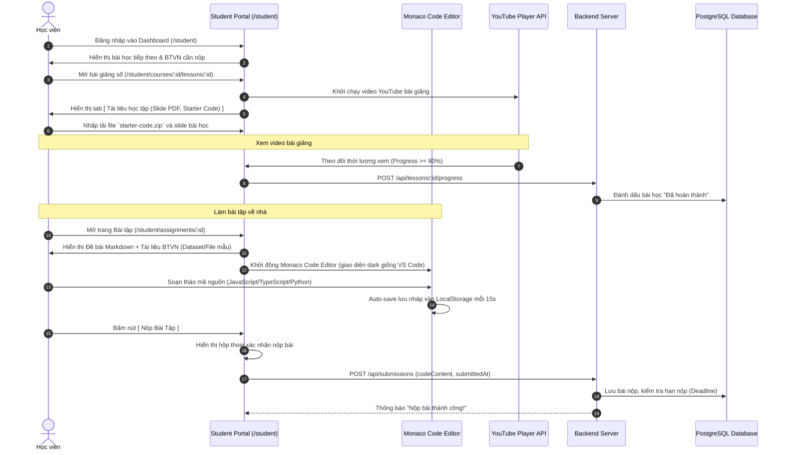
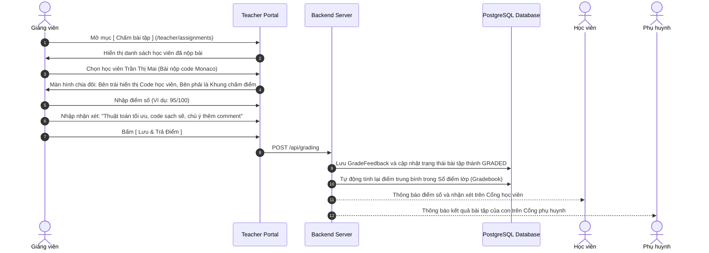
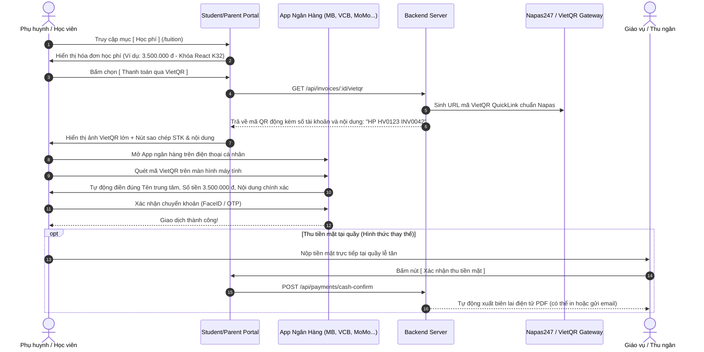

# Sơ Đồ Luồng Thao Tác Người Dùng (User Journeys & Interaction Flows)

> **Dự án:** LMS Center Platform (Hệ thống Quản lý Học tập, Giảng viên & Vận hành Đào tạo Đa hình thức)  
> **Tài liệu:** `docs/user-flows.md`  
> **Phiên bản:** 1.0.0  
> **Ngày cập nhật:** 23/09/2026  

---

## 1. Luồng 1: Giảng Viên Check-In Ca Dạy & Điểm Danh Lớp Hybrid

Luồng thao tác từ lúc giáo viên mở hệ thống chuẩn bị cho buổi dạy, chấm công ca dạy, điểm danh học viên đến khi kết thúc ca.



---

## 2. Luồng 2: Học Viên Học Bài Giảng YouTube & Làm BTVN Trực Tuyến (Monaco Editor)

Luồng thao tác của học viên CNTT khi theo dõi bài giảng, tải tài liệu và thực hành viết code nộp bài trực tiếp trên trình duyệt.



---

## 3. Luồng 3: Giảng Viên Chấm Điểm & Phụ Huynh Nhận Kết Quả

Quy trình giáo viên chấm bài nộp và hệ thống tự động cập nhật sổ điểm, thông báo đến phụ huynh.



---

## 4. Luồng 4: Phụ Huynh & Học Viên Thanh Toán Học Phí Qua Mã VietQR Động

Luồng thanh toán học phí nhanh chóng, tự động điền thông tin và không thể chuyển khoản sai lệch.



---

## 5. Bố Cục Giao Diện Màn Hình Trọng Yếu (Key Wireframe Schematics)

### 5.1 Giao diện Học viên làm bài tập CNTT (Monaco Code Workspace)
```
+-----------------------------------------------------------------------------+
| [← Quay lại lớp]  Bài tập 03: Xây dựng Todo List với React 19   [Deadline: 23:59] |
+---------------------------------------+-------------------------------------+
| ĐỀ BÀI & HƯỚNG DẪN (Markdown)        | MONACO CODE EDITOR                  |
| ------------------------------------  | Ngôn ngữ: [ TypeScript v ] [Prettier] |
| Yêu cầu:                              | 1  import React, { useState } from  |
| 1. Tạo component TodoList             | 2  'react';                         |
| 2. Cho phép thêm, xóa, sửa trạng thái | 3                                   |
| 3. Lưu trữ vào localStorage           | 4  export function TodoApp() {      |
|                                       | 5    const [todos, setTodos] = ...  |
| Tài liệu BTVN đính kèm:               | 6    // Viết code của bạn ở đây...   |
| [📄 starter-template.zip (Tải về)]    | 7  }                                |
| [📊 sample-todos.json (Tải về)]       |                                     |
|                                       | +---------------------------------+ |
|                                       | | [💾 Lưu nháp]   [🚀 NỘP BÀI TẬP] | |
+---------------------------------------+-------------------------------------+
```

### 5.2 Giao diện Giảng viên Điểm danh Lớp Hybrid (Attendance Sheet)
```
+-----------------------------------------------------------------------------+
| Lớp: LMS-FE-K32 (Hybrid) | Buổi 5 (23/09/2026) | [Check-out ca dạy: 21:30]   |
+-----------------------------------------------------------------------------+
| Tìm học viên: [ Tìm kiếm tên / mã... ]         Sĩ số: 18 học viên           |
|                                                                             |
| #  Mã HV      Họ và tên        Trạng thái tham gia          Ghi chú buổi học |
| 1  HV-001     Trần Thị Mai     (•) Offline  ( ) Online      [..............] |
|                                ( ) Đi trễ   ( ) Vắng                         |
| 2  HV-002     Lê Hoàng Nam     ( ) Offline  (•) Online      [Học qua Meet  ] |
|                                ( ) Đi trễ   ( ) Vắng                         |
| 3  HV-003     Phạm Minh Đức    ( ) Offline  ( ) Online      [Xin phép trễ  ] |
|                                (•) Đi trễ (15p) ( ) Vắng                     |
+-----------------------------------------------------------------------------+
| [ Tải lại ]                                         [ 💾 LƯU ĐIỂM DANH ]    |
+-----------------------------------------------------------------------------+
```
