# Sơ Đồ Luồng Thao Tác Người Dùng (User Journeys & Interaction Flows)

> **Dự án:** LMS Center Platform (Hệ thống Quản lý Học tập, Giảng viên & Vận hành Đào tạo Đa hình thức)  
> **Tài liệu:** `docs/user-flows.md`  
> **Phiên bản:** 1.0.0  
> **Ngày cập nhật:** 23/09/2026  

---

## 1. Luồng 1: Giảng Viên Check-In Ca Dạy & Điểm Danh Lớp Hybrid

Luồng thao tác từ lúc giáo viên mở hệ thống chuẩn bị cho buổi dạy, chấm công ca dạy, điểm danh học viên đến khi kết thúc ca.

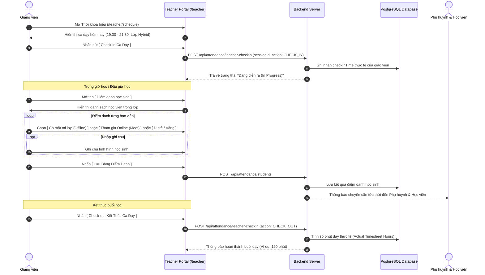

---

## 2. Luồng 2: Học Viên Học Bài Giảng YouTube & Làm BTVN Trực Tuyến (Monaco Editor)

Luồng thao tác của học viên CNTT khi theo dõi bài giảng, tải tài liệu và thực hành viết code nộp bài trực tiếp trên trình duyệt.

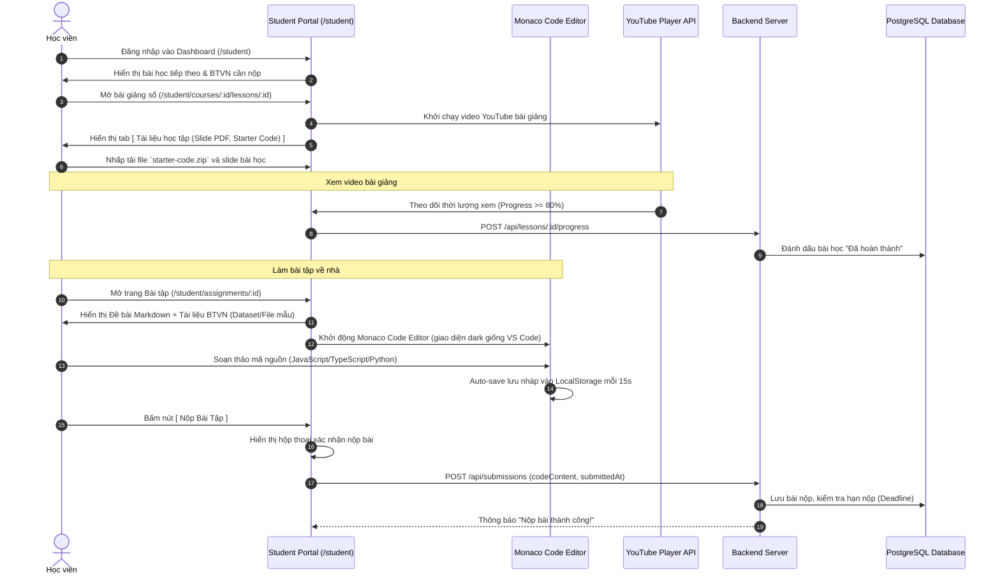

---

## 3. Luồng 3: Giảng Viên Chấm Điểm & Phụ Huynh Nhận Kết Quả

Quy trình giáo viên chấm bài nộp và hệ thống tự động cập nhật sổ điểm, thông báo đến phụ huynh.

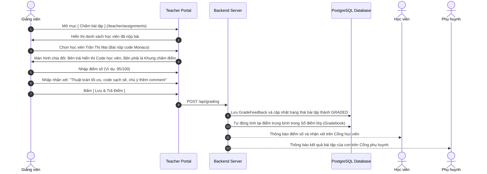

---

## 4. Luồng 4: Phụ Huynh & Học Viên Thanh Toán Học Phí Qua Mã VietQR Động

Luồng thanh toán học phí nhanh chóng, tự động điền thông tin và không thể chuyển khoản sai lệch.

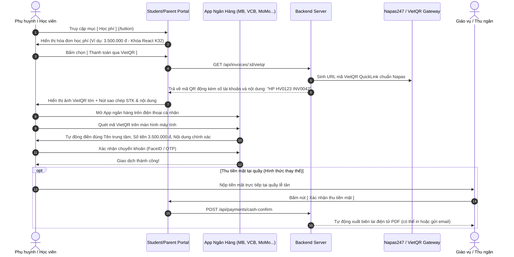

---

## 5. Luồng 5: Động Cơ Thông Báo Tự Động (Điểm Danh Sau 15p, Nhận Xét Sau Buổi, Nhắc Lịch Học)

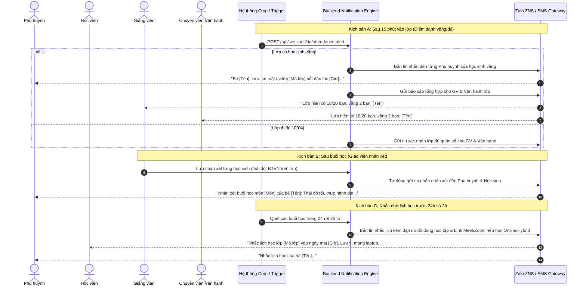

---

## 6. Luồng 6: Trình Phát Video Bài Giảng Chống Tua (Anti-Seeking Video Player Flow)

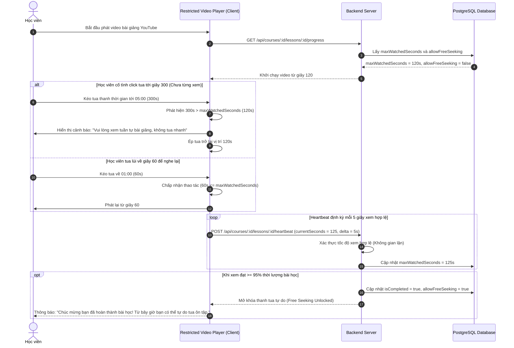

---

## 7. Bố Cục Giao Diện Màn Hình Trọng Yếu (Key Wireframe Schematics)

### 7.1 Giao diện Học viên làm bài tập CNTT (Monaco Code Workspace)
```
+-----------------------------------------------------------------------------+
| [← Quay lại lớp]  Bài tập 03: Xây dựng Todo List với React 19   [Deadline: 23:59] |
+---------------------------------------+-------------------------------------+
| ĐỀ BÀI & HƯỚNG DẪN (Markdown)        | MONACO CODE EDITOR                  |
| ------------------------------------  | Ngôn ngữ: [ TypeScript v ] [Prettier] |
| Yêu cầu:                              | 1  import React, { useState } from  |
| 1. Tạo component TodoList             | 2  'react';                         |
| 2. Cho phép thêm, xóa, sửa trạng thái | 3                                   |
| 3. Lưu trữ vào localStorage           | 4  export function TodoApp() {      |
|                                       | 5    const [todos, setTodos] = ...  |
| Tài liệu BTVN đính kèm:               | 6    // Viết code của bạn ở đây...   |
| [📄 starter-template.zip (Tải về)]    | 7  }                                |
| [📊 sample-todos.json (Tải về)]       |                                     |
|                                       | +---------------------------------+ |
|                                       | | [💾 Lưu nháp]   [🚀 NỘP BÀI TẬP] | |
|                                       | +---------------------------------+ |
+---------------------------------------+-------------------------------------+
```

### 7.2 Giao diện Giảng viên Điểm danh Lớp Hybrid (Attendance Sheet)
```
+-----------------------------------------------------------------------------+
| Lớp: LMS-FE-K32 (Hybrid) | Buổi 5 (23/09/2026) | [Check-out ca dạy: 21:30]   |
+-----------------------------------------------------------------------------+
| Tìm học viên: [ Tìm kiếm tên / mã... ]         Sĩ số: 18/20 học viên (Vắng: 2) |
| [⚠️ Đã gửi cảnh báo vắng sau 15p tới 2 phụ huynh lúc 19:45]                 |
|                                                                             |
| #  Mã HV      Họ và tên        Trạng thái tham gia          Ghi chú buổi học |
| 1  HV-001     Trần Thị Mai     (•) Offline  ( ) Online      [Thái độ tốt   ] |
|                                ( ) Đi trễ   ( ) Vắng                         |
| 2  HV-002     Lê Hoàng Nam     ( ) Offline  (•) Online      [Học qua Meet  ] |
|                                ( ) Đi trễ   ( ) Vắng                         |
| 3  HV-003     Phạm Minh Đức    ( ) Offline  ( ) Online      [Sốt xin nghỉ  ] |
|                                ( ) Đi trễ   (•) Vắng                         |
+-----------------------------------------------------------------------------+
| [ Tải lại ]                                         [ 💾 LƯU ĐIỂM DANH ]    |
+-----------------------------------------------------------------------------+
```

### 7.3 Giao diện Khóa Học Online Tự Học với Video Chống Tua & Timestamped Q&A
```
+-----------------------------------------------------------------------------+
| [← Danh sách bài học]  Bài 04: Quản lý Global State với Zustand             |
+-------------------------------------------------------+---------------------+
| TRÌNH PHÁT VIDEO BÀI GIẢNG YOUTUBE (CHỐNG TUA)        | HỎI ĐÁP & GHI CHÚ   |
| ----------------------------------------------------- | ------------------- |
| +---------------------------------------------------+ | [❓ Thảo luận] [📝] |
| |                                                   | |                     |
| |              [ Video YouTube Embed ]              | | [02:15] Nam:        |
| |                                                   | | Store này có lưu    |
| |                                                   | | localStorage k ạ?   |
| +---------------------------------------------------+ |  ↳ [GV Trả lời] ✅  |
| [▶ Play] 02:15 / 15:40 [🔒 Đã xem: 02:15 - Cấm tua]   | Có em, dùng persist |
| [======•--------------------------------------------] |                     |
| (• Đang khóa tua tiến | Chỉ được tua lùi hoặc nghe lại) | +-----------------+ |
|                                                       | | Nhập câu hỏi... | |
| [📄 Tải Slide PDF]   [💻 Tải Code Mẫu]   [✅ Hoàn thành] | +-----------------+ |
+-------------------------------------------------------+---------------------+
```

### 7.4 Giao diện Cổng Chấm Thi Giám Khảo Đồ Án Tốt Nghiệp (Capstone Jury Defense Portal)
```
+-----------------------------------------------------------------------------+
| HỘI ĐỒNG CHẤM ĐỒ ÁN TỐT NGHIỆP | Lớp: LMS-FE-K32 | Giám khảo: TS. Lê Văn Tuấn |
+-----------------------------------------------------------------------------+
| Đề tài: Nền tảng Đặt xe Công nghệ Real-time (Nhóm 02: 3 thành viên)          |
| Tài liệu: [🔗 GitHub Repo] [🌐 Live Demo] [📊 Slide PDF] [🎥 Video Demo]     |
| --------------------------------------------------------------------------- |
| PHIẾU ĐÁNH GIÁ RUBRIC CỦA GIÁM KHẢO:                                        |
| 1. Mức độ hoàn thiện sản phẩm & Chức năng (30%):    [ 90 / 100 ]            |
| 2. Kiến trúc mã nguồn, Code Quality & Clean Code (25%): [ 85 / 100 ]         |
| 3. Kỹ năng thuyết trình & Trả lời phản biện Q&A (25%):  [ 95 / 100 ]         |
| 4. Tính sáng tạo, Đột phá & Khả năng ứng dụng (20%):   [ 80 / 100 ]         |
| --------------------------------------------------------------------------- |
| => ĐIỂM TỔNG HỢP: 88.0 / 100  [✅ ĐẠT YÊU CẦU TỐT NGHIỆP]                   |
|                                                                             |
| Nhận xét chuyên môn & Góp ý định hướng:                                     |
| +-------------------------------------------------------------------------+ |
| | Kiến trúc WebSocket thời gian thực hoạt động tốt. Cần tối ưu lại index  | |
| | PostgreSQL để chịu tải cao hơn. Nhóm phản biện rất tự tin và sắc bén.   | |
| +-------------------------------------------------------------------------+ |
|                                                    [ 💾 NỘP PHIẾU CHẤM ]    |
+-----------------------------------------------------------------------------+
```

### 7.5 Giao diện Chấm Bài Tập Về Nhà Theo Lớp Học (Class Assignment & Monaco Code Grading Portal)
```
+-----------------------------------------------------------------------------+
| LỚP: LMS-FE-K32 > BÀI TẬP: BTVN-03: Xây dựng REST API với Go-chi            |
| Hạn nộp: 23:59 20/10/2026 | Đã nộp: 22/25 | Đã chấm: 18/22                 |
+-------------------------------------------------------+---------------------+
| DANH SÁCH BÀI LÀM HỌC VIÊN CỦA LỚP                    | TRÌNH XEM CODE &    |
| 1. Trần Minh Hoàng  [Đã chấm: 95đ] [Xem code]         | PHIẾU CHẤM ĐIỂM     |
| 2. Lê Hoàng Nam     [Chưa chấm]    [Đang chọn >]      | ------------------- |
| 3. Phạm Minh Đức    [Chưa nộp]     [Nhắc nộp]         | Học viên: Lê Hoàng Nam|
| ----------------------------------------------------- | GitHub: /nam/hw-03  |
| TRÌNH XEM CODE MONACO (Read-only + Diff View):        | ------------------- |
| package handler                                       | ĐIỂM SỐ (Thang 100):|
| func (h *UserHandler) GetProfile(w http.ResponseWriter)| [ 90       ] / 100  |
|     // Validate token                                 | ------------------- |
|     userID := auth.GetUserID(r.Context())             | Nhận xét giáo viên: |
|     user, err := h.useCase.FindByID(r.Context(), userID)| +-----------------+ |
|     if err != nil {                                   | | Xử lý context rất | |
|         response.NotFound(w, "NOT_FOUND", err.Error())| | chuẩn. Cần thêm   | |
|         return                                        | | unit test cho err.| |
|     }                                                 | +-----------------+ |
|     response.OK(w, user, "Success")                   | [🎙 Ghi âm dặn dò]  |
| }                                                     | [ 💾 LƯU ĐIỂM VÀO ] |
|                                                       | [   GRADEBOOK LỚP ] |
+-------------------------------------------------------+---------------------+
```

### 7.6 Giao diện Bảng Lương Giáo Viên & Bậc Lương Hàng Tháng (Admin Teacher Payroll Management)
```
+-----------------------------------------------------------------------------+
| QUẢN LÝ BẢNG LƯƠNG GIÁO VIÊN | Kỳ lương: [ Tháng 10/2026 ▼ ] | Trạng thái: [ Tất cả ▼ ]
| Tổng ngân sách: 158.400.000 đ | Số GV: 18 | Đã duyệt: 14 | Chờ duyệt: 4     |
| [ ⚡ TỰ ĐỘNG TỔNG HỢP LƯƠNG THÁNG ] [ ⚙️ Cấu hình Bậc Lương ] [ 📥 Xuất Excel ]
+-----------------------------------------------------------------------------+
| GV / Bậc Lương      | Giờ Dạy | Lương Giờ | Thưởng KPI | Phạt Muộn | Thực Lĩnh   | Trạng thái | Thao tác
| --------------------+---------+-----------+------------+-----------+-------------+------------+---------
| ThS. Nguyễn Văn Tuấn| 42.5 h  | 350.000 đ | +2.231.250 | -100.000  | 17.006.250 đ| [Chờ duyệt]| [Duyệt] [Chi tiết]
| (Bậc: Senior)       |         |           | (⭐ 4.85/5) | (20 phút) |             |            |
| KS. Đặng Hồng Sơn   | 36.0 h  | 250.000 đ | +900.000   |        0  |  9.900.000 đ| [Đã duyệt] | [Chi tiết]
| (Bậc: Standard)     |         |           | (⭐ 4.60/5) | (0 phút)  |             |            |
| Lê Thu Hà (TA)      | 28.0 h  | 120.000 đ |          0 |  -50.000  |  3.310.000 đ| [Chờ duyệt]| [Duyệt] [Chi tiết]
| (Bậc: Intern/TA)    |         |           | (⭐ 4.20/5) | (10 phút) |             |            |
+-----------------------------------------------------------------------------+
| [✓ Duyệt hàng loạt đã chọn]                       [ 💳 KẾT XUẤT LỆNH CHI TRẢ ]|
+-----------------------------------------------------------------------------+
```

---

## 8. Luồng 7: Giám Khảo Chấm Điểm Đồ Án Tốt Nghiệp & Phản Biện (Capstone Defense)

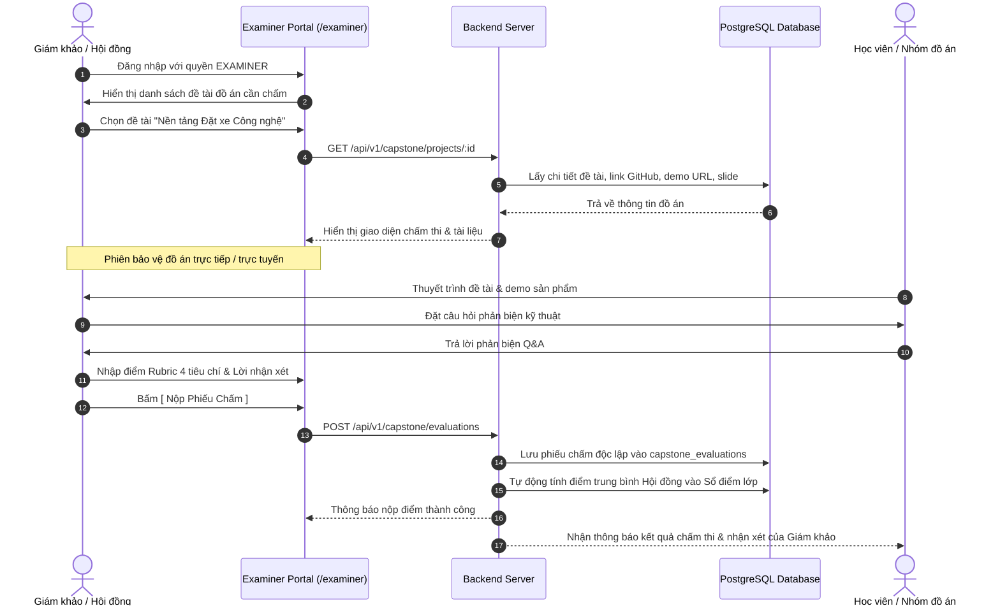

---

## 9. Luồng 8: Mua Trực Tiếp Khóa Học Trực Tuyến & Thanh Toán VietQR Tự Động Kích Hoạt

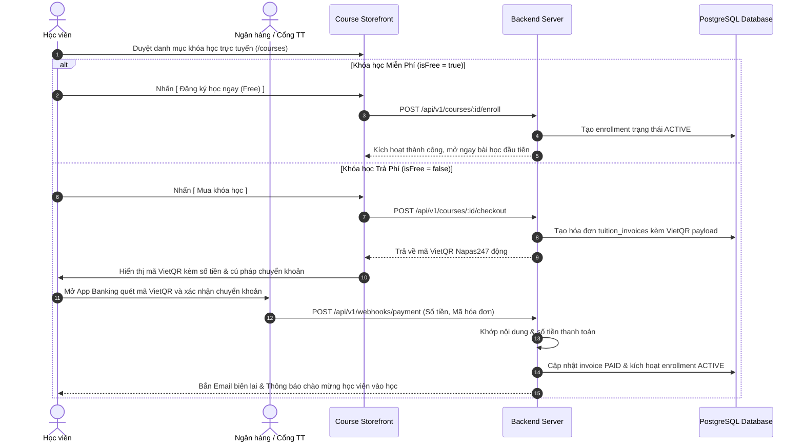

---

## 10. Luồng 9: Giáo Viên Quản Lý & Chấm Bài Tập Về Nhà Theo Lớp (Class Assignment Grading Portal)

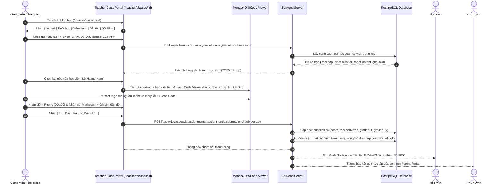

---

## 11. Luồng 10: Áp Mã Khuyến Mãi (Discount / Coupon) Khi Mua Khóa Học & Sinh VietQR

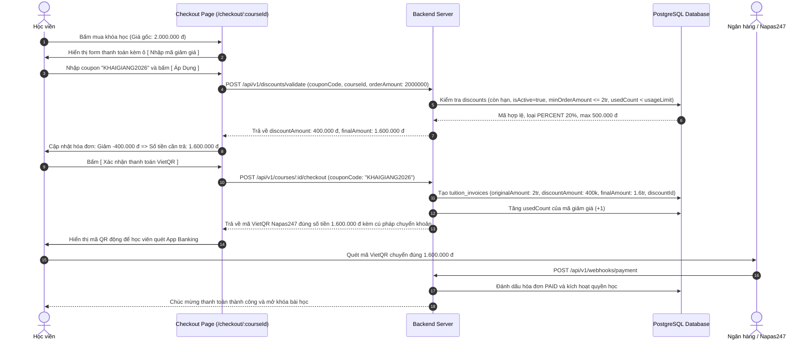

---

## 12. Luồng 11: Admin Tổng Hợp & Phê Duyệt Bảng Lương Giáo Viên Hàng Tháng (Teacher Monthly Payroll)

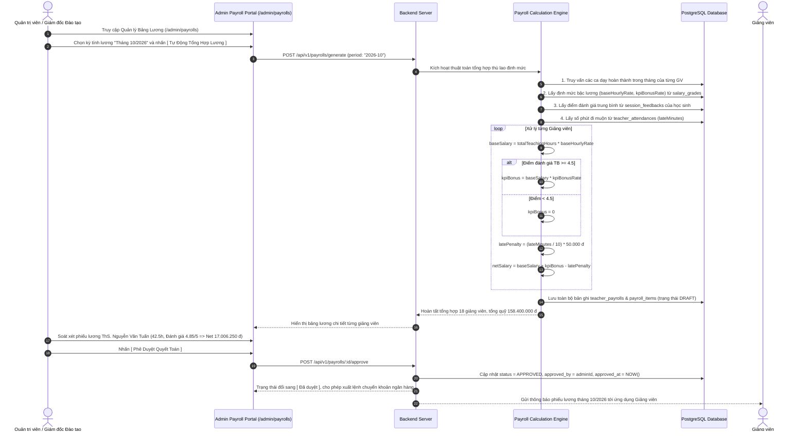

---

## 13. Luồng 12: Điều Phối Viên Lên Lịch Học Bù Cho Học Sinh Vắng (Make-up Class Scheduling)

```mermaid
sequenceDiagram
    autonumber
    actor Coord as Chuyên viên Vận hành / CSKH
    participant UI as Operations Portal (/operations/makeup)
    participant API as Backend Server
    participant DB as PostgreSQL Database
    actor Student as Học viên & Phụ huynh
    actor Teacher as Giáo viên / Trợ giảng kèm bù

    Note over Coord, DB: Sau buổi học, hệ thống phát hiện học sinh vắng
    Coord ->> UI: Mở tab [ Quản lý Học Bù ], thấy học viên "Nguyễn Hoàng Nam" vắng Buổi 4 lớp FE-K32
    Coord ->> UI: Bấm nút [ Lên lịch học bù ]
    UI ->> API: GET /api/v1/classes/parallel-topics?lessonId=...
    API ->> DB: Tìm các lớp song song cùng dạy bài "Goroutines & Channels" trong 7 ngày tới
    DB -->> API: Lớp FE-K33 học tối thứ Năm (19:30 - 21:30, phòng LAB-202, còn 3 chỗ)
    API -->> UI: Trả về danh sách gợi ý (Ghép lớp FE-K33 hoặc Kèm 1-1 với TA)

    Coord ->> UI: Chọn phương án [ Ghép lớp song song FE-K33 ], nhập ghi chú dặn dò
    Coord ->> UI: Bấm [ Lưu & Gửi thông báo học bù ]
    UI ->> API: POST /api/v1/makeup-sessions
    API ->> DB: Tạo bản ghi makeup_sessions (status: SCHEDULED, makeupType: PARALLEL_CLASS)
    API -->> Student: Gửi tin nhắn Zalo/Push: "Lịch học bù Buổi 4 vào 19:30 Thứ 5 tại Phòng LAB-202"
    API -->> UI: Thông báo đặt lịch học bù thành công

    Note over Teacher, DB: Đến buổi học bù tại lớp FE-K33
    Teacher ->> UI: Mở danh sách điểm danh lớp FE-K33 (có thêm Nam - diện Học bù)
    Teacher ->> UI: Tích chọn [ Nam: Đã tham gia học bù ] và nhập nhận xét
    UI ->> API: PUT /api/v1/makeup-sessions/:id/attend
    API ->> DB: Cập nhật status = ATTENDED; đồng bộ chuyên cần buổi 4 của Nam sang "ĐÃ HỌC BÙ"
    API -->> Student: Thông báo xác nhận hoàn thành buổi học bù thành công
```

---

## 14. Luồng 13: Xếp Lịch Phòng Học & Cảnh Báo Trùng Phòng Tự Động (Room Conflict Guard)

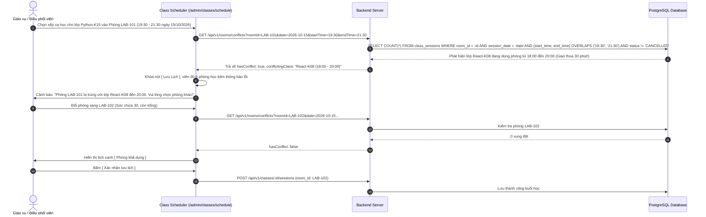

---

## 15. Luồng 14: Sinh Đề Thi Trắc Nghiệm Tự Động & Chấm Điểm Khảo Thí (Question Bank & Quiz)

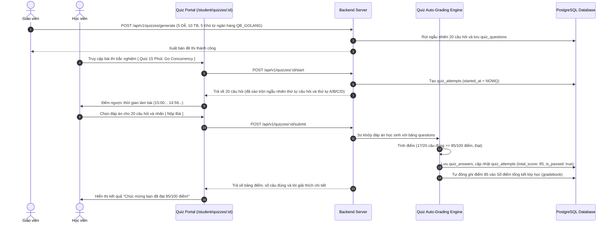

---

## 16. Luồng 15: Giám Sát Radar Nguy Cơ Bỏ Học & Chăm Sóc Học Viên (Student Churn Risk Radar)

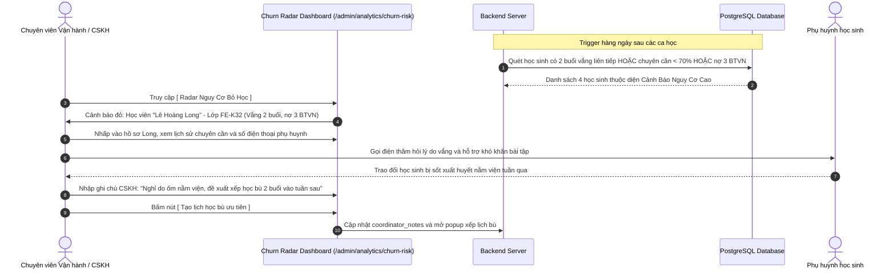

---

## 17. Thiết Kế Giao Diện Trực Quan (ASCII Wireframes)

### Wireframe 1: Giao diện Xếp Lịch Học Bù & Ghép Lớp Song Song (`/operations/makeup`)

```text
+---------------------------------------------------------------------------------------+
|  LMS CENTER - ĐIỀU PHỐI HỌC BÙ CHO HỌC SINH VẮNG                        [ Admin/Coord ]|
+---------------------------------------------------------------------------------------+
|  [!] CẢNH BÁO: Có 3 học viên vắng buổi học chưa được xếp học bù!                      |
|                                                                                       |
|  DANH SÁCH HỌC VIÊN CẦN HỌC BÙ:                                                       |
|  +--------------------+----------+-------------+----------------+------------------+  |
|  | Học Viên           | Lớp Gốc  | Buổi Vắng   | Chủ Đề Bài Học | Hành Động        |  |
|  +--------------------+----------+-------------+----------------+------------------+  |
|  | Nguyễn Hoàng Nam   | FE-K32   | Buổi 4 (T2) | Goroutines & Ch| [ Xếp Lịch Bù ]  |  |
|  | Trần Thảo Linh     | PY-K14   | Buổi 2 (T3) | Pandas & NumPy | [ Xếp Lịch Bù ]  |  |
|  +--------------------+----------+-------------+----------------+------------------+  |
|                                                                                       |
|  POPUP XẾP LỊCH HỌC BÙ: Nguyễn Hoàng Nam (FE-K32 - Buổi 4)                            |
|  +---------------------------------------------------------------------------------+  |
|  | Phương thức học bù:                                                             |  |
|  |  (o) Ghép Lớp Song Song (Được đề xuất)        ( ) Kèm 1-1 với Trợ Giảng/GV      |  |
|  |                                                                                 |  |
|  | Chọn lớp học song song có cùng chủ đề:                                          |  |
|  |  [ FE-K33 - Buổi 4: Goroutines (Thứ 5 19:30 - Phòng LAB-202 - Còn 3 chỗ)      v] |  |
|  |                                                                                 |  |
|  | Thời gian: 19:30 - 21:30, Ngày 18/10/2026                                       |  |
|  | Giảng viên lớp ghép: ThS. Vũ Hải Đăng                                           |  |
|  | Ghi chú CSKH: [Học viên thi giữa kỳ ở trường ĐH, xếp học bù tối T5           ]   |  |
|  |                                                                                 |  |
|  | [x] Tự động gửi tin nhắn Zalo/SMS xác nhận lịch cho Học viên & Phụ huynh        |  |
|  |                                                                                 |  |
|  |                       [ Hủy Bỏ ]    [ XÁC NHẬN LÊN LỊCH BÙ ]                    |  |
|  +---------------------------------------------------------------------------------+  |
+---------------------------------------------------------------------------------------+
```

### Wireframe 2: Bản Đồ Xếp Phòng Học & Cảnh Báo Trùng Phòng (`/admin/classes/schedule`)

```text
+---------------------------------------------------------------------------------------+
|  LMS CENTER - THỜI KHÓA BIỂU & XẾP PHÒNG HỌC (CAMPUS CẦU GIẤY)                        |
+---------------------------------------------------------------------------------------+
|  Ngày: [ 15/10/2026 ]  |  Cơ sở: [ Cơ sở Cầu Giấy v ]  |  Ca: [ Ca Tối: 19:30-21:30 v]|
|                                                                                       |
|  SƠ ĐỒ TRẠNG THÁI PHÒNG HỌC:                                                          |
|  +----------------------+----------------------+----------------------+               |
|  | LAB-101 (25 máy)     | LAB-102 (30 máy)     | TH-201 (Lý Thuyết)   |               |
|  | [X] ĐÃ CÓ LỚP        | [V] CÒN TRỐNG        | [X] ĐÃ CÓ LỚP        |               |
|  | Lớp: React-K08       | Sẵn sàng xếp lớp!    | Lớp: IELTS-K92       |               |
|  | GV: Hoàng Nam        |                      | GV: Ms. Linda        |               |
|  | 18:00 - 20:00 (Trùng!)|                      | 19:00 - 21:00        |               |
|  +----------------------+----------------------+----------------------+               |
|                                                                                       |
|  [!] CẢNH BÁO XUNG ĐỘT PHÒNG HỌC:                                                     |
|  "Không thể xếp lớp Python-K15 vào LAB-101 lúc 19:30 vì phòng đang bị lớp React-K08   |
|   chiếm dụng đến 20:00 (Xung đột 30 phút). Vui lòng chọn LAB-102."                   |
+---------------------------------------------------------------------------------------+
```

### Wireframe 3: Radar Cảnh Báo Nguy Cơ Học Sinh Bỏ Học (`/admin/analytics/churn-risk`)

```text
+---------------------------------------------------------------------------------------+
|  LMS CENTER - RADAR CẢNH BÁO NGUY CƠ BỎ HỌC (STUDENT CHURN RISK)        [ Ban Giám Đốc]|
+---------------------------------------------------------------------------------------+
|  BỘ LỌC: Cơ sở: [ Tất cả v ] | Lớp: [ FE-K32 v ] | Mức độ nguy cơ: [ [!] Nguy cơ cao v]|
|                                                                                       |
|  +--------+------------------+--------+-------------+------------+--------+--------+  |
|  | Mã HV  | Họ Và Tên        | Lớp    | Vắng Liên T.| Chuyên Cần | Nợ BTVN| Thao Tác|  |
|  +--------+------------------+--------+-------------+------------+--------+--------+  |
|  | HV-042 | Lê Hoàng Long    | FE-K32 | [!] 2 buổi  | 62.5%      | 3 bài  | [Chăm Sóc]|
|  | HV-108 | Phạm Thu Hà      | PY-K14 | [!] 3 buổi  | 55.0%      | 2 bài  | [Chăm Sóc]|
|  | HV-215 | Đỗ Minh Quân     | FE-K32 | 1 buổi      | 68.0%      | 4 bài  | [Chăm Sóc]|
|  +--------+------------------+--------+-------------+------------+--------+--------+  |
|                                                                                       |
|  HÀNH ĐỘNG NHANH CHO HỌC VIÊN: Lê Hoàng Long (0988.123.456 - Phụ huynh: 0912.789.012) |
|  [ Gọi Điện CSKH ]  [ Xếp Học Bù Buổi Vắng ]  [ Gia Hạn Deadline BTVN ]  [ Đổi Lớp ]  |
+---------------------------------------------------------------------------------------+
```

---

## 18. Luồng 16: Giảng Viên Sử Dụng Live Class Cockpit Trong Ca Dạy

```mermaid
sequenceDiagram
    autonumber
    actor Teacher as Giảng viên
    participant UI as Live Class Cockpit (/teacher/classes/:id/live)
    participant API as Backend Server
    participant DB as PostgreSQL Database
    actor Students as Học viên trong lớp

    Teacher ->> UI: Truy cập Live Cockpit trước giờ học 5 phút
    Teacher ->> UI: Bấm nút [ 1-Click Launch Meeting ]
    UI ->> API: POST /api/v1/attendance/teacher-checkin (action: CHECK_IN)
    API ->> DB: Ghi nhận check-in thực tế của giáo viên
    UI ->> Teacher: Tự động mở Google Meet / Zoom trong tab mới

    Note over Teacher, Students: Điểm danh nhanh 1 chạm (Quick Attendance)
    Teacher ->> UI: Nhìn danh sách thấy chỉ có 1 bạn Nam vắng
    Teacher ->> UI: Nhấn [ Tất cả có mặt ] -> Bỏ tích riêng Nam (Vắng) -> Bấm [ Lưu điểm danh ]
    UI ->> API: POST /api/v1/attendance/student-batch
    API ->> DB: Lưu điểm danh 19 có mặt, 1 vắng; kích hoạt cảnh báo vắng sau 15p

    Note over Teacher, Students: Giảng bài & Bảng trắng kỹ thuật số (Whiteboard)
    Teacher ->> UI: Mở tab [ Digital Whiteboard ] vẽ sơ đồ kiến trúc Concurrency
    Teacher ->> UI: Nhấn [ Lưu & Chia sẻ sơ đồ bài giảng ]
    UI ->> API: POST /api/v1/teacher/cockpit/:id/whiteboard
    API ->> DB: Lưu nét vẽ và xuất file PDF đính kèm buổi học

    Note over Teacher, Students: Kiểm tra độ hiểu bài ngay tại lớp (Quick Poll)
    Teacher ->> UI: Nhập câu hỏi: "Channel unbuffered có chặn sender không?" -> Bấm [ Phát Poll 2 Phút ]
    UI ->> API: POST /api/v1/teacher/cockpit/:id/quick-poll
    API -->> Students: Hiển thị popup bình chọn A / B trên màn hình học viên
    Students ->> UI: Bấm chọn đáp án
    UI -->> Teacher: Cập nhật biểu đồ phần trăm real-time (85% chọn "Có chặn")
    Teacher ->> Students: Khen ngợi cả lớp nắm vững bài và chuyển sang phần bài tập thực hành
```

---

## 19. Luồng 17: Giảng Viên Sử Dụng Trợ Lý AI Chấm Điểm & Nhận Xét Giọng Nói (Voice Note)

```mermaid
sequenceDiagram
    autonumber
    actor Teacher as Giảng viên
    participant UI as Teacher Grading Workspace
    participant AI as AI Code Review Engine
    participant API as Backend Server
    participant DB as PostgreSQL Database
    actor Student as Học viên nhận bài chấm

    Teacher ->> UI: Mở bài nộp lập trình của học sinh Tuấn Anh (Lớp FE-K32)
    Teacher ->> UI: Bấm nút [ 🤖 Trợ lý AI Quét Bài ]
    UI ->> API: POST /api/v1/submissions/:id/ai-review
    API ->> AI: Gửi mã nguồn Monaco / GitHub repo của học viên
    AI ->> AI: Quét linter, phát hiện 1 lỗi unclosed channel và vi phạm Clean Code
    AI -->> API: Trả về CleanCodeScore: 88, gợi ý bản nháp nhận xét sư phạm chi tiết
    API -->> UI: Điền sẵn nhận xét mẫu vào khung đánh giá

    Teacher ->> UI: Đọc lướt bản nháp của AI trong 10 giây, thấy rất chuẩn xác
    Teacher ->> UI: Bấm nút [ 🎙️ Ghi âm dặn dò (Voice Note) ]
    Teacher ->> UI: Thu âm 40 giây: "Tuấn Anh lưu ý nhớ dùng defer close(ch) tại dòng 38 nhé, code logic rất sáng tạo..."
    Teacher ->> UI: Bấm [ Lưu Điểm 90 & Gửi Bài ]
    UI ->> API: POST /api/v1/classes/:classId/assignments/:asgId/submissions/:id/grade
    API ->> DB: Lưu điểm 90, audio URL và nhận xét; đồng bộ Sổ điểm lớp học
    API -->> Student: Gửi thông báo kèm file âm thanh và nhận xét của thầy cô
```

---

## 20. Luồng 18: Giảng Viên Nhờ Đồng Nghiệp Dạy Thay & Tự Động Quyết Toán

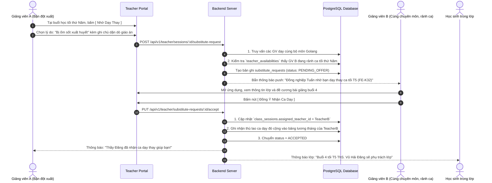

---

## 21. Bổ Sung Bản Thiết Kế Giao Diện Dành Cho Giáo Viên (Teacher Wireframes)

### Wireframe 4: Bảng Điều Khiển Ca Dạy Trực Tiếp (`/teacher/classes/{id}/live`)

```text
+---------------------------------------------------------------------------------------+
|  LMS CENTER - BẢNG ĐIỀU KHIỂN CA DẠY (LIVE COCKPIT)               GV: ThS. Hoàng Nam  |
+---------------------------------------------------------------------------------------+
|  LỚP: FE-K32 | CA: 19:30 - 21:30 | BÀI: Buổi 4 - Concurrency & Channels              |
|                                                                                       |
|  [ 🔴 GOOGLE MEET: meet.google.com/abc-xyz ]   [ ĐÃ CHECK-IN CA DẠY LÚC 19:28 V ]    |
|                                                                                       |
|  +---------------------------------------+  +--------------------------------------+  |
|  | DANH SÁCH ĐIỂM DANH NHANH (SĨ SỐ 20)  |  | BẢNG TƯƠNG TÁC & MINI POLL           |  |
|  +---------------------------------------+  +--------------------------------------+  |
|  | [ Tất Cả Có Mặt ] [ Lưu Điểm Danh ]   |  | [ Phát Quick Poll 2 Phút ]           |  |
|  | [x] 1. Nguyễn Hoàng Nam   (Online)    |  | Câu hỏi: Channel không đệm có chặn?  |  |
|  | [x] 2. Trần Thảo Linh     (Offline)   |  | (o) Có chặn [===========> ] 85%      |  |
|  | [ ] 3. Lê Hoàng Long      (Vắng mặt)  |  | ( ) Không chặn [==>       ] 15%      |  |
|  | [x] 4. Đỗ Minh Quân       (Giơ tay ✋) |  | Thời gian còn lại: 01:15             |  |
|  +---------------------------------------+  +--------------------------------------+  |
|                                                                                       |
|  [ 🎨 MỞ BẢNG TRẮNG DIGITAL WHITEBOARD ]    [ 📂 GIÁO ÁN SLIDE PDF ]   [ 💻 CODE MẪU ]|
+---------------------------------------------------------------------------------------+
```

### Wireframe 5: Không Gian Chấm Bài Code AI & Thu Âm Lời Dặn Dò

```text
+---------------------------------------------------------------------------------------+
|  CHẤM BÀI TẬP VỀ NHÀ: BTVN-03 Goroutines (Học viên: Trần Tuấn Anh)     [ Đóng / Lưu ]  |
+---------------------------------------------------------------------------------------+
|  MÃ NGUỒN HỌC VIÊN NỘP (MONACO VIEWER):  |  TRỢ LÝ CHẤM ĐIỂM & ĐÁNH GIÁ SƯ PHẠM:      |
|  1  package main                         |                                             |
|  2  func worker(ch chan int) {           |  [ 🤖 AI QUÉT BÀI TỰ ĐỘNG ]                 |
|  3     val := <-ch                       |  - Điểm Clean Code gợi ý: 88/100            |
|  4     // Logic xử lý                    |  - Cảnh báo: Dòng 14 channel chưa close.    |
|  5  }                                    |                                             |
|  ...                                     |  NHẬN XÉT SƯ PHẠM (ĐÃ ĐIỀN BẢN NHÁP AI):    |
|  14 ch := make(chan int)                 |  [Em làm rất tốt phần khởi tạo goroutine.  ]|
|  15 go worker(ch)                        |  [Lưu ý dòng 14 nhớ defer close(ch) nhé!   ]|
|                                          |                                             |
|                                          |  ĐIỂM SỐ: [ 90 ] / 100                      |
|                                          |                                             |
|                                          |  [ 🎙️ BẤM GHI ÂM DẶN DÒ (VOICE NOTE) ]     |
|                                          |  ▶️ || 00:38 / 00:40 (Đã ghi âm thành công) |
|                                          |                                             |
|                                          |  [ GHI CHÚ SƯ PHẠM KÍN (CHỈ TA XEM) ]       |
|                                          |  [Tuấn Anh tiếp thu nhanh, cần giao thêm lab]|
|                                          |                                             |
|                                          |        [ LƯU ĐIỂM & TRẢ BÀI HỌC VIÊN ]      |
+---------------------------------------------------------------------------------------+
```


